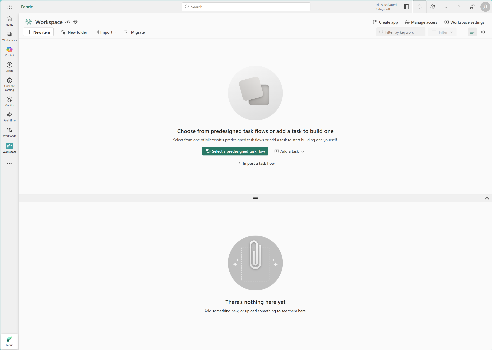
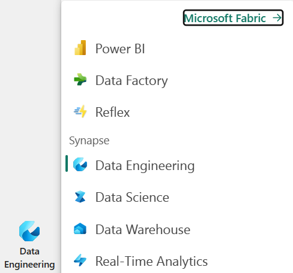
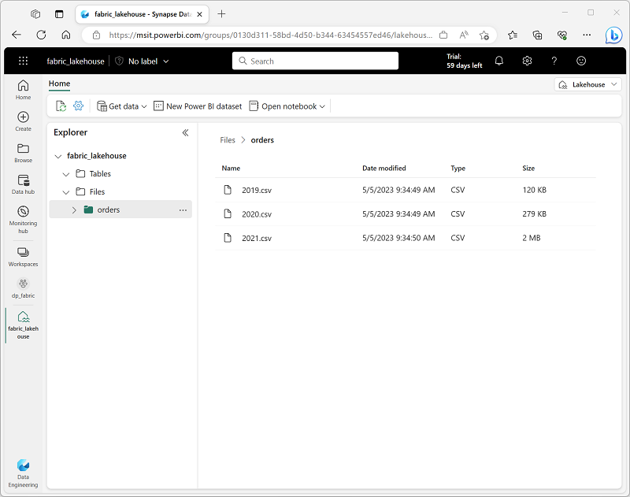
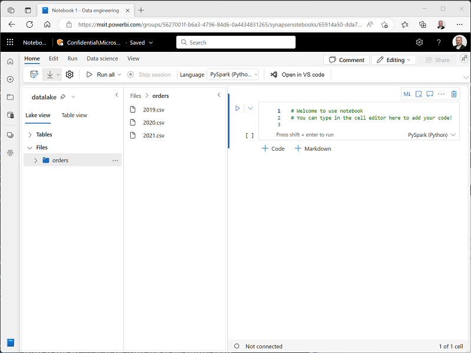
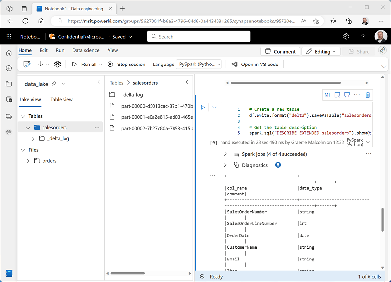
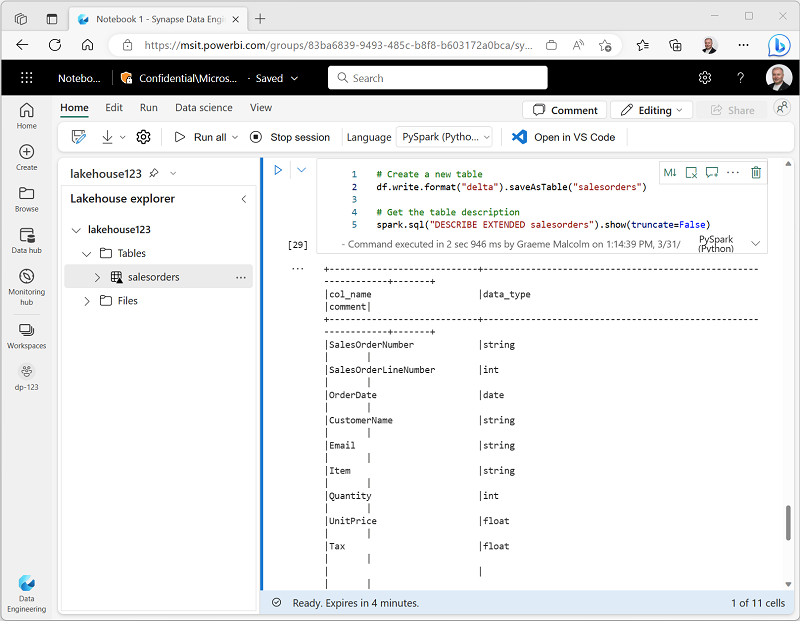
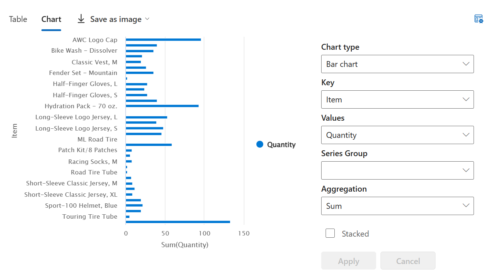

---
lab:
    title: 'Analyze data with Apache Spark'
    module: 'Use Apache Spark in Trident'
---

# Analyze data with Apache Spark

Apache Spark is an open source engine for distributed data processing, and is widely used to explore, process, and analyze huge volumes of data in data lake storage. Spark is available as a processing option in many data platform products, including Azure HDInsight, Azure Databricks, and *Trident*. One of the benefits of Spark is support for a wide range of programming languages, including Java, Scala, Python, and SQL; making Spark a very flexible solution for data processing workloads including data cleansing and manipulation, statistical analysis and machine learning, and data analytics and visualization.

This lab will take approximately **45** minutes to complete.

## Before you start

You'll need a Power BI Premium subscription with access to the Trident preview.

## Create a workspace

Before working with data in *Trident*, you should create a workspace with support for premium features.

1. Sign into your Power BI service at [https://app.powerbi.com](https://app.powerbi.com).
2. In the menu bar on the left, select **Workspaces** (the icon looks similar to &#128455;).
3. Create a new workspace with a name of your choice, selecting the **Premium per user** licensing mode.
4. When your new workspace opens, it should be empty, as shown here:

    

## Create a lakehouse and upload files

Now that you have a workspace, it's time to switch to the *Data engineering* experience in the portal and create a data lakehouse for the data files you're going to analyze.

1. At the bottom left of the Power BI portal, select the **Power BI** icon and switch to the **Data engineering** experience, as shown here:

    

2. In the **Data engineering** home page, create a new **Lakehouse** with a name of your choice.

    After a minute or so, a new lakehouse with no **Tables** or **Files** will be created. You need to ingest some data into the data lakehouse for analysis. There are multiple ways to do this, but in this exercise you'll simply download and extract a folder of text files your local computer and then upload them to your lakehouse.

3. Download and extract the data files for this exercise from [https://github.com/MicrosoftLearning/dp-data/raw/main/orders.zip](https://github.com/MicrosoftLearning/dp-data/raw/main/orders.zip).

4. After extracting the zipped archive, verify that you have a folder named **orders** that contains CSV files named **2019.csv**, **2020.csv**, and **2021.csv**.
5. Return to the web browser tab containing your lakehouse, and in the **...** menu for the **Files** node in the **Lake view** pane, select **Upload** and **Upload folder**, and then upload the **orders** folder from your local computer to the lakehouse.
6. After the files have been uploaded, expand **Files** and select the **orders** folder; and verify that the CSV files have been uploaded, as shown here:

    

## Create a notebook

To work with data in Apache Spark, you can create a *notebook*. Notebooks provide an interactive environment in which you can write and run code (in multiple languages), and add notes to document it.

1. On the **Home** page while viewing the contents of the **orders** folder in your datalake, in the **Open notebook** menu, select **New notebook**.

    After a few seconds, a new notebook containing a single *cell* will open. Notebooks are made up of one or more cells that can contain *code* or *markdown* (formatted text).

2. Select the first cell (which is currently a *code* cell), and then in the dynamic tool bar at its top-right, use the **M&#8595;** button to convert the cell to a *markdown* cell.

    When the cell changes to a markdown cell, the text it contains is rendered.

3. Use the **&#128393;** (Edit) button to switch the cell to editing mode, then modify the markdown as follows:

    ```
    # Sales order data exploration

    Use the code in this notebook to explore sales order data.
    ```

4. Select anywhere in the notebook outside of the cell to stop editing it and see the rendered markdown.

## Load data into a dataframe

Now you're ready to run code that loads the data into a *dataframe*. Dataframes in Spark are similar to Pandas dataframes in Python, and provide a common structure for working with data in rows and columns.

1. With the notebook visible, expand the **Files** list and select the **orders** folder so that the CSV files are listed next to the notebook editor, like this:

    

2. In the **...** menu for **2019.csv**, select **Load data** > **Spark**. A new code cell containing the following code should be added to the notebook:

    ```python
    df = spark.read.format("csv").option("header","true").load("Files/orders/2019.csv")
    # df now is a Spark DataFrame containing CSV data from "Files/orders/2019.csv".
    display(df)
    ```

    > **Tip**: You can hide the pane containing the files on the left by using its **<** icon. Doing so will help you focus on the notebook.

3. Use the **&#9655; Run cell** button on the left of the cell to run it.

    > **Note**: Since this is the first time you've run any Spark code in this session, the Spark pool must be started. This means that the first run in the session can take a few minutes. Subsequent runs will be quicker.

4. When the cell command has completed, review the output below the cell, which should look similar to this:

    | Index | SO43701 | 11 | 2019-07-01 | Christy Zhu | christy12@adventure-works.com | Mountain-100 Silver, 44 | 16 | 3399.99 | 271.9992 |
    | -- | -- | -- | -- | -- | -- | -- | -- | -- | -- |
    | 1 | SO43704 | 1 | 2019-07-01 | Julio Ruiz | julio1@adventure-works.com | Mountain-100 Black, 48 | 1 | 3374.99 | 269.9992 |
    | 2 | SO43705 | 1 | 2019-07-01 | Curtis Lu | curtis9@adventure-works.com | Mountain-100 Silver, 38 | 1 | 3399.99 | 271.9992 |
    | ... | ... | ... | ... | ... | ... | ... | ... | ... | ... |

    The output shows the rows and columns of data from the 2019.csv file. However, note that the column headers don't look right. The default code used to load the data into a dataframe assumes that the CSV file includes the column names in the first row, but in this case the CSV file just includes the data with no header information.

5. Modify the code to set the **header** option to **false** as follows:

    ```python
    df = spark.read.format("csv").option("header","false").load("Files/orders/2019.csv")
    # df now is a Spark DataFrame containing CSV data from "Files/orders/2019.csv".
    display(df)
    ```

6. Re-run the cell and review the output, which should look similar to this:

   | Index | _c0 | _c1 | _c2 | _c3 | _c4 | _c5 | _c6 | _c7 | _c8 |
    | -- | -- | -- | -- | -- | -- | -- | -- | -- | -- |
    | 1 | SO43701 | 11 | 2019-07-01 | Christy Zhu | christy12@adventure-works.com | Mountain-100 Silver, 44 | 16 | 3399.99 | 271.9992 |
    | 2 | SO43704 | 1 | 2019-07-01 | Julio Ruiz | julio1@adventure-works.com | Mountain-100 Black, 48 | 1 | 3374.99 | 269.9992 |
    | 3 | SO43705 | 1 | 2019-07-01 | Curtis Lu | curtis9@adventure-works.com | Mountain-100 Silver, 38 | 1 | 3399.99 | 271.9992 |
    | ... | ... | ... | ... | ... | ... | ... | ... | ... | ... |

    Now the dataframe correctly includes first row as data values, but the column names are auto-generated and not very helpful. To make sense of the data, you need to explicitly define the correct schema for the data values in the file.

7. Modify the code as follows to define a schema and apply it when loading the data:

    ```python
    from pyspark.sql.types import *
    from pyspark.sql.functions import *

    orderSchema = StructType([
        StructField("SalesOrderNumber", StringType()),
        StructField("SalesOrderLineNumber", IntegerType()),
        StructField("OrderDate", DateType()),
        StructField("CustomerName", StringType()),
        StructField("Email", StringType()),
        StructField("Item", StringType()),
        StructField("Quantity", IntegerType()),
        StructField("UnitPrice", FloatType()),
        StructField("Tax", FloatType())
        ])

    df = spark.read.format("csv").schema(orderSchema).load("Files/orders/2019.csv")
    display(df)
    ```

8. Run the modified cell and review the output, which should look similar to this:

   | Index | SalesOrderNumber | SalesOrderLineNumber | OrderDate | CustomerName | Email | Item | Quantity | UnitPrice | Tax |
    | -- | -- | -- | -- | -- | -- | -- | -- | -- | -- |
    | 1 | SO43701 | 11 | 2019-07-01 | Christy Zhu | christy12@adventure-works.com | Mountain-100 Silver, 44 | 16 | 3399.99 | 271.9992 |
    | 2 | SO43704 | 1 | 2019-07-01 | Julio Ruiz | julio1@adventure-works.com | Mountain-100 Black, 48 | 1 | 3374.99 | 269.9992 |
    | 3 | SO43705 | 1 | 2019-07-01 | Curtis Lu | curtis9@adventure-works.com | Mountain-100 Silver, 38 | 1 | 3399.99 | 271.9992 |
    | ... | ... | ... | ... | ... | ... | ... | ... | ... | ... |

    Now the dataframe includes the correct column names and data types as defined by the schema (in addition to the **Index**, which is a built-in column in all dataframes based on the ordinal position of each row).

9. The dataframe includes only the data from the **2019.csv** file. Modify the code so that the file path uses a \* wildcard to read the sales order data from all of the files in the **orders** folder:

    ```python
    from pyspark.sql.types import *
    from pyspark.sql.functions import *

    orderSchema = StructType([
        StructField("SalesOrderNumber", StringType()),
        StructField("SalesOrderLineNumber", IntegerType()),
        StructField("OrderDate", DateType()),
        StructField("CustomerName", StringType()),
        StructField("Email", StringType()),
        StructField("Item", StringType()),
        StructField("Quantity", IntegerType()),
        StructField("UnitPrice", FloatType()),
        StructField("Tax", FloatType())
        ])

    df = spark.read.format("csv").schema(orderSchema).load("Files/orders/*.csv")
    display(df)
    ```

10. Run the modified code cell and review the output, which should now include sales for 2019, 2020, and 2021.

    **Note**: Only a subset of the rows is displayed, so you may not be able to see examples from all years.

## Explore data in a dataframe

The dataframe object includes a wide range of functions that you can use to filter, group, and otherwise manipulate the data it contains.

### Filter a dataframe

1. Use the **+ Code** icon below the cell output to add a new code cell to the notebook, and enter the following code in it.

    ```Python
    customers = df['CustomerName', 'Email']
    print(customers.count())
    print(customers.distinct().count())
    display(customers.distinct())
    ```

2. Run the new code cell, and review the results. Observe the following details:
    - When you perform an operation on a dataframe, the result is a new dataframe (in this case, a new **customers** dataframe is created by selecting a specific subset of columns from the **df** dataframe)
    - Dataframes provide functions such as **count** and **distinct** that can be used to summarize and filter the data they contain.
    - The `dataframe['Field1', 'Field2', ...]` syntax is a shorthand way of defining a subset of column. You can also use **select** method, so the first line of the code above could be written as `customers = df.select("CustomerName", "Email")`

3. Modify the code as follows:

    ```Python
    customers = df.select("CustomerName", "Email").where(df['Item']=='Road-250 Red, 52')
    print(customers.count())
    print(customers.distinct().count())
    display(customers.distinct())
    ```

4. Run the modified code to view the customers who have purchased the *Road-250 Red, 52* product. Note that you can "chain" multiple functions together so that the output of one function becomes the input for the next - in this case, the dataframe created by the **select** method is the source dataframe for the **where** method that is used to apply filtering criteria.

### Aggregate and group data in a dataframe

1. Add a new code cell to the notebook, and enter the following code in it:

    ```Python
    productSales = df.select("Item", "Quantity").groupBy("Item").sum()
    display(productSales)
    ```

2. Run the code cell you added, and note that the results show the sum of order quantities grouped by product. The **groupBy** method groups the rows by *Item*, and the subsequent **sum** aggregate function is applied to all of the remaining numeric columns (in this case, *Quantity*)

3. Add another new code cell to the notebook, and enter the following code in it:

    ```Python
    yearlySales = df.select(year("OrderDate").alias("Year")).groupBy("Year").count().orderBy("Year")
    display(yearlySales)
    ```

4. Run the code cell you added, and note that the results show the number of sales orders per year. Note that the **select** method includes a SQL **year** function to extract the year component of the *OrderDate* field, and then an **alias** method is used to assign a columm name to the extracted year value. The data is then grouped by the derived *Year* column and the count of rows in each group is calculated before finally the **orderBy** method is used to sort the resulting dataframe.

## Work with tables and SQL

As you've seen, the native methods of the dataframe object enable you to query and analyze data from a file quite effectively. However, many data analysts are more comfortable working with tables that they can query using SQL syntax. Spark provides a *metastore* in which you can define relational tables. The Spark SQL library that provides the dataframe object also supports the use of SQL statements to query tables in the metastore. By using these capabilities of Spark, you can combine the flexibility of a data lake with the structured data schema and SQL-based queries of a relational data warehouse - hence the term "data lakehouse".

### Create a table

Tables in a Spark metastore are relational abstractions over files in the data lake. tables can be *managed* (in which case the files are managed by the metastore) or *external* (in which case the table references a file location in the data lake that you manage independently of the metastore).

1. Add a new code cell to the notebook, and enter the following code, which saves the dataframe of sales order data as a table named **salesorders**:

    ```Python
    # Create a new table
    df.write.format("delta").saveAsTable("salesorders")

    # Get the table description
    spark.sql("DESCRIBE EXTENDED salesorders").show(truncate=False)
    ```

    > **Note**: It's worth noting a couple of things about this example. Firstly, no explicit path is provided, so the files for the table will be managed by the metastore. Secondly, the table is saved in **delta** format. You can create tables based on multiple file formats (including CSV, Parquet, Avro, and others) but *delta lake* is a Spark technology that adds relational database capabilities to tables; including support for transactions, row versioning, and other useful features. Creating tables in delta format is preferred for most data lakehouse implementations.

2. Run the code cell and review the output, which describes the definition of the new table.

3. In the **Lake view** pane, in the **...** menu for the **Tables** node, select **Refresh**. Then expand the **Tables** node and select the **salesorders** folder to view the files that have been created for the table data.

    

    Note that the data is stored in multiple Parquet files named **part-000*xxxx*.parquet**, and that a folder named **_delta_log** has been created to store details of transactions that occur in the table.

4. Select the **Table view** tab, and verify that the **salesorders** table is listed in the metastore.

    

5. In the **...** menu for the **salesorders** table, select **Load data** > **Spark**.

    A new code cell containing code similar to the following example is added to the notebook:

    ```Python
    df = spark.sql("SELECT * FROM [your_lakehouse].salesorders LIMIT 1000")
    display(df)
    ```

6. Run the new code, which uses the Spark SQL library to embed a SQL query against the **salesorder** table in Python code and load the results of the query into a dataframe.

### Run SQL code in a cell

While it's useful to be able to embed SQL statements into a cell containing PySpark code, data analysts often just want to work directly in SQL.

1. Add a new code cell to the notebook, and enter the following code in it:

    ```sql
    %%sql
    SELECT YEAR(OrderDate) AS OrderYear,
           SUM((UnitPrice * Quantity) + Tax) AS GrossRevenue
    FROM salesorders
    GROUP BY YEAR(OrderDate)
    ORDER BY OrderYear;
    ```

2. Run the cell and review the results. Observe that:
    - The `%%sql` line at the beginning of the cell (called a *magic*) indicates that the Spark SQL language runtime should be used to run the code in this cell instead of PySpark.
    - The SQL code references the **salesorders* table that you created previously.
    - The output from the SQL query is automatically displayed as the result under the cell.

> **Note**: For more information about Spark SQL and dataframes, see the [Spark SQL documentation](https://spark.apache.org/docs/2.2.0/sql-programming-guide.html).

## Visualize data with Spark

A picture is proverbially worth a thousand words, and a chart is often better than a thousand rows of data. While notebooks in Azure Synapse Analytics include a built in chart view for data that is displayed from a dataframe or Spark SQL query, it is not designed for comprehensive charting. However, you can use Python graphics libraries like **matplotlib** and **seaborn** to create charts from data in dataframes.

### View results as a chart

1. Add a new code cell to the notebook, and enter the following code in it:

    ```sql
    %%sql
    SELECT * FROM salesorders
    ```

2. Run the code and observe that it returns the data from the **salesorders** view you created previously.
3. In the results section beneath the cell, change the **View** option from **Table** to **Chart**.
4. Use the **View options** button at the top right of the chart to display the options pane for the chart. Then set the options as follows and select **Apply**:
    - **Chart type**: Bar chart
    - **Key**: Item
    - **Values**: Quantity
    - **Series Group**: *leave blank*
    - **Aggregation**: Sum
    - **Stacked**: *Unselected*

5. Verify that the chart looks similar to this:

    

### Get started with **matplotlib**

1. Add a new code cell to the notebook, and enter the following code in it:

    ```Python
    sqlQuery = "SELECT CAST(YEAR(OrderDate) AS CHAR(4)) AS OrderYear, \
                    SUM((UnitPrice * Quantity) + Tax) AS GrossRevenue \
                FROM salesorders \
                GROUP BY CAST(YEAR(OrderDate) AS CHAR(4)) \
                ORDER BY OrderYear"
    df_spark = spark.sql(sqlQuery)
    df_spark.show()
    ```

2. Run the code and observe that it returns a Spark dataframe containing the yearly revenue.

    To visualize the data as a chart, we'll start by using the **matplotlib** Python library. This library is the core plotting library on which many others are based, and provides a great deal of flexibility in creating charts.

3. Add a new code cell to the notebook, and add the following code to it:

    ```Python
    from matplotlib import pyplot as plt

    # matplotlib requires a Pandas dataframe, not a Spark one
    df_sales = df_spark.toPandas()

    # Create a bar plot of revenue by year
    plt.bar(x=df_sales['OrderYear'], height=df_sales['GrossRevenue'])

    # Display the plot
    plt.show()
    ```

4. Run the cell and review the results, which consist of a column chart with the total gross revenue for each year. Note the following features of the code used to produce this chart:
    - The **matplotlib** library requires a *Pandas* dataframe, so you need to convert the *Spark* dataframe returned by the Spark SQL query to this format.
    - At the core of the **matplotlib** library is the **pyplot** object. This is the foundation for most plotting functionality.
    - The default settings result in a usable chart, but there's considerable scope to customize it

5. Modify the code to plot the chart as follows:

    ```Python
    from matplotlib import pyplot as plt

    # Clear the plot area
    plt.clf()

    # Create a bar plot of revenue by year
    plt.bar(x=df_sales['OrderYear'], height=df_sales['GrossRevenue'], color='orange')

    # Customize the chart
    plt.title('Revenue by Year')
    plt.xlabel('Year')
    plt.ylabel('Revenue')
    plt.grid(color='#95a5a6', linestyle='--', linewidth=2, axis='y', alpha=0.7)
    plt.xticks(rotation=45)

    # Show the figure
    plt.show()
    ```

6. Re-run the code cell and view the results. The chart now includes a little more information.

    A plot is technically contained with a **Figure**. In the previous examples, the figure was created implicitly for you; but you can create it explicitly.

7. Modify the code to plot the chart as follows:

    ```Python
    from matplotlib import pyplot as plt

    # Clear the plot area
    plt.clf()

    # Create a Figure
    fig = plt.figure(figsize=(8,3))

    # Create a bar plot of revenue by year
    plt.bar(x=df_sales['OrderYear'], height=df_sales['GrossRevenue'], color='orange')

    # Customize the chart
    plt.title('Revenue by Year')
    plt.xlabel('Year')
    plt.ylabel('Revenue')
    plt.grid(color='#95a5a6', linestyle='--', linewidth=2, axis='y', alpha=0.7)
    plt.xticks(rotation=45)

    # Show the figure
    plt.show()
    ```

8. Re-run the code cell and view the results. The figure determines the shape and size of the plot.

    A figure can contain multiple subplots, each on its own *axis*.

9. Modify the code to plot the chart as follows:

    ```Python
    from matplotlib import pyplot as plt

    # Clear the plot area
    plt.clf()

    # Create a figure for 2 subplots (1 row, 2 columns)
    fig, ax = plt.subplots(1, 2, figsize = (10,4))

    # Create a bar plot of revenue by year on the first axis
    ax[0].bar(x=df_sales['OrderYear'], height=df_sales['GrossRevenue'], color='orange')
    ax[0].set_title('Revenue by Year')

    # Create a pie chart of yearly order counts on the second axis
    yearly_counts = df_sales['OrderYear'].value_counts()
    ax[1].pie(yearly_counts)
    ax[1].set_title('Orders per Year')
    ax[1].legend(yearly_counts.keys().tolist())

    # Add a title to the Figure
    fig.suptitle('Sales Data')

    # Show the figure
    plt.show()
    ```

10. Re-run the code cell and view the results. The figure contains the subplots specified in the code.

> **Note**: To learn more about plotting with matplotlib, see the [matplotlib documentation](https://matplotlib.org/).

### Use the **seaborn** library

While **matplotlib** enables you to create complex charts of multiple types, it can require some complex code to achieve the best results. For this reason, over the years, many new libraries have been built on the base of matplotlib to abstract its complexity and enhance its capabilities. One such library is **seaborn**.

1. Add a new code cell to the notebook, and enter the following code in it:

    ```Python
    import seaborn as sns

    # Clear the plot area
    plt.clf()

    # Create a bar chart
    ax = sns.barplot(x="OrderYear", y="GrossRevenue", data=df_sales)
    plt.show()
    ```

2. Run the code and observe that it displays a bar chart using the seaborn library.
3. Modify the code as follows:

    ```Python
    import seaborn as sns

    # Clear the plot area
    plt.clf()

    # Set the visual theme for seaborn
    sns.set_theme(style="whitegrid")

    # Create a bar chart
    ax = sns.barplot(x="OrderYear", y="GrossRevenue", data=df_sales)
    plt.show()
    ```

4. Run the modified code and note that seaborn enables you to set a consistent color theme for your plots.

5. Modify the code again as follows:

    ```Python
    import seaborn as sns

    # Clear the plot area
    plt.clf()

    # Create a bar chart
    ax = sns.lineplot(x="OrderYear", y="GrossRevenue", data=df_sales)
    plt.show()
    ```

6. Run the modified code to view the yearly revenue as a line chart.

> **Note**: To learn more about plotting with seaborn, see the [seaborn documentation](https://seaborn.pydata.org/index.html).

## Save the notebook and end the Spark session

Now that you've finished working with the data, you can save the notebook with a meaningful name and end the Spark session.

1. In the notebook menu bar, use the ⚙️ **Settings** icon to view the notebook settings.
2. Set the **Name** of the notebook to **Explore Sales Orders**, and then close the settings pane.
3. On the notebook menu, select **Stop session** to end the Spark session.
