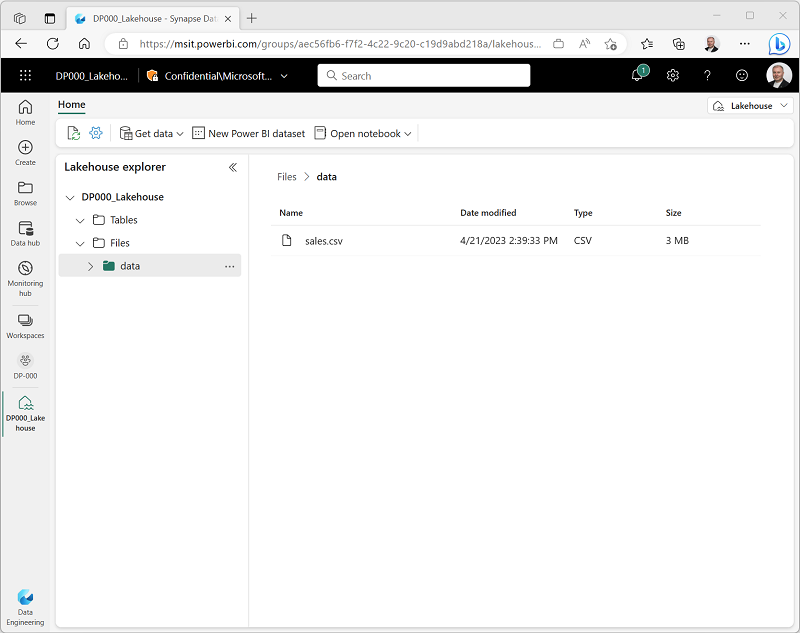

---
lab:
    title: 'Create a lakehouse'
    module: 'Get started with Lakehouses'
---

---
*The UI is changing frequently -we'll update (or remove) screenshots prior to release.*

---

# Create a lakehouse

Large-scale data analytics solutions have traditionally been built around a *data warehouse*, in which data is stored in relational tables and queried using SQL. The growth in "big data" (characterized by high *volumes*, *variety*, and *velocity* of new data assets) together with the availability of low-cost storage and cloud-scale distributed compute technologies has led to an alternative approach to analytical data storage; the *data lake*. In a data lake, data is stored as files without imposing a fixed schema for storage. Increasingly, data engineers and analysts seek to benefit from the best features of both of these approaches by combining them in a *data lakehouse*; in which data is stored in files in a data lake and a relational schema is applied to them as a metadata layer so that they can be queried using traditional SQL semantics.

In Microsoft Fabric, a lakehouse provides highly scalable file storage in a *OneLake* store (built on Azure Data Lake Store Gen2) with a metastore for relational objects such as tables and views based on the open source *Delta Lake* table format. Delta Lake enables you to define a schema of tables in your lakehouse that you can query using SQL.

This lab will take approximately **45** minutes to complete.

## Before you start

You'll need a Power BI Premium subscription with access to the Microsoft Fabric preview.

## Create a workspace

Before working with data in Fabric, create a workspace with premium capacity enabled.

1. Sign into your Power BI service at [https://app.powerbi.com](https://app.powerbi.com).
2. In the menu bar on the left, select **Workspaces** (the icon looks similar to &#128455;).
3. Create a new workspace with a name of your choice, selecting the **Premium per user** licensing mode.
4. When your new workspace opens, it should be empty, as shown here:

    

## Create a lakehouse

Now that you have a workspace, it's time to switch to the *Data engineering* experience in the portal and create a data lakehouse for your data files.

1. At the bottom left of the Power BI portal, switch the workload to the **Data Engineering** experience, as shown here:

    

    The data engineering home page includes tiles to create commonly used data engineering assets:

    

2. In the **Data engineering** home page, create a new **Lakehouse** with a name of your choice.

    After a minute or so, a new lakehouse will be created:

    

3. View the new lakehouse, and note that the **Lakehouse explorer** pane on the left enables you to browse tables and files in the lakehouse:
    - The **Tables** folder contains tables that you can query using SQL semantics. Tables in a Microsoft Fabric lakehouse are based on the open source *Delta Lake* file format, commonly used in Apache Spark.
    - The **Files** folder contains data files in the OneLake storage for the lakehouse that are not associated with managed delta tables. You can also create *shortcuts* that reference data that is stored externally in this folder.

    Currently, there are no tables or files in the lakehouse.

## Upload a file

There are multiple ways to load data into the lakehouse. One of the simplest ways to ingest small amounts of data is to upload files or folders from your local computer.

1. Download the **sales.csv** file from [https://raw.githubusercontent.com/MicrosoftLearning/dp-data/main/sales.csv](https://raw.githubusercontent.com/MicrosoftLearning/dp-data/main/sales.csv), saving it as **sales.csv** on your local computer
2. Return to the web browser tab containing your lakehouse, and in the **...** menu for the **Files** folder in the **Lakehouse explorer** pane, select **New subfolder**, and create a subfolder named **data**.
3. In the **...** menu for the new **data** folder, select **Upload** and **Upload file**, and then upload the **sales.csv** file from your local computer.
4. After the file has been uploaded, select the **Files/data** folder and verify that the **sales.csv** file has been uploaded, as shown here:

    

5. Select the **sales.csv** file to see a preview of its contents.

## Explore shortcuts

In many scenarios, the data you need to work with in your lakehouse may be stored in some other location. While there are many ways to ingest data into the OneLake storage for your lakehouse, another option is to instead create a *shortcut*. This enables you to include externally sourced data in your analytics solution without the overhead and risk of data inconsistency associated with copying it.

1. In the **...** menu for the **Files** folder, select **New shortcut**.
2. View the available data source types for shortcuts. Then close the **New shortcut** dialog box without creating a shortcut.

## Load file data into a table

The sales data you uploaded is in a file, which data analysts and engineers can work with directly by using Apache Spark code. However, in many scenarios you may want to load the data from the file into a table so that you can query it using SQL.

1. On the **Home** page, select the **Files/Data** folder so you can see the **sales.csv** file it contains.
2. In the **...** menu for the **sales.csv** file select **Load to Delta table**.
3. In **Load to table** dialog box, set the table name to **sales** and confirm the load operation. Then wait for the table to be created and loaded.

    > **Tip**: If the **sales** table does not automatically appear, in the **...** menu for the **Tables** folder, select **Refresh**.

3. In the **Lakehouse explorer** pane, select the **sales** table that has been created to view the data.

    

4. In the **...** menu for the **sales** table, select **View table files** to see the underlying files for this table

    

    Files for a delta table are stored in *Parquet* format, and include a subfolder named **_delta_log** in which details of transactions applied to the table are logged.

## Use SQL to query tables

When you create a lakehouse and define tables in it, a SQL endpoint is automatically created through which the tables can be queried using SQL `SELECT` statements.

1. At the top-right of the Lakehouse page, switch from **Lakehouse** to **SQL endpoint** as shown here:

    

2. Wait a short time until the SQL query endpoint for your lakehouse opens in a visual interface from which you can query its tables, as shown here:

    

    ---
    Note the error in the screenshot - retake when working

    ---

3. Use the **New SQL query** button to open a new query editor, and enter the following SQL query:

    ```sql
    SELECT Item, SUM(Quantity * UnitPrice) AS Revenue
    FROM sales
    GROUP BY Item
    ORDER BY Revenue DESC;
    ```

4. Use the **&#9655; Run** button to run the query and view the results, which should show the total revenue for each product.

---
This doesn't work - continue when working, adding steps to visualize the results

---

## Create a visual query


## Edit the data model


## Create a report


## Clean up resources

In this exercise, you have created a lakehouse and imported data into it. You've seen how a lakehouse consists of files stored in a OneLake data store, some of which are used to store the data for managed tables. The managed tables can be explored and manipulated using Spark, queried using SQL, and included in a dataset to support data visualizations.

If you've finished exploring your lakehouse, you can delete the workspace you created for this exercise.

1. In the bar on the left, select the icon for your workspace to view all of the items it contains.
2. In the **...** menu on the toolbar, select **Workspace settings**.
3. In the **Other** section, select **Delete this workspace**.
