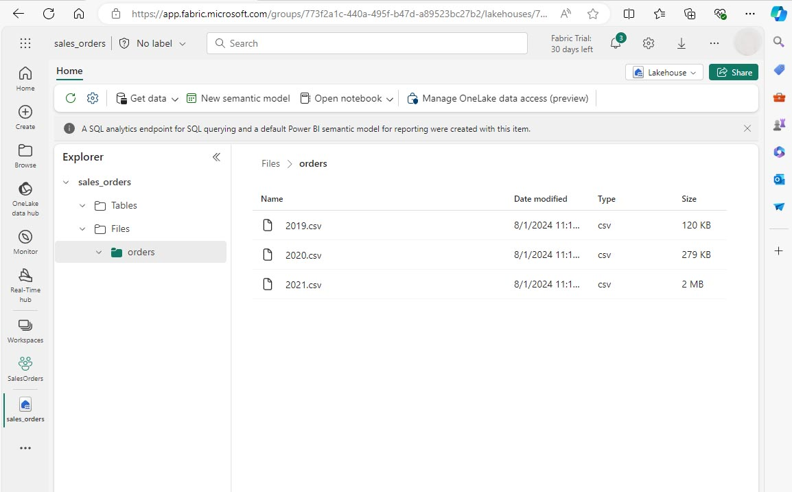
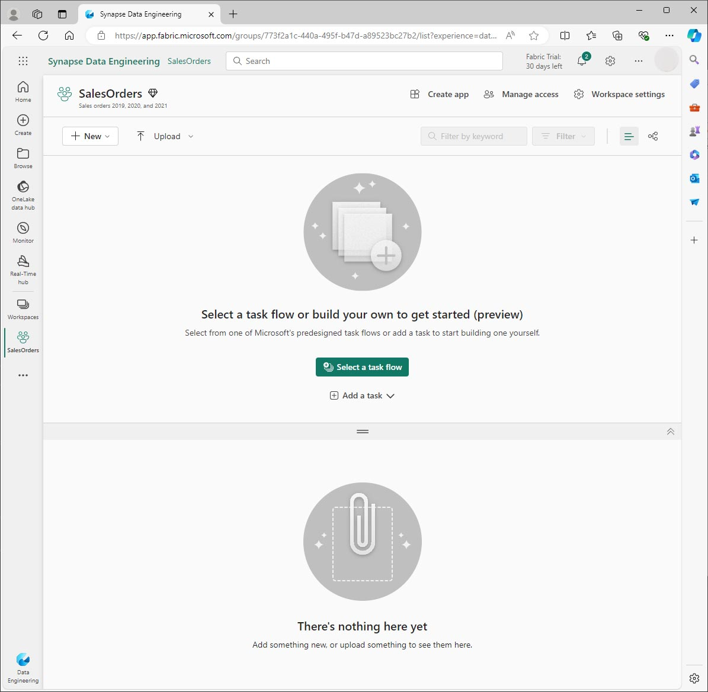
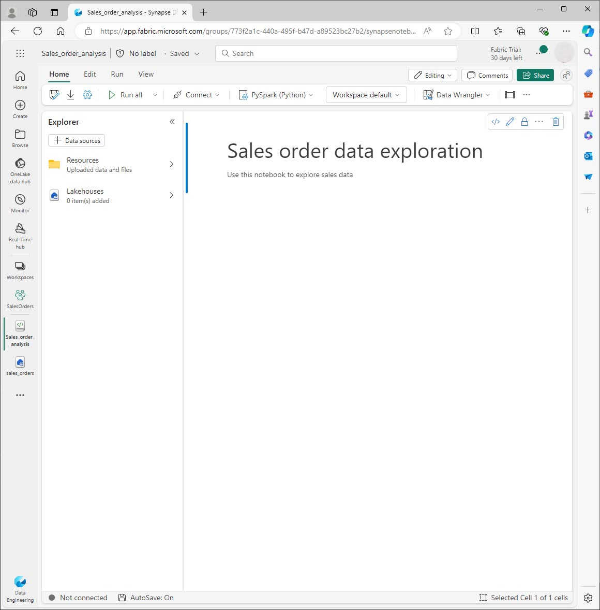
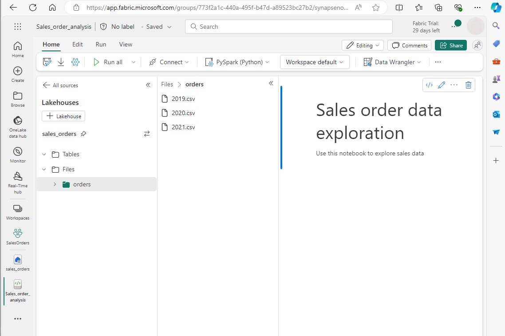
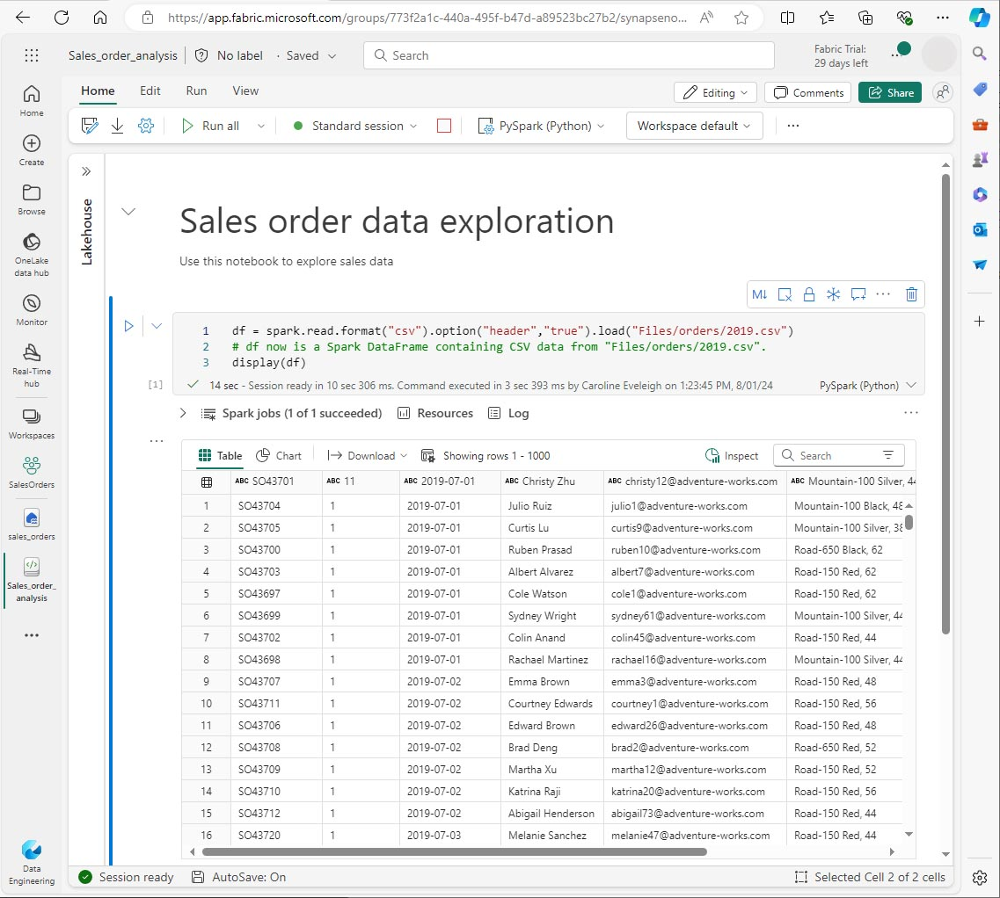
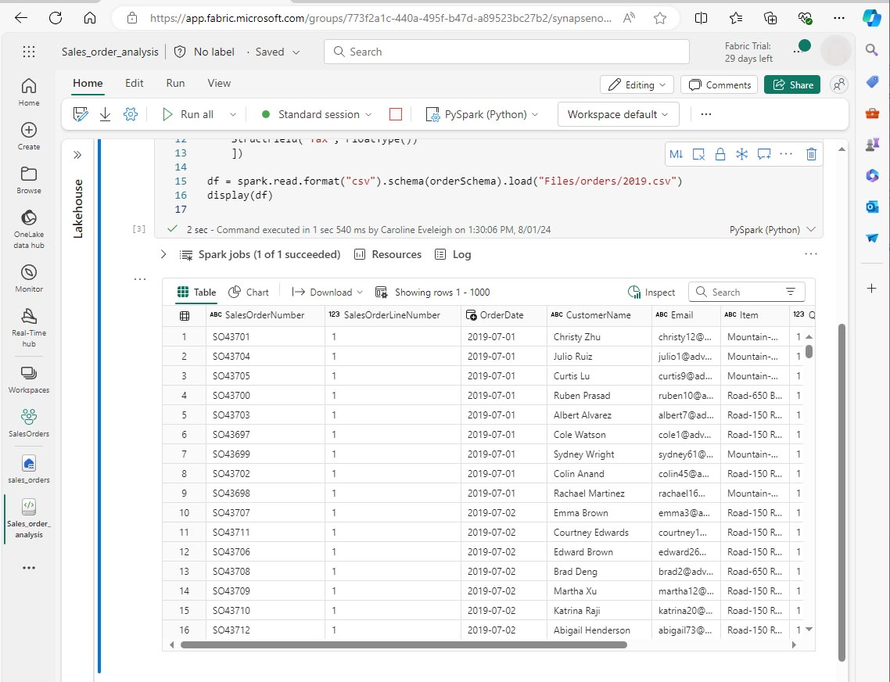
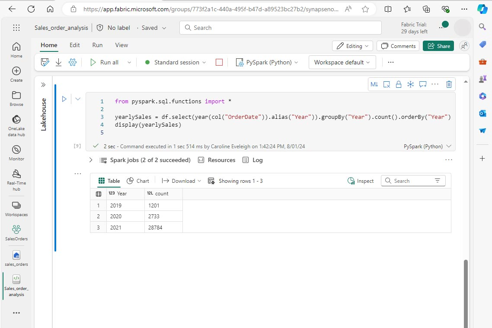
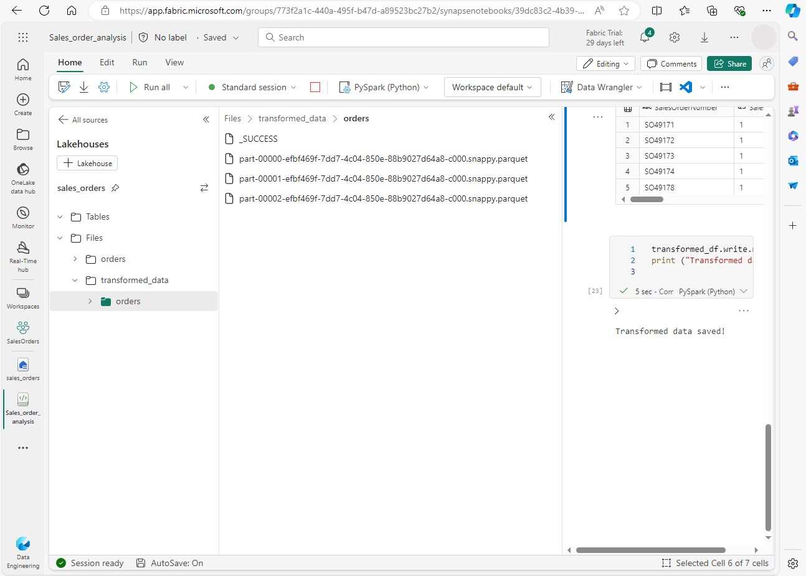
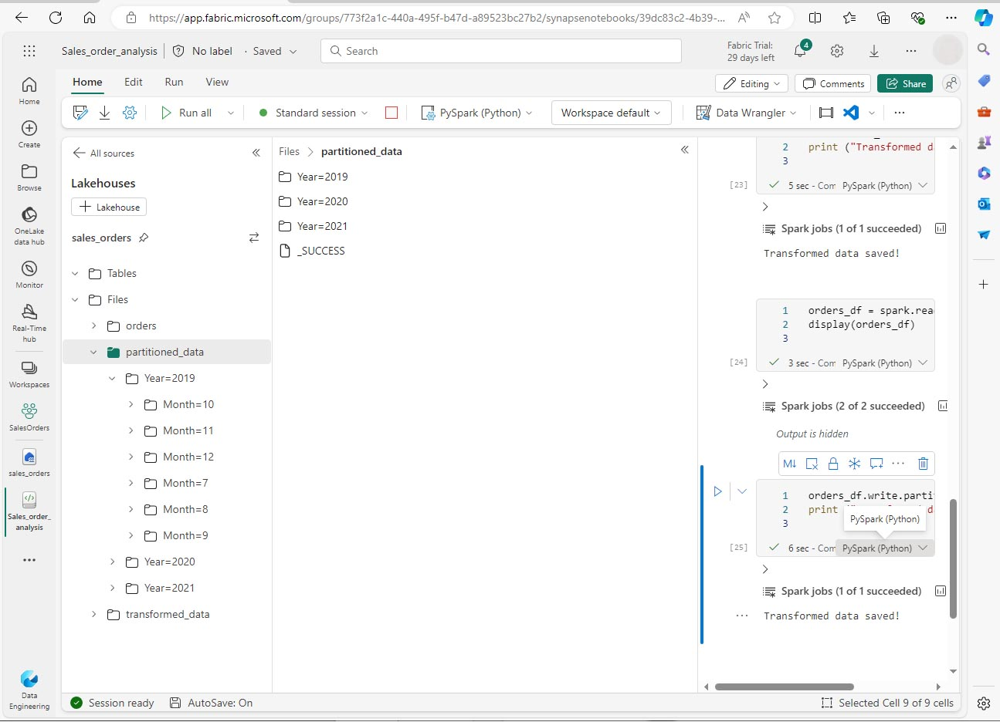
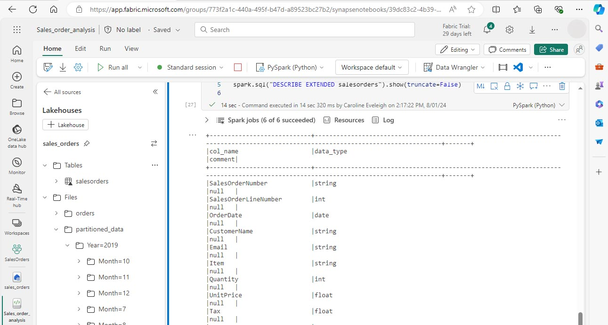

---
lab:
    title: 'Analyze data with Apache Spark'
    module: 'Use Apache Spark to work with files in a lakehouse'
---

# Analyze data with Apache Spark in Fabric

In this lab you will ingest data into the Fabric lakehouse and use PySpark to read and analyze the data.

This lab will take approximately 45 minutes to complete.

## Prerequisites

* A [Microsoft Fabric trial](https://www.microsoft.com/microsoft-fabric/getting-started).

## Create a workspace

Before you can work with data in Fabric you need to create a workspace.

1. On the [Microsoft Fabric](https://app.fabric.microsoft.com) home page at https://app.fabric.microsoft.com, select the **Data Engineering** experience.
1. From the left menu bar, select **Workspaces** (🗇) and then **New workspace**.
1. Give the new workspace a name and in the **Advanced** section, select the appropriate Licensing mode. If you have started a Microsoft Fabric trial, select Trial.
1. Select **Apply** to create an empty workspace.
 
    

## Create a lakehouse and upload files

Now that you have a workspace, you can create a lakehouse to store your data files. From your new workspace, select **New** and **Lakehouse**. Give the lakehouse a name, and then select **Create**. After a short delay, a new lakehouse is created.

You can now ingest data into the lakehouse. There are several ways to do this, but for now you’ll download a folder of text files to your local computer (or lab VM if applicable) and then upload them to your lakehouse.

1. Download the datafiles from https://github.com/MicrosoftLearning/dp-data/raw/main/orders.zip.
1. Extract the zipped archive and verify that you have a folder named *orders* which contains three CSV files: 2019.csv, 2020.csv, and 2021.csv.
1. Return to your new lakehouse. In the **Explorer** pane, next to the **Files** folder select the **…** menu, and select **Upload** and **Upload folder**. Navigate to the orders folder on your local computer (or lab VM if applicable) and select **Upload**.
1. After the files have been uploaded, expand **Files** and select the **orders** folder. Check that the CSV files have been uploaded, as shown here:

    

## Create a notebook

You can now create a Fabric notebook to work with your data. Notebooks provide an interactive environment where you can write and run code.

1. Select your workspace, then select **New** and **Notebook**. After a few seconds, a new notebook containing a single cell will open. Notebooks are made up of one or more cells that can contain code or markdown (formatted text).
1. Fabric assigns a name to each notebook you create, such as Notebook 1, Notebook 2, etc. Click the name panel above the **Home** tab on the menu to change the name to something more descriptive.
1. Select the first cell (which is currently a code cell), and then in the top-right tool bar, use the **M↓** button to convert it to a markdown cell. The text contained in the cell will then be displayed as formatted text.
1. Use the 🖉 (Edit) button to switch the cell to editing mode, then modify the markdown as shown below.

    ```markdown
   # Sales order data exploration
   Use this notebook to explore sales order data
    ```

    

When you have finished, click anywhere in the notebook outside of the cell to stop editing it and see the rendered markdown.

## Create a DataFrame

Now that you have created a workspace, a lakehouse, and a notebook you are ready to work with your data. You will use PySpark, which is the default language for Fabric notebooks, and the version of Python that is optimized for Spark.

>[!NOTE]
> Fabric notebooks support multiple programming languages including Scala, R, and Spark SQL.

1. Select your new workspace from the left bar. You will see a list of items contained in the workspace including your lakehouse and notebook.
2. Select the lakehouse to display the Explorer pane, including the **orders** folder.
3. From the top menu, select **Open notebook**, **Existing notebook**, and then Open the notebook you created earlier. The notebook should now be open next to the Explorer pane. Expand Lakehouses, expand the Files list, and select the orders folder. The CSV files that you uploaded are listed next to the notebook editor, like this:

    

4. From the … menu for 2019.csv, select **Load data** > **Spark**. The following code is automatically generated in a new code cell:

    ```python
    df = spark.read.format("csv").option("header","true").load("Files/orders/2019.csv")
    # df now is a Spark DataFrame containing CSV data from "Files/orders/2019.csv".
    display(df)
    ```

>[!TIP]
> You can hide the Lakehouse explorer panes on the left by using the « icons. This gives more space for the notebook.

5. Select ▷ **Run cell** to the left of the cell to run the code.

>[!NOTE]
> The first time you run Spark code, a Spark session is started. This can take a few seconds or longer. Subsequent runs within the same session will be quicker.

6. When the cell code has completed, review the output below the cell, which should look like this:
 
    

7. The output shows data from the 2019.csv file displayed in columns and rows.  Notice that the column headers contain the first line of the data. To correct this, you need to modify the first line of the code as follows:

    ```python
    df = spark.read.format("csv").option("header","false").load("Files/orders/2019.csv")
    ```

8. Run the code again, so that the DataFrame correctly identifies the first row as data. Notice that the column names have now changed to _c0, _c1, etc.

9. Descriptive column names help you make sense of data. To create meaningful column names, you need to define the schema and data types. You also need to import a standard set of Spark SQL types to define the data types. Replace the existing code with the following:

    ```python
    from pyspark.sql.types import *

    orderSchema = StructType([
        StructField("SalesOrderNumber", StringType()),
        StructField("SalesOrderLineNumber", IntegerType()),
        StructField("OrderDate", DateType()),
        StructField("CustomerName", StringType()),
        StructField("Email", StringType()),
        StructField("Item", StringType()),
        StructField("Quantity", IntegerType()),
        StructField("UnitPrice", FloatType()),
        StructField("Tax", FloatType())
    ])

    df = spark.read.format("csv").schema(orderSchema).load("Files/orders/2019.csv")

    display(df)
    ```
    
10. Run the cell and review the output:

    

11.	This DataFrame includes only the data from the 2019.csv file. Modify the code so that the file path uses a * wildcard to read all the files in the orders folder:

    ```python
    from pyspark.sql.types import *

    orderSchema = StructType([
        StructField("SalesOrderNumber", StringType()),
        StructField("SalesOrderLineNumber", IntegerType()),
        StructField("OrderDate", DateType()),
        StructField("CustomerName", StringType()),
        StructField("Email", StringType()),
        StructField("Item", StringType()),
        StructField("Quantity", IntegerType()),
        StructField("UnitPrice", FloatType()),
        StructField("Tax", FloatType())
        ])

    df = spark.read.format("csv").schema(orderSchema).load("Files/orders/*.csv")

    display(df)
    ```

12.	When you run the modified code, you should see sales for 2019, 2020, and 2021. Only a subset of the rows is displayed, so you may not see rows for every year.

>[!NOTE]
> You can hide or show the output of a cell by selecting **…** next to the result. This makes it easier to work in a notebook.

## Explore data in a DataFrame

The DataFrame object provides additional functionality such as the ability to filter, group, and manipulate data.

### Filter a DataFrame

1. Add a code cell by selecting **+ Code** which appears when you hover the mouse above or below the current cell or its output. Alternatively, from the ribbon menu select **Edit** and **+ Add** code cell.

2.	The following code filters the data so that only two columns are returned. It also uses *count* and *distinct* to summarize the number of records:

    ```python
    customers = df['CustomerName', 'Email']

    print(customers.count())
    print(customers.distinct().count())

    display(customers.distinct())
    ```

3. Run the code, and examine the output:

    * The code creates a new DataFrame called **customers** which contains a subset of columns from the original **df** DataFrame. When performing a DataFrame transformation you do not modify the original DataFrame, but return a new one.
    * Another way of achieving the same result is to use the select method:

    ```
    customers = df.select("CustomerName", "Email")
    ```

    * The DataFrame functions *count* and *distinct* are used to provide totals for the number of customers and unique customers.

4. Modify the first line of the code by using *select* with a *where* function as follows:

    ```python
    customers = df.select("CustomerName", "Email").where(df['Item']=='Road-250 Red, 52')
    print(customers.count())
    print(customers.distinct().count())

    display(customers.distinct())
    ```

5. Run the modified code to select only the customers who have purchased the Road-250 Red, 52 product. Note that you can “chain” multiple functions together so that the output of one function becomes the input for the next. In this case, the DataFrame created by the *select* method is the source DataFrame for the **where** method that is used to apply filtering criteria.

### Aggregate and group data in a DataFrame

1. Add a code cell, and enter the following code:

    ```python
    productSales = df.select("Item", "Quantity").groupBy("Item").sum()

    display(productSales)
    ```

2. Run the code. You can see that the results show the sum of order quantities grouped by product. The *groupBy* method groups the rows by Item, and the subsequent *sum* aggregate function is applied to the remaining numeric columns - in this case, *Quantity*.

3. Add another code cell to the notebook, and enter the following code:

    ```python
    from pyspark.sql.functions import *

    yearlySales = df.select(year(col("OrderDate")).alias("Year")).groupBy("Year").count().orderBy("Year")

    display(yearlySales)
    ```

4. Run the cell. Examine the output. The results now show the number of sales orders per year:

    * The *import* statement enables you to use the Spark SQL library.
    * The *select* method is used with a SQL year function to extract the year component of the *OrderDate* field.
    * The *alias* method is used to assign a column name to the extracted year value.
    * The *groupBy* method groups the data by the derived Year column.
    * The count of rows in each group is calculated before the *orderBy* method is used to sort the resulting DataFrame.

    

## Use Spark to transform data files

A common task for data engineers and data scientists is to transform data for further downstream processing or analysis.

### Use DataFrame methods and functions to transform data

1. Add a code cell to the notebook, and enter the following:

    ```python
    from pyspark.sql.functions import *

    # Create Year and Month columns
    transformed_df = df.withColumn("Year", year(col("OrderDate"))).withColumn("Month", month(col("OrderDate")))

    # Create the new FirstName and LastName fields
    transformed_df = transformed_df.withColumn("FirstName", split(col("CustomerName"), " ").getItem(0)).withColumn("LastName", split(col("CustomerName"), " ").getItem(1))

    # Filter and reorder columns
    transformed_df = transformed_df["SalesOrderNumber", "SalesOrderLineNumber", "OrderDate", "Year", "Month", "FirstName", "LastName", "Email", "Item", "Quantity", "UnitPrice", "Tax"]

    # Display the first five orders
    display(transformed_df.limit(5))
    ```

2. Run the cell. A new DataFrame is created from the original order data with the following transformations:

    - Year and Month columns added, based on the OrderDate column.
    - FirstName and LastName columns added, based on the CustomerName column.
    - The columns are filtered and reordered, and the CustomerName column removed.

3. Review the output and verify that the transformations have been made to the data.

You can use the Spark SQL library to transform the data by filtering rows, deriving, removing, renaming columns, and applying other data modifications.

>[!TIP]
> See the [Apache Spark dataframe](https://spark.apache.org/docs/latest/api/python/reference/pyspark.sql/dataframe.html) documentation to learn more about the DataFrame object.

### Save the transformed data

At this point you might want to save the transformed data so that it can be used for further analysis.

*Parquet* is a popular data storage format because it stores data efficiently and is supported by most large-scale data analytics systems. Indeed, sometimes the data transformation requirement is to convert data from one format such as CSV, to Parquet.

1. To save the transformed DataFrame in Parquet format, add a code cell and add the following code:  

    ```python
    transformed_df.write.mode("overwrite").parquet('Files/transformed_data/orders')

    print ("Transformed data saved!")
    ```

2. Run the cell and wait for the message that the data has been saved. Then, in the Lakehouses pane on the left, in the … menu for the Files node, select **Refresh**. Select the transformed_data folder to verify that it contains a new folder named orders, which in turn contains one or more Parquet files.

3. Add a cell with the following code:

    ```python
    orders_df = spark.read.format("parquet").load("Files/transformed_data/orders")
    display(orders_df)
    ```

4. Run the cell.  A new DataFrame is created from the parquet files in the *transformed_data/orders* folder. Verify that the results show the order data that has been loaded from the parquet files.

    

### Save data in partitioned files

When dealing with large volumes of data, partitioning can significantly improve performance and make it easier to filter data.

1. Add a cell with code to save the dataframe, partitioning the data by Year and Month:

    ```python
    orders_df.write.partitionBy("Year","Month").mode("overwrite").parquet("Files/partitioned_data")

    print ("Transformed data saved!")
    ```

2.	Run the cell and wait for the message that the data has been saved. Then, in the Lakehouses pane on the left, in the … menu for the Files node, select **Refresh** and expand the partitioned_orders folder to verify that it contains a hierarchy of folders named *Year=xxxx*, each containing folders named *Month=xxxx*. Each month folder contains a parquet file with the orders for that month.

    

3. Add a new cell with the following code to load a new DataFrame from the orders.parquet file:

    ```python
    orders_2021_df = spark.read.format("parquet").load("Files/partitioned_data/Year=2021/Month=*")

    display(orders_2021_df)
    ```

4. Run the cell and verify that the results show the order data for sales in 2021. Notice that the partitioning columns specified in the path (Year and Month) are not included in the DataFrame.

## Work with tables and SQL

You’ve now seen how the native methods of the DataFrame object enable you to query and analyze data from a file. However, you may be more comfortable working with tables using SQL syntax. Spark provides a metastore in which you can define relational tables. 

The Spark SQL library supports the use of SQL statements to query tables in the metastore. This provides the flexibility of a data lake with the structured data schema and SQL-based queries of a relational data warehouse - hence the term “data lakehouse”.

### Create a table

Tables in a Spark metastore are relational abstractions over files in the data lake. Tables can be *managed* by the metastore, or *external* and managed independently of the metastore.

1.	Add a code cell to the notebook and enter the following code, which saves the DataFrame of sales order data as a table named *salesorders*:

    ```python
    # Create a new table
    df.write.format("delta").saveAsTable("salesorders")

    # Get the table description
    spark.sql("DESCRIBE EXTENDED salesorders").show(truncate=False)
    ```

>[!NOTE]
> In this example, no explicit path is provided, so the files for the table will be managed by the metastore. Also, the table is saved in delta format which adds relational database capabilities to tables. This includes support for transactions, row versioning, and other useful features. Creating tables in delta format is preferred for data lakehouses in Fabric.

2. Run the code cell and review the output, which describes the definition of the new table.

3. In the **Lakehouses** pane, in the … menu for the Tables folder, select **Refresh**. Then expand the **Tables** node and verify that the **salesorders** table has been created.

    

4. In the … menu for the salesorders table, select **Load data** > **Spark**. A new code cell is added containing code similar to the following:

    ```pyspark
    df = spark.sql("SELECT * FROM [your_lakehouse].salesorders LIMIT 1000")

    display(df)
    ```

5. Run the new code, which uses the Spark SQL library to embed a SQL query against the *salesorder* table in PySpark code and load the results of the query into a DataFrame.

### Run SQL code in a cell

While it’s useful to be able to embed SQL statements into a cell containing PySpark code, data analysts often just want to work directly in SQL.

1. Add a new code cell to the notebook, and enter the following code:

    ```SparkSQL
    %%sql
    SELECT YEAR(OrderDate) AS OrderYear,
           SUM((UnitPrice * Quantity) + Tax) AS GrossRevenue
    FROM salesorders
    GROUP BY YEAR(OrderDate)
    ORDER BY OrderYear;
    ```

7. Run the cell and review the results. Observe that:

    * The **%%sql** command at the beginning of the cell (called a magic) changes the language to Spark SQL instead of PySpark.
    * The SQL code references the *salesorders* table that you created previously.
    * The output from the SQL query is automatically displayed as the result under the cell.

>[!NOTE]
> For more information about Spark SQL and dataframes, see the [Apache Spark SQL](https://spark.apache.org/sql/) documentation.

## Visualize data with Spark

Charts help you to see patterns and trends faster than would be possible by scanning thousands of rows of data. Fabric notebooks include a built-in chart view but it is not designed for complex charts. For more control over how charts are created from data in DataFrames, use Python graphics libraries like *matplotlib* or *seaborn*.

### View results as a chart

1. Add a new code cell, and enter the following code:

    ```python
    %%sql
    SELECT * FROM salesorders
    ```

2. Run the code to display data from the salesorders view you created previously. In the results section beneath the cell, change the **View** option from **Table** to **Chart**.

3.	Use the **Customize chart** button at the top right of the chart to set the following options:

    * Chart type: Bar chart
    * Key: Item
    * Values: Quantity
    * Series Group: leave blank
    * Aggregation: Sum
    * Stacked: Unselected

When you have finished, select **Apply**.

4. Your chart should look similar to this:

     

### Get started with matplotlib

1. Add a new code cell, and enter the following code:

    ```python
    sqlQuery = "SELECT CAST(YEAR(OrderDate) AS CHAR(4)) AS OrderYear, \
                    SUM((UnitPrice * Quantity) + Tax) AS GrossRevenue \
                FROM salesorders \
                GROUP BY CAST(YEAR(OrderDate) AS CHAR(4)) \
                ORDER BY OrderYear"
    df_spark = spark.sql(sqlQuery)
    df_spark.show()
    ```

2. Run the code. It returns a Spark DataFrame containing the yearly revenue. To visualize the data as a chart, we’ll first use the matplotlib Python library. This library is the core plotting library on which many others are based and provides a great deal of flexibility in creating charts.

3. Add a new code cell, and add the following code:

    ```python
    from matplotlib import pyplot as plt

    # matplotlib requires a Pandas dataframe, not a Spark one
    df_sales = df_spark.toPandas()

    # Create a bar plot of revenue by year
    plt.bar(x=df_sales['OrderYear'], height=df_sales['GrossRevenue'])

    # Display the plot
    plt.show()
    ```

4. Run the cell and review the results, which consist of a column chart with the total gross revenue for each year. Review the code, and notice the following:

    * The matplotlib library requires a Pandas DataFrame, so you need to convert the Spark DataFrame returned by the Spark SQL query.
    * At the core of the matplotlib library is the *pyplot* object. This is the foundation for most plotting functionality.
    * The default settings result in a usable chart, but there’s considerable scope to customize it.

5.	Modify the code to plot the chart as follows:

    ```python
    from matplotlib import pyplot as plt

    # Clear the plot area
    plt.clf()

    # Create a bar plot of revenue by year
    plt.bar(x=df_sales['OrderYear'], height=df_sales['GrossRevenue'], color='orange')

    # Customize the chart
    plt.title('Revenue by Year')
    plt.xlabel('Year')
    plt.ylabel('Revenue')
    plt.grid(color='#95a5a6', linestyle='--', linewidth=2, axis='y', alpha=0.7)
    plt.xticks(rotation=45)

    # Show the figure
    plt.show()
    ```

6. Re-run the code cell and view the results. The chart is now easier to understand.
7. A plot is contained with a Figure. In the previous examples, the figure was created implicitly but it can be created explicitly. Modify the code to plot the chart as follows:

    ```python
    from matplotlib import pyplot as plt

    # Clear the plot area
    plt.clf()

    # Create a Figure
    fig = plt.figure(figsize=(8,3))

    # Create a bar plot of revenue by year
    plt.bar(x=df_sales['OrderYear'], height=df_sales['GrossRevenue'], color='orange')

    # Customize the chart
    plt.title('Revenue by Year')
    plt.xlabel('Year')
    plt.ylabel('Revenue')
    plt.grid(color='#95a5a6', linestyle='--', linewidth=2, axis='y', alpha=0.7)
    plt.xticks(rotation=45)

    # Show the figure
    plt.show()
    ```

8. Re-run the code cell and view the results. The figure determines the shape and size of the plot.
9. A figure can contain multiple subplots, each on its own axis. Modify the code to plot the chart as follows:

    ```python
    from matplotlib import pyplot as plt

    # Clear the plot area
    plt.clf()

    # Create a figure for 2 subplots (1 row, 2 columns)
    fig, ax = plt.subplots(1, 2, figsize = (10,4))

    # Create a bar plot of revenue by year on the first axis
    ax[0].bar(x=df_sales['OrderYear'], height=df_sales['GrossRevenue'], color='orange')
    ax[0].set_title('Revenue by Year')

    # Create a pie chart of yearly order counts on the second axis
    yearly_counts = df_sales['OrderYear'].value_counts()
    ax[1].pie(yearly_counts)
    ax[1].set_title('Orders per Year')
    ax[1].legend(yearly_counts.keys().tolist())

    # Add a title to the Figure
    fig.suptitle('Sales Data')

    # Show the figure
    plt.show()
    ```

10. Re-run the code cell and view the results. 

>[!NOTE] 
> To learn more about plotting with matplotlib, see the [matplotlib](https://matplotlib.org/) documentation.

### Use the seaborn library

While *matplotlib* enables you to create different chart types, it can require some complex code to achieve the best results. For this reason, new libraries have been built on matplotlib to abstract its complexity and enhance its capabilities. One such library is seaborn.

1. Add a new code cell to the notebook, and enter the following code: 

    ```python
    import seaborn as sns

    # Clear the plot area
    plt.clf()

    # Create a bar chart
    ax = sns.barplot(x="OrderYear", y="GrossRevenue", data=df_sales)

    plt.show()
    ```

2. Run the code to display a bar chart created using the seaborn library.
3. Modify the code as follows:

    ```python
    import seaborn as sns

    # Clear the plot area
    plt.clf()

    # Set the visual theme for seaborn
    sns.set_theme(style="whitegrid")

    # Create a bar chart
    ax = sns.barplot(x="OrderYear", y="GrossRevenue", data=df_sales)

    plt.show()
    ```

4.	Run the modified code and note that seaborn enables you to set a color theme for your plots.
5.	Modify the code again as follows:

    ```python
    import seaborn as sns

    # Clear the plot area
    plt.clf()

    # Create a line chart
    ax = sns.lineplot(x="OrderYear", y="GrossRevenue", data=df_sales)

    plt.show()
    ```

6.	Run the modified code to view the yearly revenue as a line chart.

>[!NOTE]
> To learn more about plotting with seaborn, see the [seaborn](https://seaborn.pydata.org/index.html) documentation.

## Clean up resources

In this exercise, you’ve learned how to use Spark to work with data in Microsoft Fabric.

If you’ve finished exploring your data, you can end the Spark session and delete the workspace that you created for this exercise.

1.	On the notebook menu, select **Stop session** to end the Spark session.
1.	In the bar on the left, select the icon for your workspace to view all of the items it contains.
1.	Select **Workspace settings** and in the **General** section, scroll down and select **Remove this workspace**.
1.	Select **Delete** to delete the workspace.

