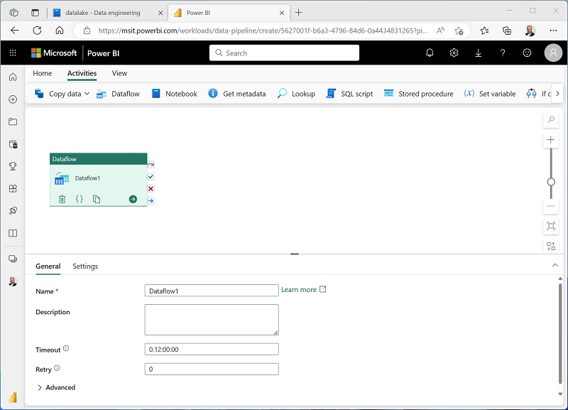

---
lab:
    title: 'Use pipelines to ingest data'
    module: 'Transfer and transform data with pipelines'
---

# Use pipelines to ingest data

A data lakehouse is a common analytical data store for cloud-scale analytics solutions. One of the core tasks of a data engineer is to implement and manage the ingestion of data from multiple operational data sources into the lakehouse. In *Trident*, you can implement *extract, transform, and load* (ETL) or *extract, load, and transform* (ELT) solutions for data ingestion through the creation of *pipelines*.

This lab will take approximately **60** minutes to complete.

## Before you start

You'll need a Power BI Premium subscription with access to the Trident preview.

## Create a workspace

Before working with data in *Trident*, you should create a workspace with support for premium features.

1. Sign into your Power BI service at [https://app.powerbi.com](https://app.powerbi.com).
2. In the menu bar on the left, select **Workspaces** (the icon looks similar to &#128455;).
3. Create a new workspace with a name of your choice, selecting the **Premium per user** licensing mode.
4. When your new workspace opens, it should be empty, as shown here:

    

## Create a lakehouse

Now that you have a workspace, it's time to switch to the *Data engineering* experience in the portal and create a data lakehouse into which you will ingest data.

1. At the bottom left of the Power BI portal, select the **Power BI** icon and switch to the **Data engineering** experience, as shown here:

    

2. In the **Data engineering** home page, create a new **Lakehouse** with a name of your choice.

    After a minute or so, a new lakehouse with no **Tables** or **Files** will be created. You need to ingest some data into the data lakehouse for analysis.

    

## Use a pipeline to copy data

The simplest way to ingest data is to use a **Copy Data** activity in a pipeline to extract the data from a source and copy it to a file or table in the lakehouse.

### Use the Copy Data wizard to create a pipeline

1. On the **Home** page for your lakehouse, select **New data pipeline**.

    The pipeline editor opens in a new browser tab (if you are prompted to allow pop-ups, do so).

2. If the **Copy Data** wizard doesn't open automatically, select **Copy Data** in the pipeline editor page.
3. In the **Copy Data** wizard, on the **Choose a data source** page, in the **data sources** section, select the **File** tab and then select **HTTP**.

    

4. Select **Next** and then select **Create new connection** and enter the following settings for the connection to your data source:
    - **URL**: `https://raw.githubusercontent.com/MicrosoftLearning/dp-data/main/products.csv`
    - **Connection**: Create new connection
    - **Connection name**: web_product_data
    - **Authentication kind**: Anonymous

5. Select **Next**. Then ensure the following settings are selected:
    - **Relative URL**: *Leave blank*
    - **Request method**: GET
    - **Additional headers**: *Leave blank*
    - **Binary copy**: <u>Un</u>selected
    - **Request timeout**: *Leave blank*
    - **Max concurrent connections**: *Leave blank*
6. Select **Next**, and then ensure that the following settings are selected:
    - **File format**: DelimitedText
    - **Column delimiter**: Comma (,)
    - **Row delimiter**: Line feed (\n)
    - **First row as header**: Selected
    - **Compression type**: None
7. Select **Preview data** to see a sample of the data that will be ingested. Then close the data preview and select **Next**.
8. On the **Choose data destination** page, select your existing lakehouse. Then select **Next**.
9. Set the following data destination options, and then select **Next**:
    - **Root folder**: Tables
    - **Table name**: product
10. On the **Copy summary** page, review the details of your copy operation and then select **OK**

    A new pipeline containing a **Copy Data** activity is created, as shown here:

    

11. Use the **&#9655; Run** button to run the pipeline, saving the pipeline as **Copy Product Data** when prompted.

    When the pipeline starts to run, you can monitor its status in the **Output** pane under the pipeline designer. Wait until it has succeeeded.

    

### View the copied data

1. Close the browser tab containing the pipeline designer and return to the tab containing your lakehouse.
2. On the **Home** page, select the **Table view** tab.
3. If necessary, in the **...** menu for **Tables**, select **Refresh**, and then verify that the **product** table has been created.
4. Select the **product** table to see a preview of its data.

    

## Ingest and transform data

While the **Copy Data** activity provides an easy way to copy data from a source into a lakehouse, there may be many scenarios when you need to *transform* data when ingesting it. The **Dataflow** activity enables you to define data flows that connect data sources, transformations, and sinks to accomplish this.

### Create a pipeline with a Dataflow activity

1. On the **Home** page for your lakehouse, in the **Get data** menu, select **New data pipeline**.

   The pipeline editor opens in a new browser tab (if you are prompted to allow pop-ups, do so).

2. If the **Copy Data** wizard opens automatically, select **Cancel** (and confirm) to close it.
3. Select **Add pipeline activity**, and in the list of available activities, select **Dataflow**.

    A new pipeline with a **Dataflow** activity is created.

    

4. With the Dataflow activity selected, in the **General** tab under the pipeline design canvas, change the **Name** to **Ingest Sales**.

# BLOCKED

*Can't get any further than this because the portal won't let me define the dataflow!*
