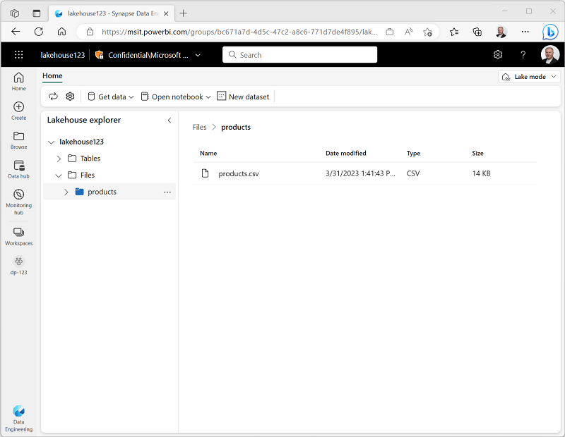
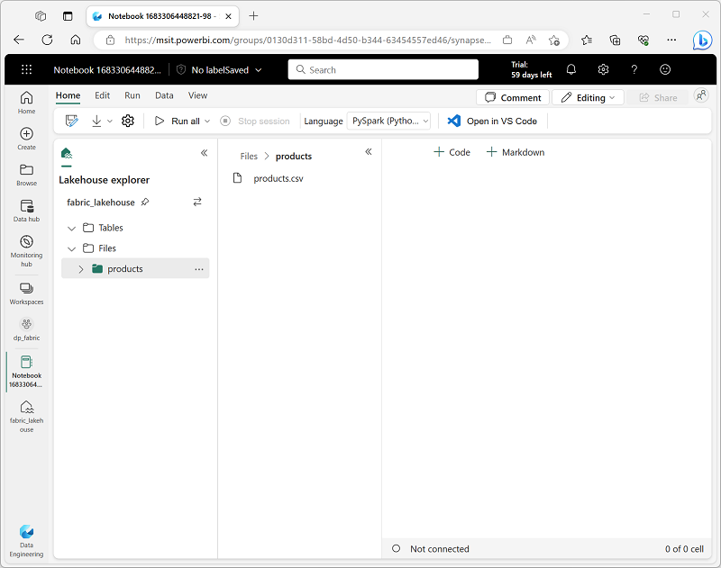

---
lab:
    title: 'Use delta tables in Apache Spark'
    module: 'Work with Delta Lake tables in Microsoft Fabric'
---

# Use delta tables in Apache Spark

Tables in a Microsoft Fabric lakehouse are based on the open source *Delta Lake* format for Apache Spark. Delta Lake adds support for relational semantics for both batch and streaming data operations, and enables the creation of a Lakehouse architecture in which Apache Spark can be used to process and query data in tables that are based on underlying files in a data lake.

This exercise should take approximately **40** minutes to complete

## Before you start

You'll need a Microsoft Fabric license to complete this exercise.

See [Getting started with Fabric](https://learn.microsoft.com/fabric/get-started/fabric-trial) for details of how to enable a free Fabric trial license. You will need a Microsoft *school* or *work* account to do this. If you don't have one, you can [sign up for a trial of Microsoft Office 365 E3 or higher](https://www.microsoft.com/microsoft-365/business/compare-more-office-365-for-business-plans).

After enabling the Fabric trial, when you sign into the Fabric portal at [https://app.fabric.microsoft.com](https://app.fabric.microsoft.com), you should see a Power BI logo at the bottom left that you can use to switch to the various workload experiences supported in Microsoft Fabric. If this logo is not visible, you may need to ask your organization's administrator to [enable Fabric trial functionality](https://learn.microsoft.com/fabric/get-started/fabric-trial#administer-user-access-to-a-fabric-preview-trial).

## Create a workspace

Before working with data in Fabric, create a workspace with the Fabric trial enabled.

1. Sign into Microsoft Fabric at [https://app.fabric.microsoft.com](https://app.fabric.microsoft.com) and select **Power BI**.
2. In the menu bar on the left, select **Workspaces** (the icon looks similar to &#128455;).
3. Create a new workspace with a name of your choice, selecting the **Trial** licensing mode.
4. When your new workspace opens, it should be empty, as shown here:

    

## Create a lakehouse and upload data

Now that you have a workspace, it's time to switch to the *Data engineering* experience in the portal and create a data lakehouse for the data you're going to analyze.

1. At the bottom left of the Power BI portal, select the **Power BI** icon and switch to the **Data Engineering** experience.

2. In the **Synapse Data Engineering** home page, create a new **Lakehouse** with a name of your choice.

    After a minute or so, a new empty lakehouse. You need to ingest some data into the data lakehouse for analysis. There are multiple ways to do this, but in this exercise you'll simply download a text file to your local computer and then upload it to your lakehouse.

3. Download the data file for this exercise from [https://github.com/MicrosoftLearning/dp-data/raw/main/products.csv](https://github.com/MicrosoftLearning/dp-data/raw/main/products.csv), saving it as **products.csv** on your local computer.

4. Return to the web browser tab containing your lakehouse, and in the **...** menu for the **Files** folder in the **Explorer** pane, select **New subfolder** and create a folder named **products**.

5. In the **...** menu for the **products** folder, select **Upload** and **Upload files**, and then upload the **products.csv** file from your local computer to the lakehouse.
6. After the file has been uploaded, select the **products** folder; and verify that the **products.csv** file has been uploaded, as shown here:

    

## Explore data in a dataframe

1. On the **Home** page while viewing the contents of the **products** folder in your datalake, in the **Open notebook** menu, select **New notebook**.

    After a few seconds, a new notebook containing a single *cell* will open. Notebooks are made up of one or more cells that can contain *code* or *markdown* (formatted text).

2. Select the existing cell in the notebook, which contains some simple code, and then use its **&#128465;** (*Delete*) icon at its top-right to remove it - you will not need this code.
3. In the **Lakehouse explorer** pane on the left, expand **Files** and select **products** to reveal a new pane showing the **products.csv** file you uploaded previously:

    

4. In the **...** menu for **products.csv**, select **Load data** > **Spark**. A new code cell containing the following code should be added to the notebook:

    ```python
    df = spark.read.format("csv").option("header","true").load("Files/products.csv")
    # df now is a Spark DataFrame containing CSV data from "Files/products.csv".
    display(df)
    ```

    > **Tip**: You can hide the pane containing the files on the left by using its **<<** icon. Doing so will help you focus on the notebook.

5. Use the **&#9655;** (*Run cell*) button on the left of the cell to run it.

    > **Note**: Since this is the first time you've run any Spark code in this notebook, a Spark session must be started. This means that the first run can take a minute or so to complete. Subsequent runs will be quicker.

6. When the cell command has completed, review the output below the cell, which should look similar to this:

    | Index | ProductID | ProductName | Category | ListPrice |
    | -- | -- | -- | -- | -- |
    | 1 | 771 | Mountain-100 Silver, 38 | Mountain Bikes | 3399.9900 |
    | 2 | 772 | Mountain-100 Silver, 42 | Mountain Bikes | 3399.9900 |
    | 3 | 773 | Mountain-100 Silver, 44 | Mountain Bikes | 3399.9900 |
    | ... | ... | ... | ... | ... |

## Create delta tables

You can save the dataframe as a delta table by using the `saveAsTable` method. Delta Lake supports the creation of both *managed* and *external* tables.

### Create a *managed* table

*Managed* tables are tables for which both the schema metadata and the data files are managed by Fabric. The data files for the table are created in the **Tables** folder.

1. Under the results returned by the first code cell, use the **+ Code** button to add a new code cell if one doesn't already exist. Then enter the following code in the new cell and run it:

    ```python
    df.write.format("delta").saveAsTable("managed_products")
    ```

2. In the **Lakehouse explorer** pane, in the **...** menu for the **Tables** folder, select **Refresh**. Then expand the **Tables** node and verify that the **managed_products** table has been created.

### Create an *external* table

You can also create *external* tables for which the schema metadata is defined in the metastore for the lakehouse, but the data files are stored in an external location.

1. Add another new code cell, and add the following code to it:

    ```python
    df.write.format("delta").saveAsTable("external_products", path="<abfs_path>/external_products")
    ```

2. In the **Lakehouse explorer** pane, in the **...** menu for the **Files** folder, select **Copy ABFS path**.

    The ABFS path is the fully qualified path to the **Files** folder in the OneLake storage for your lakehouse - similar to this:

    *abfss://workspace@tenant-onelake.dfs.fabric.microsoft.com/lakehousename.Lakehouse/Files*

3. In the code you entered into the code cell, replace **<abfs_path>** with the path you copied to the clipboard so that the code saves the dataframe as an external table with data files in a folder named **external_products** in your **Files** folder location. The full path should look similar to this:

    *abfss://workspace@tenant-onelake.dfs.fabric.microsoft.com/lakehousename.Lakehouse/Files/external_products*

4. In the **Lakehouse explorer** pane, in the **...** menu for the **Tables** folder, select **Refresh**. Then expand the **Tables** node and verify that the **external_products** table has been created.

5. In the **Lakehouse explorer** pane, in the **...** menu for the **Files** folder, select **Refresh**. Then expand the **Files** node and verify that the **external_products** folder has been created for the table's data files.

### Compare *managed* and *external* tables

Let's explore the differences between managed and external tables.

1. Add another code cell and run the following code:

    ```sql
    %%sql

    DESCRIBE FORMATTED managed_products;
    ```

    In the results, view the **Location** property for the table, which should be a path to the OneLake storage for the lakehouse ending with **/Tables/managed_products** (you may need to widen the **Data type** column to see the full path).

2. Modify the `DESCRIBE` command to show the details of the **external_products** table as shown here:

    ```sql
    %%sql

    DESCRIBE FORMATTED external_products;
    ```

    In the results, view the **Location** property for the table, which should be a path to the OneLake storage for the lakehouse ending with **/Files/external_products** (you may need to widen the **Data type** column to see the full path).

    The files for managed table are stored in the **Tables** folder in the OneLake storage for the lakehouse. In this case, a folder named **managed_products** has been created to store the Parquet files and **delta_log** folder for the table you created.

3. Add another code cell and run the following code:

    ```sql
    %%sql

    DROP TABLE managed_products;
    DROP TABLE external_products;
    ```

4. In the **Lakehouse explorer** pane, in the **...** menu for the **Tables** folder, select **Refresh**. Then expand the **Tables** node and verify that no tables are listed.

5. In the **Lakehouse explorer** pane, expand the **Files** folder and verify that the **external_products** has not been deleted. Select this folder to view the Parquet data files and **_delta_log** folder for the data that was previously in the **external_products** table. The table metadata for the external table was deleted, but the files were not affected.

### Use SQL to create a table

1. Add another code cell and run the following code:

    ```sql
    %%sql

    CREATE TABLE products
    USING DELTA
    LOCATION 'Files/external_products';
    ```

2. In the **Lakehouse explorer** pane, in the **...** menu for the **Tables** folder, select **Refresh**. Then expand the **Tables** node and verify that a new table named **products** is listed. Then expand the table to verify that it's schema matches the original dataframe that was saved in the **external_products** folder.

3. Add another code cell and run the following code:

    ```sql
    %%sql

   SELECT * FROM products;
   ```

## Explore table versioning

Transaction history for delta tables is stored in JSON files in the **delta_log** folder. You can use this transaction log to manage data versioning.

1. Add a new code cell to the notebook and run the following code:

    ```Python
    %%sql

    UPDATE products
    SET ListPrice = ListPrice * 0.9
    WHERE Category = 'Mountain Bikes';
    ```

    This code implements a 10% reduction in the price for mountain bikes.

2. Add another code cell and run the following code:

    ```sql
    %%sql

    DESCRIBE HISTORY products;
    ```

    The results show the history of transactions recorded for the table.

3. Add another code cell and run the following code:

    ```python
    delta_table_path = 'Files/external_products'

    # Get the current data
    current_data = spark.read.format("delta").load(delta_table_path)
    display(current_data)

    # Get the version 0 data
    original_data = spark.read.format("delta").option("versionAsOf", 0).load(delta_table_path)
    display(original_data)
    ```

    The results show two dataframes - one containing the data after the price reduction, and the other showing the original version of the data.

## Use delta tables for streaming data

Delta lake supports streaming data. Delta tables can be a *sink* or a *source* for data streams created using the Spark Structured Streaming API. In this example, you'll use a delta table as a sink for some streaming data in a simulated internet of things (IoT) scenario.

1. Add a new code cell in the notebook. Then, in the new cell, add the following code and run it:

    ```python
    from notebookutils import mssparkutils
    from pyspark.sql.types import *
    from pyspark.sql.functions import *

    # Create a folder
    inputPath = 'Files/data/'
    mssparkutils.fs.mkdirs(inputPath)

    # Create a stream that reads data from the folder, using a JSON schema
    jsonSchema = StructType([
    StructField("device", StringType(), False),
    StructField("status", StringType(), False)
    ])
    iotstream = spark.readStream.schema(jsonSchema).option("maxFilesPerTrigger", 1).json(inputPath)

    # Write some event data to the folder
    device_data = '''{"device":"Dev1","status":"ok"}
    {"device":"Dev1","status":"ok"}
    {"device":"Dev1","status":"ok"}
    {"device":"Dev2","status":"error"}
    {"device":"Dev1","status":"ok"}
    {"device":"Dev1","status":"error"}
    {"device":"Dev2","status":"ok"}
    {"device":"Dev2","status":"error"}
    {"device":"Dev1","status":"ok"}'''
    mssparkutils.fs.put(inputPath + "data.txt", device_data, True)
    print("Source stream created...")
    ```

    Ensure the message *Source stream created...* is printed. The code you just ran has created a streaming data source based on a folder to which some data has been saved, representing readings from hypothetical IoT devices.

2. In a new code cell, add and run the following code:

    ```python
    # Write the stream to a delta table
    delta_stream_table_path = 'Tables/iotdevicedata'
    checkpointpath = 'Files/delta/checkpoint'
    deltastream = iotstream.writeStream.format("delta").option("checkpointLocation", checkpointpath).start(delta_stream_table_path)
    print("Streaming to delta sink...")
    ```

    This code writes the streaming device data in delta format to a folder named **iotdevicedata**. Because the path for the folder location in the **Tables** folder, a table will automatically be created for it.

3. In a new code cell, add and run the following code:

    ```sql
    %%sql

    SELECT * FROM IotDeviceData;
    ```

    This code queries the **IotDeviceData** table, which contains the device data from the streaming source.

4. In a new code cell, add and run the following code:

    ```python
    # Add more data to the source stream
    more_data = '''{"device":"Dev1","status":"ok"}
    {"device":"Dev1","status":"ok"}
    {"device":"Dev1","status":"ok"}
    {"device":"Dev1","status":"ok"}
    {"device":"Dev1","status":"error"}
    {"device":"Dev2","status":"error"}
    {"device":"Dev1","status":"ok"}'''

    mssparkutils.fs.put(inputPath + "more-data.txt", more_data, True)
    ```

    This code writes more hypothetical device data to the streaming source.

5. Re-run the cell containing the following code:

    ```sql
    %%sql

    SELECT * FROM IotDeviceData;
    ```

    This code queries the **IotDeviceData** table again, which should now include the additional data that was added to the streaming source.

6. In a new code cell, add and run the following code:

    ```python
    deltastream.stop()
    ```

    This code stops the stream.

## Clean up resources

In this exercise, you've learned how to work with delta tables in Microsoft Fabric.

If you've finished exploring your lakehouse, you can delete the workspace you created for this exercise.

1. In the bar on the left, select the icon for your workspace to view all of the items it contains.
2. In the **...** menu on the toolbar, select **Workspace settings**.
3. In the **Other** section, select **Remove this workspace**.
