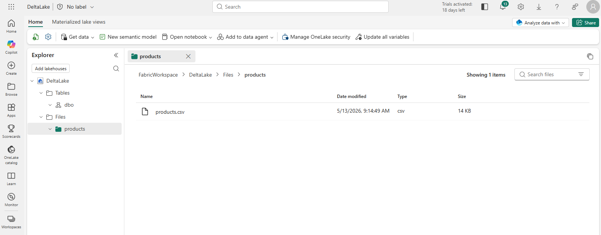
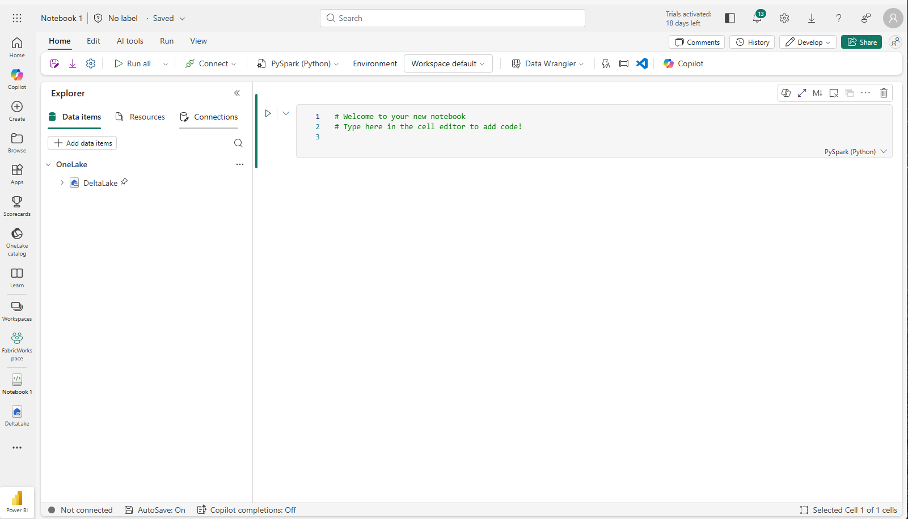
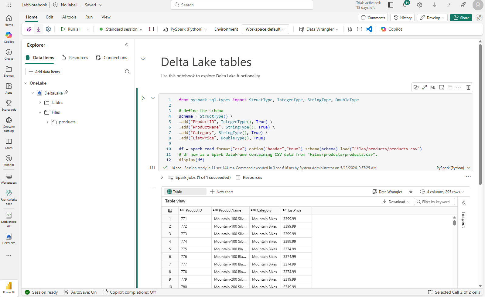
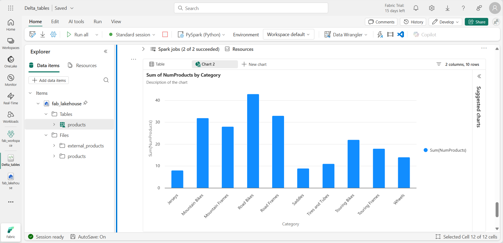

---
lab:
  title: Use delta tables in Apache Spark
  module: Work with Delta Lake tables in Microsoft Fabric
  description: In this lab, you'll create Delta tables in a Microsoft Fabric lakehouse and explore data using SQL queries. You'll work with the Delta Lake format to support relational semantics for both batch and streaming data operations.
  duration: 45 minutes
  level: 300
  islab: true
  primarytopics:
    - Microsoft Fabric
  categories:
    - Data engineering
  courses:
    - DP-700
    - DP-601
---

# Use Delta Tables in Apache Spark

Tables in a Microsoft Fabric Lakehouse are based on the open-source Delta Lake format. Delta Lake adds support for relational semantics for both batch and streaming data. In this exercise you will create Delta tables and explore the data using SQL queries.

This exercise should take approximately **45** minutes to complete

## Create a workspace

> **Note**: You need access to a Fabric paid or trial capacity to complete this exercise. For information about the free Fabric trial, see [Fabric trial](https://aka.ms/fabrictrial).

1. Navigate to the [Microsoft Fabric home page](https://app.fabric.microsoft.com/home?experience=fabric-developer) at `https://app.fabric.microsoft.com/home?experience=fabric-developer` in a browser and sign in with your Fabric credentials.
1. In the menu bar on the left, select **Workspaces** (the icon looks similar to &#128455;).
1. Create a new workspace with a name of your choice, selecting a licensing mode in the **Advanced** section that includes Fabric capacity (*Trial*, *Premium*, or *Fabric*).
1. When your new workspace opens, it should be empty.

    

## Create a lakehouse and upload files

Now that you have a workspace, it's time to create a data lakehouse for your data.

1. In the workspace, select **+ New item** and create a new **Lakehouse** with a unique name of your choice. Leave the **Lakehouse schemas** checkbox selected.

    After a minute or so, a new lakehouse will be created:

    

1. View the new lakehouse, and note that the **Explorer** pane on the left enables you to browse tables and files in the lakehouse:

You can now ingest data into the lakehouse. There are several ways to do this, but for now you’ll download a text file to your local computer (or lab VM if applicable) and then upload it to your lakehouse. 

1. Download the [data file](https://github.com/MicrosoftLearning/dp-data/raw/main/products.csv) from `https://github.com/MicrosoftLearning/dp-data/raw/main/products.csv`, saving it as *products.csv*.
1. Return to the web browser tab containing your lakehouse, and in the Explorer pane, next to the **Files** folder, select the … menu.  Create a **New subfolder** called *products*. Naming must be all small letters.
1. In the … menu for the products folder, **upload** the *products.csv* file from your local computer (or lab VM if applicable).
1. After the file has been uploaded, select the **products** folder to verify that the file has been uploaded, as shown here:

    
  
## Explore data in a DataFrame

You can now create a Fabric notebook to work with your data. Notebooks provide an interactive environment where you can write and run code.

1. In the lakehouse, select **Open notebook** > **New notebook**.

    A new notebook named **Notebook 1** is created and opened.

    

1. Fabric assigns a name to each notebook you create, such as Notebook 1, Notebook 2, etc. Click the name panel above the **Home** tab on the menu to change the name to something more descriptive.
1. Select the first cell (which is currently a code cell), and then in the top-right tool bar, use the **M↓** button to convert it to a markdown cell. The text contained in the cell will then be displayed as formatted text.
1. Use the 🖉 (Edit) button to switch the cell to editing mode, then modify the markdown as shown below.

    ```markdown
    # Delta Lake tables 
    Use this notebook to explore Delta Lake functionality 
    ```

1. Click anywhere in the notebook outside of the cell to stop editing it.
1. Add a new code cell, and add the following code to read the products data into a DataFrame using a defined schema:

    > [!TIP]
    > To add a code cell, select **+ Code** which appears when you hover the mouse above or below the current cell or its output. Alternatively, from the ribbon menu select **Edit** and **+ Add code cell below**.

    ```python
   from pyspark.sql.types import StructType, IntegerType, StringType, DoubleType

   # define the schema
   schema = StructType() \
   .add("ProductID", IntegerType(), True) \
   .add("ProductName", StringType(), True) \
   .add("Category", StringType(), True) \
   .add("ListPrice", DoubleType(), True)

   df = spark.read.format("csv").option("header","true").schema(schema).load("Files/products/products.csv")
   # df now is a Spark DataFrame containing CSV data from "Files/products/products.csv".
   display(df)
    ```

> [!TIP]
> Hide or display the explorer panes by using the chevron « icon. This enables you to either focus on the notebook, or your files.

1. Use the **Run cell** (▷) button on the left of the cell to run it.

> [!NOTE]
> Since this is the first time you’ve run any code in this notebook, a Spark session must be started. This means that the first run can take a minute or so to complete. Subsequent runs will be quicker.

1. When the cell code has completed, review the output below the cell, which should look similar to this:

    
 
## Create Delta tables

You can save a DataFrame as a managed Delta table by using the *saveAsTable* method. When you create a managed table, Fabric manages both the schema metadata and the data files.

### Create a managed table

The data files are created in the **Tables** folder.

1. To create a managed Delta table, add a new code cell, enter the following code and then run the cell:

    ```python
   df.write.format("delta").saveAsTable("dbo.managed_products")
    ```

1. In the Explorer pane, **Refresh** the Tables folder and expand the Tables node to verify that the **managed_products** table has been created.

> [!NOTE]
> The triangle icon next to the file name indicates a Delta table.

The files for managed tables are stored in the **Tables** folder in the lakehouse. A folder named *dbo/managed_products* has been created which stores the Parquet files and delta_log folder for the table.

## Use SQL to create a Delta table

You can also use the SQL `CREATE TABLE` statement to define a table based on files in Delta format.

1. Add a new code cell and run the following code to save the products data as Delta files in the **Files** folder of the lakehouse:

    ```python
   df.write.format("delta").save("Files/products")
    ```

1. In the Explorer pane, in the … menu for the **Files** folder, select **Refresh**. Then expand the **Files** node and verify that a folder named *products* has been created.

1. Add a new code cell and run the following code to create a table from the Delta files:

    ```python
   %%sql
   CREATE TABLE dbo.products
   USING DELTA
   LOCATION 'Files/products';
    ```

1. In the Explorer pane, in the … menu for the **Tables** folder, select **Refresh**. Then expand the Tables node and verify that a new table named *products* is listed. Then expand the table to view the schema.
1. Add another code cell and run the following code:

    ```python
   %%sql
   SELECT * FROM dbo.products;
    ```

## Explore table versioning

Transaction history for Delta tables is stored in JSON files in the delta_log folder. You can use this transaction log to manage data versioning.

1. Add a new code cell to the notebook and run the following code which implements a 10% reduction in the price for mountain bikes:

    ```python
   %%sql
   UPDATE dbo.products
   SET ListPrice = ListPrice * 0.9
   WHERE Category = 'Mountain Bikes';
    ```

1. Add another code cell and run the following code:

    ```python
   %%sql
   DESCRIBE HISTORY dbo.products;
    ```

The results show the history of transactions recorded for the table.

1. Add another code cell and run the following code:

    ```python
   delta_table_path = 'Files/products'
   # Get the current data
   current_data = spark.read.format("delta").load(delta_table_path)
   display(current_data)

   # Get the version 0 data
   original_data = spark.read.format("delta").option("versionAsOf", 0).load(delta_table_path)
   display(original_data)
    ```

Two result sets are returned - one containing the data after the price reduction, and the other showing the original version of the data.

## Analyze Delta table data with SQL queries

Using the SQL magic command you can use SQL syntax instead of Pyspark. Here you will create a temporary view from the products table using a `SELECT` statement.

1. Add a new code cell, and run the following code to create and display the temporary view:

    ```python
   %%sql
   -- Create a temporary view
   CREATE OR REPLACE TEMPORARY VIEW products_view
   AS
       SELECT Category, COUNT(*) AS NumProducts, MIN(ListPrice) AS MinPrice, MAX(ListPrice) AS MaxPrice, AVG(ListPrice) AS AvgPrice
       FROM dbo.products
       GROUP BY Category;

   SELECT *
   FROM products_view
   ORDER BY Category;    
    ```

1. Add a new code cell, and run the following code to return the top 10 categories by number of products:

    ```python
   %%sql
   SELECT Category, NumProducts
   FROM products_view
   ORDER BY NumProducts DESC
   LIMIT 10;
    ```

1. When the data is returned, select **+ New chart** to display one of the suggested charts.

    

Alternatively, you can run a SQL query using PySpark.

1. Add a new code cell, and run the following code:

    ```python
   from pyspark.sql.functions import col, desc

   df_products = spark.sql("SELECT Category, MinPrice, MaxPrice, AvgPrice FROM products_view").orderBy(col("AvgPrice").desc())
   display(df_products.limit(6))
    ```

## Use Delta tables for streaming data

Delta Lake supports streaming data. Delta tables can be a sink or a source for data streams created using the Spark Structured Streaming API. In this example, you’ll use a Delta table as a sink for some streaming data in a simulated internet of things (IoT) scenario.

1.	Add a new code cell and add the following code and run it:

    ```python
    from notebookutils import mssparkutils
    from pyspark.sql.types import *
    from pyspark.sql.functions import *

    # Create a folder
    inputPath = 'Files/data/'
    mssparkutils.fs.mkdirs(inputPath)

    # Create a stream that reads data from the folder, using a JSON schema
    jsonSchema = StructType([
    StructField("device", StringType(), False),
    StructField("status", StringType(), False)
    ])
    iotstream = spark.readStream.schema(jsonSchema).option("maxFilesPerTrigger", 1).json(inputPath)

    # Write some event data to the folder
    device_data = '''{"device":"Dev1","status":"ok"}
    {"device":"Dev1","status":"ok"}
    {"device":"Dev1","status":"ok"}
    {"device":"Dev2","status":"error"}
    {"device":"Dev1","status":"ok"}
    {"device":"Dev1","status":"error"}
    {"device":"Dev2","status":"ok"}
    {"device":"Dev2","status":"error"}
    {"device":"Dev1","status":"ok"}'''

    mssparkutils.fs.put(inputPath + "data.txt", device_data, True)

    print("Source stream created...")
    ```

Ensure the message *Source stream created…* is displayed. The code you just ran has created a streaming data source based on a folder to which some data has been saved, representing readings from hypothetical IoT devices.

1. In a new code cell, add and run the following code:

    ```python
   # Write the stream to a delta table
   delta_stream_table_path = 'Tables/dbo/iotdevicedata'
   checkpointpath = 'Files/delta/checkpoint'
   deltastream = iotstream.writeStream.format("delta").option("checkpointLocation", checkpointpath).start(delta_stream_table_path)
   print("Streaming to delta sink...")
    ```

This code writes the streaming device data in Delta format to a folder named iotdevicedata. Because the path for the folder location in the Tables folder, a table will automatically be created for it.

1. In a new code cell, add and run the following code:

    ```python
   %%sql
   SELECT * FROM dbo.IotDeviceData;
    ```

This code queries the IotDeviceData table, which contains the device data from the streaming source.

1. In a new code cell, add and run the following code:

    ```python
   # Add more data to the source stream
   more_data = '''{"device":"Dev1","status":"ok"}
   {"device":"Dev1","status":"ok"}
   {"device":"Dev1","status":"ok"}
   {"device":"Dev1","status":"ok"}
   {"device":"Dev1","status":"error"}
   {"device":"Dev2","status":"error"}
   {"device":"Dev1","status":"ok"}'''

   mssparkutils.fs.put(inputPath + "more-data.txt", more_data, True)
    ```

This code writes more hypothetical device data to the streaming source.

1. Re-run the cell containing the following code:

    ```python
   %%sql
   SELECT * FROM dbo.IotDeviceData;
    ```

This code queries the IotDeviceData table again, which should now include the additional data that was added to the streaming source.

1. In a new code cell, add code to stop the stream and run the cell:

    ```python
   deltastream.stop()
    ```

## Clean up resources

In this exercise, you’ve learned how to work with Delta tables in Microsoft Fabric.

If you’ve finished exploring your lakehouse, you can delete the workspace you created for this exercise.

1. In the bar on the left, select the icon for your workspace to view all of the items it contains.
1. In the … menu on the toolbar, select **Workspace settings**.
1. In the General section, select **Remove this workspace**.
