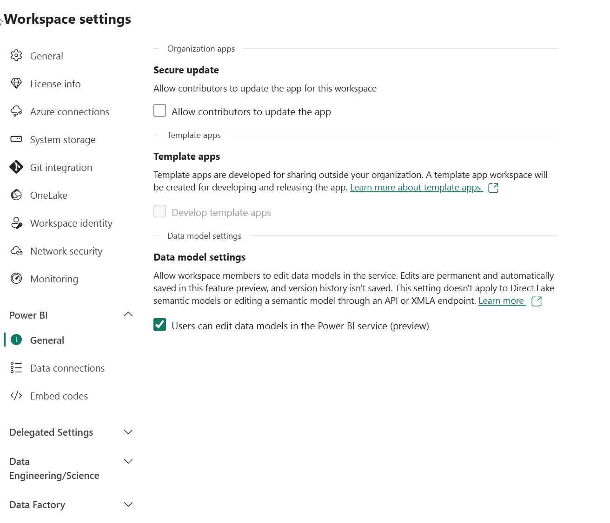
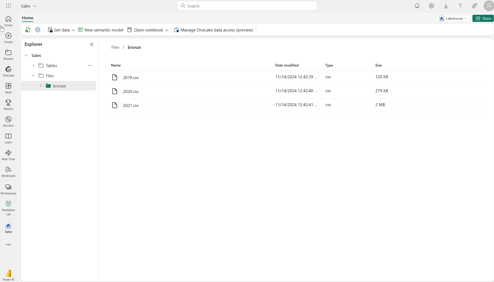

---
lab:
    title: 'Create a medallion architecture in a Microsoft Fabric lakehouse'
    module: 'Organize a Fabric lakehouse using medallion architecture design'
---

# Create a medallion architecture in a Microsoft Fabric lakehouse

In this exercise you will build out a medallion architecture in a Fabric lakehouse using notebooks. You will create a workspace, create a lakehouse, upload data to the bronze layer, transform the data and load it to the silver Delta table, transform the data further and load it to the gold Delta tables, and then explore the dataset and create relationships.

This exercise should take approximately **40** minutes to complete

> **Note**: You'll need a Microsoft Fabric license to complete this exercise. See [Getting started with Fabric](https://learn.microsoft.com/fabric/get-started/fabric-trial) for details of how to enable a free Fabric trial license. You will need a Microsoft *school* or *work* account to do this. If you don't have one, you can [sign up for a trial of Microsoft Office 365 E3 or higher](https://www.microsoft.com/microsoft-365/business/compare-more-office-365-for-business-plans).

## Create a workspace and enable data model editing

Before working with data in Fabric, create a workspace with the Fabric trial enabled.

1. Sign into [Microsoft Fabric](https://app.fabric.microsoft.com) at `https://app.fabric.microsoft.com` and select **Power BI**.
2. In the menu bar on the left, select **Workspaces** (the icon looks similar to &#128455;).
3. Create a new workspace with a name of your choice, selecting a licensing mode that includes Fabric capacity (*Trial*, *Premium*, or *Fabric*).
4. When your new workspace opens, it should be empty, as shown here:

    
5. Navigate to the workspace settings and enable the **Data model editing** preview feature. This will enable you to create relationships between tables in your lakehouse using a Power BI dataset.

    

    > **Note**: You may need to refresh the browser tab after enabling the preview feature.

## Create a lakehouse and upload data to bronze layer

Now that you have a workspace, it's time to switch to the *Data engineering* experience in the Fabric portal and create a data lakehouse for the data you're going to analyze.

1. At the bottom left of the Power BI portal, select the **Power BI** icon and switch to the **Data Engineering** experience.

2. In the **Synapse Data Engineering** home page, create a new **Lakehouse** with a name of your choice.

    After a minute or so, a new empty lakehouse. You need to ingest some data into the data lakehouse for analysis. There are multiple ways to do this, but in this exercise you'll simply download a text file to your local computer (or lab VM if applicable) and then upload it to your lakehouse.

3. Download the data file for this exercise from `https://github.com/MicrosoftLearning/dp-data/blob/main/orders.zip`. Extract the files and save them with their original names on your local computer (or lab VM if applicable). There should be 3 files containing sales data for 3 years: 2019.csv, 2020.csv, and 2021.csv.

4. Return to the web browser tab containing your lakehouse, and in the **...** menu for the **Files** folder in the **Explorer** pane, select **New subfolder** and create a folder named **bronze**.

5. In the **...** menu for the **bronze** folder, select **Upload** and **Upload files**, and then upload the 3 files (2019.csv, 2020.csv, and 2021.csv) from your local computer (or lab VM if applicable) to the lakehouse. Use the shift key to upload all 3 files at once.
   
6. After the files have been uploaded, select the **bronze** folder; and verify that the files have been uploaded, as shown here:

    

## Transform data and load to silver Delta table

Now that you have some data in the bronze layer of your lakehouse, you can use a notebook to transform the data and load it to a delta table in the silver layer. 

1. On the **Home** page while viewing the contents of the **bronze** folder in your data lake, in the **Open notebook** menu, select **New notebook**.

    After a few seconds, a new notebook containing a single *cell* will open. Notebooks are made up of one or more cells that can contain *code* or *markdown* (formatted text).

2. When the notebook opens, rename it to **Transform data for Silver** by selecting the **Notebook xxxx** text at the top left of the notebook and entering the new name.

    

2. Select the existing cell in the notebook, which contains some simple commented-out code. Highlight and delete these two lines - you will not need this code.
   
   > **Note**: Notebooks enable you to run code in a variety of languages, including Python, Scala, and SQL. In this exercise, you'll use PySpark and SQL. You can also add markdown cells to provide formatted text and images to document your code.

3. **Paste** the following code into the cell:

    ```python
    from pyspark.sql.types import *
    
    # Create the schema for the table
    orderSchema = StructType([
        StructField("SalesOrderNumber", StringType()),
        StructField("SalesOrderLineNumber", IntegerType()),
        StructField("OrderDate", DateType()),
        StructField("CustomerName", StringType()),
        StructField("Email", StringType()),
        StructField("Item", StringType()),
        StructField("Quantity", IntegerType()),
        StructField("UnitPrice", FloatType()),
        StructField("Tax", FloatType())
        ])

    # Import all files from bronze folder of lakehouse
    df = spark.read.format("csv").option("header", "true").schema(orderSchema).load("Files/bronze/*.csv")
    
    # Display the first 10 rows of the dataframe to preview your data
    display(df.head(10))
    ```

4. Use the ****&#9655;** (*Run cell*)** button on the left of the cell to run the code.

    > **Note**: Since this is the first time you've run any Spark code in this notebook, a Spark session must be started. This means that the first run can take a minute or so to complete. Subsequent runs will be quicker.

5. When the cell command has completed, **review the output** below the cell, which should look similar to this:

    | Index | SalesOrderNumber | SalesOrderLineNumber | OrderDate | CustomerName | Email | Item | Quantity | UnitPrice | Tax |
    | -- | -- | -- | -- | -- | -- | -- | -- | -- | -- |
    | 1 | SO49172 | 1 | 2021-01-01 | Brian Howard | brian23@adventure-works.com | Road-250 Red, 52 | 1 | 2443.35 | 195.468 |
    | 2 |  SO49173 | 1 | 2021-01-01 | Linda Alvarez | Mountain-200 Silver, 38 | 1 | 2071.4197 | 165.7136 |
    | ... | ... | ... | ... | ... | ... | ... | ... | ... | ... |

    The code you ran loaded the data from the CSV files in the **bronze** folder into a Spark dataframe, and then displayed the first few rows of the dataframe.

    > **Note**: You can clear, hide, and auto-resize the contents of the cell output by selecting the **...** menu at the top left of the output pane.

6. Now you'll **add columns for data validation and cleanup**, using a PySpark dataframe to add columns and update the values of some of the existing columns. Use the + button to **add a new code block** and add the following code to the cell:

    ```python
    from pyspark.sql.functions import when, lit, col, current_timestamp, input_file_name
    
    # Add columns FileName, IsFlagged, CreatedTS and ModifiedTS for data validation and tracking
    df = df.withColumn("FileName", input_file_name())
    df = df.withColumn("IsFlagged", when(col("OrderDate") < '2019-08-01',True).otherwise(False))
    df = df.withColumn("CreatedTS", current_timestamp()).withColumn("ModifiedTS", current_timestamp())
    df = df.withColumn("CustomerID", lit(None).cast("BigInt"))
    df = df.withColumn("ItemID", lit(None).cast("BigInt"))
    
    # Update CustomerName to "Unknown" if CustomerName null or empty
    df = df.withColumn("CustomerName", when((col("CustomerName").isNull() | (col("CustomerName")=="")),lit("Unknown")).otherwise(col("CustomerName")))
    ```

    The first line of the code imports the necessary functions from PySpark. You're then adding new columns to the dataframe so you can track the source file name, whether the order was flagged as being a before the fiscal year of interest, and when the row was created and modified.
    
    You're also adding columns for the CustomerID and ItemID, which will be populated later.
    
    Finally, you're updating the CustomerName column to "Unknown" if it's null or empty.

7. Run the cell to execute the code using the ****&#9655;** (*Run cell*)** button.

8. Next, you'll use SparkSQL to create your cleaned-up dataframe as a new table called **sales_silver** in the sales database using Delta Lake format. Create a new code block and add the following code to the cell:

    ```python
     %%sql
    
    -- Create sales_silver table 
    CREATE TABLE sales.sales_silver (
        SalesOrderNumber string
        , SalesOrderLineNumber int
        , OrderDate date
        , CustomerName string
        , Email string
        , Item string
        , Quantity int
        , UnitPrice float
        , Tax float
        , FileName string
        , IsFlagged boolean
        , CustomerID bigint
        , ItemID bigint
        , CreatedTS date
        , ModifiedTS date
    ) USING delta;
    ```

    This code uses `%sql` magic to run SQL statements. The first statement creates a new database called **sales**. The second statement creates a new table called **sales_silver** in the **sales** database, using the Delta Lake format and the dataframe you created in the previous code block.

9. Run the cell to execute the code using the ****&#9655;** (*Run cell*)** button.

10. Select the **...** in the Tables section of the lakehouse explorer pane and select **Refresh**. You should now see the new **sales_silver** table listed. The **&#9650;** (triangle icon) indicates that it's a Delta table.

    

    > **Note**: If you don't see the new table, wait a few seconds and then select **Refresh** again, or refresh the entire browser tab.

11. Now you're going to perform an **upsert operation** on a Delta table, updating existing records based on specific conditions and inserting new records when no match is found. Add a new code block and paste the following code:

    ```python
    # Update existing records and insert new ones based on a condition defined by the columns SalesOrderNumber, OrderDate, CustomerName, and Item.

    from delta.tables import *
    
    deltaTable = DeltaTable.forPath(spark, 'abfss://1daff8bf-a15d-4063-97c2-fd6381bd00b4@onelake.dfs.fabric.microsoft.com/065c411a-27de-4dec-b4fb-e1df9737f0a0/Tables/sales_silver')
    
    dfUpdates = df
    
    deltaTable.alias('silver') \
      .merge(
        dfUpdates.alias('updates'),
        'silver.SalesOrderNumber = updates.SalesOrderNumber and silver.OrderDate = updates.OrderDate and silver.CustomerName = updates.CustomerName and silver.Item = updates.Item'
      ) \
       .whenMatchedUpdate(set =
        {
          
        }
      ) \
     .whenNotMatchedInsert(values =
        {
          "SalesOrderNumber": "updates.SalesOrderNumber",
          "SalesOrderLineNumber": "updates.SalesOrderLineNumber",
          "OrderDate": "updates.OrderDate",
          "CustomerName": "updates.CustomerName",
          "Email": "updates.Email",
          "Item": "updates.Item",
          "Quantity": "updates.Quantity",
          "UnitPrice": "updates.UnitPrice",
          "Tax": "updates.Tax",
          "FileName": "updates.FileName",
          "IsFlagged": "updates.IsFlagged",
          "CustomerID": "updates.CustomerID",
          "ItemID": "updates.ItemID",
          "CreatedTS": "updates.CreatedTS",
          "ModifiedTS": "updates.ModifiedTS"
        }
      ) \
      .execute()
    ```
    This operation is important because it enables you to update existing records in the table based on the values of specific columns, and insert new records when no match is found. This is a common requirement when you're loading data from a source system that may contain updates to existing records and new records.

You now have data in your silver delta table that is ready for further transformation and modeling.

## Explore data in the silver layer using the SQL endpoint

Now that you have data in your silver layer, you can use the SQL endpoint to explore the data and perform some basic analysis. This is a nice option for you if you're familiar with SQL and want to do some basic exploration of your data. In this exercise we're using the SQL endpoint view in Fabric, but note that you can also use other tools like SQL Server Management Studio (SSMS) and Azure Data Explorer.

1. Navigate back to your workspace and notice that you now have a few assets listed. Select **SQL endpoint** to open your lakehouse in the SQL endpoint view.

    

1. Select **New SQL query** from the ribbon, which will open a SQL query editor. Note that you can rename your query using the **...** menu item next to the existing query name in the lakehouse explorer pane.

   We're going to run two sql queries to explore our data.

1. Paste the following query into the query editor and select **Run**:

    ```sql
    SELECT YEAR(OrderDate) AS Year
        , CAST (SUM(Quantity * (UnitPrice + Tax)) AS DECIMAL(12, 2)) AS TotalSales
    FROM sales_silver
    GROUP BY YEAR(OrderDate) 
    ORDER BY YEAR(OrderDate)
    ```

    This query calculates the total sales for each year in the sales_silver table. Your results should look like this:

    

  1. Now we'll take a look at which customers are purchasing the most (in terms of quantity). Paste the following query into the query editor and select **Run**:

        ```sql
        SELECT TOP 10 CustomerName, SUM(Quantity) AS TotalQuantity
        FROM sales_silver
        GROUP BY CustomerName
        ORDER BY TotalQuantity DESC
        ```
        This query calculates the total quantity of items purchased by each customer in the sales_silver table, and then returns the top 10 customers in terms of quantity.

Data exploration at the silver layer is useful for basic analysis, but you'll need to transform the data further and model it into a star schema to enable more advanced analysis and reporting. You'll do that in the next section.

## Transform data for gold layer

You have successfully taken data from your bronze layer, transformed it, and loaded it into a silver Delta table. Now you'll use a new notebook to transform the data further, model it into a star schema, and load it into gold Delta tables.

Note that you could have done all of this in a single notebook, but for the purposes of this exercise you're using separate notebooks to demonstrate the process of transforming data from bronze to silver and then from silver to gold. This can help with debugging, troubleshooting, and reuse.

1. Return to the **Data Engineering** home page and create a new notebook called **Transform data for Gold**.

2. In the lakehouse explorer pane, add your **Sales** lakehouse by selecting **Add** and then selecting the **Sales** lakehouse you created earlier. You should see the **sales_silver** table listed in the **Tables** section of the explorer pane.

3. In the existing code block, remove the boilerplate text and **add the following code** to load data to your dataframe and start building out your star schema:

    ```python
    # Load data to the dataframe as a starting point to create the gold layer
    df = spark.read.table("Sales.sales_silver")
    ```

4. **Add a new code block** and paste the following code to create your date dimension table:

    ```python
        %%sql
    -- Create Date_gold dimension table
    CREATE TABLE IF NOT EXISTS sales.dimdate_gold (
        OrderDate date
        , Day int
        , Month int
        , Year int
        , `mmmyyyy` string
        , yyyymm string
    ) USING DELTA;
    
    ```
    > **Note**: You can run the `display(df)` command at any time to check the progress of your work. In this case, you'd run 'display(dfdimDate_gold)' to see the contents of the dimDate_gold dataframe.

5. In a new code block, **add the following code** to update the date dimension as new data comes in:

    ```python
    from delta.tables import *

    deltaTable = DeltaTable.forPath(spark, 'abfss://1daff8bf-a15d-4063-97c2-fd6381bd00b4@onelake.dfs.fabric.microsoft.com/065c411a-27de-4dec-b4fb-e1df9737f0a0/Tables/dimdate_gold')
    
    dfUpdates = dfdimDate_gold
    
    deltaTable.alias('silver') \
      .merge(
        dfUpdates.alias('updates'),
        'silver.OrderDate = updates.OrderDate'
      ) \
       .whenMatchedUpdate(set =
        {
          
        }
      ) \
     .whenNotMatchedInsert(values =
        {
          "OrderDate": "updates.OrderDate",
          "Day": "updates.Day",
          "Month": "updates.Month",
          "Year": "updates.Year",
          "mmmyyyy": "updates.mmmyyyy",
          "yyyymm": "yyyymm"
        }
      ) \
      .execute()
    ```
5. Now we'll build out our Customer dimension table. **Add a new code block** and paste the following code:

    ```python
   %%sql
    -- Create Customer dimension table
    CREATE TABLE sales.dimCustomer_gold (
        CustomerName string
        , Email string
        , First string
        , Last string
        , CustomerID BIGINT
    ) USING DELTA;
    ```
    
6. In a new code block, **add the following code** to update the customer dimension as new data comes in:

    ```python
    from pyspark.sql.functions import col, split

    # Create Customer_gold dataframe

    dfdimCustomer_silver = df.dropDuplicates(["CustomerName","Email"]).select(col("CustomerName"),col("Email")) \
        .withColumn("First",split(col("CustomerName"), " ").getItem(0)) \
        .withColumn("Last",split(col("CustomerName"), " ").getItem(1)) \
    ```

     Here you have created a new DataFrame dfdimCustomer_silver by performing various transformations such as dropping duplicates, selecting specific columns, and splitting the "CustomerName" column to create "First" and "Last" name columns. The result is a DataFrame with cleaned and structured customer data, including separate "First" and "Last" name columns extracted from the "CustomerName" column.

7. Next we'll **create the ID column for our customers**. In a new code block, paste the following:

    ```python
    from pyspark.sql.functions import monotonically_increasing_id, col, when

    dfdimCustomer_temp = spark.sql("SELECT * FROM dimCustomer_gold")
    CustomerIDCounters = spark.sql("SELECT COUNT(*) AS ROWCOUNT, MAX(CustomerID) AS MAXCustomerID FROM dimCustomer_gold")
    MAXCustomerID = CustomerIDCounters.select((when(col("ROWCOUNT")>0,col("MAXCustomerID"))).otherwise(0)).first()[0]
    
    dfdimCustomer_gold = dfdimCustomer_silver.join(dfdimCustomer_temp,(dfdimCustomer_silver.CustomerName == dfdimCustomer_temp.CustomerName) & (dfdimCustomer_silver.Email == dfdimCustomer_temp.Email), "left_anti")
    
    dfdimCustomer_gold = dfdimCustomer_gold.withColumn("CustomerID",monotonically_increasing_id() + MAXCustomerID)
    
    ```
    Here you're cleaning and transforming customer data (dfdimCustomer_silver) by performing a left anti join to exclude duplicates that already exist in the dimCustomer_gold table, and then generating unique CustomerID values using the monotonically_increasing_id() function.

8. Now you'll ensure that your customer table remains up-to-date as new data comes in. **In a new code block**, paste the following:

    ```python
    from delta.tables import *

    deltaTable = DeltaTable.forPath(spark, 'abfss://1daff8bf-a15d-4063-97c2-fd6381bd00b4@onelake.dfs.fabric.microsoft.com/065c411a-27de-4dec-b4fb-e1df9737f0a0/Tables/dimcustomer_gold')
    
    dfUpdates = dfdimCustomer_gold
    
    deltaTable.alias('silver') \
      .merge(
        dfUpdates.alias('updates'),
        'silver.CustomerName = updates.CustomerName AND silver.Email = updates.Email'
      ) \
       .whenMatchedUpdate(set =
        {
          
        }
      ) \
     .whenNotMatchedInsert(values =
        {
          "CustomerName": "updates.CustomerName",
          "Email": "updates.Email",
          "First": "updates.First",
          "Last": "updates.Last",
          "CustomerID": "updates.CustomerID"
        }
      ) \
      .execute()
    ```
9. Now you'll **repeat those steps to create your product dimension**. In a new code block, paste the following:

    ```python
    %%sql
    -- Create Product dimension table
    CREATE TABLE sales.dimProduct_gold (
        Item string
        , ItemID BIGINT
    ) USING DELTA;
    ```    
10. **Add another code block** to create the **customer_gold** dataframe. You'll use this later on the Sales join.
    
    ```python
    from pyspark.sql.functions import col, split, lit

    # Create Customer_gold dataframe, this dataframe will be used later on on the Sales join
    
    dfdimProduct_silver = df.dropDuplicates(["Item"]).select(col("Item")) \
        .withColumn("ItemName",split(col("Item"), ", ").getItem(0)) \
        .withColumn("ItemInfo",when((split(col("Item"), ", ").getItem(1).isNull() | (split(col("Item"), ", ").getItem(1)=="")),lit("")).otherwise(split(col("Item"), ", ").getItem(1))) \
    
    # display(dfdimProduct_gold)
            ```

11. Now you'll prepare to **add new products to the dimProduct_gold table**. Add the following syntax to a new code block:

    ```python
    from pyspark.sql.functions import monotonically_increasing_id, col

    dfdimProduct_temp = spark.sql("SELECT * FROM dimProduct_gold")
    Product_IDCounters = spark.sql("SELECT COUNT(*) AS ROWCOUNT, MAX(ItemID) AS MAXProductID FROM dimProduct_gold")
    MAXProduct_ID = Product_IDCounters.select((when(col("ROWCOUNT")>0,col("MAXProductID"))).otherwise(0)).first()[0]
    
    
    dfdimProduct_gold = dfdimProduct_gold.withColumn("ItemID",monotonically_increasing_id() + MAXProduct_ID)
    
    #display(dfdimProduct_gold)

12.  Similar to what you've done with your other dimensions, you need to ensure that your product table remains up-to-date as new data comes in. **In a new code block**, paste the following:
        ```python
        from delta.tables import *
        
        deltaTable = DeltaTable.forPath(spark, 'abfss://Learn@onelake.dfs.fabric.microsoft.com/Sales.Lakehouse/Tables/dimproduct_gold')
        
        dfUpdates = dfdimProduct_gold
        
        deltaTable.alias('silver') \
          .merge(
            dfUpdates.alias('updates'),
            'silver.ItemName = updates.ItemName AND silver.ItemInfo = updates.ItemInfo'
          ) \
           .whenMatchedUpdate(set =
            {
              
            }
          ) \
         .whenNotMatchedInsert(values =
            {
              "ItemName": "updates.ItemName",
              "ItemInfo": "updates.ItemInfo",
              "ItemID": "updates.ItemID"
            }
          ) \
          .execute()
        ```

        This calculates the next available product ID based on the current data in the table, assigns these new IDs to the products, and then displays the updated product information (if the display command is uncommented).

**Now that you have your dimensions built out, the final step is to create the fact table.**

1.  **In a new code block**, paste the following code to create the **fact table**:

    ```python
       %%sql
    -- Create Date_gold dimension table if not exist
    CREATE TABLE IF NOT EXISTS sales.factsales_gold (
        CustomerID BIGINT
        , ItemID BIGINT
        , OrderDate date
        , Quantity INT
        , UnitPrice float
        , Tax float
    ) USING DELTA;
    ```
2.  **In a new code block**, paste the following code to create a **new dataframe** to combine sales data with customer and product information include customer ID, item ID, order date, quantity, unit price, and tax:

    ```python
    from pyspark.sql.functions import col

    dfdimCustomer_temp = spark.sql("SELECT * FROM dimCustomer_gold")
    dfdimProduct_temp = spark.sql("SELECT * FROM dimProduct_gold")
    
    df = df.withColumn("ItemName",split(col("Item"), ", ").getItem(0)) \
        .withColumn("ItemInfo",when((split(col("Item"), ", ").getItem(1).isNull() | (split(col("Item"), ", ").getItem(1)=="")),lit("")).otherwise(split(col("Item"), ", ").getItem(1))) \
    
    # Create Sales_gold dataframe
    
    dffactSales_gold = df.alias("df1").join(dfdimCustomer_temp.alias("df2"),(df.CustomerName == dfdimCustomer_temp.CustomerName) & (df.Email == dfdimCustomer_temp.Email), "left") \
            .join(dfdimProduct_temp.alias("df3"),(df.ItemName == dfdimProduct_temp.ItemName) & (df.ItemInfo == dfdimProduct_temp.ItemInfo), "left") \
        .select(col("df2.CustomerID") \
            , col("df3.ItemID") \
            , col("df1.OrderDate") \
            , col("df1.Quantity") \
            , col("df1.UnitPrice") \
            , col("df1.Tax") \
        ).orderBy(col("df1.OrderDate"), col("df2.CustomerID"), col("df3.ItemID"))
    
    
    display(dffactSales_gold)
    ```

3.  Now you'll ensure that sales data remains up-to-date by running the following code in a **new code block**:
    ```python
    from delta.tables import *

    deltaTable = DeltaTable.forPath(spark, 'abfss://Learn@onelake.dfs.fabric.microsoft.com/Sales.Lakehouse/Tables/factsales_gold')
    
    dfUpdates = dffactSales_gold
    
    deltaTable.alias('silver') \
      .merge(
        dfUpdates.alias('updates'),
        'silver.OrderDate = updates.OrderDate AND silver.CustomerID = updates.CustomerID AND silver.ItemID = updates.ItemID'
      ) \
       .whenMatchedUpdate(set =
        {
          
        }
      ) \
     .whenNotMatchedInsert(values =
        {
          "CustomerID": "updates.CustomerID",
          "ItemID": "updates.ItemID",
          "OrderDate": "updates.OrderDate",
          "Quantity": "updates.Quantity",
          "UnitPrice": "updates.UnitPrice",
          "Tax": "updates.Tax"
        }
      ) \
      .execute()
    ```
     Here you're using Delta Lake's merge operation to synchronize and update the factsales_gold table with new sales data (dffactSales_gold). The operation compares the order date, customer ID, and item ID between the existing data (silver table) and the new data (updates DataFrame), updating matching records and inserting new records as needed.

You now have a curated, modeled gold layer that can be used for reporting and analysis.

## Create a dataset

In your workspace, you can now use the gold layer to create a report and analyze the data. You can access the dataset directly in your workspace to create relationships and measures for reporting.

Note that you can't use the **default dataset** that is automatically created when you create a lakehouse. You must create a new dataset that includes the gold tables you created in this exercise, from the lakehouse explorer.

1. In your workspace, navigate to your **Sales** lakehouse.
2. Select **New Power BI dataset** from the ribbon of the lakehouse explorer view.
3. Select your transformed gold tables to include in your dataset and select **Confirm**.
   - dimdate_gold
   - dimcustomer_gold
   - dimproduct_gold
   - factsales_gold

    This will open the dataset in Fabric where you can create relationships and measures.

    

4. Rename your dataset so that it's easier to identify. Select the dataset name in the top left corner of the window. Rename the dataset to **Sales_Gold**.

From here, you or other members of your data team can create reports and dashboards based on the data in your lakehouse. These reports will be connected directly to the gold layer of your lakehouse, so they'll always reflect the latest data.

## Clean up resources

In this exercise, you've learned how to create a medallion architecture in a Microsoft Fabric lakehouse.

If you've finished exploring your lakehouse, you can delete the workspace you created for this exercise.

1. In the bar on the left, select the icon for your workspace to view all of the items it contains.
2. In the **...** menu on the toolbar, select **Workspace settings**.
3. In the **Other** section, select **Remove this workspace**.
