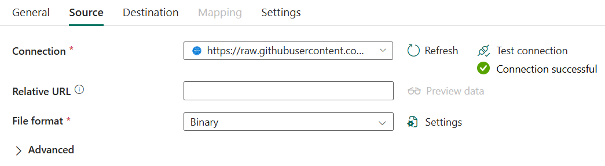
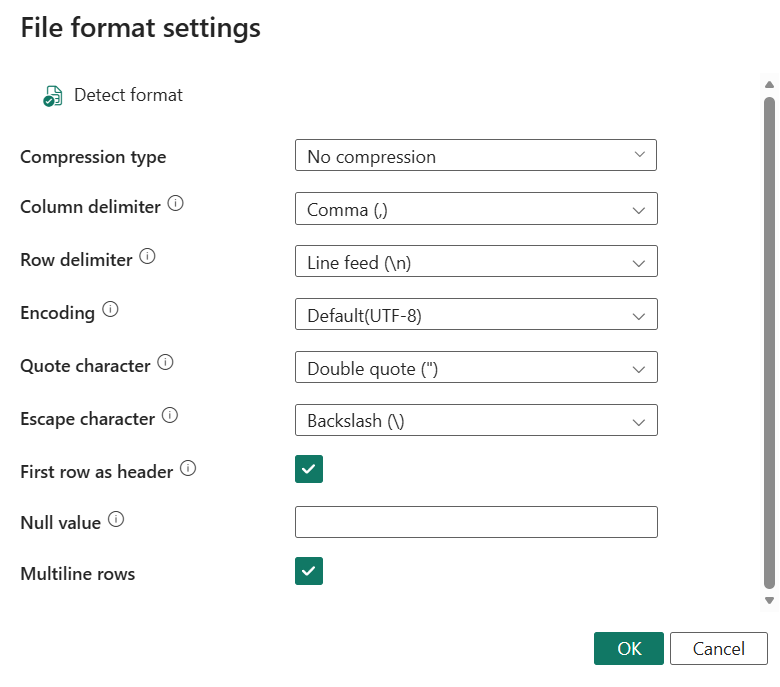
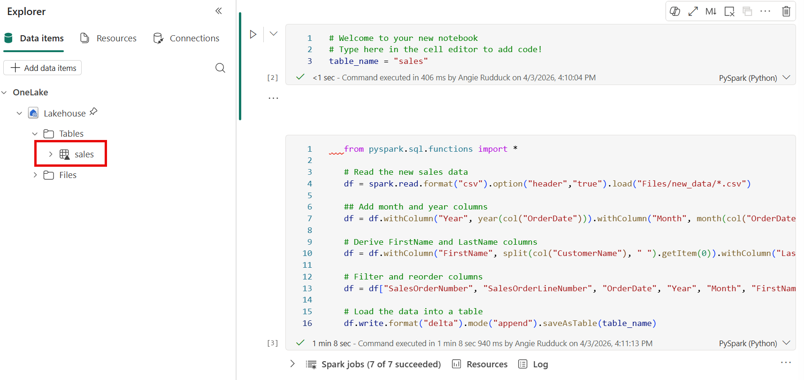
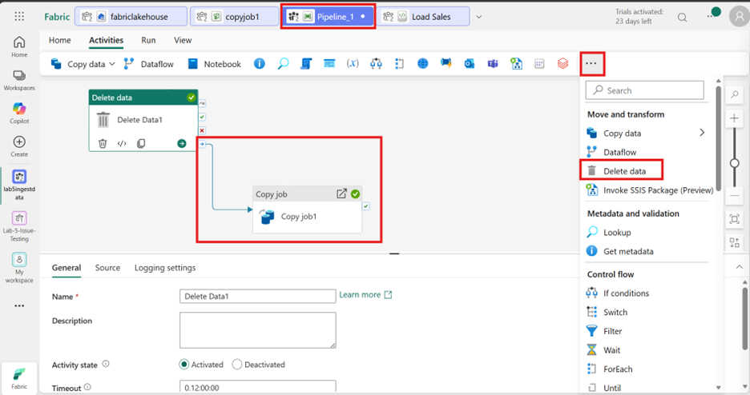
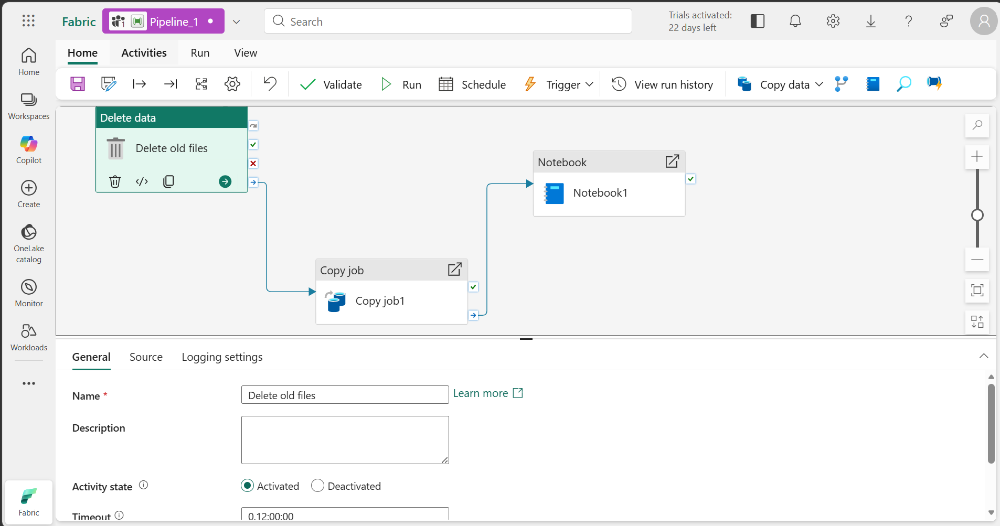

---
lab:
  title: Ingest data with a pipeline in Microsoft Fabric
  module: Use Data Factory pipelines in Microsoft Fabric
  description: In this lab, you'll create data pipelines to ingest data from external sources into a lakehouse, and integrate Spark notebooks to transform and load the data into tables. You'll learn how to combine Copy Data activities with custom Spark transformations to build reusable ETL processes in Microsoft Fabric.
  duration: 45 minutes
  level: 300
  islab: true
  primarytopics:
    - Microsoft Fabric
---

# Ingest data with a pipeline in Microsoft Fabric

A data lakehouse is a common analytical data store for cloud-scale analytics solutions. One of the core tasks of a data engineer is to implement and manage the ingestion of data from multiple operational data sources into the lakehouse. In Microsoft Fabric, you can implement *extract, transform, and load* (ETL) or *extract, load, and transform* (ELT) solutions for data ingestion through the creation of *pipelines*.

Fabric also supports Apache Spark, enabling you to write and run code to process data at scale. By combining the pipeline and Spark capabilities in Fabric, you can implement complex data ingestion logic that copies data from external sources into the OneLake storage on which the lakehouse is based, and then uses Spark code to perform custom data transformations before loading it into tables for analysis.

This lab will take approximately **45** minutes to complete.

> [!Note]
> You need access to a [Microsoft Fabric tenant](https://learn.microsoft.com/fabric/get-started/fabric-trial) to complete this exercise.

## Create a workspace

Before working with data in Fabric, create a workspace with the Fabric trial enabled.

1. Navigate to the [Microsoft Fabric home page](https://app.fabric.microsoft.com/home?experience=fabric-developer) at `https://app.fabric.microsoft.com/home?experience=fabric-developer` in a browser and sign in with your Fabric credentials.
1. In the navigation pane on the left, select **Workspaces** (the icon looks similar to &#128455;).
1. Create a new workspace with a name of your choice, selecting a licensing mode in the **Advanced** section that includes Fabric capacity (*Trial*, *Premium*, or *Fabric*).
1. When your new workspace opens, it should be empty.

    

## Create a lakehouse

Now that you have a workspace, it's time to create a data lakehouse into which you will ingest data.

1. On the navigation pane on the left, select **Create**, and choose **Lakehouse**. Give it a unique name of your choice. Make sure the "Lakehouse schemas (Public Preview)" option is disabled.

    >**Note**: If the **Create** option is not pinned to the sidebar, you need to select the ellipsis (**...**) option first.

    After a minute or so, a new lakehouse with no **Tables** or **Files** will be created.

1. On the **Explorer** pane on the left, in the **...** menu for the **Files** node, select **New subfolder** and create a subfolder named **new_data**.

## Create a pipeline

A simple way to ingest data is to use a **Copy Data** activity in a pipeline to extract the data from a source and copy it to a file in the lakehouse.

> **Note**: A *Copy Job* and a *Copy Data* activity are different methods for moving data in Fabric. A Copy Job is a standalone, simplified data movement tool and doesn't require a pipeline. A Copy Data activity is configured within a pipeline and supports orchestration with other activities. In this exercise, you use a **Copy Data** activity in a pipeline.

1. In the navigation pane on the left, select the name of your workspace.
1. In the workspace, select **New item**, search for **Pipeline**, and create a new pipeline named `Ingest Sales Data`.
1. In the pipeline editor canvas, select **Add pipeline activity** and then select **Copy activity**. A **Copy Data** activity is added to the pipeline canvas.

    

### Configure the Source

1. Select the **Copy Data** activity on the canvas, and then in the pane below the canvas select the **Source** tab.
1. In the **Connection** drop-down, select **Browse all**.
1. In the **New connection** dialog, search for **HTTP** and select it, then select **Continue**.
1. Configure the following settings and then select **Connect**:
    - **URL**: `https://raw.githubusercontent.com/MicrosoftLearning/dp-data/main/sales.csv`
    - **Connection name**: *Specify a unique name*
    - **Data gateway**: (none)
    - **Authentication kind**: Anonymous
1. Back on the **Source tab**, configure the following source settings:
    - **Relative URL**: *Leave blank*
    - **File format**: Select **DelimitedText** from the drop-down

    

1. Select the **Settings** button next to the **File format** drop-down. In the **File format settings** dialog, ensure the following settings are configured and then select **OK**:
    - **Compression type**: No compression
    - **Column delimiter**: Comma (,)
    - **Row delimiter**: Line feed (\n)
    - **First row as header**: *Selected*

    

1. Select **Test connection** to verify the connection works.
2. *Optional*: Select **Preview data** to confirm the data looks correct.

### Configure the Destination

1. Select the **Destination** tab. Then in the **Connection** drop-down, select **Browse all**.
1. In the **New connection** dialog box, find and select your lakehouse in the *OneLake Catalog* section.
1. After the connection is created, return to the **Destination** tab and configure the following settings:
    - **Connection**: *Your newly created lakehouse connection*
    - **Lakehouse**: *Select the lakehouse you created earlier*
    - **Root folder**: Files
    - **File path**: *Directory*: new_data / *File name*: sales.csv
1. No other changes are necessary.


### Run the pipeline

1. On the **Home** tab, use the **&#128427;** (*Save*) icon to save the pipeline. Then use the **&#9655; Run** button to run the pipeline.

1. When the pipeline starts to run, you can monitor its status in the **Output** pane under the pipeline designer. Use the **&#8635;** (*Refresh*) icon to refresh the status, and wait until it has succeeded.

1. In the navigation pane on the left, select your lakehouse.
1. On the **Home** page, in the **Explorer** pane, expand **Files** and select the **new_data** folder to verify that the **sales.csv** file has been copied.


## Create a notebook

1. On the **Home** page for your lakehouse, in the **Open notebook** menu, select **New notebook**.

    After a few seconds, a new notebook containing a single *cell* will open. Notebooks are made up of one or more cells that can contain *code* or *markdown* (formatted text).

1. Select the existing cell in the notebook, which contains some simple code, and then replace the default code with the following variable declaration.

    ```python
   table_name = "sales"
    ```

1. In the **...** menu for the cell (at its top-right) select **Toggle parameter cell**. This configures the cell so that the variables declared in it are treated as parameters when running the notebook from a pipeline.

1. Under the parameters cell, use the **+ Code** button to add a new code cell. Then add the following code to it:

    ```python
   from pyspark.sql.functions import *

   # Read the new sales data
   df = spark.read.format("csv").option("header","true").load("Files/new_data/*.csv")

   ## Add month and year columns
   df = df.withColumn("Year", year(col("OrderDate"))).withColumn("Month", month(col("OrderDate")))

   # Derive FirstName and LastName columns
   df = df.withColumn("FirstName", split(col("CustomerName"), " ").getItem(0)).withColumn("LastName", split(col("CustomerName"), " ").getItem(1))

   # Filter and reorder columns
   df = df["SalesOrderNumber", "SalesOrderLineNumber", "OrderDate", "Year", "Month", "FirstName", "LastName", "EmailAddress", "Item", "Quantity", "UnitPrice", "TaxAmount"]

   # Load the data into a table
   df.write.format("delta").mode("append").saveAsTable(table_name)
    ```

    This code loads the data from the sales.csv file that was ingested by the **Copy Data** activity, applies some transformation logic, and saves the transformed data as a table - appending the data if the table already exists.

1. Verify that your notebooks looks similar to this, and then use the **&#9655; Run all** button on the toolbar to run all of the cells it contains.

    > **Note**: Since this is the first time you've run any Spark code in this session, the Spark pool must be started. This means that the first cell can take a minute or so to complete.

1. When the notebook run has completed, in the **Explorer** pane on the left, in the **...** menu for **Tables** select **Refresh** and verify that a **sales** table has been created.
1. In the notebook menu bar, use the **Settings** icon to view the notebook settings. Then set the **Name** of the notebook to `Load Sales` and close the settings pane.
1. In the hub menu bar on the left, select your lakehouse.
1. In the **Explorer** pane, refresh the view. Then expand **Tables**, and select the **sales** table to see a preview of the data it contains.

    

## Modify the pipeline

Now that you've implemented a notebook to transform data and load it into a table, you can incorporate the notebook into a pipeline to create a reusable ETL process.

1. In the hub menu bar on the left select the **Ingest Sales Data** pipeline you created previously.
1. On the **Activities** tab, in the **All activities** list, select **Delete data**. Then position the new **Delete data**  activity to the left of the **Copy data** activity and connect its **On completion** output to the **Copy data** activity, as shown here:

    

1. Select the **Delete data** activity, and in the pane below the design canvas, set the following properties:
    - **General**:
        - **Name**: `Delete old files`
    - **Source**
        - **Connection**: Browse all, and select your lakehouse
        - **File path type**: Wildcard file path
        - **Folder path**: Files / **new_data**
        - **Wildcard file name**: `*.csv`
        - **Recursively**: *Selected*
    - **Logging settings**:
        - **Enable logging**: *<u>Un</u>selected*

    These settings will ensure that any existing .csv files are deleted before copying the **sales.csv** file.

1. In the pipeline designer, on the **Activities** tab, select **Notebook** to add a **Notebook** activity to the pipeline.
1. Select the **Copy data** activity and then connect its **On Completion** output to the **Notebook** activity as shown here:

    

1. Select the **Notebook** activity, and then in the pane below the design canvas, set the following properties:
    - **General**:
        - **Name**: `Load Sales notebook`
    - **Settings**:
        - **Notebook**: Select your *Load Sales* notebook
        - **Base parameters**: *Add a new parameter with the following properties:*

            | Name | Type | Value |
            | -- | -- | -- |
            | table_name | String | new_sales |

    The **table_name** parameter will be passed to the notebook and override the default value assigned to the **table_name** variable in the parameters cell.

1. On the **Home** tab, use the **&#128427;** (*Save*) icon to save the pipeline. Then use the **&#9655; Run** button to run the pipeline, and wait for all of the activities to complete.

    

> Note: In case you receive the error message *Spark SQL queries are only possible in the context of a lakehouse. Please attach a lakehouse to proceed*: Open your notebook, select the lakehouse you created on the left pane, select **Remove all Lakehouses** and then add it again. Go back to the pipeline designer and select **&#9655; Run**.

1. In the hub menu bar on the left edge of the portal, select your lakehouse.
1. In the **Explorer** pane, expand **Tables** and select the **new_sales** table to see a preview of the data it contains. This table was created by the notebook when it was run by the pipeline.

In this exercise, you implemented a data ingestion solution that uses a pipeline to copy data to your lakehouse from an external source, and then uses a Spark notebook to transform the data and load it into a table.

## Clean up resources

In this exercise, you've learned how to implement a pipeline in Microsoft Fabric.

If you've finished exploring your lakehouse, you can delete the workspace you created for this exercise.

1. In the bar on the left, select the icon for your workspace to view all of the items it contains.
1. Select **Workspace settings** and in the **General** section, scroll down and select **Remove this workspace**.
1. Select **Delete** to delete the workspace.
