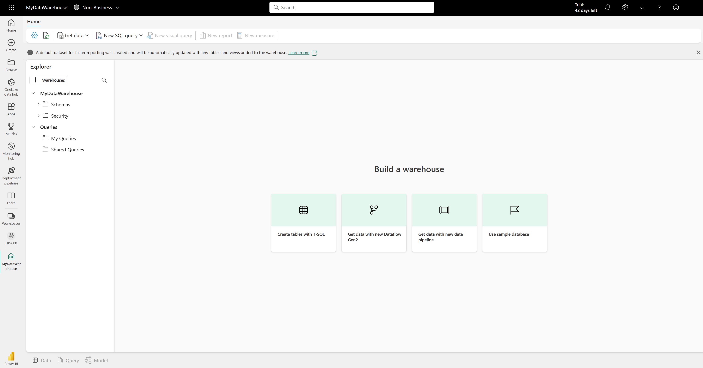

---
lab:
    title: 'Load data into a warehouse using T-SQL'
    module: 'Load data into a warehouse in Microsoft Fabric'
---

# Load data into a warehouse

In Microsoft Fabric, a data warehouse provides a relational database for large-scale analytics. Unlike the default read-only SQL endpoint for tables defined in a lakehouse, a data warehouse provides full SQL semantics; including the ability to insert, update, and delete data in the tables.

This lab will take approximately **30** minutes to complete.

> **Note**: You need a [Microsoft Fabric trial](https://learn.microsoft.com/fabric/get-started/fabric-trial) to complete this exercise.

## Create a workspace

Before working with data in Fabric, create a workspace with the Fabric trial enabled.

1. On the [Microsoft Fabric home page](https://app.fabric.microsoft.com), select **Synapse Data Warehouse**.
1. In the menu bar on the left, select **Workspaces** (the icon looks similar to &#128455;).
1. Create a new workspace with a name of your choice, selecting a licensing mode that includes Fabric capacity (*Trial*, *Premium*, or *Fabric*).
1. When your new workspace opens, it should be empty.

    

## Create a lakehouse and upload files

In our scenario, since we don't have any available data, we must ingest data to be used for loading the warehouse. You'll create a data lakehouse for the data files you're going to use to load the warehouse.

1. In the **Synapse Data Engineering** home page, create a new **Lakehouse** with a name of your choice.

    After a minute or so, a new empty lakehouse will be created. You need to ingest some data into the data lakehouse for analysis. There are multiple ways to do this, but in this exercise you'll download a CVS file to your local computer (or lab VM if applicable) and then upload it to your lakehouse.

1. Download the file for this exercise from `https://github.com/MicrosoftLearning/dp-data/raw/main/sales.csv`.

1. Return to the web browser tab containing your lakehouse, and in the **...** menu for the **Files** folder in the **Explorer** pane, select **Upload** and **Upload files**, and then upload the **sales.csv** file from your local computer (or lab VM if applicable) to the lakehouse.

1. After the files have been uploaded, select **Files**. Verify that the CSV file has been uploaded, as shown here:

    

## Create a table in the lakehouse

1. In the **...** menu for the **sales.csv** file in the **Explorer** pane, select **Load to tables**, and then **New table**.

1. Provide the following information in the **Load file to new table** dialog.
    - **New table name:** staging_sales
    - **Use header for columns names:** Selected
    - **Separator:** ,

1. Select **Load**.

## Create a warehouse

Now that you have a workspace, a lakehouse, and the sales table with the data you need, it's time to create a data warehouse. The Synapse Data Warehouse home page includes a shortcut to create a new warehouse:

1. In the **Synapse Data Warehouse** home page, create a new **Warehouse** with a name of your choice.

    After a minute or so, a new warehouse will be created:

    

## Create fact table, dimensions and view

Let's create the fact tables and dimensions for the Sales data. You'll also create a view pointing to a lakehouse, this simplifies the code in the stored procedure we'll use to load.

1. From your workspace, select the warehouse you created.

1. In the warehouse **Explorer**, select **New SQL query**, then copy and run the following query.

    ```sql
    CREATE SCHEMA [Sales]
    GO
        
    IF NOT EXISTS (SELECT * FROM sys.tables WHERE name='Fact_Sales' AND SCHEMA_NAME(schema_id)='Sales')
    	CREATE TABLE Sales.Fact_Sales (
    		CustomerID VARCHAR(255) NOT NULL,
    		ItemID VARCHAR(255) NOT NULL,
    		SalesOrderNumber VARCHAR(30),
    		SalesOrderLineNumber INT,
    		OrderDate DATE,
    		Quantity INT,
    		TaxAmount FLOAT,
    		UnitPrice FLOAT
    	);
    
    IF NOT EXISTS (SELECT * FROM sys.tables WHERE name='Dim_Customer' AND SCHEMA_NAME(schema_id)='Sales')
        CREATE TABLE Sales.Dim_Customer (
            CustomerID VARCHAR(255) NOT NULL,
            CustomerName VARCHAR(255) NOT NULL,
            EmailAddress VARCHAR(255) NOT NULL
        );
        
    ALTER TABLE Sales.Dim_Customer add CONSTRAINT PK_Dim_Customer PRIMARY KEY NONCLUSTERED (CustomerID) NOT ENFORCED
    GO
    
    IF NOT EXISTS (SELECT * FROM sys.tables WHERE name='Dim_Item' AND SCHEMA_NAME(schema_id)='Sales')
        CREATE TABLE Sales.Dim_Item (
            ItemID VARCHAR(255) NOT NULL,
            ItemName VARCHAR(255) NOT NULL
        );
        
    ALTER TABLE Sales.Dim_Item add CONSTRAINT PK_Dim_Item PRIMARY KEY NONCLUSTERED (ItemID) NOT ENFORCED
    GO
    ```

    > **Important:** In a data warehouse, foreign key constraints are not always necessary at the table level. While foreign key constraints can help ensure data integrity, they can also add overhead to the ETL (Extract, Transform, Load) process and slow down data loading. The decision to use foreign key constraints in a data warehouse should be based on a careful consideration of the trade-offs between data integrity and performance.

1. In the **Explorer**, navigate to **Schemas >> Sales >> Tables**. Note the *Fact_Sales*, *Dim_Customer*, and *Dim_Item* tables you just created.

1. Open a new **New SQL query** editor, then copy and run the following query. Update *<your lakehouse name>* with the lakehouse you created.

    ```sql
    CREATE VIEW Sales.Staging_Sales
    AS
	SELECT * FROM [<your lakehouse name>].[dbo].[staging_sales];
    ```

1. In the **Explorer**, navigate to **Schemas >> Sales >> Views**. Note the *Staging_Sales* view you created.

## Load data to the warehouse

Now that the fact and dimensions tables are created, let's create a stored procedure to load the data from our lakehouse into the warehouse. Because of the automatic SQL endpoint created when we create the lakehouse, you can directly access the data in your lakehouse from the warehouse using T-SQL and cross-database queries.

For the sake of simplicity in this case study, you'll use the customer name and item name as the primary keys.

1. Create a new **New SQL query** editor, then copy and run the following query.

    ```sql
    CREATE OR ALTER PROCEDURE Sales.LoadDataFromStaging (@OrderYear INT)
    AS
    BEGIN
    	-- Load data into the Customer dimension table
        INSERT INTO Sales.Dim_Customer (CustomerID, CustomerName, EmailAddress)
        SELECT DISTINCT CustomerName, CustomerName, EmailAddress
        FROM [Sales].[Staging_Sales]
        WHERE YEAR(OrderDate) = @OrderYear
        AND NOT EXISTS (
            SELECT 1
            FROM Sales.Dim_Customer
            WHERE Sales.Dim_Customer.CustomerName = Sales.Staging_Sales.CustomerName
            AND Sales.Dim_Customer.EmailAddress = Sales.Staging_Sales.EmailAddress
        );
        
        -- Load data into the Item dimension table
        INSERT INTO Sales.Dim_Item (ItemID, ItemName)
        SELECT DISTINCT Item, Item
        FROM [Sales].[Staging_Sales]
        WHERE YEAR(OrderDate) = @OrderYear
        AND NOT EXISTS (
            SELECT 1
            FROM Sales.Dim_Item
            WHERE Sales.Dim_Item.ItemName = Sales.Staging_Sales.Item
        );
        
        -- Load data into the Sales fact table
        INSERT INTO Sales.Fact_Sales (CustomerID, ItemID, SalesOrderNumber, SalesOrderLineNumber, OrderDate, Quantity, TaxAmount, UnitPrice)
        SELECT CustomerName, Item, SalesOrderNumber, CAST(SalesOrderLineNumber AS INT), CAST(OrderDate AS DATE), CAST(Quantity AS INT), CAST(TaxAmount AS FLOAT), CAST(UnitPrice AS FLOAT)
        FROM [Sales].[Staging_Sales]
        WHERE YEAR(OrderDate) = @OrderYear;
    END
    ```
1. Create a new **New SQL query** editor, then copy and run the following query.

    ```sql
    EXEC Sales.LoadDataFromStaging 2021
    ```

    > **Note:** In this case, we are only loading data from the year 2021. However, you have the option to modify it to load data from previous years.

## Run analytical queries

Let's run some analytical queries to validate the data in the warehouse.

1. On the top menu, select **New SQL query**, then copy and run the following query.

    ```sql
    SELECT c.CustomerName, SUM(s.UnitPrice * s.Quantity) AS TotalSales
    FROM Sales.Fact_Sales s
    JOIN Sales.Dim_Customer c
    ON s.CustomerID = c.CustomerID
    WHERE YEAR(s.OrderDate) = 2021
    GROUP BY c.CustomerName
    ORDER BY TotalSales DESC;
    ```

    > **Note:** This query shows the customers by total sales for the year of 2021. The customer with the highest total sales for the specified year is **Jordan Turner**, with total sales of **14686.69**. 

1. On the top menu, select **New SQL query** or reuse the same editor, then copy and run the following query.

    ```sql
    SELECT i.ItemName, SUM(s.UnitPrice * s.Quantity) AS TotalSales
    FROM Sales.Fact_Sales s
    JOIN Sales.Dim_Item i
    ON s.ItemID = i.ItemID
    WHERE YEAR(s.OrderDate) = 2021
    GROUP BY i.ItemName
    ORDER BY TotalSales DESC;

    ```

    > **Note:** This query shows the top-seliing items by total sales for the year of 2021. These results suggest that the *Mountain-200 bike* model, in both black and silver colors, was the most popular item among customers in 2021.

1. On the top menu, select **New SQL query** or reuse the same editor, then copy and run the following query.

    ```sql
    WITH CategorizedSales AS (
    SELECT
        CASE
            WHEN i.ItemName LIKE '%Helmet%' THEN 'Helmet'
            WHEN i.ItemName LIKE '%Bike%' THEN 'Bike'
            WHEN i.ItemName LIKE '%Gloves%' THEN 'Gloves'
            ELSE 'Other'
        END AS Category,
        c.CustomerName,
        s.UnitPrice * s.Quantity AS Sales
    FROM Sales.Fact_Sales s
    JOIN Sales.Dim_Customer c
    ON s.CustomerID = c.CustomerID
    JOIN Sales.Dim_Item i
    ON s.ItemID = i.ItemID
    WHERE YEAR(s.OrderDate) = 2021
    ),
    RankedSales AS (
        SELECT
            Category,
            CustomerName,
            SUM(Sales) AS TotalSales,
            ROW_NUMBER() OVER (PARTITION BY Category ORDER BY SUM(Sales) DESC) AS SalesRank
        FROM CategorizedSales
        WHERE Category IN ('Helmet', 'Bike', 'Gloves')
        GROUP BY Category, CustomerName
    )
    SELECT Category, CustomerName, TotalSales
    FROM RankedSales
    WHERE SalesRank = 1
    ORDER BY TotalSales DESC;
    ```

    > **Note:** The results of this query show the top customer for each of the categories: Bike, Helmet, and Gloves, based on their total sales. For example, **Joan Coleman** is the top customer for the **Gloves** category.
    >
    > The category information was extracted from the `ItemName` column using string manipulation, as there is no separate category column in the dimension table. This approach assumes that the item names follow a consistent naming convention. If the item names do not follow a consistent naming convention, the results may not accurately reflect the true category of each item.

In this exercise, you have created a lakehouse and a data warehouse with multiple tables. You have ingested data and used cross-database queries to load data from the lakehouse to the warehouse. Additionally, you have used the query tool to perform analytical queries.

## Clean up resources

If you've finished exploring your data warehouse, you can delete the workspace you created for this exercise.

1. In the bar on the left, select the icon for your workspace to view all of the items it contains.
2. In the **...** menu on the toolbar, select **Workspace settings**.
3. In the **Other** section, select **Remove this workspace**.
