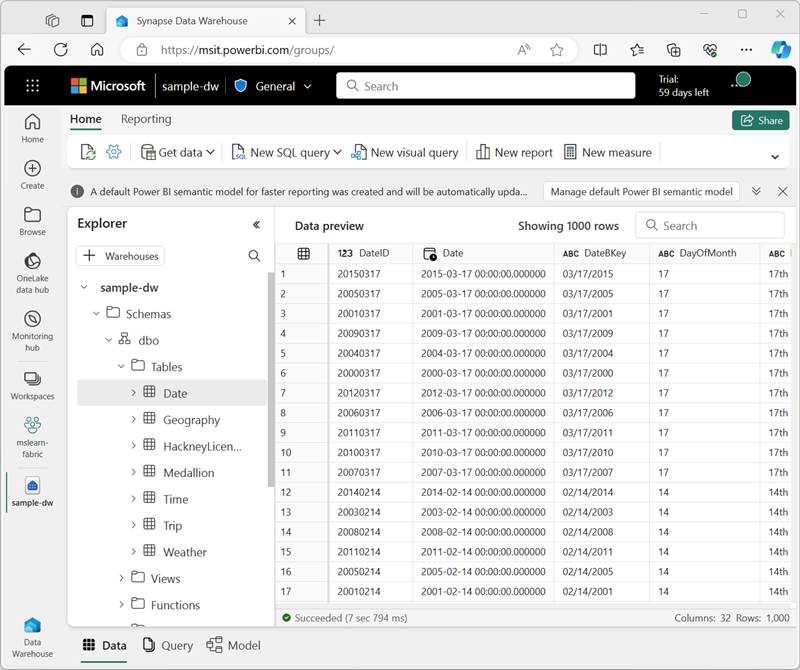

---
lab:
    title: 'Query a data warehouse in Microsoft Fabric'
    module: 'Query a data warehouse in Microsoft Fabric'
---

# Query a data warehouse in Microsoft Fabric

In Microsoft Fabric, a data warehouse provides a relational database for large-scale analytics. The rich set of experiences built into Microsoft Fabric workspace enables customers to reduce their time to insights by having an easily consumable, always connected semantic model that is integrated with Power BI in DirectLake mode. 

This lab will take approximately **30** minutes to complete.

> **Note**: You need a Microsoft *school* or *work* account to complete this exercise. If you don't have one, you can [sign up for a trial of Microsoft Office 365 E3 or higher](https://www.microsoft.com/microsoft-365/business/compare-more-office-365-for-business-plans).

## Activate a Microsoft Fabric trial

1. After signing up for a Microsoft Fabric account, navigate to the Microsoft Fabric portal at [https://app.fabric.microsoft.com](https://app.fabric.microsoft.com).
1. Select the **Account Manager** icon (the *user* image at the top right)
1. In the account manager menu, select **Start trial** to start a Microsoft Fabric trial.
1. After successfully upgrading to Microsoft Fabric, navigate to the home page by selecting **Fabric Home Page**.

## Create a workspace

Before working with data in Fabric, create a workspace with the Fabric trial enabled.

1. On the [Microsoft Fabric home page](https://app.fabric.microsoft.com), select **Synapse Data Warehouse**.
1. In the menu bar on the left, select **Workspaces** (the icon looks similar to &#128455;).
1. Create a new workspace with a name of your choice, selecting a licensing mode that includes Fabric capacity (*Trial*, *Premium*, or *Fabric*).
1. When your new workspace opens, it should be empty.

    

## Create a sample data warehouse

Now that you have a workspace, it's time to create a data warehouse.

1. At the bottom left, ensure that the **Data Warehouse** experience is selected.
1. On the **Home** page, select **Sample warehouse** and create a new data warehouse named **sample-dw**.

    After a minute or so, a new warehouse will be created and populated with sample data for a taxi ride analysis scenario.

    

## Query the data warehouse

The SQL query editor provides support for IntelliSense, code completion, syntax highlighting, client-side parsing, and validation. You can run Data Definition Language (DDL), Data Manipulation Language (DML) and Data Control Language (DCL) statements.

1. In the **sample-dw** data warehouse page, in the **New SQL query** drop-down list, select **New SQL query**.

1. In the new blank query pane, enter the following Transact-SQL code:

    ```sql
    SELECT 
    D.MonthName, 
    COUNT(*) AS TotalTrips, 
    SUM(T.TotalAmount) AS TotalRevenue 
    FROM dbo.Trip AS T
    JOIN dbo.[Date] AS D
        ON T.[DateID]=D.[DateID]
    GROUP BY D.MonthName;
    ```

1. Use the **&#9655; Run** button to run the SQL script and view the results, which show the total number of trips and total revenue by month.

1. Enter the following Transact-SQL code:

    ```sql
   SELECT 
    D.DayName, 
    AVG(T.TripDurationSeconds) AS AvgDuration, 
    AVG(T.TripDistanceMiles) AS AvgDistance 
    FROM dbo.Trip AS T
    JOIN dbo.[Date] AS D
        ON T.[DateID]=D.[DateID]
    GROUP BY D.DayName;
    ```

1. Run the modified query and view the results, which show the average trip duration and distance by day of the week.

1. Enter the following Transact-SQL code:

    ```sql
    SELECT TOP 10 
    G.City, 
    COUNT(*) AS TotalTrips 
    FROM dbo.Trip AS T
    JOIN dbo.Geography AS G
        ON T.PickupGeographyID=G.GeographyID
    GROUP BY G.City
    ORDER BY TotalTrips DESC;
    
    SELECT TOP 10 
        G.City, 
        COUNT(*) AS TotalTrips 
    FROM dbo.Trip AS T
    JOIN dbo.Geography AS G
        ON T.DropoffGeographyID=G.GeographyID
    GROUP BY G.City
    ORDER BY TotalTrips DESC;
    ```

1. Run the modified query and view the results, which show  the top 10 most popular pickup and dropoff locations.

1. Close all query tabs.

## Verify data consistency

Verifying data consistency is important to ensure that the data is accurate and reliable for analysis and decision-making. Inconsistent data can lead to incorrect analysis and misleading results. 

Let's query your data warehouse to check for consistency.

1. In the **New SQL query** drop-down list, select **New SQL query**.

1. In the new blank query pane, enter the following Transact-SQL code:

    ```sql
    -- Check for trips with unusually long duration
    SELECT COUNT(*) FROM dbo.Trip WHERE TripDurationSeconds > 86400; -- 24 hours
    ```

1. Run the modified query and view the results, which show details of all trips with unusually long duration.

1. In the **New SQL query** drop-down list, select **New SQL query** to add a second query tab. Then in the new empty query tab, run the following code:

    ```sql
    -- Check for trips with negative trip duration
    SELECT COUNT(*) FROM dbo.Trip WHERE TripDurationSeconds < 0;
    ```

1. In the new blank query pane, enter and run the following Transact-SQL code:

    ```sql
    -- Remove trips with negative trip duration
    DELETE FROM dbo.Trip WHERE TripDurationSeconds < 0;
    ```

    > **Note:** There are several ways to handle inconsistent data. Rather than removing it, one alternative is to replace it with a different value such as the mean or median.

1. Close all query tabs.

## Save as view

Suppose that you need to filter certain trips for a group of users who will use the data to generate reports.

Let's create a view based on the query we used earlier, and add a filter to it.

1. In the **New SQL query** drop-down list, select **New SQL query**.

1. In the new blank query pane, re-enter and run the following Transact-SQL code:

    ```sql
    SELECT 
        D.DayName, 
        AVG(T.TripDurationSeconds) AS AvgDuration, 
        AVG(T.TripDistanceMiles) AS AvgDistance 
    FROM dbo.Trip AS T
    JOIN dbo.[Date] AS D
        ON T.[DateID]=D.[DateID]
    GROUP BY D.DayName;
    ```

1. Modify the query to add `WHERE D.Month = 1`. This will filter the data to include only records from the month of January. The final query should look like this:

    ```sql
    SELECT 
        D.DayName, 
        AVG(T.TripDurationSeconds) AS AvgDuration, 
        AVG(T.TripDistanceMiles) AS AvgDistance 
    FROM dbo.Trip AS T
    JOIN dbo.[Date] AS D
        ON T.[DateID]=D.[DateID]
    WHERE D.Month = 1
    GROUP BY D.DayName
    ```

1. Select the text of the SELECT statement in your query. Then next to the **&#9655; Run** button, select **Save as view**.

1. Create a new view named **vw_JanTrip**.

1. In the **Explorer**, navigate to **Schemas >> dbo >> Views**. Note the *vw_JanTrip* view you just created.

1. Close all query tabs.

> **Further Information**: See [Query using the SQL query editor](https://learn.microsoft.com/fabric/data-warehouse/sql-query-editor) in the Microsoft Fabric documentation for more information about querying a data warehouse.

## Clean up resources

In this exercise, you have used queries to get insights of the data in a Microsoft Fabric data warehouse.

If you've finished exploring your data warehouse, you can delete the workspace you created for this exercise.

1. In the bar on the left, select the icon for your workspace to view all of the items it contains.
2. In the **...** menu on the toolbar, select **Workspace settings**.
3. In the **Other** section, select **Remove this workspace**.
