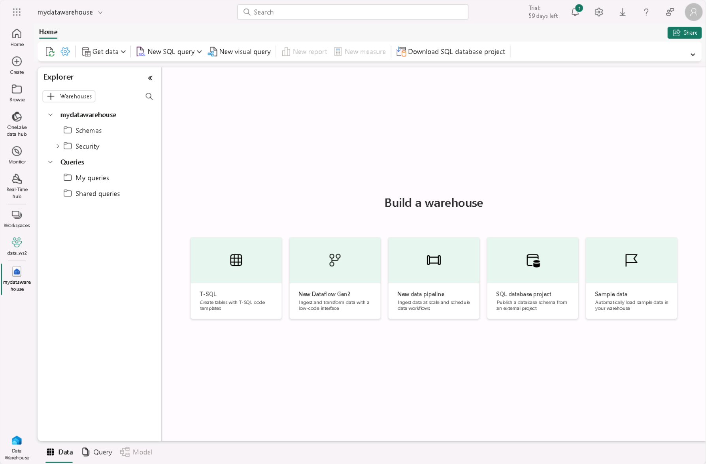

---
lab:
    title: 'Secure a Microsoft Fabric data warehouse'
    module: 'Secure a Microsoft Fabric data warehouse'
---

# Secure data in a data warehouse

Microsoft Fabric permissions and granular SQL permissions work together to govern Warehouse access and user permissions. In this exercise, you'll secure data using granular permissions, column-level security, row-level security, and dynamic data masking.

> **Note**: To complete the exercises in this lab, you'll need two users: one user should be assigned the Workspace Admin role, and the other should have the Workspace Viewer role. To assign roles to workspaces see [
Give access to your workspace
](
https://learn.microsoft.com/fabric/get-started/give-access-workspaces
).

This lab takes approximately **45** minutes to complete.

## Create a workspace

Before working with data in Fabric, create a workspace with the Fabric trial enabled.

1. On the [Microsoft Fabric home page](https://app.fabric.microsoft.com), select **Synapse Data Warehouse**.
1. In the menu bar on the left, select **Workspaces** (the icon looks similar to &#128455;).
1. Create a new workspace with a name of your choice, selecting a licensing mode that includes Fabric capacity (*Trial*, *Premium*, or *Fabric*).
1. When your new workspace opens, it should be empty.

    

> **Note**: When you create a workspace, you automatically become a member of the Workspace Admin role. You can add a second user from your environment to the Workspace Viewer role to test functionality configured in these exercises. This can be done by selecting **Manage Access** within the workspace, then **Add people or groups**. This will allow the second user to view the workspace content.

## Create a data warehouse

Next, create a data warehouse in the workspace you created. The Synapse Data Warehouse home page includes a shortcut to create a new warehouse:

1. On the **Synapse Data Warehouse** home page, create a new **Warehouse** with a name of your choice.

    After a minute or so, a new warehouse will be created:

    

## Apply dynamic data masking rules to columns in a table

Dynamic data masking rules are applied on individual columns at the table level so all queries are affected by the masking. Users who do not have explicit permissions to view confidential data see masked values in query results while users with explicit permission to view the data see it unobscured. There are four types of masks: default, email, random and custom string. In this exercise, you will apply a default mask, an email mask, and a custom string mask.

1. In your warehouse, select the **T-SQL** tile, and replace the default SQL code with the following T-SQL statements to create a table and to insert and view data.  

    ```tsql
    CREATE TABLE dbo.Customers
    (   
        CustomerID INT NOT NULL,   
        FirstName varchar(50) MASKED WITH (FUNCTION = 'partial(1,"XXXXXXX",0)') NULL,     
        LastName varchar(50) NOT NULL,     
        Phone varchar(20) MASKED WITH (FUNCTION = 'default()') NULL,     
        Email varchar(50) MASKED WITH (FUNCTION = 'email()') NULL   
    );
    
    INSERT dbo.Customers (CustomerID, FirstName, LastName, Phone, Email) VALUES
    (29485,'Catherine','Abel','555-555-5555','catherine0@adventure-works.com'),
    (29486,'Kim','Abercrombie','444-444-4444','kim2@adventure-works.com'),
    (29489,'Frances','Adams','333-333-3333','frances0@adventure-works.com');
    
    SELECT * FROM dbo.Customers;
    
    ```
    When users who are restricted from seeing unmasked data query the table, the **FirstName** column will show the first letter of the string with XXXXXXX and none of the last characters. The **Phone** column will show xxxx. The **Email** column will show the first letter of the email address followed by `XXX@XXX.com`. This approach ensures that sensitive data remains confidential, while still allowing restricted users to query the table.

2. Use the **&#9655; Run** button to run the SQL script, which creates a new table named **Customers** in the **dbo** schema of the data warehouse.

3. Then, in the **Explorer** pane, expand **Schemas** > **dbo** > **Tables** and verify that the **Customers** table has been created. The `SELECT` statement returns unmasked data for you because as the workspace creator, you're a member of the Workspace Admin role which can see unmasked data.

4. Connect as a test user that's a member of the **Viewer** workspace role and run the following T-SQL statement.

    ```tsql
    SELECT * FROM dbo.Customers;
    ```
    The test user hasn't been granted UNMASK permission so data returned for the FirstName, Phone, and Email columns is masked because those columns were defined with a mask in the `CREATE TABLE` statement.

5. Reconnect as yourself, the Workspace Admin, and run the following T-SQL to unmask data for the test user. Replace `<username1>@<your_domain>.com` with the name of the user you're testing with who is a member of the **Viewer** workspace role. 

    ```tsql
    GRANT UNMASK ON dbo.Customers TO [<username>@<your_domain>.com];
    ```

6. Connect as the test user again and run the following T-SQL statement.

    ```tsql
    SELECT * FROM dbo.Customers;
    ```

    The data is returned unmasked because the test user has been granted the `UNMASK` permission.

## Apply row-level security

Row-level security (RLS) can be used to limit access to rows based on the identity, or role of the user executing a query. In this exercise, you restrict access to rows by creating a security policy and a security predicate defined as an inline table-valued function.

1. In the warehouse you created in the last exercise, select the **New SQL Query** dropdown.  Under the header **Blank**, select **New SQL Query**.

2. Create a table and insert data into it. So that you can test row-level security in a later step, replace `<username1>@<your_domain>.com` with a user name from your environment and replace `<username2>@<your_domain>.com` with your user name.

```tsql
    CREATE TABLE dbo.Sales  
    (  
        OrderID INT,  
        SalesRep VARCHAR(60),  
        Product VARCHAR(10),  
        Quantity INT  
    );
     
    --Populate the table with 6 rows of data, showing 3 orders for each test user. 
    INSERT dbo.Sales (OrderID, SalesRep, Product, Quantity) VALUES
    (1, '<username1>@<your_domain>.com', 'Valve', 5),   
    (2, '<username1>@<your_domain>.com', 'Wheel', 2),   
    (3, '<username1>@<your_domain>.com', 'Valve', 4),  
    (4, '<username2>@<your_domain>.com', 'Bracket', 2),   
    (5, '<username2>@<your_domain>.com', 'Wheel', 5),   
    (6, '<username2>@<your_domain>.com', 'Seat', 5);  
     
    SELECT * FROM dbo.Sales;  
    ```

3. Use the **&#9655; Run** button to run the SQL script, which creates a new table named **Sales** in the **dbo** schema of the data warehouse.

4. Then, in the **Explorer** pane, expand **Schemas** > **dbo** > **Tables** and verify that the **Sales** table has been created.
5. Create a new schema, a security predicate defined as a function, and a security policy.  

    ```tsql
    --Create a separate schema to hold the row-level security objects (the predicate function and the security policy)
    CREATE SCHEMA rls;
    GO
    
    /*Create the security predicate defined as an inline table-valued function.
    A predicate evalutes to true (1) or false (0). This security predicate returns 1,
    meaning a row is accessible, when a row in the SalesRep column is the same as the user
    executing the query.*/

    --Create a function to evaluate who is querying the table
    CREATE FUNCTION rls.fn_securitypredicate(@SalesRep AS VARCHAR(60)) 
        RETURNS TABLE  
    WITH SCHEMABINDING  
    AS  
        RETURN SELECT 1 AS fn_securitypredicate_result   
    WHERE @SalesRep = USER_NAME();
    GO

    /*Create a security policy to invoke and enforce the function each time a query is run on the Sales table.
    The security policy has a filter predicate that silently filters the rows available to 
    read operations (SELECT, UPDATE, and DELETE). */
    CREATE SECURITY POLICY SalesFilter  
    ADD FILTER PREDICATE rls.fn_securitypredicate(SalesRep)   
    ON dbo.Sales  
    WITH (STATE = ON);
    GO
    ```

6. Use the **&#9655; Run** button to run the SQL script
7. Then, in the **Explorer** pane, expand **Schemas** > **rls** > **Functions**, and verify that the function has been created.
8. Log in to Fabric as the user you replaced `<username1>@<your_domain>.com` with, in the Sales table `INSERT`statement from step 9. Confirm that you're logged in as that user by running the following T-SQL.

    ```tsql
    SELECT USER_NAME();
    ```

9. Query the **Sales** table to confirm that row-level security works as expected. You should only see data that meets the conditions in the security predicate defined for the user you're logged in as.

    ```tsql
    SELECT * FROM dbo.Sales;
    ```
## Implement column-level security

Column-level security allows you to designate which users can access specific columns in a table. It's implemented by issuing a `GRANT` or `DENY` statement on a table specifying a list of columns and the user or role that can or cannot read them. To streamline access management, assign permissions to roles in lieu of individual users. In this exercise, you will create a table, grant access to a subset of columns on the table, and test that restricted columns aren't viewable by a user other than yourself.

1. In the warehouse you created in the earlier exercise, select the **New SQL Query** dropdown. Under the header **Blank**, select **New SQL Query**.  

2. Create a table and insert data into the table.

    ```tsql
    CREATE TABLE dbo.Orders
    (   
        OrderID INT,   
        CustomerID INT,  
        CreditCard VARCHAR(20)      
        );

    INSERT dbo.Orders (OrderID, CustomerID, CreditCard) VALUES
    (1234, 5678, '111111111111111'),
    (2341, 6785, '222222222222222'),
    (3412, 7856, '333333333333333');

    SELECT * FROM dbo.Orders;
     ```

3. Deny permission to view a column in the table. The T-SQL statement prevents `<username>@<your_domain>.com` from seeing the CreditCard column in the Orders table. In the `DENY` statement, replace `<username>@<your_domain>.com` with a user name in your system who has **Viewer** permissions on the workspace.

     ```tsql
    DENY SELECT ON dbo.Orders (CreditCard) TO [<username>@<your_domain>.com];
     ```

4. Test column-level security by logging in to Fabric as the user you denied select permissions to.

5. Query the Orders table to confirm that column-level security works as expected. The following query will return only the OrderID and CustomerID columns, not the CreditCard column.  

    ```tsql
    SELECT * FROM dbo.Orders;
    ```

    You'll receive an error because access to the CreditCard column has been restricted.  Try selecting only the OrderID and CustomerID fields and the query will succeed.

    ```tsql   
    SELECT OrderID, CustomerID from dbo.Orders
    ```

## Configure SQL granular permissions using T-SQL

Fabric has a permissions model that allows you to control access to data at the workspace level, and at the item level. When you need more granular control of what users can do with securables in a Fabric warehouse, you can use the standard SQL data control language (DCL) commands `GRANT`,`DENY` and, `REVOKE`. In this exercise, you will create objects, secure them using `GRANT`, and `DENY`, and then run queries to view the effect of applying granular permissions.

1. In the warehouse you created in the earlier exercise, select the **New SQL Query** dropdown. Under the header **Blank**, select **New SQL Query**.  

2. Create a stored procedure and a table. Then execute the procedure and query the table.

     ```tsql
    CREATE PROCEDURE dbo.sp_PrintMessage
    AS
    PRINT 'Hello World.';
  
    CREATE TABLE dbo.Parts
    (
        PartID INT,
        PartName VARCHAR(25)
    );
    
    INSERT dbo.Parts (PartID, PartName) VALUES
    (1234, 'Wheel'),
    (5678, 'Seat');
     GO
    
    --Execute the stored procedure and select from the table and note the results you get as a member of the Workspace Admin role. Look for output from the stored procedure on the 'Messages' tab.
    EXEC dbo.sp_PrintMessage;
    
    SELECT * FROM dbo.Parts
     ```

3. Next `DENY SELECT` permissions on the table to a user who is a member of the **Workspace Viewer** role and `GRANT EXECUTE` on the procedure to the same user. Replace `<username>@<your_domain>.com` with a user name from your environment that is a member of the **Workspace Viewer** role. 

     ```tsql
    DENY SELECT on dbo.Parts to [<username>@<your_domain>.com];

    GRANT EXECUTE on dbo.sp_PrintMessage to [<username>@<your_domain>.com];
     ```

4. Sign in to Fabric as the user you specified in the `DENY` and `GRANT` statements in place of `<username>@<your_domain>.com`. Then test the granular permissions you applied by executing the stored procedure and querying the table.  

     ```tsql
    EXEC dbo.sp_PrintMessage;
       
    SELECT * FROM dbo.Parts;
     ```

## Clean up resources

In this exercise, you applied dynamic data masking rules to columns in a table, applied row-level security, implemented column-level security and, configured SQL granular permissions using T-SQL.

1. In the left navigation bar, select the icon for your workspace to view all of the items it contains.
2. In the menu on the top toolbar, select **Workspace settings**.
3. In the **General** section, select **Remove this workspace**.
