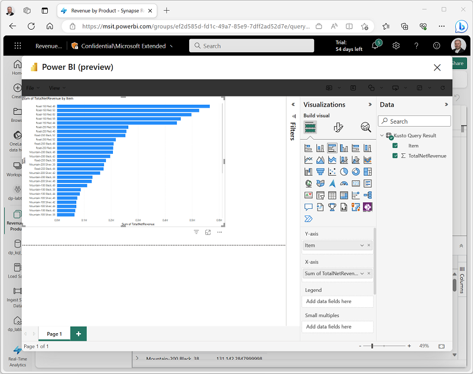

---
lab:
    title: 'Get started with Real-Time Analytics in Microsoft Fabric'
    module: 'Get started with real-time analytics in Microsoft Fabric'
---

# Get started with Real-Time Analytics in Microsoft Fabric

Microsoft Fabric provides a runtime that you can use to store and query data by using Kusto Query Language (KQL). Kusto is optimized for data that includes a time series component, such as real-time data from log files or IoT devices.

This lab will take approximately **30** minutes to complete.

## Before you start

You'll need a Microsoft Fabric trial license with the Fabric preview enabled in your tenant.

> **Note**: See [Getting started with Fabric](https://learn.microsoft.com/fabric/get-started/fabric-trial) to enable your Fabric trial license.

## Create a workspace

Before working with data in Fabric, create a workspace with the Fabric trial enabled.

1. Sign into your Power BI service at [https://app.powerbi.com](https://app.powerbi.com).
2. In the menu bar on the left, select **Workspaces** (the icon looks similar to &#128455;).
3. Create a new workspace with a name of your choice, selecting the **Trial** licensing mode.
4. When your new workspace opens, it should be empty, as shown here:

    

## Create a lakehouse and upload files

Now that you have a workspace, it's time to switch to the *Data engineering* experience in the portal and create a data lakehouse for the data files you're going to analyze.

1. At the bottom left of the Power BI portal, select the **Power BI** icon and switch to the **Data Engineering** experience.

2. In the **Data engineering** home page, create a new **Lakehouse** with a name of your choice.

    After a minute or so, a new lakehouse with no **Tables** or **Files** will be created. You need to ingest some data into the data lakehouse for analysis. There are multiple ways to do this, but in this exercise you'll simply download a text file to your local computer and then upload it to your lakehouse.

3. Download the data file for this exercise from [https://raw.githubusercontent.com/MicrosoftLearning/dp-data/main/sales.csv](https://raw.githubusercontent.com/MicrosoftLearning/dp-data/main/sales.csv), saving it as **sales.csv** on your local computer
4. Return to the web browser tab containing your lakehouse, and in the **...** menu for the **Files** node in the **Lake view** pane, select **Upload** and **Upload file**, and then upload the **sales.csv** file from your local computer to the lakehouse.
5. After the file has been uploaded, select **Files** verify that the **sales.csv** file has been uploaded, as shown here:

    

6. In the **...** menu for the **sales.csv** file, select **Properties**. Then copy the **ABFS path** for your file to the clipboard - you will use this later.

## Create a KQL database

Kusto query language (KQL) is used to query static or streaming data in a table that is defined in a KQL database. To analyze the sales data you uploaded to your lakehouse, you must create a table in a KQL database and ingest the data from the file.

1. At the bottom left of the Power BI portal, select the **Data Engineering** icon and switch to the **Real-Time Analytics** experience.
2. On the **Home** page for the Real-Time Analytics experience, select **KQL database** and create a new database with a name of your choice.
3. When the new database has been created, select the option to get data from **OneLake**. Then use the wizard to import the data into a new table by selecting the following options:
    - **Destination**:
        - **Database**: *The database you just created is already selected*
        - **Table**: *Create a new table named* **sales**.
    - **Source**:
        - **Source type**: OneLake
        - **Link to source**: *Paste the ABFS path to your sales.csv file, which you copied to the clipboard previously*
    - **Schema**:
        - **Compression type**: Uncompressed
        - **Data format**: CSV
        - **Ignore the first record**: *Selected*
        - **Mapping name**: sales_mapping
    - **Summary**:
        - *Review the preview of the table and close the wizard.*

> **Note**: In this example, you imported a very small amount of static data from a file, which is fine for the purposes of this exercise. In reality, you can use Kusto to analyze much larger volumes of data; including real-time data from a streaming source such as Azure Event Hubs.

## Use KQL to query the sales table

Now that you have a table of data in your database, you can use KQL code to query it.

1. Make sure you have the **sales** table highlighted. From the menu bar, select the **Query table** drop-down, and from there select **Show any 100 records** .

2. A new pane will open with the query and its result. 

3. Modify the query as follows:

    ```kusto
    sales
    | where Item == 'Road-250 Black, 48'
    ```

4. Run the query. Then review the results, which should contain only the rows for sales orders for the *Road-250 Black, 48* product.

5. Modify the query as follows:

    ```kusto
    sales
    | where Item == 'Road-250 Black, 48'
    | where datetime_part('year', OrderDate) > 2020
    ```

6. Run the query and review the results, which should contain only sales orders for *Road-250 Black, 48* made after 2020.

7. Modify the query as follows:

    ```kusto
    sales
    | where OrderDate between (datetime(2020-01-01 00:00:00) .. datetime(2020-12-31 23:59:59))
    | summarize TotalNetRevenue = sum(UnitPrice) by Item
    | sort by Item asc
    ```

8. Run the query and review the results, which should contain the total net revenue for each product between January 1st and December 31st 2020 in ascending order of product name.
9. Select **Save as KQL queryset** and save the query as **Revenue by Product**.

## Create a Power BI report from a KQL query set

You can use your KQL query set as the basis for a Power BI report.

1. In the query workbench editor for your query set, run the query and wait for the results.
2. Select **Build Power BI report** and wait for the report editor to open.
3. In the report editor, in the **Data** pane, expand **Kusto Query Result** and select the **Item** and **TotalRevenue** fields.
4. On the report design canvas, select the table visualization that has been added and then in the **Visualizations** pane, select **Clustered bar chart**.

    

5. In the **Power BI** window, in the **File** menu, select **Save**. Then save the report as **Revenue by Item.pbix** in the workspace where your lakehouse and KQL database are defined using a **Non-Business** sensitivity label.
6. Close the **Power BI** window, and in the bar on the left, select the icon for your workspace (*close the dialog box used to select a KQL database if it is open*).

    Refresh the Workspace page if necessary to view all of the items it contains.

7. In the list of items in your workspace, note that the **Revenue by Item** report is listed.

## Clean up resources

In this exercise, you have created a lakehouse, a KQL database to analyze the data uploaded into the lakehouse. You used KQL to query the data and create a query set, which was then used to create a PowerBI report.

If you've finished exploring your KQL database, you can delete the workspace you created for this exercise.

1. In the bar on the left, select the icon for your workspace.
2. In the **...** menu on the toolbar, select **Workspace settings**.
3. In the **Other** section, select **Remove this workspace**.
