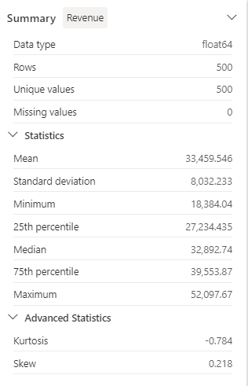
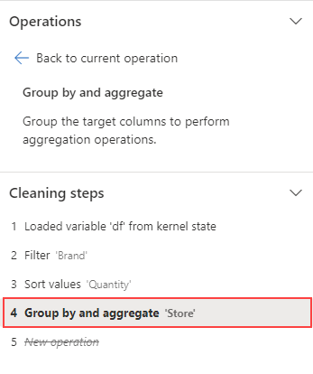

---
lab:
    title: 'Preprocess data with Data Wrangler in Microsoft Fabric'
    module: 'Preprocess data with Data Wrangler in Microsoft Fabric'
---

# Preprocess data with Data Wrangler in Microsoft Fabric

In this lab, you'll learn how to use Data Wrangler in Microsoft Fabric to preprocess data, and generate code using a library of common data science operations.

This lab will take approximately **30** minutes to complete.

> **Note**: You need a Microsoft *school* or *work* account to complete this exercise. If you don't have one, you can [sign up for a trial of Microsoft Office 365 E3 or higher](https://www.microsoft.com/microsoft-365/business/compare-more-office-365-for-business-plans).

## Create a workspace

Before working with data in Fabric, create a workspace with the Fabric trial enabled.

1. Navigate to the [Microsoft Fabric home page](https://app.fabric.microsoft.com) at `https://app.fabric.microsoft.com` in a browser.
1. Select **Synapse Data Science**.
1. In the menu bar on the left, select **Workspaces** (the icon looks similar to &#128455;).
1. Create a new workspace with a name of your choice, selecting a licensing mode that includes Fabric capacity (*Trial*, *Premium*, or *Fabric*).
1. When your new workspace opens, it should be empty.

    

## Create a notebook

To train a model, you can create a *notebook*. Notebooks provide an interactive environment in which you can write and run code (in multiple languages) as *experiments*.

1. In the **Synapse Data Science** home page, create a new **Notebook**.

    After a few seconds, a new notebook containing a single *cell* will open. Notebooks are made up of one or more cells that can contain *code* or *markdown* (formatted text).

1. Select the first cell (which is currently a *code* cell), and then in the dynamic tool bar at its top-right, use the **M&#8595;** button to convert the cell to a *markdown* cell.

    When the cell changes to a markdown cell, the text it contains is rendered.

1. Use the **&#128393;** (Edit) button to switch the cell to editing mode, then delete the content and enter the following text:

    ```text
   # Perform data exploration for data science

   Use the code in this notebook to perform data exploration for data science.
    ```

## Load data into a dataframe

Now you're ready to run code to get data. You'll work with the [**OJ Sales dataset**](https://learn.microsoft.com/en-us/azure/open-datasets/dataset-oj-sales-simulated?tabs=azureml-opendatasets?azure-portal=true) from the Azure Open Datasets. After loading the data, you'll convert the data to a Pandas dataframe, which is the structure supported by Data Wrangler.

1. In your notebook, use the **+ Code** icon below the latest cell to add a new code cell to the notebook. Enter the following code to load the dataset into a dataframe.

    ```python
    # Azure storage access info for open dataset diabetes
    blob_account_name = "azureopendatastorage"
    blob_container_name = "ojsales-simulatedcontainer"
    blob_relative_path = "oj_sales_data"
    blob_sas_token = r"" # Blank since container is Anonymous access
    
    # Set Spark config to access  blob storage
    wasbs_path = f"wasbs://%s@%s.blob.core.windows.net/%s" % (blob_container_name, blob_account_name, blob_relative_path)
    spark.conf.set("fs.azure.sas.%s.%s.blob.core.windows.net" % (blob_container_name, blob_account_name), blob_sas_token)
    print("Remote blob path: " + wasbs_path)
    
    # Spark reads csv
    df = spark.read.csv(wasbs_path, header=True)
    ```

1. Use the **&#9655; Run cell** button on the left of the cell to run it. Alternatively, you can press `SHIFT` + `ENTER` on your keyboard to run a cell.

    > **Note**: Since this is the first time you've run any Spark code in this session, the Spark pool must be started. This means that the first run in the session can take a minute or so to complete. Subsequent runs will be quicker.

1. Use the **+ Code** icon below the cell output to add a new code cell to the notebook, and enter the following code in it:

    ```python
    import pandas as pd

    df = df.toPandas()
    df = df.sample(n=500, random_state=1)
    
    df['WeekStarting'] = pd.to_datetime(df['WeekStarting'])
    df['Quantity'] = df['Quantity'].astype('int')
    df['Advert'] = df['Advert'].astype('int')
    df['Price'] = df['Price'].astype('float')
    df['Revenue'] = df['Revenue'].astype('float')
    
    df = df.reset_index(drop=True)
    df.head(4)
    ```

1. When the cell command has completed, review the output below the cell, which should look similar to this:

    |   |WeekStarting|Store|Brand|Quantity|Advert|Price|Revenue|
    |---|---|---|---|---|---|---|---|
    |0|1991-10-17|947|minute.maid|13306|1|2.42|32200.52|
    |1|1992-03-26|1293|dominicks|18596|1|1.94|36076.24|
    |2|1991-08-15|2278|dominicks|17457|1|2.14|37357.98|
    |3|1992-09-03|2175|tropicana|9652|1|2.07|19979.64|
    |...|...|...|...|...|...|...|...|

    The output shows the first four rows of the OJ Sales dataset.

## View summary statistics

Now that we have loaded the data, the next step is to preprocess it using Data Wrangler. Preprocessing is a crucial step in any machine learning workflow. It involves cleaning the data and transforming it into a format that can be fed into a machine learning model.

1. Select **Data** in the notebook ribbon, and then select **Launch Data Wrangler** dropdown.

1. Select the `df` dataset. When Data Wrangler launches, it generates a descriptive overview of the dataframe in the **Summary** panel.

1. Select the **Revenue** feature, and observe the data distribution of this feature.

1. Review the **Summary** side panel details, and observe the statistics values.

    

    What are some of the insights you can draw from it? The mean revenue is approximately **$33,459.54**, with a standard deviation of **$8,032.23**. This suggests that the revenue values are spread out over a range of about **$8,032.23** around the mean.

## Format text data

Now let's apply a few transformations to the **Brand** feature.

1. In the **Data Wrangler** dashboard, select the `Brand` feature on the grid.

1. Navigate to the **Operations** panel, expand **Find and replace**, and then select **Find and replace**.

1. In the **Find and replace** panel, change the following properties:

    - **Old value:** "`.`"
    - **New value:** "` `" (space character)

    You can see the results of the operation automatically previewed in the display grid.

1. Select **Apply**.

1. Back to the **Operations** panel, expand **Format**.

1. Select **Capitalize first character**. Switch the **Capitalize all words** toggle on, and then select **Apply**.

1. Select **Add code to notebook**. Additionally, you can also copy the code and save the transformed dataset as a CSV file.

    >**Note:** The code is automatically copied to the notebook cell, and is ready for use.

1. Replace the lines 10 and 11 with the code `df = clean_data(df)`, as the code generated in Data Wrangler doesn't overwrite the original dataframe. The final code block should look like this:

    ```python
    def clean_data(df):
        # Replace all instances of "." with " " in column: 'Brand'
        df['Brand'] = df['Brand'].str.replace(".", " ", case=False, regex=False)
        # Capitalize the first character in column: 'Brand'
        df['Brand'] = df['Brand'].str.title()
        return df
    
    df = clean_data(df)
    ```

1. Run the code cell, and check the `Brand` variable.

    ```python
    df['Brand'].unique()
    ```

    The result should show the values *Minute Maid*, *Dominicks*, and *Tropicana*.

You've learned how to graphically manipulate text data, and easily generate code using Data Wrangler.

## Apply one-hot encoding transformation

Now, let's generate the code to apply the one-hot encoding transformation to our data as part of our preprocessing steps. To make our scenario more practical, we begin by generating some sample data. This allows us to simulate a real-world situation and provides us with a workable feature.

1. Launch Data Wrangler at the top menu for the `df` dataframe.

1. Select the `Brand` feature on the grid.

1. In the **Operations** panel, expand **Formulas**, and then select **One-hot encode**.

1. In the **One-hot encode** panel, select **Apply**.

    Navigate to the end of the Data Wrangler display grid. Notice that it added three new features (`Brand_Dominicks`, `Brand_Minute Maid`, and `Brand_Tropicana`), and removed the `Brand` feature.

1. Exit the Data Wrangler without generating the code.

## Sort and filter operations

Imagine we need to review the revenue data for a specific store, and then sort the product prices. In the following steps, we use Data Wrangler to filter and analyze the `df` dataframe.

1. Launch Data Wrangler for the `df` dataframe.

1. In the **Operations** panel, expand **Sort and filter**.

1. Select **Filter**.

1. In the **Filter** panel, add the following condition:

    - **Target colunm**: `Store`
    - **Operation**: `Equal to`
    - **Value**: `1227`
    - **Action**: `Keep matching rows`

1. Select **Apply**, and notice the changes in the Data Wrangler display grid.

1. Select the **Revenue** feature, and then review the **Summary** side panel details.

    What are some of the insights you can draw from it? The skewness is **-0.751**, indicating a slight left skew (negative skew). This means that the left tail of the distribution is slightly longer than the right tail. In other words, there are a number of periods with revenues significantly below the mean.

1. Back to the **Operations** panel, expand **Sort and filter**.

1. Select **Sort values**.

1. In the **Sort values** panel, select the following properties:

    - **Column name**: `Price`
    - **Sort order**: `Descending`

1. Select **Apply**.

    The highest product price for store **1227** is **$2.68**. With only a few records it's easier to identify the highest product price, but consider the complexity when dealing with thousands of results.

## Browse and remove steps

Suppose you made a mistake and need to remove the sort you created in the previous step. Follow these steps to remove it:

1. Navigate to the **Cleaning steps** panel.

1. Select the **Sort values** step.

1. Select the delete icon to have it removed.

    

    > **Important:** the grid view and summary are limited to the current step.

    Notice that the changes are reverted to the previous step, which is the **Filter** step.

1. Exit the Data Wrangler without generating the code.

## Aggregate data

Suppose we need to understand the average revenue generated by each brand. In the following steps, we use Data Wrangler to perform a group by operation on the `df` dataframe.

1. Launch Data Wrangler for the `df` dataframe.

1. Back to the **Operations** panel, select **Group by and aggregate**.

1. In the **Columns to group by** panel, select the `Brand` feature.

1. Select **Add aggregation**.

1. On the **Column to aggregate** property, select the `Revenue` feature.

1. Select `Mean` for the **Aggregation type** property.

1. Select **Apply**.

1. Select **Copy code to clipboard**.

1. Exit the Data Wrangler without generating the code.

1. Combine the code from the `Brand` variable transformation with the code generated by the aggregation step in the `clean_data(df)` function. The final code block should look like this:

    ```python
    def clean_data(df):    
        # Replace all instances of "." with " " in column: 'Brand'    
        df['Brand'] = df['Brand'].str.replace(".", " ", case=False, regex=False)    
        # Capitalize the first character in column: 'Brand'    
        df['Brand'] = df['Brand'].str.title()
        
        # Performed 1 aggregation grouped on column: 'Brand'    
        df = df.groupby(['Brand']).agg(Revenue_mean=('Revenue', 'mean')).reset_index()    
        
        return df    
        
    df = clean_data(df)
    ```

1. Run the cell code.

1. Check the data in dataframe.

    ```python
    print(df)
    ```

    Results:

    |   |Brand|Revenue_mean|
    |---|---|---|
    |0|Dominicks|33206.330958|
    |1|Minute Maid|33532.999632|
    |2|Tropicana|33637.863412|

You generated the code for some of the preprocessing operations, and copied the code back to the notebook as a function, which you can then run, reuse or modify as needed.

## Save the notebook and end the Spark session

Now that you've finished preprocessing your data for modeling, you can save the notebook with a meaningful name and end the Spark session.

1. In the notebook menu bar, use the ⚙️ **Settings** icon to view the notebook settings.
2. Set the **Name** of the notebook to **Preprocess data with Data Wrangler**, and then close the settings pane.
3. On the notebook menu, select **Stop session** to end the Spark session.

## Clean up resources

In this exercise, you've created a notebook and used Data Wrangler to explore and preprocess data for a machine learning model.

If you've finished exploring the preprocess steps, you can delete the workspace you created for this exercise.

1. In the bar on the left, select the icon for your workspace to view all of the items it contains.
2. In the **...** menu on the toolbar, select **Workspace settings**.
3. In the **Other** section, select **Remove this workspace** .
