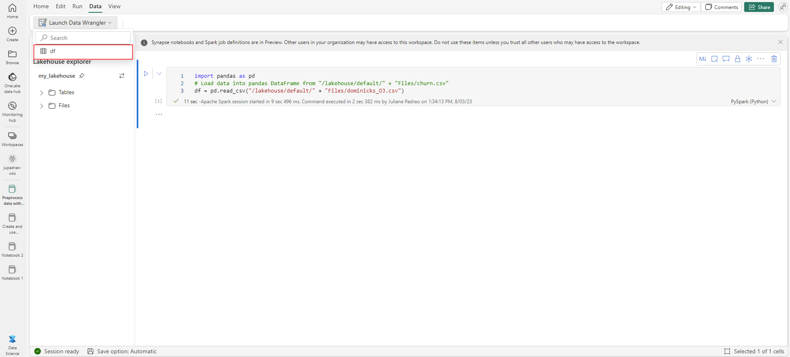
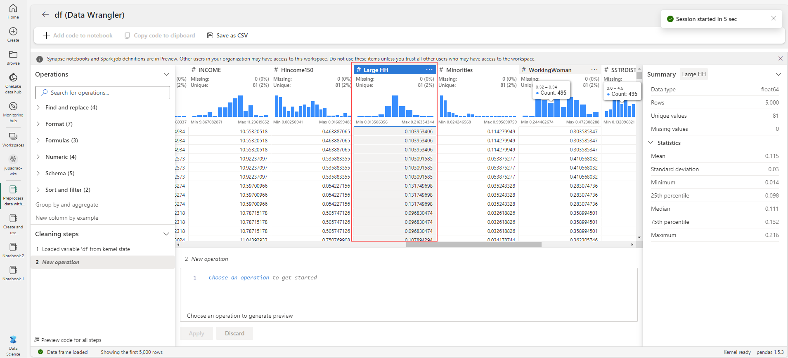

---
lab:
    title: 'Preprocess data with Data Wrangler in Microsoft Fabric'
    module: 'Preprocess data with Data Wrangler in Microsoft Fabric'
---

# Use notebooks to train a model in Microsoft Fabric

In this lab, you'll learn how to use Data Wrangler in Microsoft Fabric to preprocess data, and generate code using a library of common data science operations.

This lab will take approximately **30** minutes to complete.

> **Note**: You'll need a Microsoft Fabric license to complete this exercise. See [Getting started with Fabric](https://learn.microsoft.com/fabric/get-started/fabric-trial) for details of how to enable a free Fabric trial license. You will need a Microsoft *school* or *work* account to do this. If you don't have one, you can [sign up for a trial of Microsoft Office 365 E3 or higher](https://www.microsoft.com/microsoft-365/business/compare-more-office-365-for-business-plans).

## Create a workspace

Before working with data in Fabric, create a workspace with the Fabric trial enabled.

1. Sign into [Microsoft Fabric](https://app.fabric.microsoft.com) at `https://app.fabric.microsoft.com` and select **Power BI**.
2. In the menu bar on the left, select **Workspaces** (the icon looks similar to &#128455;).
3. Create a new workspace with a name of your choice, selecting a licensing mode that includes Fabric capacity (*Trial*, *Premium*, or *Fabric*).
4. When your new workspace opens, it should be empty, as shown here:

    

## Create a lakehouse and upload files

Now that you have a workspace, it's time to switch to the *Data science* experience in the portal and create a data lakehouse for the data files you're going to analyze.

1. At the bottom left of the Power BI portal, select the **Power BI** icon and switch to the **Data Engineering** experience.
1. In the **Data engineering** home page, create a new **Lakehouse** with a name of your choice.

    After a minute or so, a new lakehouse with no **Tables** or **Files** will be created. You need to ingest some data into the data lakehouse for analysis. There are multiple ways to do this, but in this exercise you'll simply download and extract a folder of text files your local computer (or lab VM if applicable) and then upload them to your lakehouse.

1. TODO: Download and save the `dominicks_OJ.csv` CSV file for this exercise from [https://raw.githubusercontent.com/MicrosoftLearning/dp-data/main/XXXXX.csv](https://raw.githubusercontent.com/MicrosoftLearning/dp-data/main/XXXXX.csv).


1. Return to the web browser tab containing your lakehouse, and in the **...** menu for the **Files** node in the **Lake view** pane, select **Upload** and **Upload files**, and then upload the **dominicks_OJ.csv** file from your local computer (or lab VM if applicable) to the lakehouse.
6. After the files have been uploaded, expand **Files** and verify that the CSV file have been uploaded.

## Create a notebook

To train a model, you can create a *notebook*. Notebooks provide an interactive environment in which you can write and run code (in multiple languages) as *experiments*.

1. At the bottom left of the Power BI portal, select the **Data engineering** icon and switch to the **Data science** experience.

1. In the **Data science** home page, create a new **Notebook**.

    After a few seconds, a new notebook containing a single *cell* will open. Notebooks are made up of one or more cells that can contain *code* or *markdown* (formatted text).

1. Select the first cell (which is currently a *code* cell), and then in the dynamic tool bar at its top-right, use the **M&#8595;** button to convert the cell to a *markdown* cell.

    When the cell changes to a markdown cell, the text it contains is rendered.

1. Use the **&#128393;** (Edit) button to switch the cell to editing mode, then delete the content and enter the following text:

    ```text
   # Train a machine learning model and track with MLflow

   Use the code in this notebook to train and track models.
    ``` 

## Load data into a dataframe

Now you're ready to run code to prepare data and train a model. To work with data, you'll use *dataframes*. Dataframes in Spark are similar to Pandas dataframes in Python, and provide a common structure for working with data in rows and columns.

1. In the **Add lakehouse** pane, select **Add** to add a lakehouse.
1. Select **Existing lakehouse** and select **Add**.
1. Select the lakehouse you created in a previous section.
1. Expand the **Files** folder so that the CSV file is listed next to the notebook editor.
1. In the **...** menu for **churn.csv**, select **Load data** > **Pandas**. A new code cell containing the following code should be added to the notebook:

    ```python
    import pandas as pd
    df = pd.read_csv("/lakehouse/default/" + "Files/dominicks_OJ.csv") 
    display(df.head(5))
    ```

    > **Tip**: You can hide the pane containing the files on the left by using its **<<** icon. Doing so will help you focus on the notebook.

1. Use the **&#9655; Run cell** button on the left of the cell to run it.

    > **Note**: Since this is the first time you've run any Spark code in this session, the Spark pool must be started. This means that the first run in the session can take a minute or so to complete. Subsequent runs will be quicker.

## View summary statistics

When Data Wrangler launches, it generates a descriptive overview of the dataframe in the Summary panel. 

1. Select **Data** at the top menu, then **Data Wrangler** dropdown to browse the `df` dataset.

    

1. Select the **Large HH** column and observe how easily you can determine the data distribution of this feature.

    

    Notice that this feature follows a normal distribution.

1. Check the Summary side panel, and observe the percentile ranges. 

    

    You can see that most of the data lies between **0.098** and **0.132**, and that 50% of the data values fall within that range.

## Format text data

Now let's apply a few transformations to the **Brand** feature.

1. On the **Data Wrangler** page, select the `Brand` feature.

1. Navigate to the **Operations** panel, expand **Find and replace**, then select **Find and replace**.

1. On the **Find and replace** panel, change the following properties:
    
    - **Old value:** "."
    - **New value:** " " (space character)

    

    You can see the results of the operation automatically previewed in the display grid.

1. Select **Apply**.

1. Back to the **Operations** panel, expand **Format**.

1. Select **Convert text to capital case**.

1. On the **Convert text to capital case** panel, select **Apply**.

1. Select **Add code to notebook**. Additionally, you can also save the transformed dataset as a .csv file.

    Note that the code is automatically copied to the notebook cell, and is ready for use.

1. Run the code.

> **Important:** The code generated doesn't overwrite the original dataframe. 

You've learned how to easily generate code, and manipulate text data using Data Wrangler operations. 

## Apply one-hot encoder transformation

Now, let's generate the code to apply one-hot encoder transformation as a preprocessing step.

1. Select **Data** at the top menu, then **Data Wrangler** dropdown to browse the `df` dataset.

1. On the **Operations** panel, expand **Formulas**.

1. Select **One-hot encode**.

1. On the **One-hot encode** panel, select **Apply**.

    Navigate to the end of the Data Wrangler display grid. Notice that it added three new features, and removed the `Brand` feature.

1. Select **Add code to notebook**.

1. Run the code.

## Sort and filter operations

1. Select **Data** at the top menu, then **Data Wrangler** dropdown to browse the `df` dataset.

1. On the **Operations** panel, expand **Sort and filter**.

1. Select **Filter**.

1. On the **Filter** panel, add the following condition:
    
    - **Target colunm:** Store
    - **Operation:** Equal to
    - **Value:** 2

1. Select **Apply**.

    Notice that the changes in the Data Wrangler display grid.

1. Back to the **Operations** panel, expand **Sort and filter**.

1. Select **Sort values**

1. On the **Price** panel, add the following condition:
    
    - **Column name:** Price
    - **Sort order:** Descending

1. Select **Apply**.

    Notice that the changes in the Data Wrangler display grid.

## Aggregate data

1. Back to the **Operations** panel, select **Group by and aggregate**.

1. On the **Columns to group by:** property, select the `Store` feature.

1. Select **Add aggregation**.

1. On the **Column to aggregate** property, select the `Quantity` feature.

1. Select **Count** for the **Aggregation type** property.

1. Select **Apply**. 

    Notice that the changes in the Data Wrangler display grid.

## Browse and remove steps

Suppose you made a mistake and need to remove the aggregation you created in the previous step. Follow these steps to remove it:

1. Expand the **Cleaning steps** panel.

1. Select the **Group by and aggregate** step.

1. Select the delete icon to have it removed.

    

    > **Important:** the grid view and summary are limited to the current step.

    Notice that the changes are reverted to the previous step, which is the **Sort values** step.

1. Select **Add code to notebook**.

1. Run the code.

You generated the code for some of the preprocess operations, and saved back to the notebook as a function, which you can then reuse or modify as needed.

## Save the notebook and end the Spark session

Now that you've finished preprocessing your data for modeling, you can save the notebook with a meaningful name and end the Spark session.

1. In the notebook menu bar, use the ⚙️ **Settings** icon to view the notebook settings.
2. Set the **Name** of the notebook to **Preprocess data with Data Wrangler**, and then close the settings pane.
3. On the notebook menu, select **Stop session** to end the Spark session.

## Clean up resources

In this exercise, you've created a notebook and used Data Wrangler to explore and preprocess data for a machine learning model.

If you've finished exploring the preprocess steps, you can delete the workspace you created for this exercise.

1. In the bar on the left, select the icon for your workspace to view all of the items it contains.
2. In the **...** menu on the toolbar, select **Workspace settings**.
3. In the **Other** section, select **Remove this workspace** .
