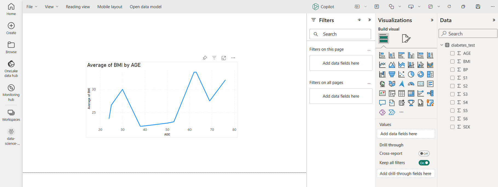

---
lab:
    title: 'Generate and save batch predictions'
    module: 'Generate batch predictions using a deployed model in Microsoft Fabric'
---

# Generate and save batch predictions

In this lab, you'll train a machine learning model to predict a quantitative measure of diabetes. You'll train a regression model with scikit-learn, and track and compare your models with MLflow.

By completing this lab, you'll gain hands-on experience in machine learning and model tracking, and learn how to work with *notebooks*, *experiments*, and *models* in Microsoft Fabric.

This lab will take approximately **45** minutes to complete.

> **Note**: You'll need a Microsoft Fabric license to complete this exercise. See [Getting started with Fabric](https://learn.microsoft.com/fabric/get-started/fabric-trial) for details of how to enable a free Fabric trial license. You will need a Microsoft *school* or *work* account to do this. If you don't have one, you can [sign up for a trial of Microsoft Office 365 E3 or higher](https://www.microsoft.com/microsoft-365/business/compare-more-office-365-for-business-plans).

## Create a workspace

Before working with models in Fabric, create a workspace with the Fabric trial enabled.

1. Sign into [Microsoft Fabric](https://app.fabric.microsoft.com) at `https://app.fabric.microsoft.com` and select **Power BI**.
2. In the menu bar on the left, select **Workspaces** (the icon looks similar to &#128455;).
3. Create a new workspace with a name of your choice, selecting a licensing mode that includes Fabric capacity (*Trial*, *Premium*, or *Fabric*).
4. When your new workspace opens, it should be empty, as shown here:

    

## Create a notebook

To train a model, you can create a *notebook*. Notebooks provide an interactive environment in which you can write and run code (in multiple languages).

1. At the bottom left of the Fabric portal, select the **Data engineering** icon and switch to the **Data science** experience.

1. In the **Data science** home page, create a new **Notebook**.

    After a few seconds, a new notebook containing a single *cell* will open. Notebooks are made up of one or more cells that can contain *code* or *markdown* (formatted text).

1. Select the first cell (which is currently a *code* cell), and then in the dynamic tool bar at its top-right, use the **M&#8595;** button to convert the cell to a *markdown* cell.

    When the cell changes to a markdown cell, the text it contains is rendered.

1. Use the **&#128393;** (Edit) button to switch the cell to editing mode, then delete the content and enter the following text:

    ```text
   # Train a machine learning model and track with MLflow
    ```

## Load data into a dataframe

Now you're ready to run code to get data and train a model. You'll work with the [diabetes dataset](https://learn.microsoft.com/azure/open-datasets/dataset-diabetes?tabs=azureml-opendatasets?azure-portal=true) from the Azure Open Datasets. After loading the data, you'll convert the data to a Pandas dataframe: a common structure for working with data in rows and columns. First, you'll need to ad

1. In the **Add lakehouse** pane, select **Add** to add a lakehouse.
1. Select **New lakehouse** and select **Add**.
1. Create a new **Lakehouse** with a name of your choice.
1. In your notebook, use the **+ Code** icon below the latest cell output to add a new code cell to the notebook, and enter the following code in it:

    ```python
    # Azure storage access info for open dataset diabetes
    blob_account_name = "azureopendatastorage"
    blob_container_name = "mlsamples"
    blob_relative_path = "diabetes"
    blob_sas_token = r"" # Blank since container is Anonymous access
    
    # Set Spark config to access  blob storage
    wasbs_path = f"wasbs://%s@%s.blob.core.windows.net/%s" % (blob_container_name, blob_account_name, blob_relative_path)
    spark.conf.set("fs.azure.sas.%s.%s.blob.core.windows.net" % (blob_container_name, blob_account_name), blob_sas_token)
    print("Remote blob path: " + wasbs_path)
    
    # Spark read parquet, note that it won't load any data yet by now
    df = spark.read.parquet(wasbs_path)
    ```

1. Use the **&#9655; Run cell** button on the left of the cell to run it. Alternatively, you can press `SHIFT` + `ENTER` on your keyboard to run a cell.

    > **Note**: Since this is the first time you've run any Spark code in this session, the Spark pool must be started. This means that the first run in the session can take a minute or so to complete. Subsequent runs will be quicker.

1. Use the **+ Code** icon below the cell output to add a new code cell to the notebook, and enter the following code in it:

    ```python
    display(df)
    ```

1. When the cell command has completed, review the output below the cell, which should look similar to this:

    |AGE|SEX|BMI|BP|S1|S2|S3|S4|S5|S6|Y|
    |---|---|---|--|--|--|--|--|--|--|--|
    |59|2|32.1|101.0|157|93.2|38.0|4.0|4.8598|87|151|
    |48|1|21.6|87.0|183|103.2|70.0|3.0|3.8918|69|75|
    |72|2|30.5|93.0|156|93.6|41.0|4.0|4.6728|85|141|
    |24|1|25.3|84.0|198|131.4|40.0|5.0|4.8903|89|206|
    |50|1|23.0|101.0|192|125.4|52.0|4.0|4.2905|80|135|
    | ... | ... | ... | ... | ... | ... | ... | ... | ... | ... | ... |

    The output shows the rows and columns of the diabetes dataset.

1. The data is loaded as a Spark dataframe. Scikit-learn will expect the input dataset to be a Pandas dataframe. Run the code below to convert your dataset to a Pandas dataframe:

    ```python
    import pandas as pd
    df = df.toPandas()
    df.head()
    ```

## Train a machine learning model

Now that you've loaded the data, you can use it to train a machine learning model and predict a quantitative measure of diabetes. You'll train a regression model using the scikit-learn library and track the model with MLflow.

1. Run the following code to split the data into a training and test dataset, and to separate the features from the label you want to predict:

    ```python
    from sklearn.model_selection import train_test_split
    
    print("Splitting data...")
    X, y = df[['AGE','SEX','BMI','BP','S1','S2','S3','S4','S5','S6']].values, df['Y'].values
    
    X_train, X_test, y_train, y_test = train_test_split(X, y, test_size=0.30, random_state=0)
    ```

1. Add another new code cell to the notebook, enter the following code in it, and run it:

    ```python
   import mlflow
   experiment_name = "experiment-diabetes"
   mlflow.set_experiment(experiment_name)
    ```

    The code creates an MLflow experiment named `experiment-diabetes`. Your models will be tracked in this experiment.

1. Add another new code cell to the notebook, enter the following code in it, and run it:

    ```python
    from sklearn.linear_model import LinearRegression
    
    with mlflow.start_run():
       mlflow.autolog()
    
       model = LinearRegression()
       model.fit(X_train, y_train)
    
       mlflow.log_param("estimator", "LinearRegression")
    ```

    The code trains a classification model using Linear Regression. Parameters, metrics, and artifacts, are automatically logged with MLflow. Additionally, you're logging a parameter called `estimator`, with the value `LinearRegression`.

1. Add another new code cell to the notebook, enter the following code in it, and run it:

    ```python
    from sklearn.tree import DecisionTreeRegressor
    
    with mlflow.start_run():
       mlflow.autolog()
    
       model = DecisionTreeRegressor(max_depth=5) 
       model.fit(X_train, y_train)
    
       mlflow.log_param("estimator", "DecisionTreeRegressor")
    ```

    The code trains a classification model using Decision Tree Regressor. Parameters, metrics, and artifacts, are automatically logged with MLflow. Additionally, you're logging a parameter called `estimator`, with the value `DecisionTreeRegressor`.

## Use MLflow to search and view your experiments

When you've trained and tracked models with MLflow, you can use the MLflow library to retrieve your experiments and its details.

1. To list all experiments, use the following code:

    ```python
   import mlflow
   experiments = mlflow.search_experiments()
   for exp in experiments:
       print(exp.name)
    ```

1. To retrieve a specific experiment, you can get it by its name:

    ```python
   experiment_name = "experiment-diabetes"
   exp = mlflow.get_experiment_by_name(experiment_name)
   print(exp)
    ```

1. Using an experiment name, you can retrieve all jobs of that experiment:

    ```python
   mlflow.search_runs(exp.experiment_id)
    ```

1. To more easily compare job runs and outputs, you can configure the search to order the results. For example, the following cell orders the results by `start_time`, and only shows a maximum of `2` results:

    ```python
   mlflow.search_runs(exp.experiment_id, order_by=["start_time DESC"], max_results=2)
    ```

1. Finally, you can plot the evaluation metrics of multiple models next to each other to easily compare models:

    ```python
   import matplotlib.pyplot as plt
   
   df_results = mlflow.search_runs(exp.experiment_id, order_by=["start_time DESC"], max_results=2)[["metrics.training_r2_score", "params.estimator"]]
   
   fig, ax = plt.subplots()
   ax.bar(df_results["params.estimator"], df_results["metrics.training_r2_score"])
   ax.set_xlabel("Estimator")
   ax.set_ylabel("R2 score")
   ax.set_title("R2 score by Estimator")
   for i, v in enumerate(df_results["metrics.training_r2_score"]):
       ax.text(i, v, str(round(v, 2)), ha='center', va='bottom', fontweight='bold')
   plt.show()
    ```

    The output should resemble the following image:

    


## Load the test dataset and create a report

### Create the test dataset

1. In the **Add lakehouse** pane, select **Add** to add a lakehouse.
1. Select **New lakehouse** and select **Add**.
1. Create a new **Lakehouse** with a name of your choice.
1. In your notebook, use the **+ Code** icon below the latest cell output to add a new code cell to the notebook, and enter the following code in it:

    ```python
    from pyspark.sql import SparkSession
    from pyspark.sql.types import StructType, StructField, IntegerType, DoubleType
    
    # Initialize a Spark session
    spark = SparkSession.builder.appName("CreateDataFrame").getOrCreate()
    
    # Define the schema without the "Y" variable
    schema = StructType([
        StructField("AGE", IntegerType(), True),
        StructField("SEX", IntegerType(), True),
        StructField("BMI", DoubleType(), True),
        StructField("BP", DoubleType(), True),
        StructField("S1", IntegerType(), True),
        StructField("S2", DoubleType(), True),
        StructField("S3", DoubleType(), True),
        StructField("S4", DoubleType(), True),
        StructField("S5", DoubleType(), True),
        StructField("S6", IntegerType(), True)
    ])
    
    
    data = [
        (62, 2, 33.7, 101.0, 157, 93.2, 38.0, 4.0, 4.8598, 87),
        (50, 1, 22.7, 87.0, 183, 103.2, 70.0, 3.0, 3.8918, 69),
        (76, 2, 32.0, 93.0, 156, 93.6, 41.0, 4.0, 4.6728, 85),
        (25, 1, 26.6, 84.0, 198, 131.4, 40.0, 5.0, 4.8903, 89),
        (53, 1, 23.0, 101.0, 192, 125.4, 52.0, 4.0, 4.2905, 80),
        (24, 1, 23.7, 89.0, 139, 64.8, 61.0, 2.0, 4.1897, 68),
        (38, 2, 22.0, 90.0, 160, 99.6, 50.0, 3.0, 3.9512, 82),
        (69, 2, 27.5, 114.0, 255, 185.0, 56.0, 5.0, 4.2485, 92),
        (63, 2, 33.7, 83.0, 179, 119.4, 42.0, 4.0, 4.4773, 94),
        (30, 1, 30.0, 85.0, 180, 93.4, 43.0, 4.0, 5.3845, 88)
    ]
    
    # Create the dataframe
    df = spark.createDataFrame(data, schema=schema)
    
    # Show the dataframe
    df.show()
    ```

1. Run the cell to create a new Spark dataframe with ten rows of data.
1. To save the dataframe as a delta table in the lakehouse, add another new code cell to the notebook, enter the following code in it, and run it:

    ```python
    table_name = "diabetes_test"
    df.write.mode("overwrite").format("delta").save(f"Tables/{table_name}")
    print(f"Spark dataframe saved to delta table: {table_name}")
    ```

1. To view the delta table, select the *...* next to the **Tables** in the **Lakehouse explorer** pane, and select **Refresh**. The `diabetes_test` table should appear.
1. Optionally, you can drag and drop the `diabetes_test` table to a cell in the notebook. You can run the generated code to view the data from the delta table, which should be the same as the DataFrame you created.

### Create a Power BI report

Now that you have a dataset, you can create a Power BI report.

1. Select **OneLake data hub**, from the left menu.
1. Select the lakehouse that you created in the previous section.
1. Select **Open** in the **Open this Lakehouse** pane on the top right.
1. Select **New Power BI dataset** on the top ribbon.
1. Select the delta table `diabetes_test`, and select **Confirm** to create a new Power BI dataset linked to the test dataset.
1. Wait for the new window to load, which shows the new Power BI dataset.
1. Rename the dataset to `diabetes_predictions` by selecting the dropdown at the top left corner of the dataset page.
1. When the page for the new dataset loads, rename the dataset by selecting the name at top left corner of the dataset page.
1. Select the `BMI` field from the **Data** pane on the right.
1. Select **Decimal number** in the drop-down menu under **Format** in the **Properties** pane.
1. Select **New report** from the top ribbon to open the Power BI report authoring page.

### Add a visualization to the report

By creating a Power BI dataset linked to a delta table, you can create a Power BI report.

1. Select a **Line chart** from the **Visualizations** pane.
1. Drag and drop `Age` to the **X-axis** field.
1. Drag and drop `BMI` to the **Y-axis** field.
1. Select the drop-down menu for `BMI` in the **Y-axis** field.
1. Select **Average** to change the value of BMI from the sum to the average.

As as result, you should now have the following:



Instead of visualizing the BMI by age, you want to show the quantitative prediction of diabetes by age, to understand how the risk of diabetes differs per age. Let's use a model to generate predictions and add it to the delta table. The results will then automatically show up in your Power BI dataset.

## Train a model


### Load the training dataset


1. In your notebook, use the **+ Code** icon below the latest cell output to add a new code cell to the notebook, and enter the following code in it:
    ```python
    # Azure storage access info for open dataset diabetes
    blob_account_name = "azureopendatastorage"
    blob_container_name = "mlsamples"
    blob_relative_path = "diabetes"
    blob_sas_token = r"" # Blank since container is Anonymous access
    
    # Set Spark config to access  blob storage
    wasbs_path = f"wasbs://%s@%s.blob.core.windows.net/%s" % (blob_container_name, blob_account_name, blob_relative_path)
    spark.conf.set("fs.azure.sas.%s.%s.blob.core.windows.net" % (blob_container_name, blob_account_name), blob_sas_token)
    print("Remote blob path: " + wasbs_path)
    
    # Spark read parquet, note that it won't load any data yet by now
    df = spark.read.parquet(wasbs_path)
    ```

    ```python
    from sklearn.model_selection import train_test_split
    
    print("Splitting data...")
    X, y = df[['AGE','SEX','BMI','BP','S1','S2','S3','S4','S5','S6']].values, df['Y'].values
    
    X_train, X_test, y_train, y_test = train_test_split(X, y, test_size=0.30, random_state=0)
    ```


## Save the model

1. Navigate to the experiment `diabetes-experiment`.
1. Select the latest experiment run.
1. Select **Save** from the **Save run as model** pane at the top right.
1. Select **Create a new model**.
1. Select `model` as the **folder**.
1. Select `diabetes-model` as the **model name**.
1. Select **View model** in the notification that appears at the top right of your screen when the model is created. You can also refresh the window. The saved model is linked under **Model versions**.

## Apply the model

1. After navigating to the `diabetes-model`, select **Apply this version** from the **Apply this version** pane on the top right.
1. Select **Copy code to apply**.
1. Navigate back to the notebook that is attached to the lakehouse.

## Load data into a dataframe

Now you're ready to run code to get data and train a model. You'll work with the [diabetes dataset](https://learn.microsoft.com/azure/open-datasets/dataset-diabetes?tabs=azureml-opendatasets?azure-portal=true) from the Azure Open Datasets. After loading the data, you'll convert the data to a Pandas dataframe: a common structure for working with data in rows and columns. First, you'll need to ad

1. In the **Add lakehouse** pane, select **Add** to add a lakehouse.
1. Select **New lakehouse** and select **Add**.
1. Create a new **Lakehouse** with a name of your choice.
1. In your notebook, use the **+ Code** icon below the latest cell output to add a new code cell to the notebook, and enter the following code in it:

    ```python
    # Azure storage access info for open dataset diabetes
    blob_account_name = "azureopendatastorage"
    blob_container_name = "mlsamples"
    blob_relative_path = "diabetes"
    blob_sas_token = r"" # Blank since container is Anonymous access
    
    # Set Spark config to access  blob storage
    wasbs_path = f"wasbs://%s@%s.blob.core.windows.net/%s" % (blob_container_name, blob_account_name, blob_relative_path)
    spark.conf.set("fs.azure.sas.%s.%s.blob.core.windows.net" % (blob_container_name, blob_account_name), blob_sas_token)
    print("Remote blob path: " + wasbs_path)
    
    # Spark read parquet, note that it won't load any data yet by now
    df = spark.read.parquet(wasbs_path)

### Save the model

After comparing machine learning models that you've trained across experiment runs, you can choose the best performing model. To use the best performing model, save the model and use it to generate predictions.

1. In the experiment overview, ensure the **View** tab is selected.
1. Select **Run details**.
1. Select the run with the highest R2 score.
1. Select **Save** in the **Save as model** box.
1. Select **Create a new model** in the newly opened pop-up window.
1. Select the `model` folder.
1. Name the model `model-diabetes`, and select **Save**.
1. Select **View model** in the notification that appears at the top right of your screen when the model is created. You can also refresh the window. The saved model is linked under **Model versions**.

Note that the model, the experiment, and the experiment run are linked, allowing you to review how the model is trained.

## Generate batch predictions


### Save the notebook and end the Spark session

Now that you've finished training and evaluating the models, you can save the notebook with a meaningful name and end the Spark session.

1. In the notebook menu bar, use the ⚙️ **Settings** icon to view the notebook settings.
2. Set the **Name** of the notebook to **Train and compare models**, and then close the settings pane.
3. On the notebook menu, select **Stop session** to end the Spark session.


## Refresh the report

## Clean up resources

In this exercise, you have created a notebook and trained a machine learning model. You used scikit-learn to train the model and MLflow to track its performance.

If you've finished exploring your model and experiments, you can delete the workspace that you created for this exercise.

1. In the bar on the left, select the icon for your workspace to view all of the items it contains.
2. In the **...** menu on the toolbar, select **Workspace settings**.
3. In the **Other** section, select **Remove this workspace** .
