---
lab:
    title: 'Get started with Real-Time Analytics in Microsoft Fabric'
    module: 'Get started with real-time analytics in Microsoft Fabric'
---
# Get started with EventStream in Real

Event streams is a feature in Microsoft Fabric that captures, transforms, and routes real-time events to various destinations with a no-code experience. When you create an Eventstream item in the portal, it is an instance of Fabric event streams (also called an eventstream). You can add event data sources, routing destinations, and the event processor when the transformation is needed, to the eventstream. Azure Service Fabric's EventStore is a monitoring option that maintains events from the cluster and provides a way to understand the state of your cluster or workloads at a given point in time. The EventStore service can be queried for events that are available for each entity and entity type in your cluster. This means you can query for events on different levels such as cluster, nodes, applications, services, partitions, and partition replicas. The EventStore service also has the ability to correlate events in your cluster. By looking at events that were written at the same time from different entities that may have impacted each other, the EventStore service is able to link these events to help with identifying causes for activities in your cluster. Another option for monitoring and diagnostics of Azure Service Fabric clusters is aggregating and collecting events using EventFlow[.

This lab takes approximately **30** minutes to complete.

> **Note**: You'll need a Microsoft Fabric license to complete this exercise. See [Getting started with Fabric](https://learn.microsoft.com/fabric/get-started/fabric-trial) for details of how to enable a free Fabric trial license. You will need a Microsoft *school* or *work* account to do this. If you don't have one, you can [sign up for a trial of Microsoft Office 365 E3 or higher](https://www.microsoft.com/microsoft-365/business/compare-more-office-365-for-business-plans).

## Create a workspace

Before working with data in Fabric, create a workspace with the Fabric trial enabled.

1. Sign into [Microsoft Fabric](https://app.fabric.microsoft.com) at `https://app.fabric.microsoft.com` and select **Power BI**.
2. In the menu bar on the left, select **Workspaces** (the icon looks similar to &#128455;).
3. Create a new workspace with a name of your choice, selecting a licensing mode that includes Fabric capacity (*Trial*, *Premium*, or *Fabric*).
4. When your new workspace opens, it should be empty, as shown here:

   
5. At the bottom left of the Power BI portal, select the **Power BI** icon and switch to the **Microsoft Fabric** experience.

## Scenario

With Microsoft Fabric event streams, you can easily manage your event data in one place. You can collect, transform, and send real-time event data to different destinations in the format you want. You can also connect your event streams with Azure Event Hubs, KQL database, and Lakehouse without any hassle.

This lab is based on sample streaming data called Stock Market Data. The Stock Market sample data is a dataset of a stock exchange with a preset schema column such as time, symbol, price, volume and more. You will use this sample data to simulate real-time events of stock prices and analyze them with various destinations, such as the KQL database.

You'll use the streaming and query capabilities of Real-Time Analytics to answer key questions about the stock statistics, and have the ability to use its results to build Power BI reports. In this scenario, we're going to take full advantage of the wizard instead of manually creating some components idependently, such as the KQL Database.

In this tutorial, you learn how to:

- Create a KQL database
- Enable data copy to OneLake
- Create an eventstream
- Stream data from Eventstream to your KQL database
- Explore data with KQL and SQL

## Create a KQL Database

1. Sign into [Microsoft Fabric](https://app.fabric.microsoft.com) at `https://app.fabric.microsoft.com` and select **Power BI**.
2. In the menu bar, select **Real-Time Analytics** (the icon looks similar to )
3. Under **New**, select **EventStream (Preview)**

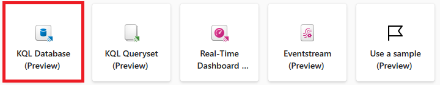

4. You will be prompted to **Name Eventstream**

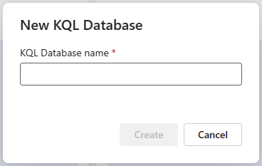

5. Give the KQL Database a name that you'll remember, such as **MyStockData**, press **Create**.

## Turn on availability in OneLake

1. In the **Database details** panel, selec the pencil icon.

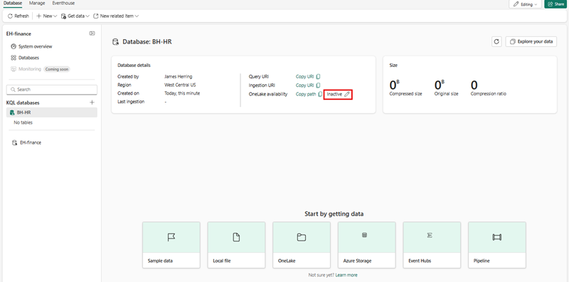

2. Make sure to toggle the button to **Active** and then select **Done**.

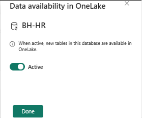

## Create an Eventstream

1. Sign into [Microsoft Fabric](https://app.fabric.microsoft.com) at `https://app.fabric.microsoft.com` and select **Power BI**.
2. In the menu bar, select **Real-Time Analytics** (the icon looks similar to )
3. Under **New**, select **EventStream (Preview)**

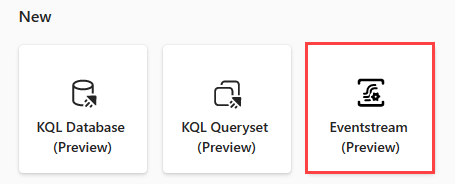

4. You will be prompted to **Name Eventstream**

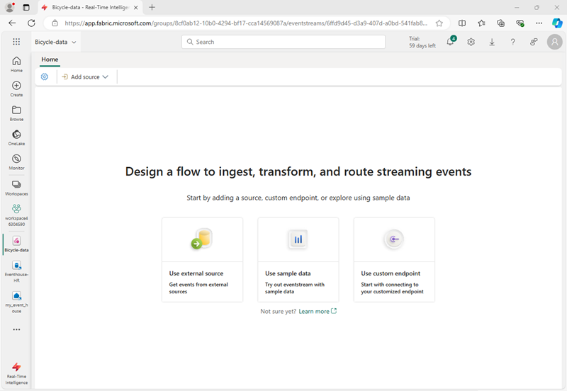

5. Give the EventStream a name that you'll remember, such as ***MyStockEV**, press **Create**

## Source EventStream data

1. In the Eventstream canvas, click on **New source.Sample Data**.

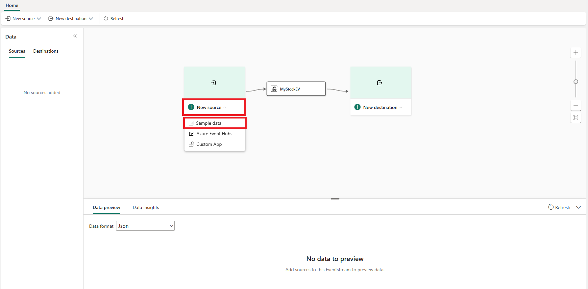

2. Enter the values for your Sample Data as shown in the following table

| Field       | Recommended Value |
| ----------- | ----------------- |
| Source name | StockData         |
| Sample data | Stock Market      |

## Destination EventStream Data

1. In the Eventstream canvas, click on the **New destination.KQL Database**

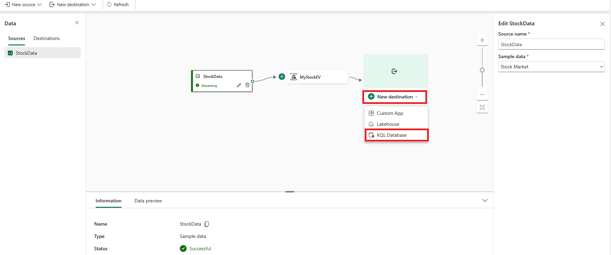

2. In the KQL Database configuration use the following table to complete the configuration.

| Field            | Recommended Value                              |
| ---------------- | ---------------------------------------------- |
| Destination Name | MyStockData                                    |
| Workspace        | The workspace where you created a KQL database |
| KQL Database     | StockDataDB                                    |

3. Select **Add and configure**.

## Configure data loading to the KQL database

1. Select the **New Table**, then enter the MyStockData.

2. Click **Next: Source**.
3. Confirm the **Data connection name**, the select **Next: Schema**.

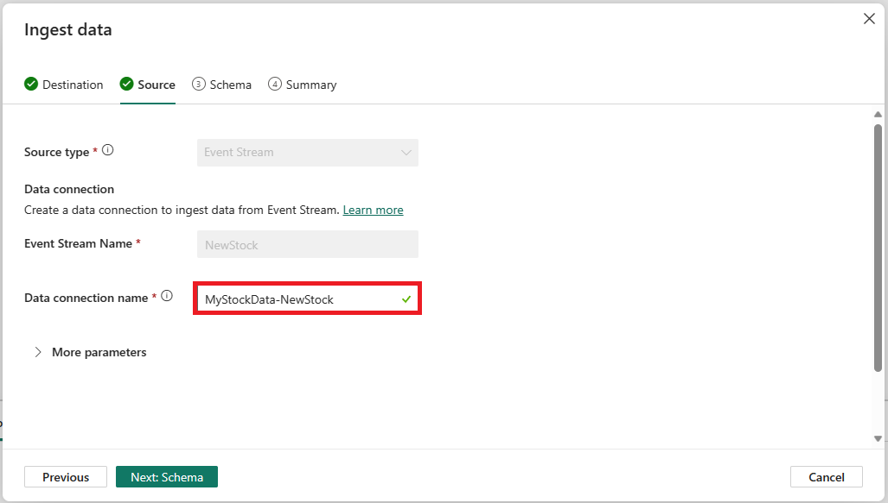

## Schema Mapping

1. The incoming data is uncompressed for sample data, so keep the compression type as uncompressed.
2. From the **Data Format** dropdown, select **JSON**.

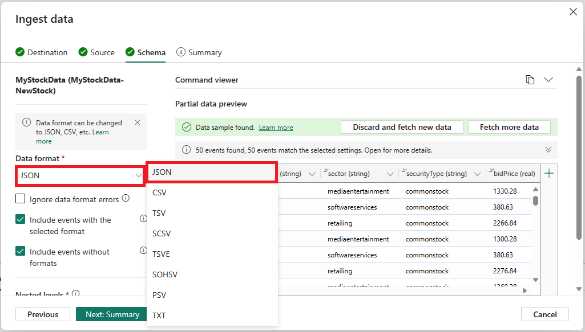

## Change data types

1. It may be necessary to change some or all data types from your incoming stream to your destination(s) tables.
2. You can accomplish this task by selecting the **down arrow>Change data type**. Then verify that the columns reflect the correct data type: 

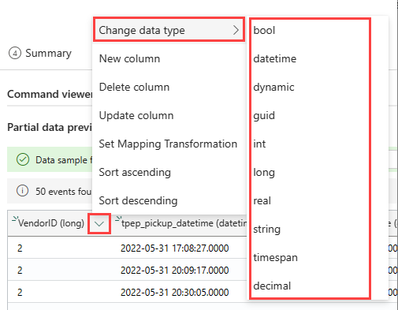

3. Select **Next: Summary**

In the **Continuous ingestion from Eventstream established** window, all steps are marked with green check marks when the data connection is successfully created. The data from Eventstream begins streaming automatically into your table.

>!Note: It may be necessary to refresh the page to view your table after the Eventstream connection has been built and established

## KQL Queries

Kusto Query Language (KQL) is a read-only request to process data and return results. The request is stated in plain text, using a data-flow model that is easy to read, author, and automate. Queries always run in the context of a particular table or database. At a minimum, a query consists of a source data reference and one or more query operators applied in sequence, indicated visually by the use of a pipe character (|) to delimit operators. For more information on the Kusto Query Language, see [Kusto Query Language (KQL) Overview](https://learn.microsoft.com/en-us/azure/data-explorer/kusto/query/?context=%2Ffabric%2Fcontext%2Fcontext)

>! Note: The KQL Editor comes with both syntax and Inellisense highlighting, which allows you to quickly gain knowledge of the Kusto Query Language (KQL).

1. Browse to your newly created and hydrated KQL Database named ***MyStockData***.
2. In the Data tree, select the More menu [...] on the MyStockData table. Then select Query table > Show any 100 records.

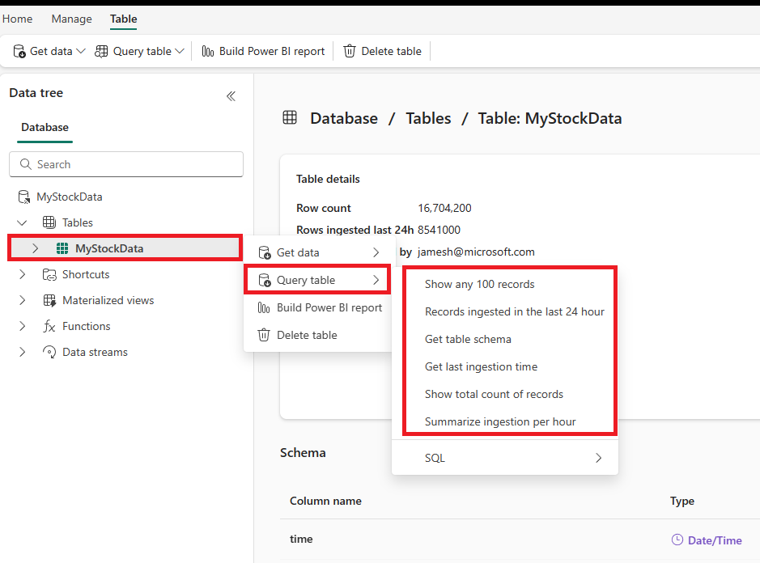

3. The sample query opens in the **Explore your data** pane with the table context already populated. This first query uses the take operator to return a sample number of records, and is useful to get a first look at the data structure and possible values. The autopopulated sample queries are automatically run. You can see the query results in the results pane.

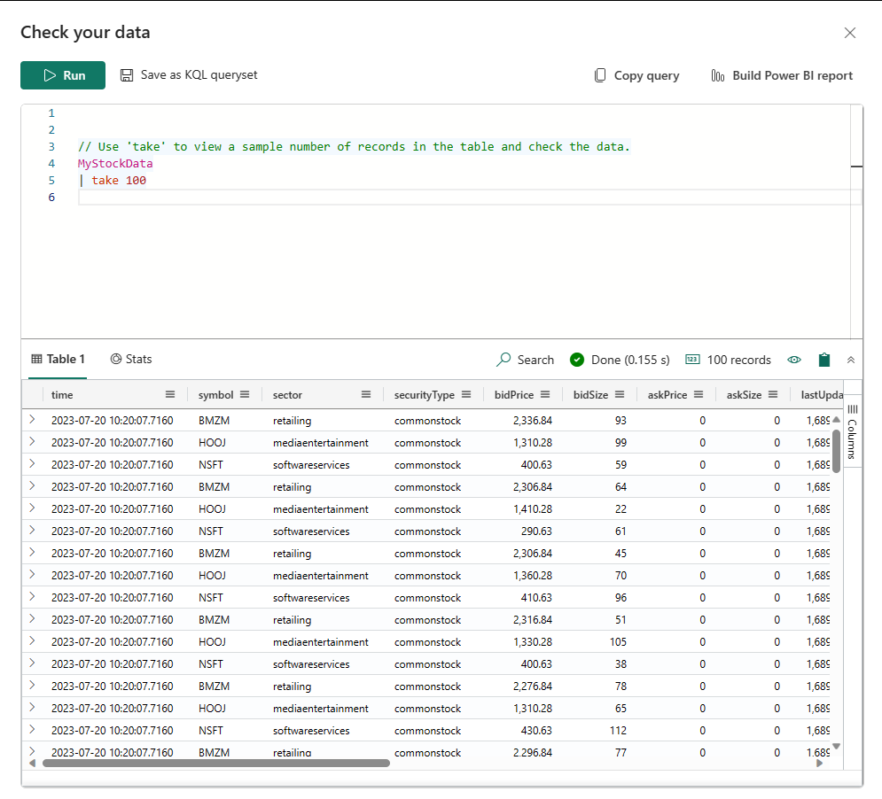

4. Return to the data tree to paste the next query, which uses the where operator and between operator to return records ingested in the last 24 hours.

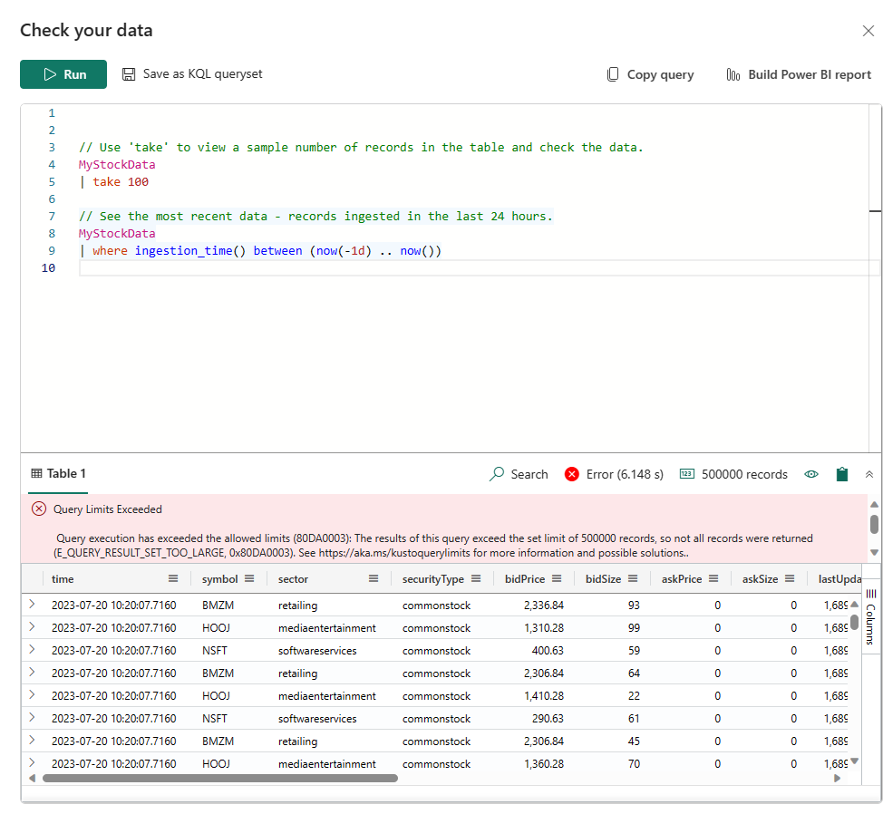

>!Note: Notice that the volumes of the streaming data exceed the query limits. This behavior may vary depending on the amount of data streamed into your database.
You can continue to navigate using the built-in query functions to familiarize yourself with your data.

## Sample SQL Queries

The query editor supports the use of T-SQL in addition to its primary query Kusto Query Language (KQL). T-SQL can be useful for tools that are unable to use KQL. For more information, see [Query data using T-SQL](https://learn.microsoft.com/en-us/azure/data-explorer/t-sql)

1. Back In the Data tree, select the **More menu** [...] on the MyStockData table. Select **Query table > SQL > Show any 100 records**.

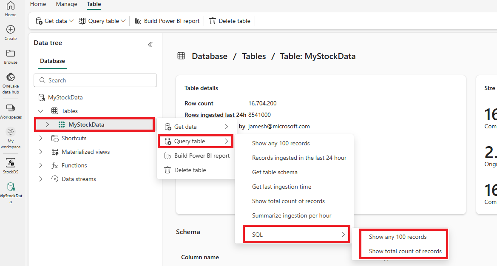

2. Place your cursor somewhere within the query and select **Run** or press **Shift + Enter**.

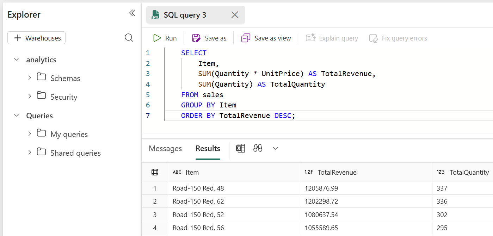

You can continue to navigate using the build-in functions and familiarize yourself with the data using SQL or KQL. This ends the lesson.
