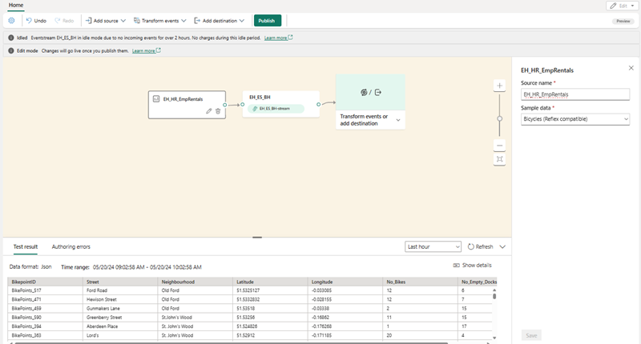
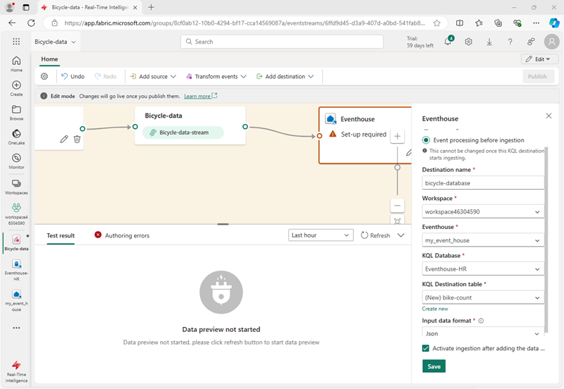
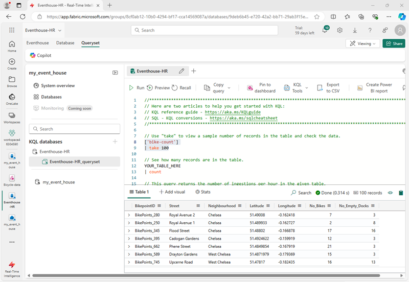
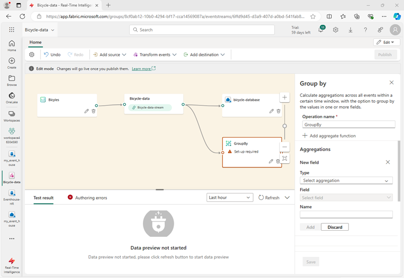
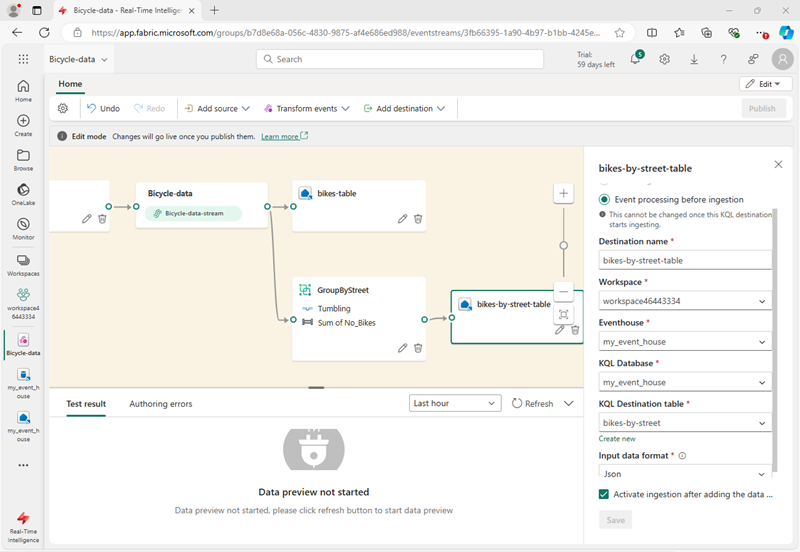
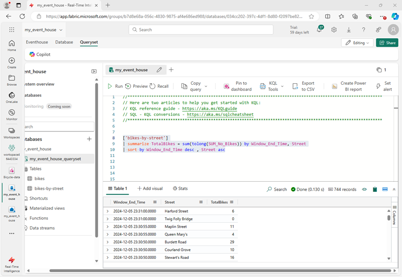

---
lab:
    title: 'Get started with Eventstream in Microsoft Fabric'
    module: 'Get started with Eventstream in Microsoft Fabric'
---
# Get started with Eventstream in Microsoft Fabric

Eventstream is a feature in Microsoft Fabric that captures, transforms, and routes real-time events to various destinations with a no-code experience. You can add event data sources, routing destinations, and the event processor, when the transformation is needed, to the eventstream. Microsoft Fabric's EventStore is a monitoring option that maintains events from the cluster and provides a way to understand the state of your cluster or workload at a given point in time. The EventStore service can be queried for events that are available for each entity and entity type in your cluster. This means you can query for events on different levels, such as clusters, nodes, applications, services, partitions, and partition replicas. The EventStore service also has the ability to correlate events in your cluster. By looking at events that were written at the same time from different entities that may have impacted each other, the EventStore service can link these events to help with identifying causes for activities in your cluster. Another option for monitoring and diagnostics of Microsoft Fabric clusters is aggregating and collecting events using EventFlow.

This lab takes approximately **30** minutes to complete.

> **Note**: You need a [Microsoft Fabric trial](https://learn.microsoft.com/fabric/get-started/fabric-trial) to complete this exercise.

## Create a workspace

Before working with data in Fabric, create a workspace with the Fabric trial enabled.

1. Sign into the [Microsoft Fabric home page](https://app.fabric.microsoft.com/home?experience=fabric) at `https://app.fabric.microsoft.com/home?experience=fabric` and select **Power BI**.
2. In the menu bar on the left, select **Workspaces** (the icon looks similar to &#128455;).
3. Create a new workspace with a name of your choice, selecting a licensing mode that includes Fabric capacity (*Trial*, *Premium*, or *Fabric*).
4. When your new workspace opens, it should be empty, as shown here:

   
5. At the bottom left of the Power BI portal, select the **Power BI** icon and switch to the **Real-Time Intelligence** experience.

## Create a Real-Time Intelligence Eventhouse

1. In the Real-Time Intelligence home page in Microsoft Fabric,create a new **Eventhouse**, giving it a unique name of your choice.
1. Close any tips or prompts that are displayed until you see your new empty eventhouse.

    

## Create a KQL Database

1. Within the **Real-Time Intelligence Eventhouse** Dashboard, select the **KQL Database +** box.
1. You'll have the option to create a **New database (default)** or create a **New shortcut database (follower)**.

    >**Note:**
    > The follower database feature allows you to attach a database located in a different cluster to your Azure Data Explorer cluster. The follower database
    is attached in read-only mode, making it possible to view the data and run queries on the data that was ingested into the leader database . The follower database synchronizes changes in the leader databases. Because of the synchronization, there's a data lag of a few seconds to a few minutes in data availability. The length of the time lag depends on the overall size of the leader database metadata. The leader and follower databases use the same storage account to fetch the data. The storage is owned by the leader database. The follower database views the data without needing to ingest it. Since the attached database is a read-only database, the data, tables, and policies in the database can't be modified except for
    caching policy, principals, and permissions.

1. Create a new database and name it `Eventhouse-DB`.


## Create an Eventstream

1. In the main page of your KQL database, select **Get data**.
2. For the data source, select **Eventstream** > **New eventstream**. Name the Eventstream `Bicycle data`.

    The creation of your new event stream in the workspace will be completed in just a few moments. Once established, you will be automatically redirected to the primary editor, ready to begin integrating sources into your event stream.

    

## Establish an eventstream source

1. In the Eventstream canvas, select **Use sample data**.
2. Name the source `Bicycles`, and select the **Bicycles** sample data.

    Your stream will be mapped and you will be automatically disp;layed on the **eventstream canvas**.

   

## Add a destination

1. In the **Transform events or add destination** drop-down list, select **Eventhouse**.
1. In the **Eventhouse** pane, configure the following setup options.
   - **Data ingestion mode:**: Event processing before ingestion
   - **Destination name:** `Bicycle-database`
   - **Workspace:** *Select the workspace you created at the beginning of this exercise*
   - **Eventhouse**: *Select your event house*
   - **KQL database:** Eventhouse-DB
   - **Destination table:** Create a new table named `bike-count`
   - **Input data format:** JSON

   

1. In the **Eventhouse** pane, select **Save**. 
1. On the toolbar, select **Publish**.
1. Wait a minute or so for the data destination to become active.

## View captured data

The eventstream you have created takes data from the sample source of bicycle data and loads it into the database in your  eventhouse. You can view the captured data by querying the table in the database.

1. In the menu bar on the left, select your **Eventhouse-DB** database.
1. In the **...** menu for the **Eventhouse-DB** KQL database, select **Query data**.
1. In the query pane, modify the first example query as shown here:

    ```kql
    ['bike-count']
    | take 100
    ```

1. Select the query code and run it to see the first 100 rows in the table.

    

## Transform event data

The data you've captured is unaltered from the source. In many scenarios, you may want to transform the data in the event stream before loading it into a destination.

1. In the menu bar on the left, select the **Bicycle-data** eventstream.
1. On the toolbar, select **Edit** to edit the eventstream.

1. In the **Transform events** menu, select **Group by** to add a new **Group by** node to the eventstream.
1. Drag a connection from the output of the **Bicycle-data** node to the input of the new **Group by** node Then use the *pencil* icon in the **Group by** node to edit it.

   

1. Configure out the properties of the **Group by** settings section:
    - **Operation name:** GroupByStreet
    - **Aggregate type:** *Select* Sum
    - **Field:** *select* No_Bikes. *Then select **Add** to create the function* SUM_No_Bikes
    - **Group aggregations by (optional):** Street
    - **Time window**: Tumbling
    - **Duration**: 5 seconds
    - **Offset**: 0 seconds

    > **Note**: This configuration will cause the eventstream to calculate the total number of bicycles in each street every 5 seconds.
      
1. Save the configuration and return to the eventstream canvas, where an error is indicated (because you need to store the output from the group by transformation somewhere!).

1. Use the **+** icon to the right of the **GroupByStreet** node to add a new **Eventhouse** node.
1. Configure the new eventhouse node with the following options:
   - **Data ingestion mode:**: Event processing before ingestion
   - **Destination name:** `Bicycle-database`
   - **Workspace:** *Select the workspace you created at the beginning of this exercise*
   - **Eventhouse**: *Select your event house*
   - **KQL database:** Eventhouse-DB
   - **Destination table:** Create a new table named `bikes-by-street`
   - **Input data format:** JSON

   

1. In the **Eventhouse** pane, select **Save**. 
1. On the toolbar, select **Publish**.
1. Wait a minute or so for the changes to become active.

## View the transformed data

Now you can view the bicycle data that has been transformed and loaded into a table by your eventstream

1. In the menu bar on the left, select your **Eventhouse-DB** database.
1. In the **...** menu for the **Eventhouse-DB** KQL database, select **Query data**.
1. In the query pane, modify an example query as shown here:

    ```kql
    ['bikes-by-street']
    | take 100
    ```

1. Select the query code and run it to see the first 100 rows in the table.

    

    > **Tip**: You can also query the table by using SQL syntax. For example, try the query `SELECT TOP 100 * FROM bikes-by-street`.

## Clean up resources

In this exercise, you have created an eventhouse and pipulated tables in its database by using an eventstream.

When you've finished exploring your KQL database, you can delete the workspace you created for this exercise.

1. In the bar on the left, select the icon for your workspace.
2. In the **...** menu on the toolbar, select **Workspace settings**.
3. In the **General** section, select **Remove this workspace**.
.
