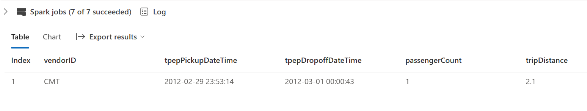

---
lab:
    title: 'Ingest data with Spark and Microsoft Fabric notebooks'
    module: 'Ingest data with Spark and Microsoft Fabric notebooks'
---

# Ingest data with Spark and Microsoft Fabric notebooks

In this lab, you'll create a Microsoft Fabric notebook and use PySpark to connect to an Azure Blob Storage path, then load the data into a lakehouse using write optimizations.

This lab will take approximately **30** minutes to complete.

For this experience, you'll build the code across multiple notebook code cells, which may not reflect how you will do it in your environment; however, it can be useful for debugging.

Because you're also working with a sample dataset, the optimization doesn't reflect what you may see in production at scale; however, you can still see improvement and when every millisecond counts, optimization is key.

> **Note**: You need a [Microsoft Fabric trial](https://learn.microsoft.com/fabric/get-started/fabric-trial) to complete this exercise.

## Create a workspace

Before working with data in Fabric, create a workspace with the Fabric trial enabled.

1. On the [Microsoft Fabric home page](https://app.fabric.microsoft.com), select **Synapse Data Engineering**.
1. In the menu bar on the left, select **Workspaces** (the icon looks similar to &#128455;).
1. Create a new workspace with a name of your choice, selecting a licensing mode that includes Fabric capacity (*Trial*, *Premium*, or *Fabric*).
1. When your new workspace opens, it should be empty.

    

## Create workspace and lakehouse destination

Start by creating a new lakehouse, and a destination folder in the lakehouse.

1. From your workspace, select **+ New > Lakehouse**, supply a name, and **Create**.

    > **Note:** It may take a few minutes to create a new lakehouse with no **Tables** or **Files**.

    

1. From **Files**, select the **[...]** to create **New subfolder** named **RawData**.

1. From the Lakehouse Explorer within the lakehouse, select **RawData > ... > Properties**.

1. Copy the **ABFS path** for the **RawData** folder to an empty notepad for later use, which should look something like:
    `abfss://{workspace_name}@onelake.dfs.fabric.microsoft.com/{lakehouse_name}.Lakehouse/Files/{folder_name}/{file_name}`

You should now have a workspace with a lakehouse and a RawData destination folder.

## Create a Fabric notebook and load external data

Create a new Fabric notebook and connect to external data source with PySpark.

1. From the top menu in the lakehouse, select **Open notebook > New notebook**, which will open once created.

    >  **Tip:** You have access to the Lakehouse explorer from within this notebook, and can refresh to see progress as you complete this exercise.

1. In the default cell, notice that the code is set to **PySpark (Python)**.

1. Insert the following code into the code cell, which will:
    - Declare parameters for connection string
    - Build the connection string
    - Read data into a DataFrame

    ```Python
    # Azure Blob Storage access info
    blob_account_name = "azureopendatastorage"
    blob_container_name = "nyctlc"
    blob_relative_path = "yellow"
    
    # Construct connection path
    wasbs_path = f'wasbs://{blob_container_name}@{blob_account_name}.blob.core.windows.net/{blob_relative_path}'
    print(wasbs_path)
    
    # Read parquet data from Azure Blob Storage path
    blob_df = spark.read.parquet(wasbs_path)
    ```

1. Select **&#9655; Run Cell** next to the code cell to connect and read data into a DataFrame.

    **Expected outcome:** Your command should succeed and print `wasbs://nyctlc@azureopendatastorage.blob.core.windows.net/yellow`

    > **Note:** A Spark session starts on the first code run, so it may take longer to complete.

1. To write the data to a file, you now need that **ABFS Path** for your **RawData** folder.

1. Insert the following code into a **new code cell**:

    ```python
        # Declare file name    
        file_name = "yellow_taxi"
    
        # Construct destination path
        output_parquet_path = f"**InsertABFSPathHere**/{file_name}"
        print(output_parquet_path)
        
        # Load the first 1000 rows as a Parquet file
        blob_df.limit(1000).write.mode("overwrite").parquet(output_parquet_path)
    ```

1. Add your **RawData** ABFS path and select **&#9655; Run Cell** to write 1000 rows to a yellow_taxi.parquet file.

1. Your **output_parquet_path** should look similar to:
    `abfss://Spark@onelake.dfs.fabric.microsoft.com/DPDemo.Lakehouse/Files/RawData/yellow_taxi`

1. To confirm data load from the Lakehouse Explorer, select **Files > ... > Refresh**.

You should now see your new folder **RawData** with a **yellow_taxi.parquet** "file" - *which shows as a folder with partition files within*.

## Transform and load data to a Delta table

Likely, your data ingestion task doesn't end with only loading a file. Delta tables in a lakehouse allows scalable, flexible querying and storage, so we'll create one as well.

1. Create a new code cell, and insert the following code:

    ```python
    from pyspark.sql.functions import col, to_timestamp, current_timestamp, year, month
    
    # Read the parquet data from the specified path
    raw_df = spark.read.parquet(output_parquet_path)   
    
    # Add dataload_datetime column with current timestamp
    filtered_df = raw_df.withColumn("dataload_datetime", current_timestamp())
    
    # Filter columns to exclude any NULL values in storeAndFwdFlag
    filtered_df = filtered_df.filter(raw_df["storeAndFwdFlag"].isNotNull())
    
    # Load the filtered data into a Delta table
    table_name = "yellow_taxi"
    filtered_df.write.format("delta").mode("append").saveAsTable(table_name)
    
    # Display results
    display(filtered_df.limit(1))
    ```

1. Select **&#9655; Run Cell** next to the code cell.

    - This will add a timestamp column **dataload_datetime** to log when the data was loaded to a Delta table
    - Filter NULL values in **storeAndFwdFlag**
    - Load filtered data into a Delta table
    - Display a single row for validation

1. Review and confirm the displayed results, something similar to the following image:

    

You've now successfully connected to external data, written it to a parquet file, loaded the data into a DataFrame, transformed the data, and loaded it to a Delta table.

## Analyze Delta table data with SQL queries

This lab is focused on data ingestion, which really explains the *extract, transform, load* process, but it's valuable for you to preview the data too.

1. Create a new code cell, and insert the code below:

    ```python
    # Load table into df
    delta_table_name = "yellow_taxi"
    table_df = spark.read.format("delta").table(delta_table_name)
    
    # Create temp SQL table
    table_df.createOrReplaceTempView("yellow_taxi_temp")
    
    # SQL Query
    table_df = spark.sql('SELECT * FROM yellow_taxi_temp')
    
    # Display 10 results
    display(table_df.limit(10))
    ```

1. Select **&#9655; Run Cell** next to the code cell.

     Many data analysts are comfortable working with SQL syntax. Spark SQL is a SQL language API in Spark that you can use to run SQL statements, or even persist data in relational tables.

   The code you just ran creates a relational *view* of the data in a dataframe, and then uses the **spark.sql** library to embed Spark SQL syntax within your Python code and query the view and return the results as a dataframe.

## Clean up resources

In this exercise, you have used notebooks with PySpark in Fabric to load data and save it to Parquet. You then used that Parquet file to further transform the data. Finally you used SQL to query the Delta tables.

When you're finished exploring, you can delete the workspace you created for this exercise.

1. In the bar on the left, select the icon for your workspace to view all of the items it contains.
2. In the **...** menu on the toolbar, select **Workspace settings**.
3. In the **General** section, select **Remove this workspace**.
