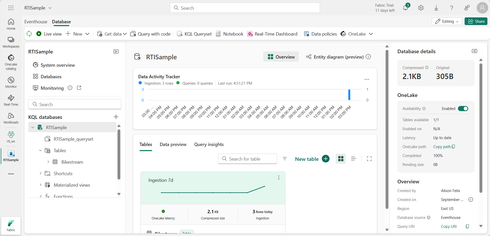

---
lab:
    title: 'Work with data in a Microsoft Fabric eventhouse'
    module: 'Work with data in a Microsoft Fabric eventhouse'
---

# Work with data in a Microsoft Fabric eventhouse

In Microsoft Fabric, an *eventhouse* is used to store real-time data related to events; often captured from a streaming data source by an *eventstream*.

Within an eventhouse, the data is stored in one or more KQL databases, each of which contains tables and other objects that you can query by using Kusto Query Language (KQL) or a subset of Structured Query Language (SQL).

In this exercise, you'll create and populate an eventhouse with some sample data related to taxi rides, and then query the data using KQL and SQL.

This exercise takes approximately **25** minutes to complete.

## Create a workspace

Before working with data in Fabric, create a workspace with the Fabric capacity enabled.

1. In the menu bar on the left, select **Workspaces** (the icon looks similar to &#128455;).
1. Create a new workspace with a name of your choice, selecting a licensing mode that includes Fabric capacity (*Trial*, *Premium*, or *Fabric*).
1. When your new workspace opens, it should be empty.

    

## Create an Eventhouse

Now that you have a workspace with support for a Fabric capacity, you can create an eventhouse in it.

1. In the menu bar on the left, select **Workloads**. Then, select the **Real-Time Intelligence** tile.
1. On the **Real-Time Intelligence** home page, in the *Explore Real-Time Intelligence Sample* tile, select **Open**. It will automatically create an eventhouse called **RTISample**:

   

1. In the pane on the left, note that your eventhouse contains a KQL database with the same name as the eventhouse.
1. Verify that a **Bikestream** table has also been created.

## Query data by using KQL

Kusto Query Language (KQL) is an intuitive, comprehensive language that you can use to query a KQL database.

### Retrieve data from a table with KQL

1. In the left pane of the eventhouse window, under your KQL database, select the default **queryset** file. This file contains some sample KQL queries to get you started.
1. Modify the first example query as follows.

    ```kql
    Bikestream
    | take 100
    ```

    > **NOTE:**
    > The Pipe ( | ) character is used for two purposes in KQL including to separate query operators in a tabular expression statement. It is also used as a logical OR operator within square or round brackets to denote that you may specify one of the items separated by the pipe character.

1. Select the query code and run it to return 100 rows from the table.

   

    You can be more precise by adding specific attributes you want to query using the `project` keyword and then using the `take` keyword to tell the engine how many records to return.

1. Type, select, and run the following query:

    ```kql
    // Use 'project' and 'take' to view a sample number of records in the table and check the data.
    Bikestream
    | project Street, No_Bikes
    | take 10
    ```

    > **NOTE:** The use of // denotes a comment.

    Another common practice in the analysis is renaming columns in our queryset to make them more user-friendly.

1. Try the following query:

    ```kql
    Bikestream 
    | project Street, ["Number of Empty Docks"] = No_Empty_Docks
    | take 10
    ```

### Summarize data by using KQL

You can use the *summarize* keyword with a function to aggregate and otherwise manipulate data.

1. Try the following query, which uses the **sum** function to summarize the rental data to see how many bikes are available in total:

    ```kql

    Bikestream
    | summarize ["Total Number of Bikes"] = sum(No_Bikes)
    ```

    You can group the summarized data by a specified column or expression.

1. Run the following query to group the number of bikes by neighbourhood to determine the amount of available bikes in each neighbourhood:

    ```kql
    Bikestream
    | summarize ["Total Number of Bikes"] = sum(No_Bikes) by Neighbourhood
    | project Neighbourhood, ["Total Number of Bikes"]
    ```

    If any of the bike points has a null or empty entry for neighbourhood, the results of summarization will include a blank value, which is never good for analysis.

1. Modify the query as shown here to use the *case* function along with the *isempty* and *isnull* functions to group all trips for which the neighbourhood is unknown into a ***Unidentified*** category for follow-up.

    ```kql
    Bikestream
    | summarize ["Total Number of Bikes"] = sum(No_Bikes) by Neighbourhood
    | project Neighbourhood = case(isempty(Neighbourhood) or isnull(Neighbourhood), "Unidentified", Neighbourhood), ["Total Number of Bikes"]
    ```

    >**Note**: As this sample dataset is well-maintained, you might not have an Unidentified field in the query result.

### Sort data by using KQL

To make more sense of our data, we typically order it by a column, and this process is done in KQL with either a *sort by* or *order by* operator (they act the same way).

1. Try the following query:

    ```kql
    Bikestream
    | summarize ["Total Number of Bikes"] = sum(No_Bikes) by Neighbourhood
    | project Neighbourhood = case(isempty(Neighbourhood) or isnull(Neighbourhood), "Unidentified", Neighbourhood), ["Total Number of Bikes"]
    | sort by Neighbourhood asc
    ```

1. Modify the query as follows and run it again, and note that the *order by* operator works the same way as *sort by*:

    ```kql
    Bikestream
    | summarize ["Total Number of Bikes"] = sum(No_Bikes) by Neighbourhood
    | project Neighbourhood = case(isempty(Neighbourhood) or isnull(Neighbourhood), "Unidentified", Neighbourhood), ["Total Number of Bikes"]
    | order by Neighbourhood asc
    ```

### Filter data by using KQL

In KQL, the *where* clause is used to filter data. You can combine conditions in a *where* clause by using *and* and *or* logical operators.

1. Run the following query to filter the bike data to include only bike points in the Chelsea neighbourhood:

    ```kql
    Bikestream
    | where Neighbourhood == "Chelsea"
    | summarize ["Total Number of Bikes"] = sum(No_Bikes) by Neighbourhood
    | project Neighbourhood = case(isempty(Neighbourhood) or isnull(Neighbourhood), "Unidentified", Neighbourhood), ["Total Number of Bikes"]
    | sort by Neighbourhood asc
    ```

## Query data by using Transact-SQL

KQL Database doesn't support Transact-SQL natively, but it provides a T-SQL endpoint that emulates Microsoft SQL Server and allows you to run T-SQL queries on your data. The T-SQL endpoint has some limitations and differences from the native SQL Server. For example, it doesn't support creating, altering, or dropping tables, or inserting, updating, or deleting data. It also doesn't support some T-SQL functions and syntax that aren't compatible with KQL. It was created to allow systems that didn't support KQL to use T-SQL to query the data within a KQL Database. So, it's recommended to use KQL as the primary query language for KQL Database, as it offers more capabilities and performance than T-SQL. You can also use some SQL functions that are supported by KQL, such as count, sum, avg, min, max, and so on.

### Retrieve data from a table by using Transact-SQL

1. In your queryset, add and run the following Transact-SQL query: 

    ```sql
    SELECT TOP 100 * from Bikestream
    ```

1. Modify the query as follows to retrieve specific columns

    ```sql
    SELECT TOP 10 Street, No_Bikes
    FROM Bikestream
    ```

1. Modify the query to assign an alias that renames **No_Empty_Docks** to a more user-friendly name.

    ```sql
    SELECT TOP 10 Street, No_Empty_Docks as [Number of Empty Docks]
    from Bikestream
    ```

### Summarize data by using Transact-SQL

1. Run the following query to find the total number of bikes available:

    ```sql
    SELECT sum(No_Bikes) AS [Total Number of Bikes]
    FROM Bikestream
    ```

1. Modify the query to group the total number of bikes by neighbourhood:

    ```sql
    SELECT Neighbourhood, Sum(No_Bikes) AS [Total Number of Bikes]
    FROM Bikestream
    GROUP BY Neighbourhood
    ```

1. Modify the query further to use a *CASE* statement to group bike points with an unknown origin into a ***Unidentified*** category for follow-up. 

    ```sql
    SELECT CASE
             WHEN Neighbourhood IS NULL OR Neighbourhood = '' THEN 'Unidentified'
             ELSE Neighbourhood
           END AS Neighbourhood,
           SUM(No_Bikes) AS [Total Number of Bikes]
    FROM Bikestream
    GROUP BY CASE
               WHEN Neighbourhood IS NULL OR Neighbourhood = '' THEN 'Unidentified'
               ELSE Neighbourhood
             END;
    ```

### Sort data by using Transact-SQL

1. Run the following query to order the grouped results by neighbourhood:
 
    ```sql
    SELECT CASE
             WHEN Neighbourhood IS NULL OR Neighbourhood = '' THEN 'Unidentified'
             ELSE Neighbourhood
           END AS Neighbourhood,
           SUM(No_Bikes) AS [Total Number of Bikes]
    FROM Bikestream
    GROUP BY CASE
               WHEN Neighbourhood IS NULL OR Neighbourhood = '' THEN 'Unidentified'
               ELSE Neighbourhood
             END;
    ORDER BY Neighbourhood ASC;
    ```

### Filter data by using Transact-SQL
    
1. Run the following query to filter the grouped data so that only rows having a neighbourhood of "Chelsea" are included in the results

    ```sql
    SELECT CASE
             WHEN Neighbourhood IS NULL OR Neighbourhood = '' THEN 'Unidentified'
             ELSE Neighbourhood
           END AS Neighbourhood,
           SUM(No_Bikes) AS [Total Number of Bikes]
    FROM Bikestream
    GROUP BY CASE
               WHEN Neighbourhood IS NULL OR Neighbourhood = '' THEN 'Unidentified'
               ELSE Neighbourhood
             END;
    HAVING Neighbourhood = 'Chelsea'
    ORDER BY Neibourhood ASC;
    ```

## Clean up resources

In this exercise, you have created an eventhouse and queried data using KQL and SQL.

When you've finished exploring your KQL database, you can delete the workspace you created for this exercise.

1. In the bar on the left, select the icon for your workspace.
2. In the toolbar, select **Workspace settings**.
3. In the **General** section, select **Remove this workspace**.
