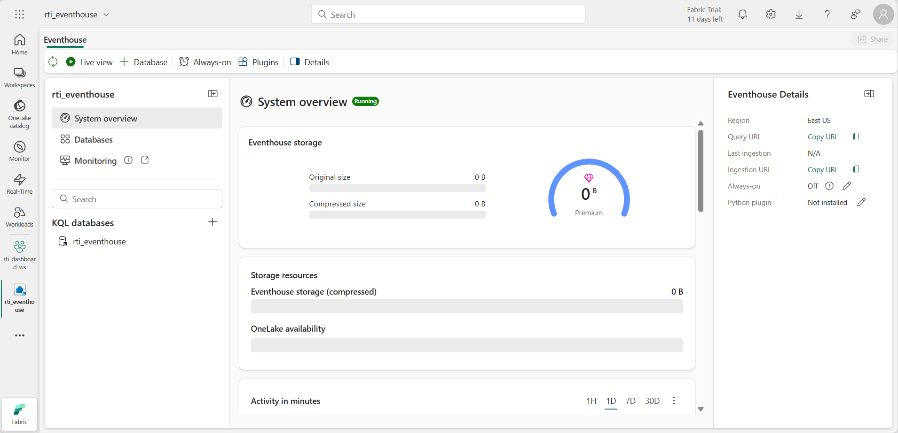
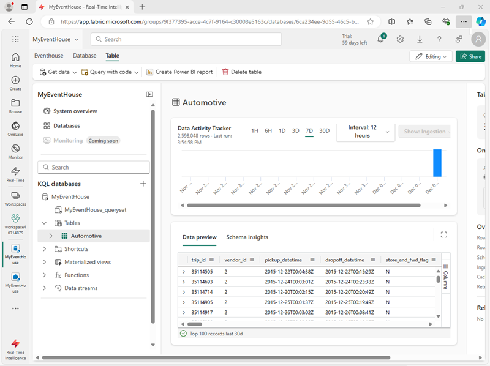
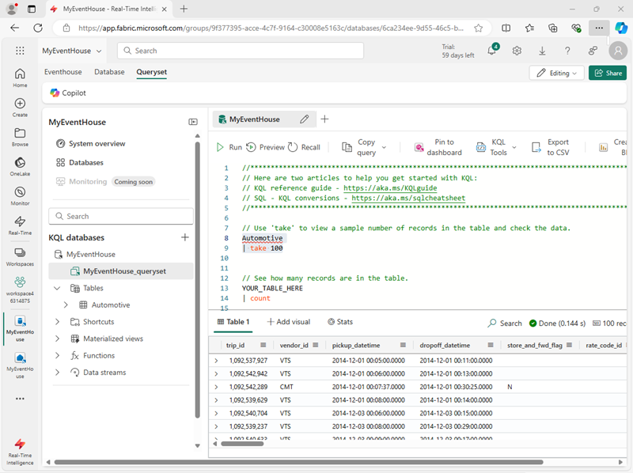

---
lab:
    title: 'Work with data in a Microsoft Fabric eventhouse'
    module: 'Work with data in a Microsoft Fabric eventhouse'
---

# Work with data in a Microsoft Fabric eventhouse

In Microsoft Fabric, an *eventhouse* is used to store real-time data related to events; often captured from a streaming data source by an *eventstream*.

Within an eventhouse, the data is stored in one or more KQL databases, each of which contains tables and other objects that you can query by using Kusto Query Language (KQL) or a subset of Structured Query Language (SQL).

In this exercise, you'll create and populate an eventhouse with some sample data related to taxi rides, and then query the data using KQL and SQL.

This exercise takes approximately **25** minutes to complete.

## Create a workspace

Before working with data in Fabric, create a workspace with the Fabric capacity enabled.

1. On the [Microsoft Fabric home page](https://app.fabric.microsoft.com/home?experience=fabric) at `https://app.fabric.microsoft.com/home?experience=fabric`, select **Real-Time Intelligence**.
1. In the menu bar on the left, select **Workspaces** (the icon looks similar to &#128455;).
1. Create a new workspace with a name of your choice, selecting a licensing mode that includes Fabric capacity (*Trial*, *Premium*, or *Fabric*).
1. When your new workspace opens, it should be empty.

    

## Create an Eventhouse

Now that you have a workspace with support for a Fabric capacity, you can create an eventhouse in it.

1. On the **Real-Time Intelligence** home page, create a new **Eventhouse** with a name of your choice. When the eventhouse has been created, close any prompts or tips that are displayed until you see the eventhouse page:

   

1. In the pane on the left, note that your eventhouse contains a KQL database with the same name as the eventhouse.
1. Select the KQL database to view it.

    Currently there are no tables in the database. In the rest of this exercise you'll use an eventstream to load data from a real-time source into a table.
   
1. In the page for the KQL database, select **Get data** > **Sample**. Then choose the **Automotive operations analytics** sample data.

1. After the data is finished loading (which may take some time), verify that an **Automotive** table has been created.

   

## Query data by using KQL

Kusto Query Language (KQL) is an intuitive, comprehensive language that you can use to query a KQL database.

### Retrieve data from a table with KQL

1. In the left pane of the eventhouse window, under your KQL database, select the default **queryset** file. This file contains some sample KQL queries to get you started.
1. Modify the first example query as follows.

    ```kql
    Automotive
    | take 100
    ```

    > **NOTE:**
    > The Pipe ( | ) character is used for two purposes in KQL including to separate query operators in a tabular expression statement. It is also used as a logical OR operator within square or round brackets to denote that you may specify one of the items separated by the pipe character.

1. Select the query code and run it to return 100 rows from the table.

   

    You can be more precise by adding specific attributes you want to query using the `project` keyword and then using the `take` keyword to tell the engine how many records to return.

1. Type, select, and run the following query:

    ```kql
    // Use 'project' and 'take' to view a sample number of records in the table and check the data.
    Automotive 
    | project vendor_id, trip_distance
    | take 10
    ```

    > **NOTE:** The use of // denotes a comment.

    Another common practice in the analysis is renaming columns in our queryset to make them more user-friendly.

1. Try the following query:

    ```kql
    Automotive 
    | project vendor_id, ["Trip Distance"] = trip_distance
    | take 10
    ```

### Summarize data by using KQL

You can use the *summarize* keyword with a function to aggregate and otherwise manipulate data.

1. Try the following query, which uses the **sum** function to summarize the trip data to see how many miles were traveled in total:

    ```kql

    Automotive
    | summarize ["Total Trip Distance"] = sum(trip_distance)
    ```

    You can group the summarized data by a specified column or expression.

1. TRun the following query to group the trip distances by borough within the NY Taxi system to determine the total distance traveled from each borough.

    ```kql
    Automotive
    | summarize ["Total Trip Distance"] = sum(trip_distance) by pickup_boroname
    | project Borough = pickup_boroname, ["Total Trip Distance"]
    ```

    The results include a blank value, which is never good for analysis.

1. Modify the query as shown here to use the *case* function along with the *isempty* and *isnull* functions to group all trips for which the borough is unknown into a ***Unidentified*** category for follow-up.

    ```kql
    Automotive
    | summarize ["Total Trip Distance"] = sum(trip_distance) by pickup_boroname
    | project Borough = case(isempty(pickup_boroname) or isnull(pickup_boroname), "Unidentified", pickup_boroname), ["Total Trip Distance"]
    ```

### Sort data by using KQL

To make more sense of our data, we typically order it by a column, and this process is done in KQL with either a *sort by* or *order by* operator (they act the same way).

1. Try the following query:

    ```kql
    Automotive
    | summarize ["Total Trip Distance"] = sum(trip_distance) by pickup_boroname
    | project Borough = case(isempty(pickup_boroname) or isnull(pickup_boroname), "Unidentified", pickup_boroname), ["Total Trip Distance"]
    | sort by Borough asc
    ```

1. Modify the query as follows and run it again, and note that the *order by* operator works the same way as *sort by*:

    ```kql
    Automotive
    | summarize ["Total Trip Distance"] = sum(trip_distance) by pickup_boroname
    | project Borough = case(isempty(pickup_boroname) or isnull(pickup_boroname), "Unidentified", pickup_boroname), ["Total Trip Distance"]
    | order by Borough asc 
    ```

### Filter data by using KQL

In KQL, the *where* clause is used to filter data. You can combine conditions in a *where* clause by using *and* and *or* logical operators.

1. Run the following query to filter the trip data to include only trips that originated in Manhatten:

    ```kql
    Automotive
    | where pickup_boroname == "Manhattan"
    | summarize ["Total Trip Distance"] = sum(trip_distance) by pickup_boroname
    | project Borough = case(isempty(pickup_boroname) or isnull(pickup_boroname), "Unidentified", pickup_boroname), ["Total Trip Distance"]
    | sort by Borough asc
    ```

## Query data by using Transact-SQL

KQL Database doesn't support Transact-SQL natively, but it provides a T-SQL endpoint that emulates Microsoft SQL Server and allows you to run T-SQL queries on your data. The T-SQL endpoint has some limitations and differences from the native SQL Server. For example, it doesn't support creating, altering, or dropping tables, or inserting, updating, or deleting data. It also doesn't support some T-SQL functions and syntax that aren't compatible with KQL. It was created to allow systems that didn't support KQL to use T-SQL to query the data within a KQL Database. So, it's recommended to use KQL as the primary query language for KQL Database, as it offers more capabilities and performance than T-SQL. You can also use some SQL functions that are supported by KQL, such as count, sum, avg, min, max, and so on.

### Retrieve data from a table by using Transact-SQL

1. In your queryset, add and run the following Transact-SQL query: 

    ```sql
    SELECT TOP 100 * from Automotive
    ```

1. Modify the query as follows to retrieve specific columns

    ```sql
    SELECT TOP 10 vendor_id, trip_distance
    FROM Automotive
    ```

1. Modify the query to assign an alias that renames **trip_distance** to a more user-friendly name.

    ```sql
    SELECT TOP 10 vendor_id, trip_distance as [Trip Distance]
    from Automotive
    ```

### Summarize data by using Transact-SQL

1. Run the following query to find the total distance travelled:

    ```sql
    SELECT sum(trip_distance) AS [Total Trip Distance]
    FROM Automotive
    ```

1. Modify the query to group the total distance by pickup borough:

    ```sql
    SELECT pickup_boroname AS Borough, Sum(trip_distance) AS [Total Trip Distance]
    FROM Automotive
    GROUP BY pickup_boroname
    ```

1. Modify the query further to use a *CASE* statement to group trips with an unknown origin into a ***Unidentified*** category for follow-up. 

    ```sql
    SELECT CASE
             WHEN pickup_boroname IS NULL OR pickup_boroname = '' THEN 'Unidentified'
             ELSE pickup_boroname
           END AS Borough,
           SUM(trip_distance) AS [Total Trip Distance]
    FROM Automotive
    GROUP BY CASE
               WHEN pickup_boroname IS NULL OR pickup_boroname = '' THEN 'Unidentified'
               ELSE pickup_boroname
             END;
    ```

### Sort data by using Transact-SQL

1. Run the following query to order the grouped results by borough
 
    ```sql
    SELECT CASE
             WHEN pickup_boroname IS NULL OR pickup_boroname = '' THEN 'unidentified'
             ELSE pickup_boroname
           END AS Borough,
           SUM(trip_distance) AS [Total Trip Distance]
    FROM Automotive
    GROUP BY CASE
               WHEN pickup_boroname IS NULL OR pickup_boroname = '' THEN 'unidentified'
               ELSE pickup_boroname
             END
    ORDER BY Borough ASC;
    ```

### Filter data by using Transact-SQL
    
1. Run the following query to filter the grouped data so that only rows having a borough of "Manhattan" are included in the results

    ```sql
    SELECT CASE
             WHEN pickup_boroname IS NULL OR pickup_boroname = '' THEN 'unidentified'
             ELSE pickup_boroname
           END AS Borough,
           SUM(trip_distance) AS [Total Trip Distance]
    FROM Automotive
    GROUP BY CASE
               WHEN pickup_boroname IS NULL OR pickup_boroname = '' THEN 'unidentified'
               ELSE pickup_boroname
             END
    HAVING Borough = 'Manhattan'
    ORDER BY Borough ASC;
    ```

## Clean up resources

In this exercise, you have created an eventhouse and queried data using KQL and SQL.

When you've finished exploring your KQL database, you can delete the workspace you created for this exercise.

1. In the bar on the left, select the icon for your workspace.
2. In the toolbar, select **Workspace settings**.
3. In the **General** section, select **Remove this workspace**.
