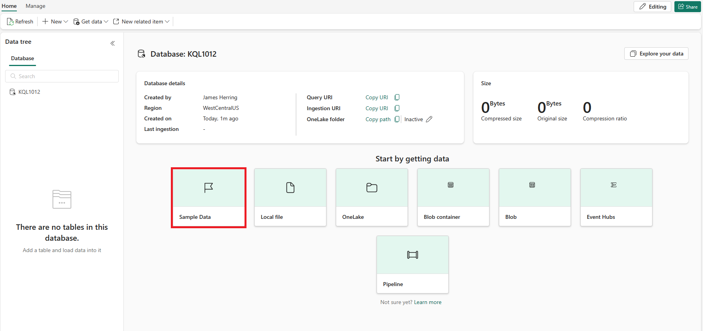
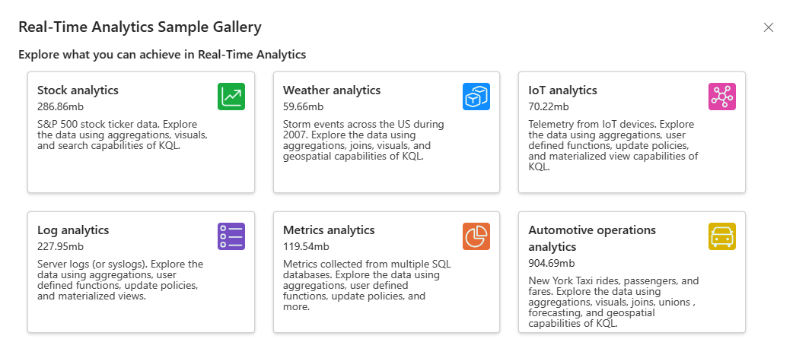
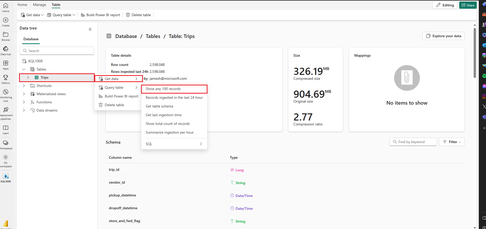
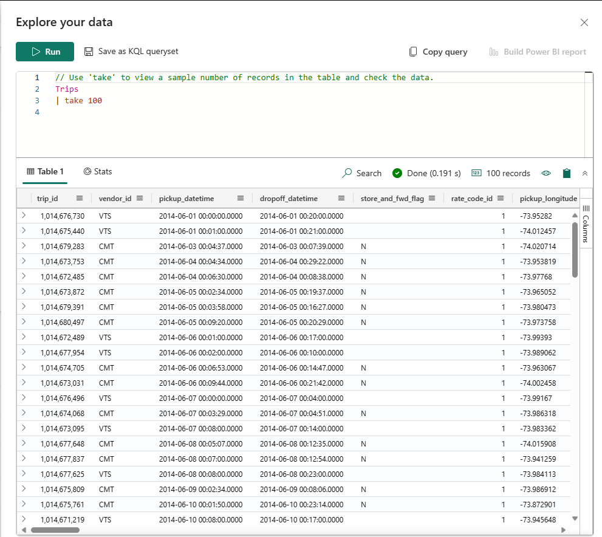
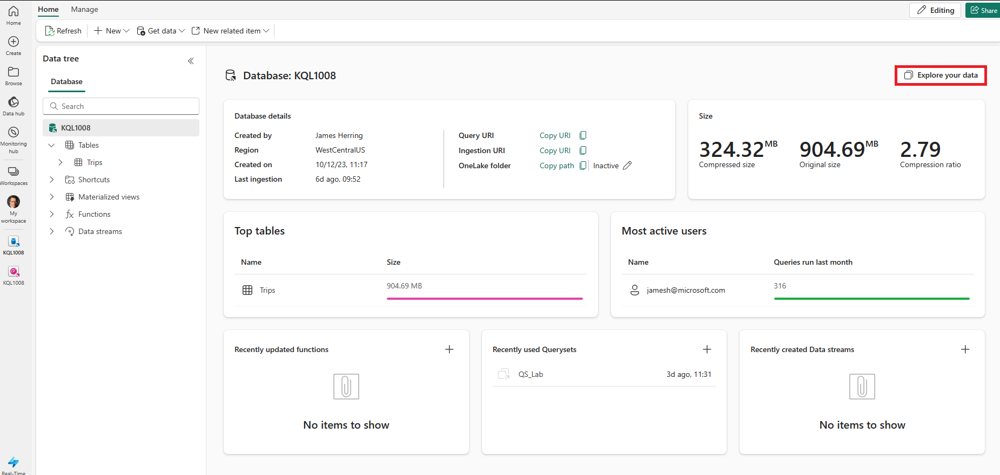

---
lab:
    title: 'Query data in KQL Database'
    module: 'Query data from a Kusto Query database in Microsoft Fabric'
---

# Get started with querying a Kusto database in Microsoft Fabric

A KQL Queryset is a tool that allows you to execute queries, modify, and display query results from a KQL database. You can link each tab in the KQL Queryset to a different KQL database, and save your queries for future use or share them with others for data analysis. You can also switch the KQL database for any tab, so you can compare the query results from different data sources.

The KQL Queryset uses the Kusto Query language, which is compatible with many SQL functions, to create queries. To learn more about the [kusto query (KQL)language](https://learn.microsoft.com/en-us/azure/data-explorer/kusto/query/?context=%2Ffabric%2Fcontext%2Fcontext).

This lab takes approximately **25** minutes to complete.

## Scenario

In this scenario, you're an analyst that's tasked with querying a sample dataset of raw metrics NYC taxicab rides that you pull summary statistics (profiling) the data from the Fabric environment. You use KQLto query this data and gather information in order to gain informational insights about the data.

> **Note**: You need a Microsoft *school* or *work* account to complete this exercise. If you don't have one, you can [sign up for a trial of Microsoft Office 365 E3 or higher](https://www.microsoft.com/microsoft-365/business/compare-more-office-365-for-business-plans).

## Activate a Microsoft Fabric trial

1. After signing up for a Microsoft Fabric account, navigate to the Microsoft Fabric portal at [https://app.fabric.microsoft.com](https://app.fabric.microsoft.com).
1. Select the **Account Manager** icon (the *user* image at the top right)
1. In the account manager menu, select **Start trial** to start a Microsoft Fabric trial.
1. After successfully upgrading to Microsoft Fabric, navigate to the home page by selecting **Fabric Home Page**.

## Create a workspace

Before working with data in Fabric, create a workspace with the Fabric trial enabled.

1. On the [Microsoft Fabric home page](https://app.fabric.microsoft.com), select **Real-Time Analytics**.
1. In the menu bar on the left, select **Workspaces** (the icon looks similar to &#128455;).
1. Create a new workspace with a name of your choice, selecting a licensing mode that includes Fabric capacity (*Trial*, *Premium*, or *Fabric*).
1. When your new workspace opens, it should be empty.

    

In this lab, you use the Real-Time Analytics (RTA) in Fabric to create a KQL database from a sample eventstream. Real-Time Analytics conveniently provides a sample dataset that you can use to explore RTA's capabilities. You use this sample data to create KQL | SQL queries and querysets that analyzes real-time data and allow for other uses in downstream processes.

## Create a KQL Database

1. Within the **Real-Time Analytics**, select the **KQL Database** box.

   

2. You're prompted to **Name** the KQL Database

   

3. Give the KQL Database a name that you remember, such as **MyStockData**, press **Create**.

4. In the **Database details** panel, select the pencil icon to turn on availability in OneLake.

   

   Then use the slider to turn on the availability.

   

5. Select **sample data** box from the options of ***Start by getting data***.

   

   Then choose the **Automotive operations analytics** box from the options for sample data.

   

6. Once the data is finished loading, we can verify the KQL Database is populated.

   

7. Once the data is loaded, verify the data is loaded into the KQL database. You can accomplish this operation by selecting the ellipses to the right of the table, navigating to **Query table** and selecting **Show any 100 records**.

    

   > **NOTE**: The first time you run this, it can take several seconds to allocate compute resources.

    

## Introduction to Kusto Query Language (KQL) and its syntax

Kusto Query Language (KQL) is a query language used to analyze data in Microsoft Azure Data Explorer, which is a part of the Azure Fabric. KQL is designed to be simple and intuitive, making it easy for beginners to learn and use. At the same time, it's also highly flexible and customizable, allowing advanced users to perform complex queries and analysis.

KQL is based on a syntax similar to SQL, but with some key differences. For example, KQL uses a pipe operator (|) instead of a semicolon (;) to separate commands, and it uses a different set of functions and operators for filtering and manipulating data.

One of the key features of KQL is its ability to handle large volumes of data quickly and efficiently. This capability makes it ideal for analyzing logs, telemetry data, and other types of big data. KQL also supports a wide range of data sources, including structured and unstructured data, making it a versatile tool for data analysis.

In the context of Microsoft Fabric, KQL can be used to query and analyze data from various sources, such as application logs, performance metrics, and system events. This can help you gain insights into the health and performance of your applications and infrastructure, and identify issues and opportunities for optimization.

Overall, KQL is a powerful and flexible query language that can help you gain insights into your data quickly and easily, whether you're working with Microsoft Fabric or other data sources. With its intuitive syntax and powerful capabilities, KQL is definitely worth exploring further.

In this module, we focus on the basics of queries against a KQL Database using KQL first and then T-SQL. We'll focus on the basis elements of T-SQL syntax that are used for queries inlcuding:

**SELECT** queries, which are used to retrieve data from one or more tables. For example, you can use a SELECT query to get the names and salaries of all employees in a company.

**WHERE** queries, which are used to filter the data based on certain conditions. For example, you can use a WHERE query to get the names of employees who work in a specific department or who have a salary above a certain amount.

**GROUP BY** queries, which are used to group the data by one or more columns and perform aggregate functions on them. For example, you can use a GROUP BY query to get the average salary of employees by department or by country.

**ORDER BY** queries, which are used to sort the data by one or more columns in ascending or descending order. For example, you can use an ORDER BY query to get the names of employees sorted by their salaries or by their last names.

   > **WARNING:** You cannot create Power BI Reports from querysets with **T-SQL** because Power BI does not support T-SQL as a data source. **Power BI only supports KQL as the native query language for querysets**. If you want to use T-SQL to query your data in Microsoft Fabric, you need to use the T-SQL endpoint that emulates Microsoft SQL Server and allows you to run T-SQL queries on your data. However, the T-SQL endpoint has some limitations and differences from the native SQL Server, and it does not support creating or publishing reports to Power BI.

> **NOTE**: Besides the approach to pull up a query window within shown earlier, you can always press the **Explore your data** button in the main KQL Database panel..

   

## ```SELECT``` data from our sample dataset using KQL

1. In this query, we pull 100 records from the Trips table. We use the ```take``` keyword to ask the engine to return 100 records.

    ```kusto
    
    Trips
    | take 100
    ```

    > **NOTE:**
    > The Pipe ```|``` character is used for two purposes in KQL includuing to separate query operators in a tabular expression statement. It is also used as a logical OR operator within square or round brackets to denote that you may specify one of the items separated by the pipe character.

1. We can be more precise by adding specific attributes we would like to query using the ```project``` keyword and then using the ```take``` keyword to tell the engine how many records to return.

    > **NOTE:** the use of ```//``` denotes comments used within the Microsoft Fabric ***Explore your data*** query tool.

    ```kusto
    
    // Use 'project' and 'take' to view a sample number of records in the table and check the data.
    Trips 
    | project vendor_id, trip_distance
    | take 10
    ```

1. Another common practice in analysis is renaming columns in our queryset to make them more user friendly. This can be accomplished by using the new column name followed by the equals sign and the column we wish to rename.

    ```kusto
    
    Trips 
    | project vendor_id, ["Trip Distance"] = trip_distance
    | take 10
    ```

1. We may also want to summarize the trips to see how many miles were traveled:

    ```kusto
    
    Trips
    | summarize ["Total Trip Distance"] = sum(trip_distance)
    ```

## ```GROUP BY``` data from our sample dataset using KQL

1. Then we may want to ***group by*** the pickup location that we do with the ```summarize``` operator. We're also able to use the ```project``` operator that allows us to select and rename the columns you want to include in your output. In this case, we group by borough within the NY Taxi system to provide our users with the total distance traveled from each borough.

```kusto

Trips
| summarize ["Total Trip Distance"] = sum(trip_distance) by pickup_boroname
| project Borough = pickup_boroname, ["Total Trip Distance"]
```

2. In this case we have a blank value, which is never good for analysis, and we can use the ```case``` function along with the ```isempty``` and the ```isnull``` functions to categorize into a ***Unidentified*** category for follow-up.

```kusto

Trips
| summarize ["Total Trip Distance"] = sum(trip_distance) by pickup_boroname
| project Borough = case(isempty(pickup_boroname) or isnull(pickup_boroname), "Unidentified", pickup_boroname), ["Total Trip Distance"]
```

## ```ORDER BY``` data from our sample dataset using KQL

To make more sense of our data, we typically order it by a column, and this process is done in KQL with either a ```sort by``` or ```order by``` operator and they act the same way.
 
```kusto

// using the sort by operators
Trips
| summarize ["Total Trip Distance"] = sum(trip_distance) by pickup_boroname
| project Borough = case(isempty(pickup_boroname) or isnull(pickup_boroname), "Unidentified", pickup_boroname), ["Total Trip Distance"]
| sort by Borough asc 

// order by operator has the same result as sort by
Trips
| summarize ["Total Trip Distance"] = sum(trip_distance) by pickup_boroname
| project Borough = case(isempty(pickup_boroname) or isnull(pickup_boroname), "Unidentified", pickup_boroname), ["Total Trip Distance"]
| sort by Borough asc 
```

## ```WHERE``` clause to filter data in our sample KQL Query

Unlike SQL, our WHERE clause is immediately called in our KQL Query. We can still use the ```and``` and the ```or``` logical operators within the where clause and it evaluates to true or false against the table and can be simple or a complex expression that might involve multiple columns, operators, and functions.

```kusto

// let's filter our dataset immediately from the source by applying a filter directly after the table.
Trips
| where pickup_boroname == "Manhattan"
| summarize ["Total Trip Distance"] = sum(trip_distance) by pickup_boroname
| project Borough = case(isempty(pickup_boroname) or isnull(pickup_boroname), "Unidentified", pickup_boroname), ["Total Trip Distance"]
| sort by Borough asc

```

## Use T-SQL to query summary information

KQL Database doesn't support T-SQL natively, but it provides a T-SQL endpoint that emulates Microsoft SQL Server and allows you to run T-SQL queries on your data. However, the T-SQL endpoint has some limitations and differences from the native SQL Server. For example, it doesn't support creating, altering, or dropping tables, or inserting, updating, or deleting data. It also doesn't support some T-SQL functions and syntax that aren't compatible with KQL. It was created to allow systems that didn't support KQL to use T-SQL to query the data within a KQL Database. So, it's recommended to use KQL as the primary query language for KQL Database, as it offers more capabilities and performance than T-SQL. You can also use some SQL functions that are supported by KQL, such as count, sum, avg, min, max, etc. 

## ```SELECT``` data from our sample dataset using T-SQL

1. In this query, we pull the first 100 records from the **Trips** table using the ```TOP``` clause. 

```sql
// We can use the TOP clause to limit the number of records returned

SELECT TOP 100 * from Trips
```

2. If you use the ```//```, which is a comment in the ***Explore your data** tool within the KQL database, you can't highlight it when executing T-SQL queries, rather you should use the standard ```--``` SQL comments notation. this double-hypen will also tell the KQL Engine to expect T-SQL in Azure Data Explorer.

```sql
-- instead of using the 'project' and 'take' keywords we simply use a standard SQL Query
SELECT TOP 10 vendor_id, trip_distance
FROM Trips
```

3. Again, you can see that standard T-SQL features work fine with the query where we rename trip_distance to a more user friendly name.

```sql

-- No need to use the 'project' or 'take' operators as standard T-SQL Works
SELECT TOP 10 vendor_id, trip_distance as [Trip Distance]
from Trips
```

4. We may also want to summarize the trips to see how many miles were traveled:

```sql
Select sum(trip_distance) as [Total Trip Distance]
from Trips
```
 >**NOTE:** The use of the quotations is not necessary in T-SQL compared to the KQL query, also note the `summarize` and `sort by` commands aren't available in T-SQL.

## ```GROUP BY``` data from our sample dataset using T-SQL

1. Then we may want to ***group by*** the pickup location that we do with the ```GROUP BY``` operator. We're also able to use the ```AS``` operator that allows us to select and rename the columns you want to include in your output. In this case, we group by borough within the NY Taxi system to provide our users with the total distance traveled from each borough.

```sql
SELECT pickup_boroname AS Borough, Sum(trip_distance) AS [Total Trip Distance]
FROM Trips
GROUP BY pickup_boroname
```

2. In this case we have a blank value, which is never good for analysis, and we can use the ```CASE``` function along with the ```IS NULL``` function and the ```''``` empty value to categorize into a ***Unidentified*** category for follow-up. 

```sql

SELECT CASE
         WHEN pickup_boroname IS NULL OR pickup_boroname = '' THEN 'Unidentified'
         ELSE pickup_boroname
       END AS Borough,
       SUM(trip_distance) AS [Total Trip Distance]
FROM Trips
GROUP BY CASE
           WHEN pickup_boroname IS NULL OR pickup_boroname = '' THEN 'Unidentified'
           ELSE pickup_boroname
         END;
```

## ```ORDER BY``` data from our sample dataset using T-SQL

1. To make more sense of our data, we typically order it by a column, and this process is done in T-SQL with an ```ORDER BY``` operator. There's no ***SORT BY*** operator in T-SQL
 
```sql
-- Group by pickup_boroname and calculate the summary statistics of trip_distance
SELECT CASE
         WHEN pickup_boroname IS NULL OR pickup_boroname = '' THEN 'unidentified'
         ELSE pickup_boroname
       END AS Borough,
       SUM(trip_distance) AS [Total Trip Distance]
FROM Trips
GROUP BY CASE
           WHEN pickup_boroname IS NULL OR pickup_boroname = '' THEN 'unidentified'
           ELSE pickup_boroname
         END
-- Add an ORDER BY clause to sort by Borough in ascending order
ORDER BY Borough ASC;
```
## ```WHERE``` clause to filter data in our sample T-SQL Query

1. Unlike KQL, our ```WHERE``` clause would go at end of the T-SQL Statement; however, in this case we have a ```GROUP BY``` clause, which requires us to use the ```HAVING``` statement and we use the new name of the column, in this case **Borough** as the column name to filter from.

```sql
-- Group by pickup_boroname and calculate the summary statistics of trip_distance
SELECT CASE
         WHEN pickup_boroname IS NULL OR pickup_boroname = '' THEN 'unidentified'
         ELSE pickup_boroname
       END AS Borough,
       SUM(trip_distance) AS [Total Trip Distance]
FROM Trips
GROUP BY CASE
           WHEN pickup_boroname IS NULL OR pickup_boroname = '' THEN 'unidentified'
           ELSE pickup_boroname
         END
-- Add a having clause due to the GROUP BY statement
HAVING Borough = 'Manhattan'
-- Add an ORDER BY clause to sort by Borough in ascending order
ORDER BY Borough ASC;

```

## Clean up resources

In this exercise, you have created a KQL database and set up a sample dataset for querying. After that you queried the data using KQL and SQL. When you've finished exploring your KQL database, you can delete the workspace you created for this exercise.
1. In the bar on the left, select the **icon** for your workspace.
2. In the ... menu on the toolbar, select **Workspace settings**.
3. In the **Other** section, select **Remove this workspace**.
