---
lab:
    title: 'Real-time dashboards in Microsoft Fabric'
    module: 'Get Started with Real-Time Dashboards in Microsoft Fabric'
---

# Get started with Real-Time Dashboards in Microsoft Fabric

Real-time dashboards allow you to glean insight from within Microsoft Fabric using the Kusto Query Language (KQL) to retrieve both structure and unstructured data and render it in charts, scatterplots, tables, and more within panels that allow for linking similar to slicers within Power BI. 

This lab takes approximately **25** minutes to complete.

> **Note**: You need a [Microsoft Fabric trial.](https://learn.microsoft.com/fabric/get-started/fabric-trial) to complete this exercise.

## Create a workspace

Before working with data in Fabric, create a workspace with the Fabric trial enabled.

1. On the [Microsoft Fabric home page.](https://app.fabric.microsoft.com), select **Real-Time Intelligence**.
1. In the menu bar on the left, select **Workspaces** (the icon looks similar to &#128455;).
1. Create a new workspace with a name of your choice, selecting a licensing mode that includes Fabric capacity (*Trial*, *Premium*, or *Fabric*). Or, you can use an existing workspace to build a Real-Time Dashboard.
1. When your new workspace opens, it should be empty.

    

In this lab, you use the Real-Time Intelligence in Fabric to create a Real-Time Dashboard. Real-Time Intelligence  conveniently provides a sample dataset that you can use to explore Real-Time Intelligences' capabilities. You use this sample data to create KQL | SQL queries and querysets that analyzes real-time data and allow for other uses in downstream processes.

## Create a Real-Time Dashboard

1. Within the **Real-Time Intelligence**, select the **Real-Time Dashboard** box.

   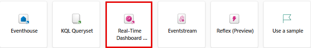

2. You're prompted to **Name** the Real-Time Dashboard.

   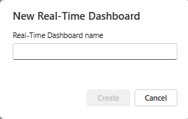

3. Give the Real-Time Dashboard a name that you remember, such as something based on your primary source, press **Create**.

4. In the **Database details** panel, select the pencil icon to turn on availability in OneLake.

   [ 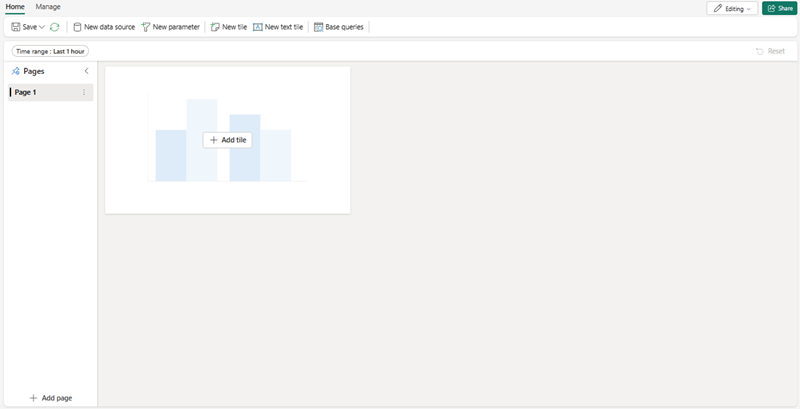](./Images/real-time-dashboard-details-large.png#lightbox)

## Add a data source

Data sources serve as reusable references to specific databases or queries within the same workspace as the Real-Time Dashboard, allowing various tiles to utilize distinct data sources for their data needs.

1. Select the **Manage** tab, then select **New data source** on the ***menu bar***.
1. Select the **+ Add** button in the **Data sources** pane.

    [ 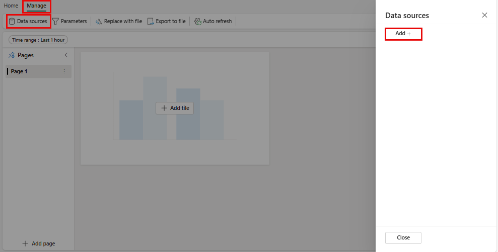 ](./Images/add-data-source-to-real-time-dashboard-large.png#lightbox)

1. choose from one of the two main options of **OneLake data hub** or **Azure Data Explorer**.

    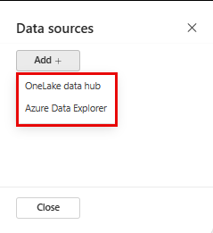

1. Choose the **datasource** that meets your busines needs, then select the **Connect** button.

    [ 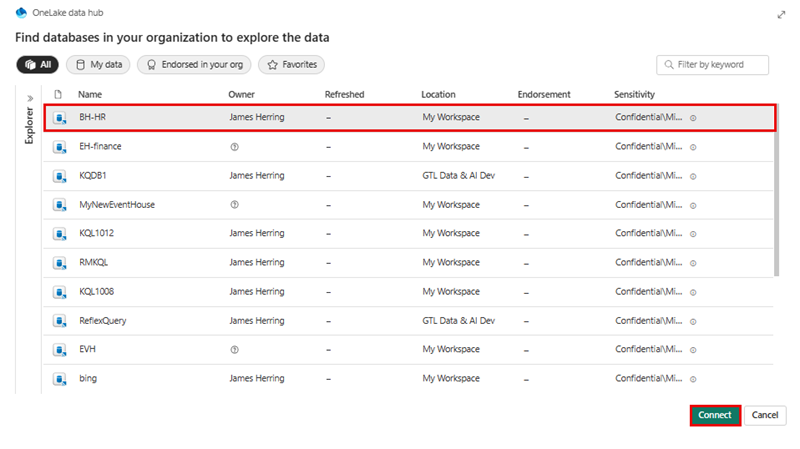 ](./Images/select-onelake-data-hub-large.png#lightbox)

    > **Note**
    > Once you connect to a datasource, you will have the ability to confirm, and create additional datasrouces within the selected location.

1. Confirm your **datasource** connection in the **Create new data source** pane, and select **Create**.

    [ 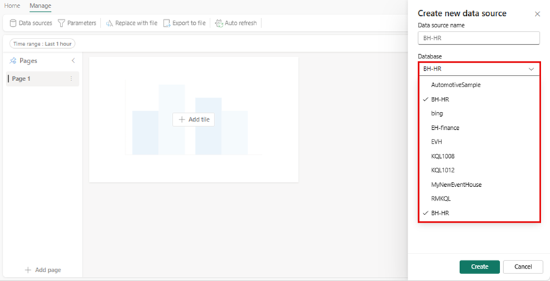 ](./Images/conected-now-create-datasource-large.png#lightbox)

1. At this point, you'll want to select the elipses **...** to the right of **Page n**, and select **Rename page** to a name appropriate for the tile's usage.
1. Select **+ Add tile**

    [ 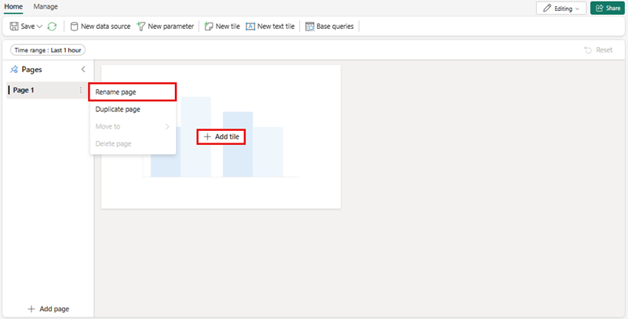 ](./Images/rename-page-add-tile-large.png#lightbox)

1. You'll be redirected to the **tile query pane** where you can add parameters and pull in base queries to support your tile. 

    [ 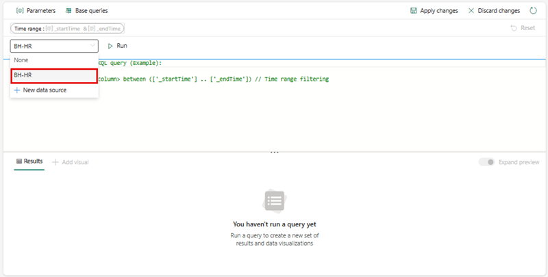 ](./Images/write-query-for-tile-large.png#lightbox)

    > **Note**
    > You'll have the option to add a new data source in the drop-down window in the same window. This source can be within your personal workspace or any workspace you may have another KQL database stored within an Evenhouse where you have access to.

## Write Queries

Since Real-Time Dashboard tiles use Kusto Query Language snippets to retrieve data and render visuals. Each tile/query can support a single visual.

1. Within each tile, you'll have the ability to write, or paste from **Copilot** if you choose to pin them to a new or existing tile, and then modify them to meet your needs. Just from a simple query, we can create a map viaulization that uses sizes on the map based on the number of bikes.

```kusto

['Bike-count']
BikepointID, Latitude, Longitude, No_Bikes

```

## Create Visualizations

Once you're happy with the visualization, simply select the **Apply changes** and then either add additional visualizations to support your Real-Time Dashboard or perform additional steps, such as **Parameters** or **Schedules**.

   [ 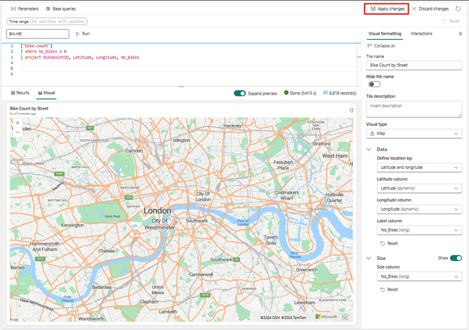 ](./Images/create-visual-in-tiles-large.png#lightbox)

Once the changes are applied you will see the data and can then make adjustments for readability and understanding by your users.

   [ 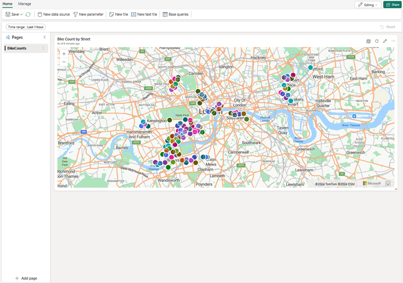 ](./Images/first-published-visual-large.png#lightbox)

You can continue to create **new tiles** that have table information and visualization information to ease understanding to your user community. You also have the ability, as shown earlier to **add page[s]**, **New data source[s]**. Next we'll focus on adding a parameter to assist with navigating and reducing the amount of information that is presented to a user.

## Add Parameters
Parameters enhance the efficiency of dashboard rendering and allow for the utilization of filter values at the earliest stage in the query process. The inclusion of parameters in the query linked to your tiles activates filtering capabilities. A parameter can be utilized across a dashboard and multiple parameters can filter the data represented in the underlying viaulizations, including tables.

Creating a parameter starts easily enough: 

1. Select the New Parameters button on the top menu. The Parameters pane opens.
1. Select the + Add button at the top of the right pane.

    [ 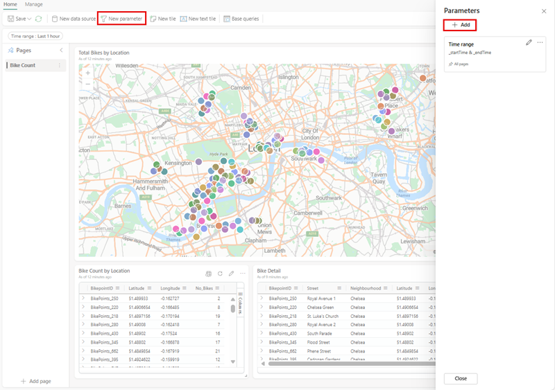 ](./Images/add-new-parameter-large.png#lightbox)

1. Fill in the relevant properties for your parameter.

    [ 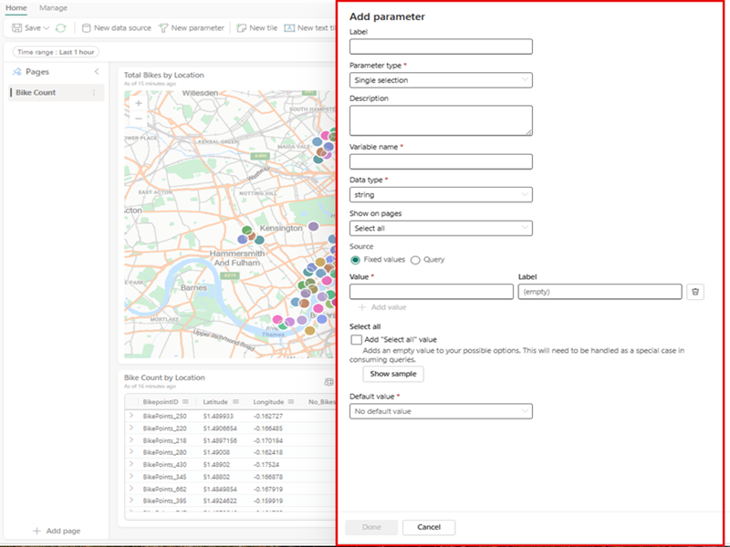 ](./Images/configure-parameter-large.png#lightbox)

1. One of the more important features of a parameter is the ability to **Add a query** to give the user only options that are relevant to the underlying information.

    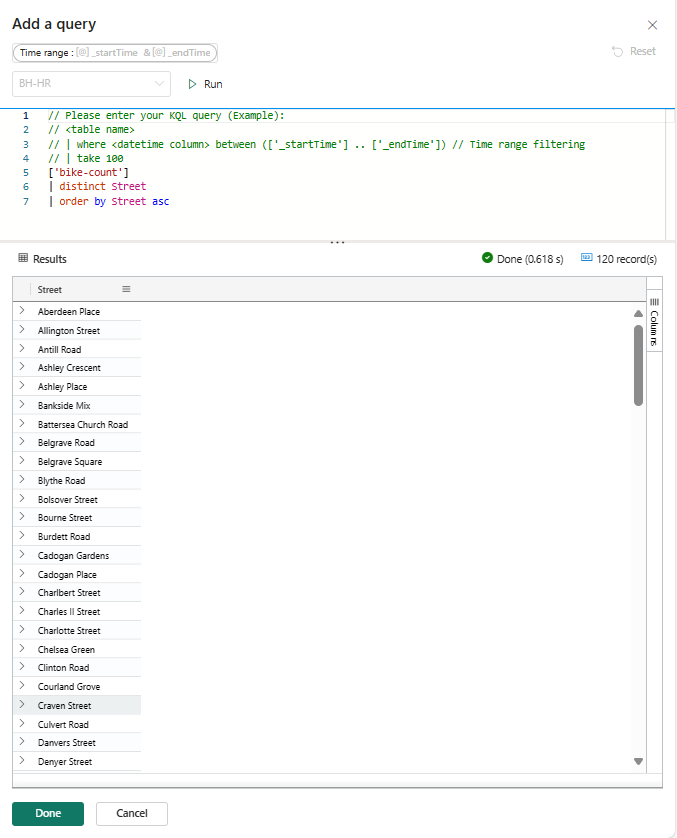

1. Select Done to create the parameter.

    [ 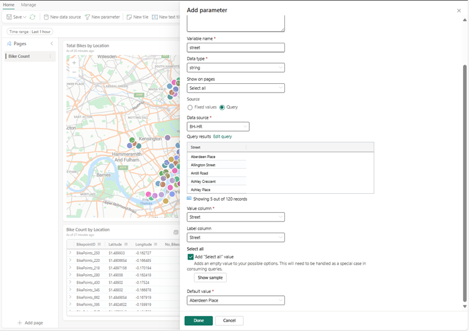 ](./Images/complete-parameter-settings-large.png#lightbox)

### Parameter properties

| Field            | Description |
|------------------|-------------|
| **Label**        | The name of the parameter displayed on the dashboard or the edit card. |
| **Parameter type** | One of the following types: <ul><li>Single selection: Only one value can be selected in the filter as input for the parameter.</li><li>Multiple selection: One or more values can be selected in the filter as inputs for the parameter.</li><li>Time range: Enables the creation of additional parameters to filter queries and dashboards based on time. Every dashboard has a default time range picker.</li><li>Free text: Allows users to type or paste a value into the filter field without pre-populated values, retaining recent values used.</li></ul> |
| **Description**  | An optional description of the parameter. |
| **Variable name** | The name used for the parameter within the query. |
| **Data type**    | The type of data the parameter values represent. |
| **Show on pages** | Pages where the parameter will be displayed, with an option to select all pages. |
| **Source**       | The origin of the parameter values, which can be: <ul><li>Fixed values: Static filter values entered manually.</li><li>Query: Dynamic values introduced using a KQL query.</li></ul> |
| **Add "Select all" value** | Applicable to single and multiple selection parameter types, this option retrieves data for all parameter values and must be integrated into the query for functionality. |
| **Default value** | The filter's default value, which is set upon the initial rendering of the dashboard. |

6. Enusre that you add the parameter to each of the queries within the tiles and then select **Apply changes**.

**Before KQL query**
```kusto
//Add the street parameter to each tile's query
['bike-count']
| where No_Bikes > 0
| project BikepointID, Latitude, Longitude, No_Bikes

```

**After KQL query**
```kusto
//Add the street parameter to each tile's query
['bike-count']
| where No_Bikes > 0 and Street == street
| project BikepointID, Latitude, Longitude, No_Bikes

```
   [ 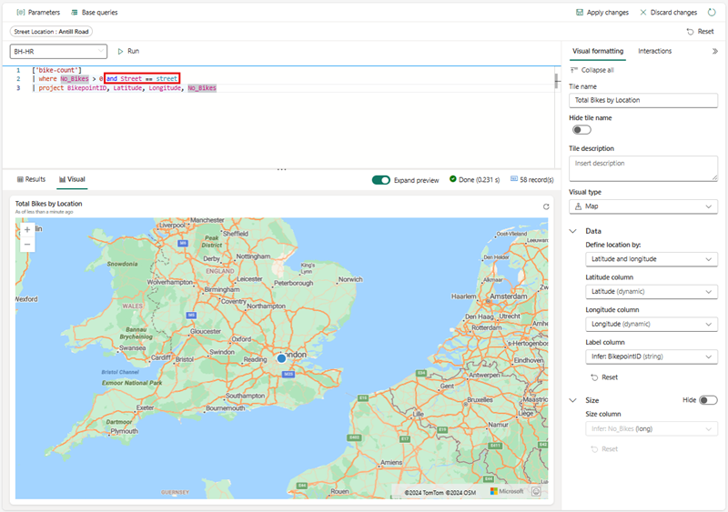 ](./Images/update-each-query-large.png#lightbox)

## Enable auto refresh

Auto-refresh is a functionality that enables the automatic updating of dashboard data without the need for manual page reloading or pressing a refresh button. The initial auto-refresh frequency is configurable by a database editor. Both editors and viewers have the capability to modify the actual auto-refresh rate during dashboard viewing. Database editors have the authority to establish a minimum refresh rate to mitigate excessive load on the cluster. Once this minimum rate is set, database users are restricted from selecting a refresh rate lower than the specified minimum. This ensures that the system's performance is maintained without overburdening the resources.

1. Select the Manage tab > Auto refresh.

    [ 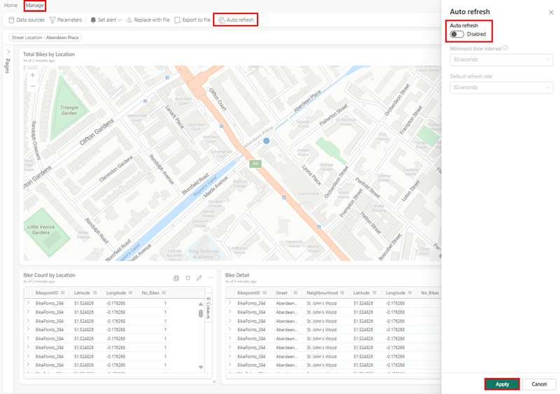 ](./Images/enable-auto-refresh-large.png#lightbox)

1. Toggle the option so auto refresh is Enabled.
1. Select values for Minimum time interval and Default refresh rate.
1. Select Apply and then Save the dashboard.

    [ 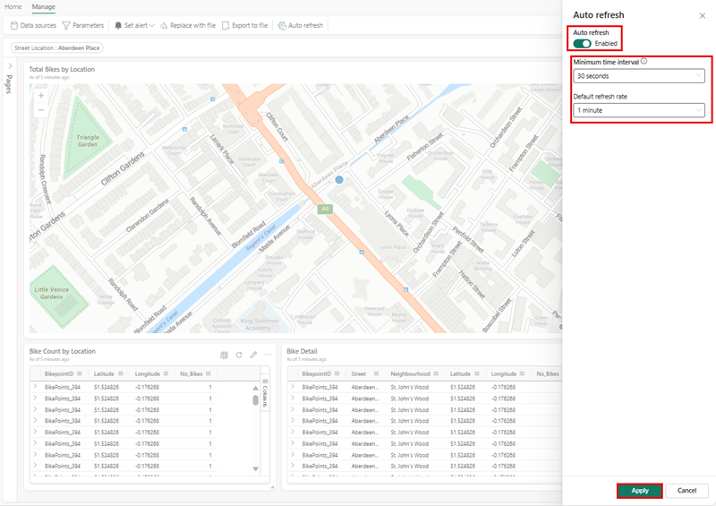 ](./Images/enable-and-configure-refresh-rate-large.png#lightbox)

## Clean up resources

In this exercise, you have created a KQL database and set up a sample dataset for querying. After that, you queried the data using KQL and SQL. When you've finished exploring your KQL database, you can delete the workspace you created for this exercise.
1. In the bar on the left, select the **icon** for your workspace.
2. In the ... menu on the toolbar, select **Workspace settings**.
3. In the **General** section, select **Remove this workspace**.

