---
lab:
    title: 'Design scalable semantic models'
    module: 'Design scalable semantic models'
---

# Design scalable semantic models

In this exercise, you will work with model relationships specifically to address the need for role-playing dimensions. It will involve working with active and inactive relationships, and also Data Analysis Expressions (DAX) functions that modify relationship behavior.

In this exercise, you learn how to:

- Interpret relationship properties in the model diagram.
- Set relationship properties.
- Use DAX functions that modify relationship behavior.

This lab takes approximately **30** minutes to complete.

> **Note**: You need a [Microsoft Fabric trial](https://learn.microsoft.com/fabric/get-started/fabric-trial) to complete this exercise.

## Explore model relationships

In this exercise, you will open a pre-developed Power BI Desktop solution to learn about the data model. You will then explore the behavior of active model relationships.

### Download starter file

1. Download the [Sales Analysis starter file](https://github.com/MicrosoftLearning/mslearn-fabric/raw/Main/Allfiles/Labs/15/15-scalable-semantic-models.zip) from `https://github.com/MicrosoftLearning/mslearn-fabric/raw/Main/Allfiles/Labs/15/15-scalable-semantic-models.zip` and save it on your local computer.

1. Extract the folder to the **C:\Users\Student\Downloads\15-scalable-semantic-models** folder.

1. Open the **15-Starter-Sales Analysis.pbix** file.
   
    >Note : Ignore and close the warning asking to apply changes.

### Review the data model

1. In Power BI Desktop, at the left, switch to **Model** view.

    
2. Use the model diagram to review the model design.

    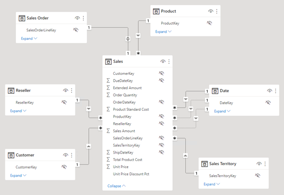

    *The model comprises six dimension tables and one fact table. The **Sales** fact table stores sales order details. It’s a classic star schema design.*

3. Notice that there are three relationships between the **Date** and **Sales** tables.

    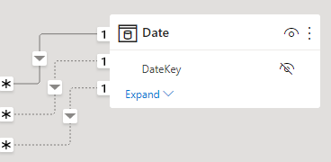

    *The **DateKey** column in the **Date** table is a unique column representing the "one” side of the relationships. Filters applied to any column of the **Date** table propagate to the **Sales** table using one of the relationships.*

4. Hover the cursor over each of the three relationships to highlight the "many” side column in the **Sales** table.

5. Notice that the relationship to the **OrderDateKey** column is a solid line, while the other relationships are represented by a dotted line.

    *A solid line represents an active relationship. There can only be one active relationship path between two model tables, and the path is used by default to propagate filters between tables. Conversely, a dotted line represents an inactive relationship. Inactive relationships are used only when explicitly invoked by DAX formulas.*

    *The current model design indicates that the **Date** table is a role-playing dimension. This dimension could play the role of order date, due date, or ship date. Which role depends on the analytical requirements of the report.*

    *In this lab, you will learn how to design a model to support role playing dimensions.*

### Visualize date data

In this task, you will visualize sales data by date and use inactive relationships.

1. Switch to **Report** view.

    

2. To add a table visual, in the **Visualizations** pane, select the **Table** visual icon.

    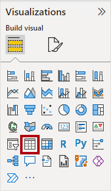

3. To add columns to the table visual, in the **Data** pane (located at the right), first expand the **Date** table.

    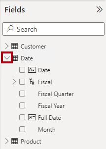

4. Drag the **Fiscal Year** column and drop it into the table visual.

    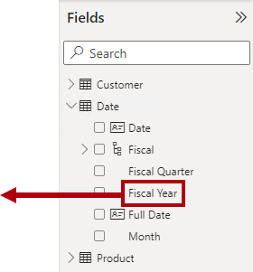

5. Expand open the **Sales** table, and then drag and drop the **Sales Amount** column into the table visual.

    

6. Review the table visual.

    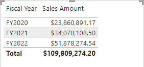

    *The table visual shows the sum of the **Sales Amount** column grouped by year. But what does **Fiscal Year** mean? Because there’s an active relationship between the **Date** and **Sales** tables to the **OrderDateKey** column, **Fiscal Year** means the fiscal year in which the orders were made.*

## Use inactive relationships

In this task, you will use the USERELATIONSHIP function to make an inactive relationship active.

1. In the **Data** pane, right-click the **Sales** table, and then select **New measure**.

    

2. In the formula bar (located beneath the ribbon), replace the text with the following measure definition, and then press **Enter**.

    ```DAX
    Sales Shipped =
    CALCULATE (
    SUM ('Sales'[Sales Amount]),
    USERELATIONSHIP('Date'[DateKey], 'Sales'[ShipDateKey])
    )
    ```

    *This formula uses the CALCULATE function to modify the filter context. It’s the USERELATIONSHIP function that, for the purpose of this calculation, makes the **ShipDateKey** relationship active.*

3. On the **Measure tools** contextual ribbon, from inside the **Formatting** group, set the decimals places to **2**.

    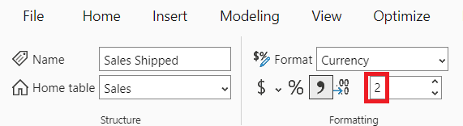

4. Add the **Sales Shipped** measure to the table visual.

    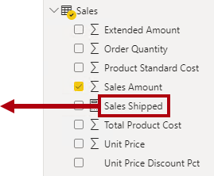

5. Widen the table visual so all columns are fully visible.

    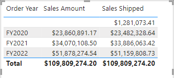

    *Creating measures that temporarily set relationships as active is one way to work with role-playing dimensions. However, it can become tedious when there’s a need to create role-playing versions for many measures. For example, if there were 10 sales-related measures and three role-playing dates, it could mean creating 30 measures. Creating them with calculation groups makes the process easier.*

## Create calculation groups

In this task, you will create a calculation group to support all date analysis.

1. Switch to **Model** view.

    

1. In the Model view, select **Calculation Group** to create a new calculation group table, group column, and item. Select **Yes** in the warning window to confirm the creation of the calculation group.

> Note: Once you create a calculation group, Power BI Desktop won't create implicit measures anymore, being required from the user to create explicit measures whenever they want to aggregate data columns.

1. Rename the calculation group to *Analyze By Date*.

1. In the **Model** tab of the **Data** pane, select the calculation item automatically created with your calculation group.

1. Replace and commit the item's formula with the following:

    ```DAX
   Order Date = SELECTEDMEASURE()
    ```

1. Right-click on the **Calculation items** field and select **New calculation item**.

1. Use the following DAX formula for the new item:

    ```DAX
   Ship Date = CALCULATE(SELECTEDMEASURE(), USERELATIONSHIP('Date'[DateKey], 'Sales'[ShipDateKey]))
    ```

1. Create a third item with the following DAX formula:

    ```DAX
   Due Date = CALCULATE(SELECTEDMEASURE(), USERELATIONSHIP('Date'[DateKey], 'Sales'[DueDateKey]))
    ```
   
1. In the model diagram, right-click the **ShipDateKey** relationship, and then select **Delete**.

    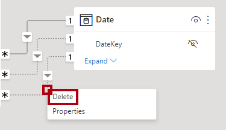

1. When prompted to confirm the deletion, select **Yes**.

    *Deleting the relationship results in an error with the **Sales Shipped** measure. You will rewrite the measure formula later in this lab.*

### Visualize ship date data

In this task, you will visualize the ship date data in a new table visual.

1. Switch to **Report** view.

    

2. To clone the table visual, first select the visual.

3. On the **Home** ribbon tab, from inside the **Clipboard** group, select **Copy**.

    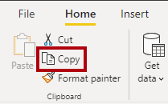

4. To paste the copied visual, on the **Home** ribbon tab, from inside the **Clipboard** group, select **Paste**.

    *Tip: You can also use the **Ctrl+C** and **Ctrl+V** shortcuts.*

    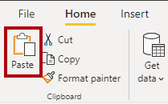

5. Move the new table visual to the right of the existing table visual.

6. Select the new table visual, and then in the **Visualizations** pane, from inside the **Columns** well, remove the **Order Year** field.

    

7. In the **Data** pane, expand open the **Ship Date** table.

8. To add a new field to the new table visual, from the **Ship Date** table, drag the **Ship Year** field to the **Columns** well, above the **Sales Amount** field.

    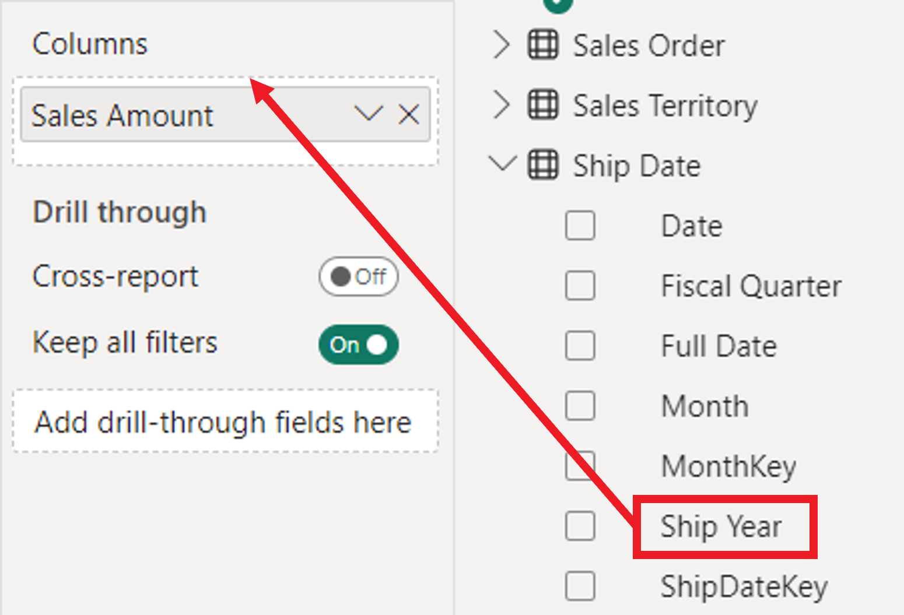

9. Verify that the new table visual shows sales amount grouped by ship year.

    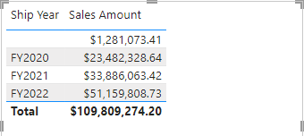

    *The model now has two date tables, each with an active relationship to the **Sales** table. The benefit of this design approach is that it’s flexible. It’s now possible to use all measures and summarizable fields with either date table.*

    *There are, however, some disadvantages. Each role-playing table will contribute to a larger model size—although dimension table aren’t typically large in terms of rows. Each role-playing table will also require duplicating model configurations, like marking the date table, creating hierarchies, and other settings. Also, additional tables contribute to a possible overwhelming number of fields. Users may find it more difficult to find the model resources they need.*

    *Lastly, it’s not possible to achieve a combination of filters in the one visual. For example, it’s not possible to combine sales ordered and sales shipped in the same visual without creating a measure. You will create that measure in the next exercise.*

## Explore other relationship functions

In this task, you will work with the CROSSFILTER and TREATAS functions to modify relationship behavior during calculations.

1. In the **Data** pane, from inside the **Sales** table, select the **Sales Shipped** measure.

    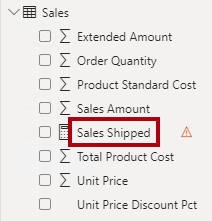

2. In the formula base, replace the text with the following definition:

    ```dax
    Sales Shipped =
    CALCULATE (
    SUM ( 'Sales'[Sales Amount] ),
    CROSSFILTER ( 'Date'[DateKey], 'Sales'[OrderDateKey], NONE ),
    TREATAS (
    VALUES ( 'Date'[DateKey] ),
    'Ship Date'[ShipDateKey]
        )
    )
    ```

    *This formula uses the CALCULATE function to sum the **Sales Amount** column by using modified relationship behaviors. The CROSSFILTER function disables the active relationship to the **OrderDateKey** column (this function can also modify filter direction). The TREATAS function creates a virtual relationship by applying the in-context **DateKey** values to the **ShipDateKey** column.*

3. Add the revised **Sales Shipped** measure to the first table visual.

    

4. Review the first table visual.

    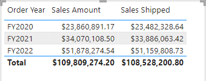

5. Notice that there is no BLANK group.

    *Because there are no BLANKs in the **OrderDateKey** column, a BLANK group wasn’t generated. Showing unshipped sales will require a different approach.*

### Show unshipped sales

In this task, you will create a measure to show the unshipped sales amount.

1. Create a measure named **Sales Unshipped** in the **Sales** table by using the following definition:

    ```DAX
    Sales Unshipped =
    CALCULATE (
    SUM ( 'Sales'[Sales Amount] ),
    ISBLANK ( 'Sales'[ShipDateKey] )
    )
    ```

    *This formula sums the **Sales Amount** column where the **ShipDateKey** column is BLANK.*

2. Format the measure to use two decimal places.

3. To add a new visual to the page, first select a blank area of the report page.

4. In the **Visualizations** pane, select the **Card** visual icon.

    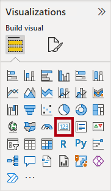

5. Drag the **Sales Unshipped** measure into the card visual.

    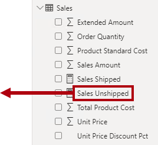

6. Verify that the final report page layout looks like the following.

    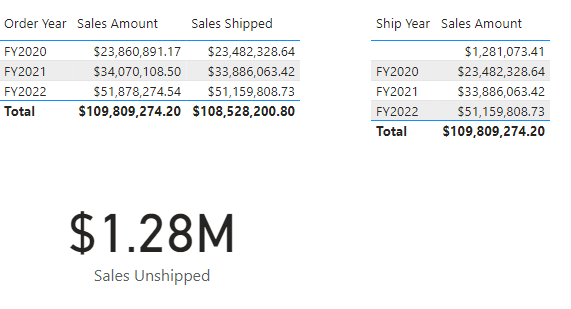

### Finish up

To finish the exercise, close Power BI Desktop - no need to save the file.
