---
lab:
    title: 'Design scalable semantic models'
    module: 'Design scalable semantic models'
---

# Design scalable semantic models

In this exercise, you will work with DAX functions to enhance flexibility and efficiency of data models, particularly through features like calculation groups and field parameters. By using these features together, you can make interactive reports without needing multiple visuals or complex DAX expressions, creating highly flexible and scalable semantic models.

In this exercise, you learn how to:

- Use DAX functions to modify relationship behavior.
- Create calculation groups and apply them in dynamic time intelligence calculations.
- Create field parameters to dinamically select and display different fields and measures.

This lab takes approximately **30** minutes to complete.

## Explore model relationships

In this exercise, you will open a pre-developed Power BI Desktop solution to learn about the data model. You will then explore the behavior of active model relationships.

### Download starter file

1. Download the [Sales Analysis starter file](https://github.com/MicrosoftLearning/mslearn-fabric/raw/Main/Allfiles/Labs/15/15-scalable-semantic-models.zip) from `https://github.com/MicrosoftLearning/mslearn-fabric/raw/Main/Allfiles/Labs/15/15-scalable-semantic-models.zip` and save it on your local computer.

2. Extract the folder to the **C:\Users\Student\Downloads\15-scalable-semantic-models** folder.

3. Open the **15-Starter-Sales Analysis.pbix** file.
   
    >Note : Ignore and close any warnings asking to apply changes.

### Review the data model

1. In Power BI Desktop, at the left, switch to **Model** view.

    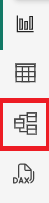
   
2. Use the model diagram to review the model design.

    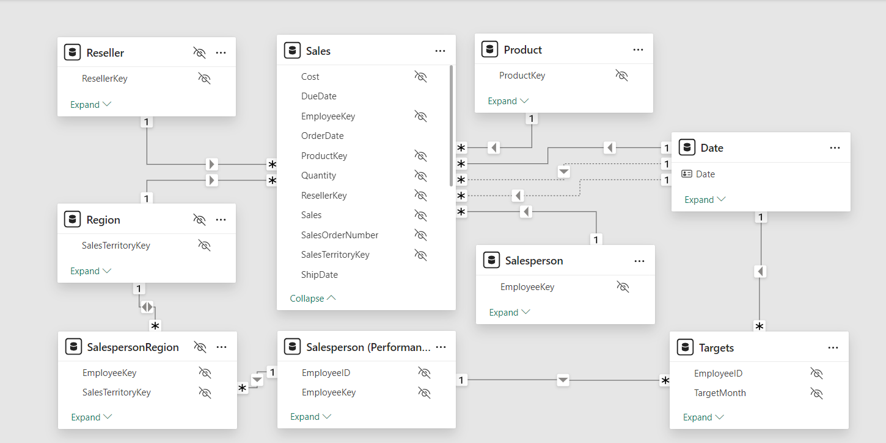

3. Notice that there are three relationships between the **Date** and **Sales** tables.

    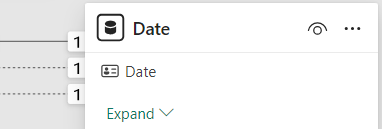

    *The **Date** column in the **Date** table is a unique column representing the "one” side of the relationships. Filters applied to any column of the **Date** table propagate to the **Sales** table using one of the relationships.*

4. Hover the cursor over each of the three relationships to highlight the "many” side column in the **Sales** table.

5. Notice that the relationship to the **OrderDate** column is a solid line, while the other relationships are represented by a dotted line.

    *A solid line represents an active relationship. There can only be one active relationship path between two model tables, and the path is used by default to propagate filters between tables. Conversely, a dotted line represents an inactive relationship. Inactive relationships are used only when explicitly invoked by DAX formulas.*

    *The current model design indicates that the **Date** table is a role-playing dimension. This dimension could play the role of order date, due date, or ship date. Which role depends on the analytical requirements of the report.*

    *In this lab, you will learn how to design a model to support role playing dimensions.*

### Visualize date data

In this task, you will visualize sales data by date and use inactive relationships.

1. Switch to **Report** view.

    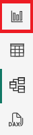

2. To add a table visual, in the **Visualizations** pane, select the **Table** visual icon.

    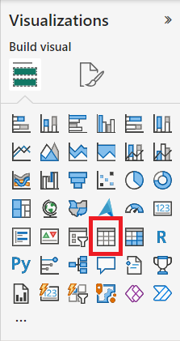

3. To add columns to the table visual, in the **Data** pane (located at the right), first expand the **Date** table.

    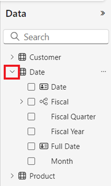

4. Drag the **Year** column and drop it into the table visual.

    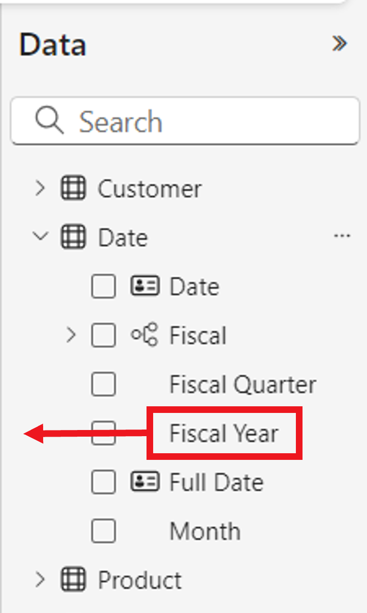

5. Expand open the **Sales** table, and then drag and drop the **Total Sales** column into the table visual.

    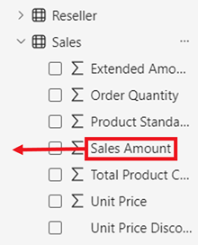

6. Review the table visual.

    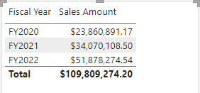

    *The table visual shows the sum of the **Total Sales** column grouped by year. But what does **Year** mean? Because there’s an active relationship between the **Date** and **Sales** tables to the **OrderDate** column, **Year** means the fiscal year in which the orders were made.*

## Use inactive relationships

In this task, you will use the USERELATIONSHIP function to make an inactive relationship active.

1. In the **Data** pane, right-click the **Sales** table, and then select **New measure**.

    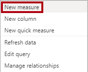

2. In the formula bar (located beneath the ribbon), replace the text with the following measure definition, and then press **Enter**.

    ```DAX
    Sales Shipped =
    CALCULATE (
    SUM ('Sales'[Sales]),
    USERELATIONSHIP('Date'[Date], 'Sales'[ShipDate])
    )
    ```

    *This formula uses the CALCULATE function to modify the filter context. It’s the USERELATIONSHIP function that, for the purpose of this calculation, makes the **ShipDate** relationship active.*

3. Add the **Sales Shipped** measure to the table visual.

    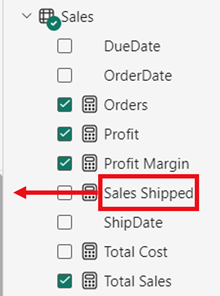

4. Widen the table visual so all columns are fully visible. Observe that the **Total** row is the same but the sales amount for each year in **Total Sales** and **Sales Shipped** is different. That is due to orders being received in a given year while being shipped only in the following year or are not even shipped yet.

    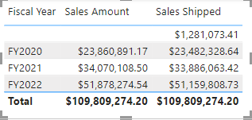

    *Creating measures that temporarily set relationships as active is one way to work with role-playing dimensions. However, it can become tedious when there’s a need to create role-playing versions for many measures. For example, if there were 10 sales-related measures and three role-playing dates, it could mean creating 30 measures. Creating them with calculation groups makes the process easier.*

## Create calculation groups

In this task, you will create a calculation group for Time Inteligence analysis.

1. Switch to **Model** view.

2. In the Model view, select **Calculation Group** to create a new calculation group table, group column, and item. If a warning window pops up, select **Yes** to confirm the creation of the calculation group.

   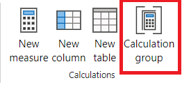

> Note: Once you create a calculation group, Power BI Desktop won't create implicit measures anymore, being required from the user to create explicit measures whenever they want to aggregate data columns. An implicit measure occurs when, in the Report view, you use a data column from the Data pane directly in a visual. The visual allows you to aggregate it as a SUM, AVERAGE, MIN, MAX, or some other basic aggregation, which becomes an implicit measure.

3. Rename the calculation group to *Time Calculations* and the calculation column to *Yearly Calculations*.

4. In the **Model** tab of the **Data** pane, select the calculation item automatically created with your calculation group.

5. Replace and commit the item's formula with the following:

    ```DAX
   Year-to-Date (YTD) = CALCULATE(SELECTEDMEASURE(), DATESYTD('Date'[Date]))
    ```

6. Right-click on the **Calculation items** field and select **New calculation item**.

7. Use the following DAX formula for the new item:

    ```DAX
   Previous Year (PY) = CALCULATE(SELECTEDMEASURE(), PREVIOUSYEAR('Date'[Date]))
    ```

8. Create a third item with the following DAX formula:

    ```DAX
   Year-over-Year (YoY) Growth = 
   VAR MeasurePriorYear =
   CALCULATE(
       SELECTEDMEASURE(),
       SAMEPERIODLASTYEAR('Date'[Date])
   )
   RETURN
   DIVIDE(
       (SELECTEDMEASURE() - MeasurePriorYear),
       MeasurePriorYear
   )
    ```

The last calculation item should return values in percentage only, so it needs a dynamic format string to change the format of the measures it affects.

9. In the **Properties** pane of the YoY item, enable the **Dynamic format string** feature.

10. In the DAX formula bar, verify that the field to its left is set as **Format**, and write the following format string:

    ```DAX
   "0.##%"
    ```
    
11. Confirm that your calculation group looks as follows:

    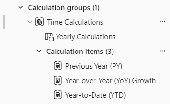

### Apply a calculation group to measures

In this task, you will visualize how the calculation items affect measures in a visual.

1. Switch to **Report** view.

2. At the bottom of the canvas, select the **Overview** tab.

3. Select the matrix visual already created in the canvas and drag the **Yearly Calculations** calculation column from the **Data** pane to the **Columns** field in the **Visualizations** pane.

    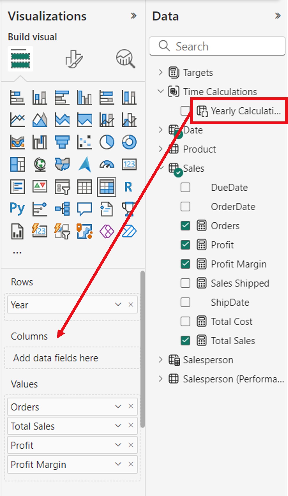

    *Observe that now the matrix has a set of sales figures for each calculation item. Having all this information in one visual at once can be hard to read and therefore, it would be convenient to limit the visual to one sales figure at a time. In order to do that, we can use a field parameter.*

### Create field parameters

In this task, you will create field parameters to change visuals.

1. Select the **Modeling** tab in the top ribbon, then expand the **New parameter** button and select **Fields**.

    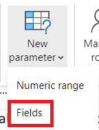

2. In the Parameters window, rename the parameter to **Sales Figures**, verify that the option **Add slicer to this page** is checked, and add the following fields from the **Sales** table:

   * Total Sales
   * Profit
   * Profit Margin
   * Orders

    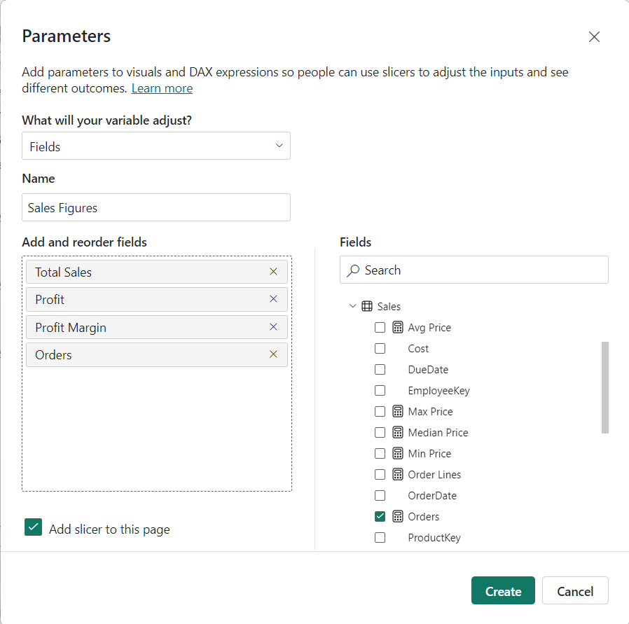

3. Select **Create**.

4. Once the slicer is created, you can select the matrix and remove all fields from **Values** in the Visualizations pane and add instead the Sales Figures field parameter.

    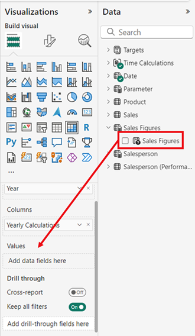

5. Check the different sales figures in the slicer and how the matrix changes when each of them is selected.

### Edit field parameters

In this task, you will edit the **Sales Figures** field parameter by directly modifying its DAX expression.

1. Select the **Salesperson Performance** tab at the bottom of the canvas.

    *In this canvas, you have a clustered bar chart with Total Sales by Month. Above this visual you have bookmark buttons that can be used to change the chart between Total Sales and Target by month. While creating the bookmark buttons allows you to change the visual type with each option, if you need to switch between many measures, you will have to create a bookmark button for each of them and that can be very time consuming. Instead, we can use a field parameter with all the measures we want to analyze and quickly switch between them.*

2. Select the bar chart visual and replace the **Total Sales** field in **X-axis** with the **Sales Figures** field parameter.

3. Create a **Slicer** visual and drag the **Sales Figures** parameter to the **Field** area.

For this visual you still need to evaluate the Target by Month, which is not in the field parameter.

4. Select the **Sales Figures** parameter in the Data pane and add the Target field in the parameter's DAX expression as below:

    ```DAX
   Sales Figures = {
    ("Total Sales", NAMEOF('Sales'[Total Sales]), 0),
    ("Profit", NAMEOF('Sales'[Profit]), 1),
    ("Profit Margin", NAMEOF('Sales'[Profit Margin]), 2),
    ("Orders", NAMEOF('Sales'[Orders]), 3),
    ("Target", NAMEOF('Targets'[Target]), 4)
   }
    ```

5. Commit the changes and verify that the visual changes as you select the different Sales figures.

6. Delete the bookmark buttons.
   
## Finish up

To finish the exercise, close Power BI Desktop - no need to save the file.
