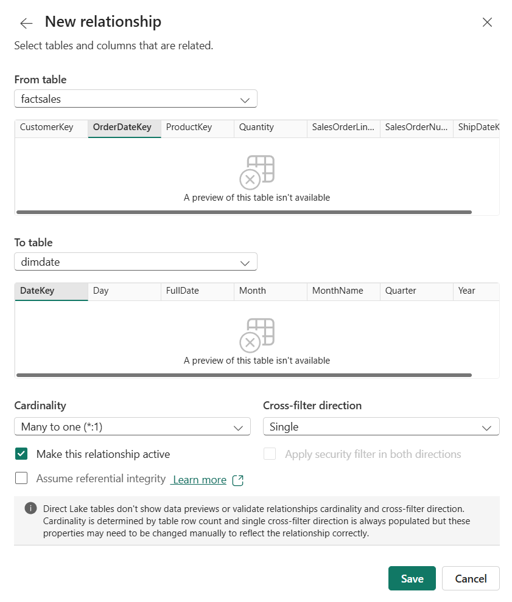
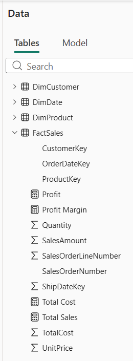
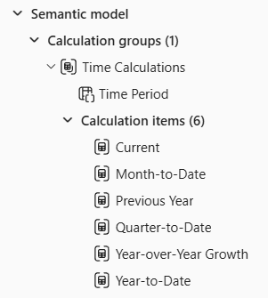
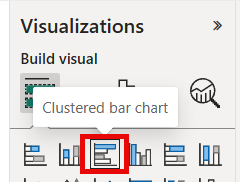

---
lab:
  title: Design a semantic model for scale
  module: Design semantic models for scale in Microsoft Fabric
  description: In this lab, you'll design a semantic model for scale in the Microsoft Fabric service. You'll connect to lakehouse data using Direct Lake, build star schema relationships, create a calculation group for time intelligence, and configure settings that support large datasets and concurrent consumption.
  duration: 30 minutes
  level: 300
  islab: true
  primarytopics:
    - Microsoft Fabric
  categories:
    - Semantic models
    - Get started with Fabric
  courses:
    - DP-600
---

# Design a semantic model for scale

In this exercise, you design a semantic model for scale in the Microsoft Fabric service. You connect to lakehouse data using Direct Lake, build star schema relationships, create a calculation group for time intelligence, and configure settings that support large datasets and concurrent consumption. You learn how to:

- Create a semantic model that connects to lakehouse data through Direct Lake.
- Design star schema relationships with appropriate filter direction and referential integrity.
- Create a calculation group for time intelligence across multiple measures.
- Configure settings for scale, including query scale-out and OneLake integration.

This lab takes approximately **30** minutes to complete.

> **Tip:** For related training content, see [Design semantic models for scale in Microsoft Fabric](https://learn.microsoft.com/training/modules/design-semantic-models-scale/).

## Set up the environment

> **Note**: You need access to a Fabric paid or trial capacity to complete this exercise. Paid capacities must include Power BI capabilities, or you need a separate Power BI Pro or Premium Per User license. For information about the free Fabric trial, see [Fabric trial](https://aka.ms/fabrictrial).

1. Navigate to the [Microsoft Fabric home page](https://app.fabric.microsoft.com/home?experience=fabric) at `https://app.fabric.microsoft.com/home?experience=fabric` in a browser, and sign in with your Fabric credentials.
1. In the menu bar on the left, select **Workspaces** (the icon looks similar to &#128455;).
1. Create a new workspace with a name of your choice, selecting a licensing mode that includes Fabric capacity (*Trial*, *Premium*, or *Fabric*).
1. When your new workspace opens, it should be empty.

You need a lakehouse with data to model. Import a notebook that creates sample sales data, create a lakehouse, and then run the notebook against it.

1. Download the [Create-Sales-Data.ipynb](https://github.com/MicrosoftLearning/mslearn-fabric/raw/main/Allfiles/Labs/15/Create-Sales-Data.ipynb) notebook from `https://github.com/MicrosoftLearning/mslearn-fabric/raw/main/Allfiles/Labs/15/Create-Sales-Data.ipynb` and save it.

1. In your workspace, select **Import** > **Notebook** and upload the **Create-Sales-Data.ipynb** file you downloaded. The notebook appears in the workspace after import.

1. In the workspace, select **+ New item** and create a **Lakehouse**. Name it **SalesLakehouse**.

    After a minute or so, a new lakehouse is created.

1. In the lakehouse, on the **Home** menu tab, select **Open notebook** > **Existing notebook** and select **Create-Sales-Data**.

1. The notebook opens with the lakehouse attached. It contains two code cells with comments that explain what each block does: the first cell creates three dimension tables (`DimDate`, `DimProduct`, `DimCustomer`) and the second cell generates 5,000 fact table rows (`FactSales`).

1. Select **Run all** in the toolbar to run both cells. Wait for both cells to complete.

1. Once both cells complete, use the lakehouse explorer on the left to verify that the following tables appear under **Tables**:
    - `DimCustomer`
    - `DimDate`
    - `DimProduct`
    - `FactSales`

    > *If the tables don't appear, select the **Refresh** button on the toolbar.*


## Create a semantic model

In this section, you create a semantic model designed for scale. The model uses Direct Lake to query data directly from lakehouse Delta tables without importing a copy, eliminating refresh bottlenecks and memory limits that constrain large datasets. You then structure the model with star schema relationships, explicit measures, calculation groups, and role-playing dimensions — patterns that keep the model performant and maintainable as the number of tables, measures, and users grows.

1. In the **Lakehouse explorer** menu bar, select **New semantic model**.

1. Name the model **Sales Model** and select the following tables to include:
    - `DimCustomer`
    - `DimDate`
    - `DimProduct`
    - `FactSales`

1. Select **Confirm** to create the semantic model. You might need to wait for a minute before the model opens in the web modeling experience.

    > The semantic model uses Direct Lake mode by default because it connects to lakehouse Delta tables. No data import or refresh schedule is needed.


### Design star schema relationships

In this task, you configure the relationships between the fact and dimension tables to form a star schema. A star schema gives the query engine a simple, predictable path from filters to facts. Single-direction relationships and assumed referential integrity enable INNER joins and reduce the work the engine does per query, which matters as row counts grow into the millions.

1. In the model diagram, arrange the tables so that `FactSales` is in the center with the three dimension tables around it.

1. If relationships weren't automatically detected, create them manually. Select **Manage relationships** from the ribbon, then select **New relationship** and configure it as follows:

    > **Note**: Direct Lake tables don't show data previews in the relationship dialog. Cardinality is determined by table row count, and single cross-filter direction is always populated, but you may need to verify these settings manually.

    - From table: `FactSales`
      - Select the `OrderDateKey` column
    - To table: `DimDate`
      - Select the `DateKey` column
    - Cardinality: **Many to one (*:1)**
    - Cross-filter direction: **Single**
    - Check **Make this relationship active**
    - Check **Assume referential integrity**
    - Select **Save**

    > The referential integrity option tells the engine to use INNER joins instead of LEFT OUTER joins, which improves query performance when every foreign key has a matching dimension key.

    

1. Create a second relationship:

    - From table: `FactSales`
      - Select the `CustomerKey` column
    - To table: `DimCustomer`
      - Select the `CustomerKey` column
    - Cardinality: **Many to one (*:1)**
    - Cross-filter direction: **Single**
    - Check **Make this relationship active**
    - Check **Assume referential integrity**
    - Select **Save**

1. Create a third relationship:

    - From table: `FactSales`
      - Select the `ProductKey` column
    - To table: `DimProduct`
      - Select the `ProductKey` column
    - Cardinality: **Many to one (*:1)**
    - Cross-filter direction: **Single**
    - Check **Make this relationship active**
    - Check **Assume referential integrity**
    - Select **Save**

    > Single-direction filtering provides predictable filter propagation in a star schema.

1. Create a fourth relationship for the ship date:

    - From table: `FactSales`
      - Select the `ShipDateKey` column
    - To table: `DimDate`
      - Select the `DateKey` column
    - Cardinality: **Many to one (*:1)**
    - Cross-filter direction: **Single**
    - Uncheck **Make this relationship active** since only one active relationship can exist between two tables at a time
    - Check **Assume referential integrity**
    - Select **Save**

Your model diagram should now show a star schema with `FactSales` in the center and three dimension tables filtering inward through single-direction relationships.

> Notice how the tables have a blue dotted line at the top. This indicates that these tables are using Direct Lake storage mode.


### Create measures

In this task, you create explicit DAX measures on the fact table. Explicit measures are a prerequisite for calculation groups, which are one of the most important patterns for keeping a model manageable at scale.

The `FactSales` table already contains columns like `SalesAmount` and `TotalCost` that hold row-level values. By default, Power BI can auto-aggregate these in visuals using *implicit measures*. However, when you create a calculation group in the next task, implicit measures are disabled, so you need to define *explicit* DAX measures for the calculation group items to apply to.

1. In the **Data** pane, right-click the `FactSales` table and select **New measure**.

> **Tip**: The DAX formulas for all measures, calculation groups, and the USERELATIONSHIP measure can be copied from the **Create-Sales-Data** notebook you imported earlier. Open the notebook from the workspace to find the formulas in the markdown cells.

1. In the formula bar, enter the following and press **Enter**:

    ```dax
    Total Sales = SUM(FactSales[SalesAmount])
    ```

1. Create a second measure on the `FactSales` table:

    ```dax
    Total Cost = SUM(FactSales[TotalCost])
    ```

1. Create a third measure:

    ```dax
    Profit =
    VAR TotalRevenue = [Total Sales]
    VAR TotalExpense = [Total Cost]
    RETURN
        TotalRevenue - TotalExpense
    ```

1. Create a fourth measure:

    ```dax
    Profit Margin =
    VAR ProfitAmount = [Profit]
    VAR TotalRevenue = [Total Sales]
    RETURN
        DIVIDE(ProfitAmount, TotalRevenue)
    ```

    > These measures use variables to store intermediate results. Variables improve readability and prevent the engine from evaluating the same expression multiple times.

You now have four new measures in the `FactSales` table, which are represented by calculator icons.



### Create a calculation group

In this task, you create a calculation group for time intelligence that applies across all four base measures without creating separate measures for each combination. Calculation groups prevent measure proliferation — instead of creating separate YTD, QTD, and prior-year variants of every base measure, you define the pattern once and it applies to all measures automatically. This keeps the model metadata small and maintenance low, which becomes critical as the model scales to dozens or hundreds of base measures.

1. In the model view, select **Calculation group** from the ribbon to create a new calculation group.

    > Choose **Yes** if prompted to acknowledge that implicit measures will be discouraged in the model.

1. Rename the calculation group table to `Time Calculations` and the column to `Time Period`.

1. In the **Data** pane, select the calculation item that was created automatically and replace its formula with:

    ```dax
    Current = SELECTEDMEASURE()
    ```

1. Right-click the **Calculation items** field and select **New calculation item**. Create the following items one at a time:

    ```dax
    Year-to-Date =
    CALCULATE(
        SELECTEDMEASURE(),
        DATESYTD('DimDate'[FullDate])
    )
    ```

    ```dax
    Quarter-to-Date =
    CALCULATE(
        SELECTEDMEASURE(),
        DATESQTD('DimDate'[FullDate])
    )
    ```

    ```dax
    Month-to-Date =
    CALCULATE(
        SELECTEDMEASURE(),
        DATESMTD('DimDate'[FullDate])
    )
    ```

    ```dax
    Previous Year =
    CALCULATE(
        SELECTEDMEASURE(),
        PREVIOUSYEAR('DimDate'[FullDate])
    )
    ```

1. Create one more calculation item for year-over-year growth:

    ```dax
    Year-over-Year Growth =
    VAR MeasurePriorYear =
        CALCULATE(
            SELECTEDMEASURE(),
            SAMEPERIODLASTYEAR('DimDate'[FullDate])
        )
    RETURN
        DIVIDE(
            (SELECTEDMEASURE() - MeasurePriorYear),
            MeasurePriorYear
        )
    ```

1. Select the `Year-over-Year Growth` item and then enable the **Dynamic format string** feature in the **Properties** pane.

   - Set the format string to: `"0.##%"`

    > This dynamic format string ensures that when `Year-over-Year Growth` is selected in a visual, the result displays as a percentage rather than a raw decimal, regardless of which base measure it applies to.

1. Verify that your calculation group has six items: `Current`, `Year-to-Date`, `Quarter-to-Date`, `Month-to-Date`, `Previous Year`, and `Year-over-Year Growth`.

> These six items now apply to all four base measures automatically. Without the calculation group, you would need 24 separate measures (4 base measures x 6 time patterns). As the model grows to 50 or 100 base measures, this pattern prevents measure proliferation.



### Use USERELATIONSHIP for the inactive ship date relationship

In this task, you create a measure that activates the inactive ship date relationship. Role-playing dimensions let you analyze data by different date columns (order date, ship date) without duplicating the Date table. Avoiding duplicate tables reduces model size and keeps relationships simple, both of which support scale.

1. In the **Data** pane, right-click the `FactSales` table and select **New measure**.

1. Enter the following formula and press **Enter**:

    ```dax
    Sales by Ship Date =
    CALCULATE(
        [Total Sales],
        USERELATIONSHIP(FactSales[ShipDateKey], DimDate[DateKey])
    )
    ```

    > This measure uses USERELATIONSHIP to temporarily activate the inactive relationship between `FactSales.ShipDateKey` and `DimDate.DateKey`. This pattern lets you analyze data by different date columns without duplicating the Date table.

### Configure settings for scale

In this task, you configure workspace-level settings that prepare the model for production use. These settings won't change what you see in the report you build next, but they're what distinguish a lab prototype from a production-ready model.

1. Navigate back to your workspace and find **Sales Model** in the workspace item list. Select the **...** (ellipsis) menu next to it and select **Settings**.

1. Expand the **Query scale-out** section. Toggle **Query scale-out** to **On**.

    > With query scale-out enabled, Fabric can create read-only replicas of your model so that multiple users running reports simultaneously don't compete for the same resources. This is critical when dashboards are shared across large teams. Direct Lake models already have large semantic model storage format enabled (a prerequisite), so this setting is ready to use immediately.

1. Expand the **OneLake integration** section. Toggle **OneLake integration** to **On**.

    > With OneLake integration, the data in your semantic model becomes accessible as Delta tables in OneLake. This means data engineers can consume the same curated data in notebooks, pipelines, or other Fabric items without duplicating it, keeping the model as the single source of truth.

## Validate the model with a report

In this section, you create a report to verify that relationships, measures, and the calculation group work correctly.

1. Navigate back to your workspace and find **Sales Model** in the workspace item list. Select the **...** (ellipsis) menu next to it and select **Create report**.

1. In the report canvas, create a **Clustered bar chart** visual. Add the following fields:

    - `DimProduct` > `Category` on the Y-axis
    - `Total Sales` on the X-axis

    

1. Verify that sales data appears broken out by product category. This confirms the relationships between your dimension and fact tables are working.

1. With the bar chart still selected, add the `Time Period` column from the `Time Calculations` table to the **Legend** area. The chart now shows grouped bars for each time intelligence calculation per category, confirming the calculation group is working.

1. Create a **Card** visual and add both the `Total Sales` and `Sales by Ship Date` measures so you can see them side by side.

    

1. Create a **Slicer** visual and add `DimDate` > `Year`. The slicer defaults to a Between slider.

    

1. Adjust the slider to different year ranges (for example, **2022–2023** or **2023–2024**) and observe how the `Total Sales` and `Sales by Ship Date` values change in the card.

> The two values differ because `Total Sales` uses the active relationship on `OrderDateKey` while `Sales by Ship Date` uses `USERELATIONSHIP` to activate the inactive relationship on `ShipDateKey`.
>
> Since ship dates are 14–60 days after order dates, orders near year boundaries can fall into different years depending on which date is used. When the slicer covers the full range (2022–2024), the values are closer because most rows are included regardless of which date key is filtered.


## Try it with Copilot (optional)

Copilot works best with well-structured semantic models. In this section, you test whether Copilot can answer questions accurately against the star schema you built.

If your workspace supports Copilot, try asking it questions about the model data.

1. In the report, select the **Copilot** button in the ribbon (if available).

1. Ask Copilot: `"What was the total sales for each product category last year?"`

1. Observe whether Copilot returns an accurate answer. The star schema you built, with a single fact table, clear many-to-one relationships, and explicit DAX measures, gives Copilot a straightforward path to resolve the question. Models with ambiguous relationships or missing measures are harder for Copilot to interpret correctly.

## Clean up resources

In this exercise, you created a semantic model with Direct Lake storage mode, star schema relationships, calculation groups, and scale settings.

1. Close the report without saving, or delete it if you saved it.
1. Navigate to your workspace.
1. Select the **...** menu next to **Sales Model** and **SalesLakehouse**, and select **Delete** to remove them from your workspace.
