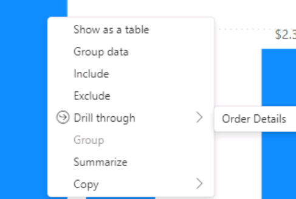
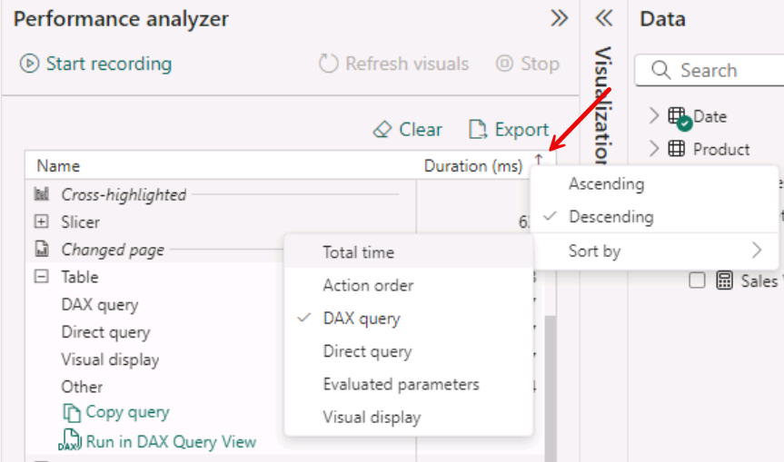

---
lab:
    title: 'Create reusable Power BI assets'
---

# Create reusable Power BI assets

In this exercise you'll create reusable assets to support semantic model and report development. These assets include Power BI Project and Template files and shared semantic models. At the end, you'll explore the lineage view how these items relate to each other in the Power BI service.

   > Note: this exercise doesn't require a Fabric license and can be completed in a Power BI or Microsoft Fabric environment.

This exercise should take approximately **30** minutes to complete.

## Before you start

Before you can start this exercise, you need to open a web browser and enter the following URL to download the zip folder:

`https://github.com/MicrosoftLearning/mslearn-fabric/raw/Main/Allfiles/Labs/15b/15-optimize-power-bi.zip`

Extract the folder to the **C:\Users\Student\Downloads\15-optimize-power-bi** folder.

## Review a DirectQuery model design

In this task, you'll review an existing Power BI report and make improvements.

1. Navigate to the 15-optimize-power-bi folder and open the 15-Starter-Sales Analysis.pbix file in Power BI Desktop.
1. If prompted, **Connect** to the database with Windows current credentials.
1. Switch to the **Model view** and review the different tables and relationships.
1. Notice the star schema design with the Reseller Sales fact table connected to the Date and Product dimension tables.
1. Select each table, then **Properties > Advanced > Storage mode** and see the storage mode is set to DirectQuery for all tables.

## Use Performance analyzer to identify performance

1. Switch back to the **Report view**, then find **Performance analyzer** in the Optimize tab.
1. Select **Start recording** and start interacting with the report by selecting different items in the Fiscal Year slicer.
1. Select one of the months in the column chart and right-click to drill through to the Order details.
    
1. Select any of the rows and see the value change in the Order Count card.
1. **Refresh visuals**, interact again, and then stop the recording.
1. Look through the results and see which interactions have higher duration counts.
    > Since this is a closed lab environment, the values won't be too high or significant.
1. See that lines for the slicer and Sales by Month higher values.
1. Expand these lines and see the different elements that have times recorded.
    - DAX query
    - Direct query
    - Visual display
    - Other
1. At the top of the pane, select the arrow next to Duration (ms) column and sort DAX query by Descending.
    

    > In our example, Sales by Month was the highest DAX query, so we'll investigate further.

1. Choose one of the higher DAX query values for Sales By Month and notice the DAX query duration.
1. Select the **Run in DAX Query View** option, which will open the query in a new window in the DAX Query View.
1. Dismiss the tour message, if prompted.
1. In the bottom-left corner, there is a **Success** message with the runtime. Take note of that initial duration, then run the query again.
1. Your run times will vary each time, but we have identified slower performance querying the Date table.

## Configure Dual storage tables

In this task, you'll change the storage mode to improve performance for date queries.

1. Switch to the **Model view** and select the Date table.
1. In **Properties > Advanced > Storage Mode**, change the value from DirectQuery to Dual.
1. See the warning message that setting the storage mode to Dual will refresh tables when you make this change. This is important for your data sources, but we can safely select **OK** for this message in the exercise.

There are a few things to notice from this change:
    - The visual representation of the Date table now has a striped header.
    - In the bottom-right of the footer, the Storage mode is now **Mixed**.
    - There's a new Table view in the left navigation pane.

## Review DAX query performance

In this task, you'll record the performance as you interact with the report again to see how your changes affected the run times.

1. Switch back to the Performance analyzer in the **Report view**.
    > Do **not** clear the results.
1. Start recording in Performance analyzer and interact with the slicer and visual again a few times.
1. Stop the recording and expand the Sales by Month and Slicer lines.
1. Notice how the first DAX query runtime is still high, but the subsequent times is much lower.
1. Compare this to the original durations. You should see that the subsequent slicer changes are also lower that the first one, but the DAX query duration is higher than your new run.

<Screenshot>

## Create aggregations

1. Open the Power Query Editor window, and in the Queries pane, duplicate the Reseller Sales query.

1. Rename the new query Reseller Sales Agg.

1. Apply a group by transformation, as follows:

    - Group by OrderDate.

    - New column: Sales Agg, which is the sum of the SalesAmount column.

1. Close and apply the queries.

1. Switch back to Model view.

<!-- this section doesn't make sense
----
1. Create a relationship from the Date table Date column to the Reseller Sales Agg table OrderDate column—ensure that the column cardinality is set to one-to-many, with the Date table on the one-side.

1. Switch to Report view, and in the Performance Analyzer pane, and then refresh the visuals.

1. Point out that the Sales by Month table is now queried from the model cache.

1. Drill through from any month, and point out that the details in the table are requested as DirectQuery from the data source.
----
-->

## Update DAX formula

1. Find the profit Margin measure.

```dax
Profit Margin = [Profit] / SUM ( 'Sales'[Sales] )
```

1. Update to the following code:

    ```dax
    DIVIDE ( [Profit], SUM ( 'Sales'[Sales] ) )
    ```

1. Run Performance analyzer again and see the difference.
<!-- IDK if this can actually work without using BPA or DAX Studio to evaluate. -->

-----------

## Clean up

You've successfully completed this exercise. You can safely delete the workspace and all local assets.
