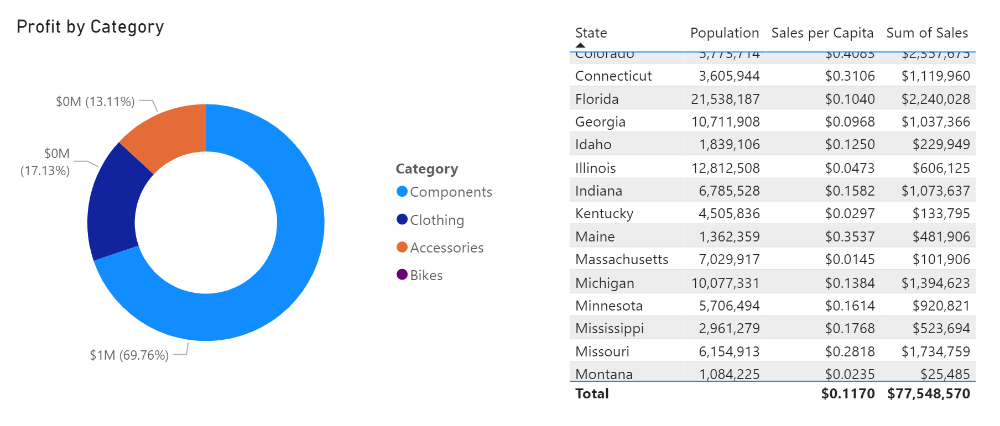
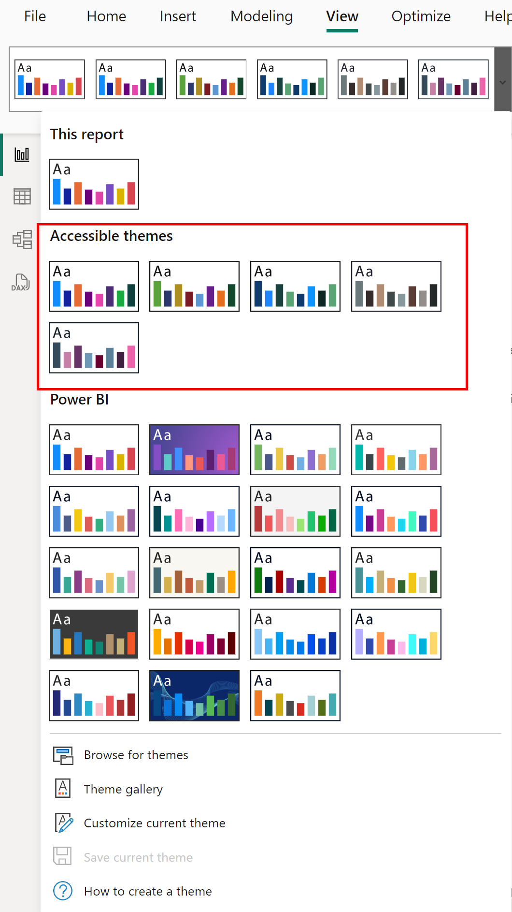
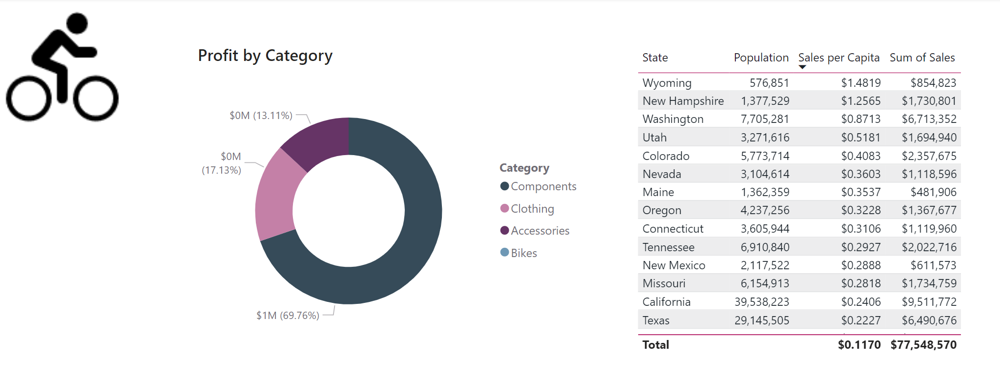
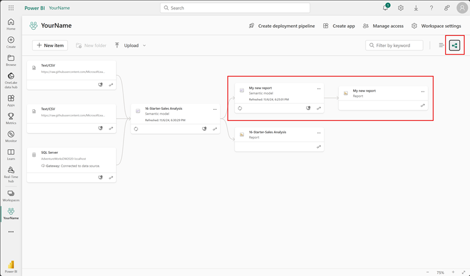

---
lab:
    title: 'Create reusable Power BI assets'
    module: 'Create reusable Power BI assets'
---

# Create reusable Power BI assets

In this exercis,e you'll create reusable assets to support semantic model and report development. These assets include Power BI Project and Template files and shared semantic models. At the end, lineage view shows how these items relate to each other in the Power BI service.

   > Note: this exercise doesn't require a Fabric license and can be completed in a Power BI or Microsoft Fabric environment.

This exercise should take approximately **30** minutes to complete.

## Before you start

Before you can start this exercise, you need to open a web browser and enter the following URL to download the zip folder:

`https://github.com/MicrosoftLearning/mslearn-fabric/raw/refs/heads/main/Allfiles/Labs/16b/16-reusable-assets.zip`

Extract the folder to the **C:\Users\Student\Downloads\16-reusable-assets** folder.

## Create a new Power BI project

In this task, you'll create a report as a Power BI Project file (*.pbip*). Power BI Project files store the report and semantic model details in flat files that work with source control. You might use Visual Studio Code to modify these files or Git to track changes.

1. From your desktop, open the Power BI Desktop app and create a blank report.

1. Select **File** > **Options and settings** > **Options** > **Preview features** and select the **Store semantic model using TMDL format** option and **OK**.

    > This enables the option to save the semantic model using Tabular Model Definition Language (TMDL), which is currently a preview feature. If prompted to restart Power BI Desktop, do so before continuing the exercise.

    

1. Select **Save as** and choose the file type by selecting the arrow in the drop-down menu when you name the file.

1. Select the **.pbip** file extension, then choose a name for your report, and save in a folder you will remember.

    

1. Notice at the top of the Power BI Desktop window that your report name has **(Power BI Project)** next to it.

1. **Save** your file again.

### Review Power BI Project file details

Let's look at how changes in Power BI Desktop are reflected in the .tmdl files.

1. From your desktop, use File explorer to navigate to the folder where you saved the **.pbip** file.
1. You should see the following items:

    - YourReport.pbip file
    - YourReport.Report folder
    - YourReport.SemanticModel folder
    - .gitignore Git Ignore Source File

## Add a new table to your report

In this task, you'll add a new table because the semantic model doesn't have all of the data you need.

1. In Power BI Desktop, navigate to **Get data > Web** to add the new data.

1. The From Web dialog box will pop up once connected. Keep the **Basic** radio button selected. Enter the following file path as the URL path.

    `C:\Users\Student\Downloads\16-reusable-assets\us-resident-population-estimates-2020.html`

1. Select the box for the **HTML Tables > Table 2**, and then select **Transform Data** to proceed.

    

1. A new Power Query Editor window will open with the Table 2 data preview.
1. Rename **Table 2** to *US Population*.
1. Rename STATE to **State** and NUMBER to **Population**.
1. Remove the RANK column.
1. Select **Close & Apply** to load the transformed data to your semantic model.
1. Select **OK** if presented a dialog box for *Potential security risk*.
1. **Save** your file.
1. If prompted, **Don't upgrade** to the Power BI Report enhanced format.

### Create a relationship

In this task, we'll make changes to the report in Power BI Desktop and see the changes in the flat .tmdl files.

1. In File explorer, find the ***YourReport*.SemanticModel** file folder.
1. Open the definition folder and notice the different files.
1. Open the **relationships.tmdl** file in a Notepad, and notice there are 9 relationships listed. Close the file.
1. Back in Power BI Desktop, navigate to the **Modeling** tab in the ribbon.
1. Select **Manage relationships** and notice there are 9 relationships.
1. Create a new relationship as follows:
    - **From**: Reseller with State-Province as Key column
    - **To**: US Population with State as Key column
    - **Cardinality**: Many-to-one (*:1)
    - **Cross-filter direction**: Both

    

1. **Save** your file.
1. Check back in the **relationships.tmdl** file and notice that a new relationship has been added.

> These changes in flat files are trackable in source control systems, unlike *.pbix* files which are binary.

## Add a measure and visual to your report

In this task, you'll add a measure and visual to extend the semantic model and use the measure in a visual.

1. In Power BI Desktop, navigate to the Data pane and select the Sales table.
1. Select **New measure** on the contextual Table tools ribbon.
1. In the formula bar, enter and commit the following code:

    ```DAX
    Sales per Capita =
    DIVIDE(
        SUM(Sales[Sales]),
        SUM('US Population'[Population])
    )
    ```

1. Locate the new **Sales per Capita** measure and drag it onto the canvas.
1. Drag **Sales \| Sales**, **US Population \| State**, and **US Population \| Population** fields to the same visual.

   > *The labs use a shorthand notation to reference a field. It will look like this: **Sales \| Unit Price**. In this example, **Sales** is the table name and **Unit Price** is the field name.*

1. Select the visual and change it to a **Table**.
1. Notice the inconsistent formatting for the Sales per Capita and Population data.
1. Select each field in the Data pane and change the format and decimal places.
    - Sales per Capita: Currency \| 4 decimal places
    - Population: Whole number \| Comma separated \| 0 decimal places

    

    > Tip: If you accidentally create a measure in the wrong table, you can easily change the Home table, as shown in the previous image.

1. Save your file.

> Your table should look like the following image with four columns and correctly formatted numbers.


## Configure a Power BI Template (.pbit) file

In this task, you'll create a template file so you can share a lightweight file with others for better collaboration.

1. Go to the Insert tab on the ribbon in Power BI Desktop and select **Images**. Navigate to your downloads folder and select the `AdventureWorksLogo.jpg` file.
1. Position this image in the top left corner.
1. Select a new visual and add **Sales \| Profit** and **Product \| Category** to it.

    > We used a Donut chart for our following screenshot.

    

1. Notice that there are 4 different colors in the legend.
1. Navigate to the **View** tab in the ribbon.
1. Select the arrow next to **Themes** to expand and see all choices.
1. Select one of the **Accessible themes** to apply to this report.

    > These themes are specifically created to be more accessible for report viewers.

1. Expand the Themes again and select **Customize current theme**.

    

1. In the Customize theme window, navigate to the **Text** tab. Change the font family to a Segoe UI font for each of the sections.

    

1. **Apply** the changes once completed.
1. Notice the different colors in the visuals with the new theme applied.

    

1. Select **File > Save as** to create the *.pbit* file.
1. Change the file type to *.pbit* and save it in the same location as the *.pbip* file.
1. Enter a description for what users can expect from this template when they use it and select OK.
1. Go back to File explorer and open the *.pbit* file and see that it looks exactly the same as the *.pbip* file.

    > In this exercise, we only want a standard report theme template without a semantic model.

1. In this same new file, delete the two visuals from the canvas.
1. Select **Transform data** on the home ribbon.
1. In Power Query Editor, select the **US population** query and right-click to delete it.
1. Select Data source settings in the ribbon and delete the **DirectQuery to AS - Power BI Semantic Model** data source and **Close**.
1. **Close & Apply**
1. Navigate back to the Themes and see that your modified Accessible theme is still applied to the report.
1. Also notice the message that *you haven't loaded any data yet* in the Data pane.
1. **Save as** a *.pbit* file with the same name you previously used to overwrite the file.
1. Close the untitled file without saving. You should still have your other *.pbip* file open.

> Now you have a template with a consistent theme without any pre-loaded data.

### Review final state

In this task, you review the following screenshot of the final outcome of the tasks performed in thie exercise. To achieve this stateu, you've created your Power BI Project file and published it to a workspace. You've then navigated to the workspace in the Power BI service and switched to the **Lineage view** to see how your new report depends on other data sources.

From left to right, the following items are visible:

- Data sources: 2 text/csv files and a SQL server connection.
- 16-Starter-Sales Analysis semantic model, which is connected to the data sources.
- 16-Starter-Sales Analysis report, which is connected to the 16-Starter-Sales Analysis semantic model.
- My new report semantic model, which is connected to the 16-Starter-Sales Analysis semantic model.
- My new report report, which is connected to the My new report semantic model.

> When semantic models relate to other semantic models, it's known as **chaining**. In this lab, the starter semantic model is chained to the newly created semantic model, enabling its reuse for a specialized purpose.




## Clean up

You've successfully completed this exercise. You created Power BI Project and Template files and specialized semantic models and reports. You can safely delete the workspace and all local assets.
