---
lab:
    title: 'Create reusable Power BI assets'
    module: 'Create reusable Power BI assets'
---

# Create reusable Power BI assets

In this exercise, you'll create reusable assets to support semantic model and report development. These assets include Power BI Project and Template files.

   > Note: this exercise doesn't require a Fabric license and can be completed in a Power BI, or Microsoft Fabric environment with a Power BI license.

This exercise should take approximately **30** minutes to complete.

## Before you start

Before you can start this exercise, you need to open a web browser and enter the following URL to download the zip folder:

`https://github.com/MicrosoftLearning/mslearn-fabric/raw/refs/heads/main/Allfiles/Labs/16b/16-reusable-assets.zip`

Extract the zip file to the **C:\Users\Student\Downloads\16-reusable-assets** folder.

## Create a new Power BI project

In this task, you'll save a report as a Power BI Project file (*.pbip*). Power BI Project files store the report and semantic model details in flat files that work with source control. You might use Visual Studio Code to modify these files or Git to track changes.

1. Open the **16-Starter-Sales Analysis.pbix** file within the **16-reusable-assets** folder.

1. Select **File** > **Options and settings** > **Options** > **Preview features** and select the **Store semantic model using TMDL format** option and **OK**.

    > This enables the option to save the semantic model using Tabular Model Definition Language (TMDL), which is currently a preview feature. If prompted to restart Power BI Desktop, do so before continuing the exercise.

    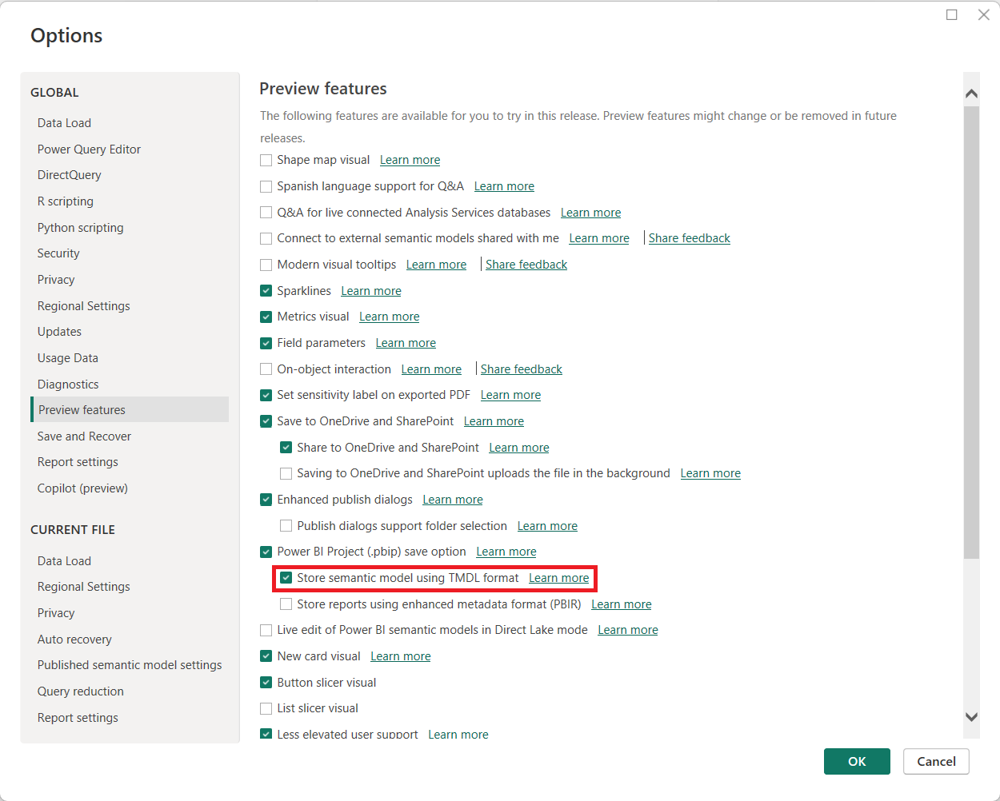

1. Select **Save as** and choose the file type by selecting the arrow in the drop-down menu when you name the file.

1. Select the **.pbip** file extension, then choose a name for your report, and save in a folder you will remember.

    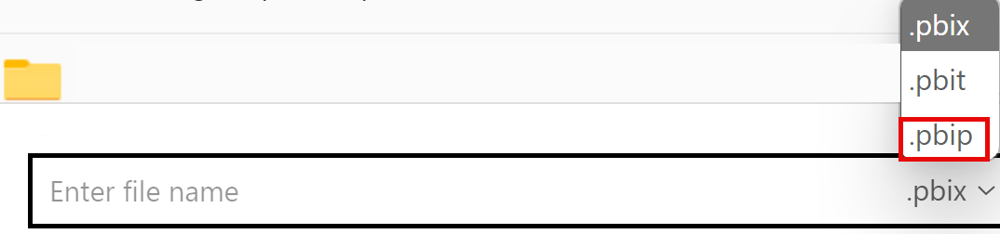

1. Notice at the top of the Power BI Desktop window that your report name has **(Power BI Project)** next to it.

1. **Close** Power BI Desktop and save your changes if prompted.

1. **Reopen** Power BI Desktop and open the **.pbip** file you just saved.

1. If prompted to **Upgrade** the project to use TMDL format, select **Upgrade** to enable the Tabular Model Definition Language format for the semantic model.

    > This upgrade is necessary to store the semantic model using TMDL format, which allows you to see the .tmdl files in the next steps.

1. **Save** your file.

### Review Power BI Project file details

Let's look at how changes in Power BI Desktop are reflected in the .tmdl files.

1. From your desktop, use File explorer to navigate to the folder where you saved the **.pbip** file.
1. You should see the following items:

    - YourReport.pbip file
    - YourReport.Report folder
    - YourReport.SemanticModel folder
    - .gitignore Git Ignore Source File

## Add a new table to your report

In this task, you'll add a new table because the semantic model doesn't have all of the data you need.

1. In Power BI Desktop, navigate to **Get data > Web** to add the new data.

1. The From Web dialog box will pop up once connected. Keep the **Basic** radio button selected. Enter the following file path as the URL path.

    `C:\Users\Student\Downloads\16-reusable-assets\us-resident-population-estimates-2020.html`

1. Select the box for the **HTML Tables > Table 2**, and then select **Transform Data** to proceed.

    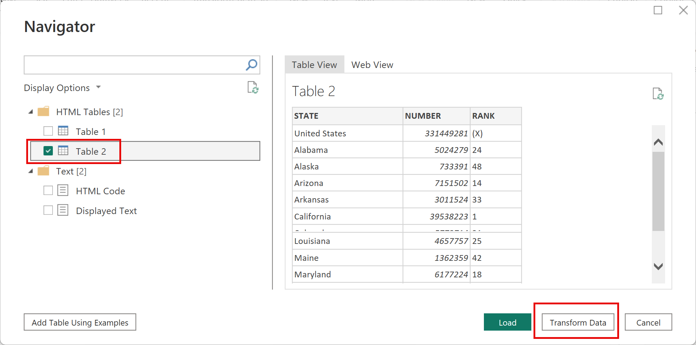

1. A new Power Query Editor window will open with the Table 2 data preview.
1. Rename **Table 2** to *US Population*.
1. Rename STATE to **State** and NUMBER to **Population**.
1. Remove the RANK column.
1. Select **Close & Apply** to load the transformed data to your semantic model.
1. Select **OK** if presented a dialog box for *Potential security risk*.
1. **Save** your file.
1. If prompted, **Don't upgrade** to the Power BI Report enhanced format.

### Create a relationship

In this task, we'll make changes to the report in Power BI Desktop and see the changes in the flat .tmdl files.

1. In File explorer, find the ***YourReport*.SemanticModel** file folder.
1. Open the definition folder and notice the different files.
1. Open the **relationships.tmdl** file in a Notepad, and notice there are 9 relationships listed. Close the file.
1. Back in Power BI Desktop, navigate to the **Modeling** tab in the ribbon.
1. Select **Manage relationships** and notice there are 9 relationships.
1. Create a new relationship as follows:
    - **From**: Reseller with State-Province as Key column
    - **To**: US Population with State as Key column
    - **Cardinality**: Many-to-one (*:1)
    - **Cross-filter direction**: Both

    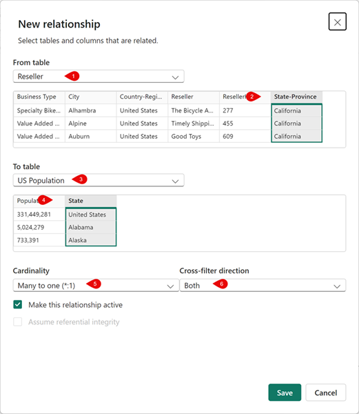

1. **Save** your file.
1. Check back in the **relationships.tmdl** file and notice that a new relationship has been added.

> These changes in flat files are trackable in source control systems, unlike *.pbix* files which are binary.

## Add a measure and visual to your report

In this task, you'll add a measure and visual to extend the semantic model and use the measure in a visual.

1. In Power BI Desktop, navigate to the Data pane and select the Sales table.
1. Select **New measure** on the contextual Table tools ribbon.
1. In the formula bar, enter and commit the following code:

    ```DAX
    Sales per Capita =
    DIVIDE(
        SUM(Sales[Sales]),
        SUM('US Population'[Population])
    )
    ```

1. Locate the new **Sales per Capita** measure and drag it onto the canvas.
1. Drag **Sales \| Sales**, **US Population \| State**, and **US Population \| Population** fields to the same visual.

   > *The labs use a shorthand notation to reference a field. It will look like this: **Sales \| Unit Price**. In this example, **Sales** is the table name and **Unit Price** is the field name.*

1. Select the visual and change it to a **Table**.
1. Notice the inconsistent formatting for the Sales per Capita and Population data.
1. Select each field in the Data pane and change the format and decimal places.
    - Sales per Capita: Currency \| 4 decimal places
    - Population: Whole number \| Comma separated \| 0 decimal places

    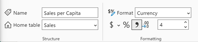

    > Tip: If you accidentally create a measure in the wrong table, you can easily change the Home table, as shown in the previous image.

1. Save your file.

    > Note: Your table should look like the following image with four columns and correctly formatted numbers.

    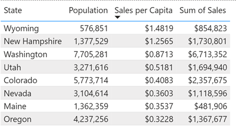


1. Open Notepad
1. Open the file: `C:\Users\Student\Downloads\16-Starter-Sales Analysis.SemanticModel\definition\tables\Sales.tmdl`
1. Locate the code around line 163 where you can observe the measure has been added like this:
   
    ```tmdl
    
    	measure 'Sales per Capita' =
    			
    			DIVIDE(
    			    SUM(Sales[Sales]),
    			    SUM('US Population'[Population])
    			)
    		formatString: \$#,0.0000;(\$#,0.0000);\$#,0.0000
    		lineageTag: c95a1828-af50-484b-8310-64614fe2504b
    
    		annotation PBI_FormatHint = {"currencyCulture":"en-US"}
    ```

1. Close Notepad.
2. Close Power BI Desktop. There is no need to save changes.

## Create a reusable Power BI Template (PBIT)

The goal of this next part of the exercise is to demonstrate how **Power BI templates (PBIT files)** can separate report logic from data by using a Power Query parameter—in this case, a **Region** parameter. You will build a small report, define a parameter that controls which region’s data is loaded, and then export the report as a reusable template. When reopening the template, users can simply select a region value, and the report will automatically load the corresponding dataset, showing how templates enable scalable, standardized reporting across multiple variations of the same data model.

### Explore Region Sales Data

1. Open Windows Explorer and navigating to the folder where the region data is stored. This should look like `C:\Users\student\Downloads\16-reusable-assets\data`. Inside this folder, you will find two CSV files:
   
   - region-north.csv
   - region-south.csv

1. Take a moment to open each file (you can use Notepad, Excel, or any text editor) and explore the contents. Observe the structure of the data, the columns available, and how the two regional datasets are similar. Notice the region north and south. This familiarity will help you understand what Power BI will load later and how the Region parameter will be used to switch between them.

### Create the Power BI report and Load data

1. Open Power BI Desktop, and create a blank report.
1. From the **Home** ribbon, select **Get Data** and choose **Text/CSV**.
1. Load the `C:\Users\Student\Downloads\16-reusable-assets\data\region-north.csv` file.
1. Select **Transform Data**
1. Rename the query to `sales`

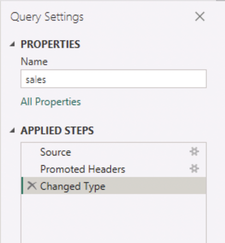

### Create a Power Query Parameter

1. In Power Query, from the **Home** ribbon, select **Manage Parameters** and choose **New Parameter**.
1. Create the parameter with the following values:
   
    | Property         | Value                 |
    | ---------------- | --------------------- |
    | Name             | `Region`.             |
    | Type             | Text                  |
    | Suggested Values | List of values        |
    | Table            | north, south          |
    | Default Value    | north                 |
    | Current Value    | north                 |

    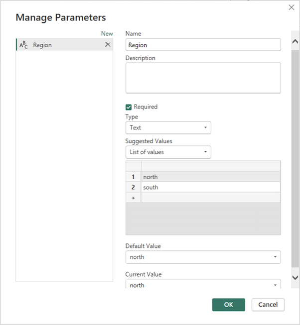

### Modify Your Query to Use the Parameter

We want Power BI to allow the user to choose the region when they open the template.

1. Select the **sales** query again.
1. From the **View** ribbon, select **Advanced Editor**.
1. Notice the query is hard-coded to region-north.csv

    ```powerquery
    let
        Source = Csv.Document(File.Contents("C:\Users\Student\Downloads\16-reusable-assets\data\region-north.csv"),[Delimiter=",", Columns=5, Encoding=1252, QuoteStyle=QuoteStyle.None]),
        #"Promoted Headers" = Table.PromoteHeaders(Source, [PromoteAllScalars=true]),
        #"Changed Type" = Table.TransformColumnTypes(#"Promoted Headers",{ {"Date", type date}, {"Region", type text}, {"Product", type text}, {"Units", Int64.Type}, {"Revenue", Int64.Type} })
    in
        #"Changed Type"
    ```
    
1. Replace the hard-coded region (north) with the parameter **Region**. 
    
    ```m
    let
        Source = Csv.Document(File.Contents("C:\Users\Student\Downloads\16-reusable-assets\data\region-" & Region & ".csv"),[Delimiter=",", Columns=5, Encoding=1252, QuoteStyle=QuoteStyle.None]),
        #"Promoted Headers" = Table.PromoteHeaders(Source, [PromoteAllScalars=true]),
        #"Changed Type" = Table.TransformColumnTypes(#"Promoted Headers",{ {"Date", type date}, {"Region", type text}, {"Product", type text}, {"Units", Int64.Type}, {"Revenue", Int64.Type} })
    in
        #"Changed Type"
    ```
    
    > **Note**: In Power Query (M language), text values must be enclosed in quotation marks " ", and you combine (concatenate) text pieces using the ampersand & operator.

1. Select **Close & Apply** from the **Home** ribbon.

### Create a simple report

1. Go back to the report view.
1. Create:
   - A Card showing total Revenue
   - A Column Chart showing Revenue by Product
   - A Table showing all fields

1. Add a title: `Regional Sales Report Template`

The report could look like this. Don't worry about the layout.

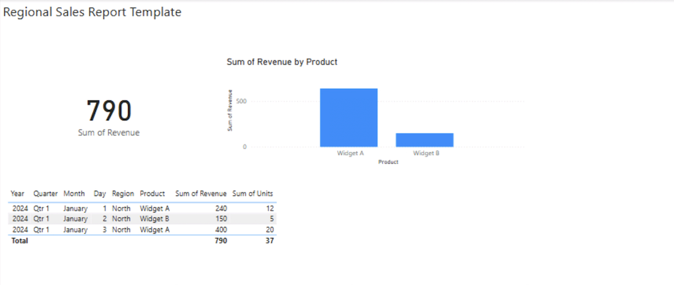

### Save as a Template (PBIT)

1. From the **Home** ribbon, select **File** > **Save as**.
1. Select a folder location (for example **Downloads**), and enter a file name. For example `regional-sales`.
1. Choose **PBIT** as the file extension.

    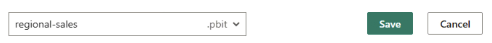

1. When asked to provide a template description, enter the following text:

    ```txt
    Select your region.
    ```
    
    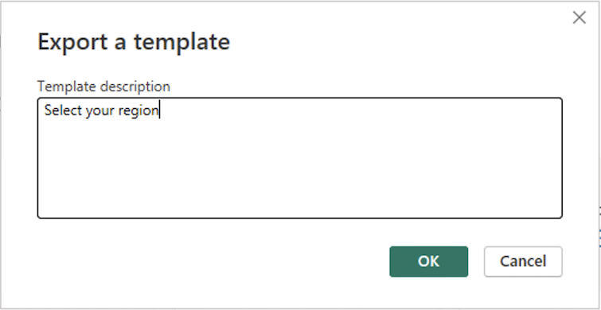

### Test the template

1. Close Power BI Desktop. When asked to save your changes, can you choose **Don't save**.
1. Open the `regional-sales.pbit` file.
1. Notice you will get a parameter prompt asking you to select your region. 

    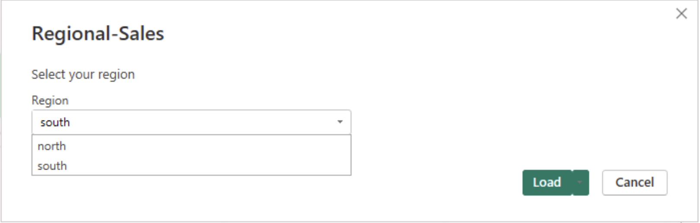

1. Choose **south** from the dropdown list.
1. Load the data and open the report.

Notice how the report opens correctly the south-region values.

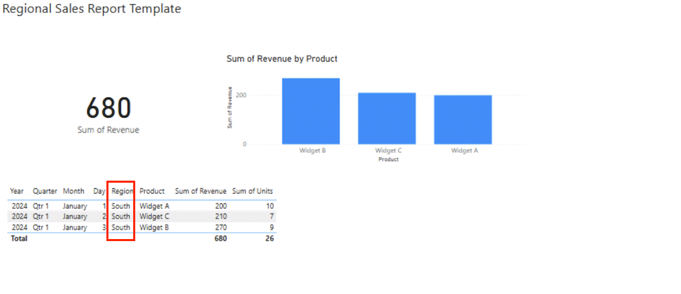

You now have a fully reusable, parameterized reporting framework. 

1. Close the report, you don't need to save it.


## Clean up

You've successfully completed this exercise. You created Power BI Project and Template files. You can safely delete the workspace and all local assets.
