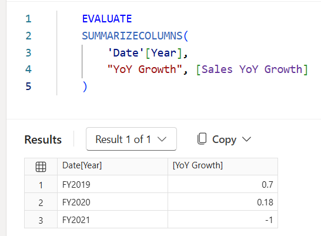

---
lab:
    title: 'Optimize semantic model performance'
    module: 'Optimize semantic model performance'
    description: 'Use Performance analyzer in Power BI Desktop to diagnose report visual performance, identify expensive DAX patterns, apply optimizations, and verify improvements.'
    duration: 30 minutes
    level: 300
    islab: true
    primarytopics:
        - Power BI
        - Semantic models
        - DAX optimization
        - Performance analyzer
    categories:
        - Semantic models
    courses:
        - DP-600
---

# Optimize semantic model performance

In this exercise, you open a Power BI Desktop report built on AdventureWorks sales data. The report contains measures that use inefficient DAX patterns. You use Performance analyzer to capture timing data, identify the most expensive visual, analyze the DAX query, apply an optimization, and re-measure to confirm the improvement. You also explore cardinality by examining column statistics in the model. You learn how to:

- Use Performance analyzer to capture and interpret timing data for report visuals.
- Export a slow DAX query and analyze it in DAX query view.
- Identify and fix expensive DAX patterns using variables.
- Examine column cardinality to understand where memory consumption is highest.
- Verify performance improvements by comparing before and after measurements.

This lab takes approximately **30** minutes to complete.

## Before you start

You need [Power BI Desktop](https://www.microsoft.com/download/details.aspx?id=58494) (November 2025 or newer) installed to complete this exercise. *Note: UI elements may vary slightly depending on your version.*

1. Open a web browser and enter the following URL to download the [16-optimize-performance zip folder](https://github.com/MicrosoftLearning/mslearn-fabric/raw/refs/heads/main/Allfiles/Labs/16/16-optimize-performance.zip):

    `https://github.com/MicrosoftLearning/mslearn-fabric/raw/refs/heads/main/Allfiles/Labs/16/16-optimize-performance.zip`

1. Save the file in **Downloads** and extract the zip file to the **16-optimize-performance** folder.

1. Open the **16-Starter-Sales Analysis.pbix** file from the folder you extracted.

    > **Note**: Ignore and close any warnings asking to apply changes, but don't select *Discard changes*.

This file contains an AdventureWorks sales model with a report page that includes several visuals. Some measures in this model use intentionally inefficient DAX patterns that you identify and fix.

## Capture a performance baseline

In this task, you use Performance analyzer to measure how long each visual takes to load. These timings serve as your baseline so you can compare them after you apply an optimization.

1. In Power BI Desktop, navigate to the **Sales Overview** report page.

1. On the **Optimize** ribbon, select **Performance analyzer**.

    The Performance analyzer pane opens on the right side of the report canvas.

1. In the Performance analyzer pane, select **Start recording**.

1. Select **Refresh visuals** to reload all visuals on the current page.

1. Wait for all visuals to finish loading, then select **Stop recording**.

1. In the Performance analyzer results, expand the entry for the **Table** visual. This table displays Year, Total Sales, and Sales YoY Growth.

1. Take note of the **DAX query** time (in milliseconds) for this visual. This is your baseline.

    > **Note**: With the AdventureWorks dataset, query times may be small (under 500 ms). That's expected — this dataset isn't large. The goal is to learn the diagnostic process. Even a change from 80 ms to 30 ms demonstrates that the optimization worked. If all timings appear identical, select **Clear**, then select **Refresh visuals** again to get uncached measurements.

## Analyze the slow DAX query

In this task, you export the DAX query for the **Table** visual and examine its structure. Then you look at the underlying measure formula to find the inefficient pattern.

1. In the Performance analyzer pane, expand the entry for the **Table** visual if it isn't already expanded.

1. Select **Run in DAX query view**. Power BI Desktop opens DAX query view with the visual's generated query.

1. Select **Run** to execute the query. The result grid shows values for each fiscal year: `Total_Sales` and `Sales_YoY_Growth`.

1. Review the generated query. It looks something like this:

    ```DAX
    DEFINE
        VAR __DS0Core = 
            SUMMARIZECOLUMNS(
                ROLLUPADDISSUBTOTAL('Date'[Year], "IsGrandTotalRowTotal"),
                "Total_Sales", 'Sales'[Total Sales],
                "Sales_YoY_Growth", 'Sales'[Sales YoY Growth]
            )

        VAR __DS0PrimaryWindowed = 
            TOPN(502, __DS0Core, [IsGrandTotalRowTotal], 0, 'Date'[Year], 1)

    EVALUATE
        __DS0PrimaryWindowed

    ORDER BY
        [IsGrandTotalRowTotal] DESC, 'Date'[Year]
    ```

    > This query is not the measure definition itself. Power BI generates this query to populate the visual. `SUMMARIZECOLUMNS` groups the data by year, `ROLLUPADDISSUBTOTAL` adds the grand total row, and `TOPN` caps the row count. The measures (`[Total Sales]` and `[Sales YoY Growth]`) are referenced by name, but their formulas aren't shown here because they live in the model. To see the actual measure logic, you need to look in the formula bar.

1. Switch back to **Report view**. In the **Data** pane, expand the **Sales** table and select the **Sales YoY Growth** measure. The formula bar shows the measure definition:

    ```DAX
    Sales YoY Growth =
    DIVIDE(
        [Total Sales] - CALCULATE([Total Sales], SAMEPERIODLASTYEAR('Date'[Date])),
        CALCULATE([Total Sales], SAMEPERIODLASTYEAR('Date'[Date]))
    )
    ```

1. Look at the formula. The `CALCULATE([Total Sales], SAMEPERIODLASTYEAR('Date'[Date]))` expression appears twice, in the numerator and the denominator, but it calculates the same value both times. This means the engine evaluates the prior-year sales calculation twice per row in the query, which is wasteful.

    Common inefficient patterns like this include:

    - **Repeated subexpressions**: The same `CALCULATE` evaluated multiple times without storing it in a `VAR`.
    - **FILTER on a full table**: `FILTER(Sales, ...)` iterating every row instead of using a column predicate in `CALCULATE`.
    - **COUNTROWS(FILTER(...))**: Counting rows by iterating a filtered table instead of using `CALCULATE(COUNTROWS(...), ...)`.

The **Sales YoY Growth** measure has a repeated subexpression — the prior-year calculation is evaluated twice. In the next task, you fix this by storing it in a variable.

## Optimize the DAX measure

In this task, you rewrite the **Sales YoY Growth** measure using a variable so the prior-year calculation is evaluated only once.

1. In **Report view**, select the **Sales YoY Growth** measure in the **Data** pane so its formula appears in the formula bar.

1. Select all the text in the formula bar and replace it with the following optimized version:

    ```DAX
    Sales YoY Growth =
    VAR SalesPriorYear =
        CALCULATE([Total Sales], SAMEPERIODLASTYEAR('Date'[Date]))
    RETURN
        DIVIDE([Total Sales] - SalesPriorYear, SalesPriorYear)
    ```

    The `VAR` stores the prior-year result once. The `RETURN` expression references `SalesPriorYear` twice without recalculating it.

1. Press **Enter** to confirm the formula change.

1. To verify the measure still returns the correct values, switch to **DAX query view**, open a new query tab, and run the following query:

    ```DAX
    EVALUATE
    SUMMARIZECOLUMNS(
        'Date'[Year],
        "YoY Growth", [Sales YoY Growth]
    )
    ```

    Compare the results to what you saw earlier. The values should be the same — for example, FY2019 should still show approximately 0.7 and FY2020 approximately 0.18. The optimization changes speed, not results.

    

## Examine column cardinality

In this task, you use the `COLUMNSTATISTICS()` DAX function to see how many distinct values each column contains. Columns with high cardinality compress less efficiently and consume more memory. Understanding where cardinality is highest helps you make informed decisions about model design.

1. Switch to **DAX query view** in Power BI Desktop.

1. In a new query tab, enter the following query and select **Run**:

    ```DAX
    DEFINE
        VAR _stats = COLUMNSTATISTICS()
    EVALUATE
        FILTER(_stats, NOT CONTAINSSTRING([Column Name], "RowNumber-"))
    ORDER BY [Cardinality] DESC
    ```

    > The result grid returns one row per column in the model, sorted by the number of distinct values. The `FILTER` excludes internal system columns that aren't part of your model. The columns with the highest cardinality appear at the top.

1. Review the results and notice where the highest cardinality columns come from:

    - **SalesOrderNumber** in the **Sales** table has the highest cardinality (3,616) — nearly one distinct value per row. This is typical for transaction identifiers in fact tables.
    - **Date** in the **Date** table is second (1,826). The calendar table covers a wider date range than the actual sales data, so it has more distinct values than **OrderDate** (990) in the **Sales** table.
    - **Cost** (1,430) and **Sales** (1,411) have high cardinality for numeric columns — many distinct decimal values. Rounding to fewer decimal places is one way to reduce cardinality for numeric columns.
    - **ResellerKey** (701) and **Reseller** (699) are nearly 1:1, which is expected for a dimension key and its label.

1. Notice that fact table columns (**Sales**) dominate the top of the list. In a star schema, dimension tables stay small while fact tables drive memory consumption. This is why fact table optimization has the biggest impact.

## Verify the improvements

In this task, you re-run Performance analyzer to compare against your baseline now that you've optimized the Sales YoY Growth measure.

1. Switch to **Report view** and open the Performance analyzer pane if it isn't already open.

1. Select **Clear**, then select **Start recording**.

1. Select **Refresh visuals** and wait for all visuals to finish loading.

1. Select **Stop recording**.

1. Expand the **Table** visual entry and compare its **DAX query** time to the baseline you recorded earlier.

    > **Note**: The absolute difference may be small with this dataset. The important takeaway is the process: measure → diagnose → fix → verify.

    

## Try it with Copilot (Optional)

In this task, you use Copilot in DAX query view to get AI-powered suggestions for simplifying and optimizing your DAX queries.

If Copilot is available in your Power BI Desktop environment, try these additional steps:

1. In Performance analyzer, select **Copy query** for any visual.

1. Switch to DAX query view. Paste the query and ask Copilot:

    `Simplify this DAX query and suggest performance improvements.`

1. Review Copilot's suggestions. Compare them to the manual optimization you applied.

1. Ask Copilot:

    `Explain why evaluating the same CALCULATE expression twice is slower than using a variable.`

1. Optionally, ask Copilot to generate a new measure using best practices from the start:

    `Write a measure that calculates profit margin percentage using variables for Sales and Cost.`

> **Note**: Copilot generates new insights and suggestions without changing the measures you already optimized.

## Clean up resources

1. Close Power BI Desktop. There's no need to save the file.
