---
lab:
    title: 'Enforce semantic model security'
    module: 'Design and build tabular models'
---

# Enforce semantic model security

In this exercise, you will update a pre-developed data model to enforce security. Specifically, salespeople at the Adventure Works company should only be able to see sales data related to their assigned sales region.

In this exercise, you learn how to:

- Create static roles.
- Create dynamic roles.
- Validate roles.
- Map security principals to semantic model roles.

This lab takes approximately **45** minutes to complete.

> **Note**: You need a [Microsoft Fabric trial](https://learn.microsoft.com/fabric/get-started/fabric-trial) to complete this exercise.

## Get started

In this exercise, you will prepare your environment.

### Download the Power BI starter file

1. Download the [Sales Analysis starter file](https://aka.ms/fabric-security-starter) from `https://aka.ms/fabric-security-starter` and save it on your local computer (in any folder).

1. Navigate to the downloaded file and open it in Power BI Desktop.

1. When prompted, sign in with a work or school account.

### Sign in to the Power BI service

In this task, you will sign in to the Power BI service, start a trial license, and create a workspace.

1. In a web browser, go to `https://app.powerbi.com/`.

2. Complete the sign in process with the same account used in Power BI Desktop.

    *Important: You must use the same credentials used to sign in from Power BI Desktop.*

    *Tip: The Power BI web browser experience is known as the **Power BI service**.*

### Create a workspace

In this task, you will create a workspace.

1. In the Power BI service, to create a workspace, in the **Navigation** pane (located at the left), select **Workspaces**, and then select **+ New workspace**.

2. In the **Create a workspace** pane (located at the right), in the **Name** box, enter a name for the workspace.

    *The workspace name must be unique within the tenant.*

3. Select **Apply**.

    *Once created, the workspace is opened. In a later exercise, you will publish a semantic model to this workspace.*

### Review the data model

In this task, you will review the data model.

1. In Power BI Desktop, at the left, switch to **Model** view.

    

2. Use the model diagram to review the model design.

    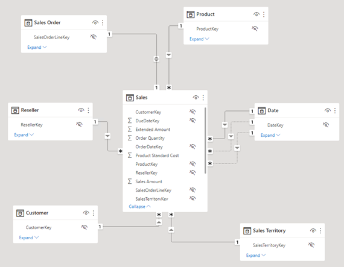

    *The model comprises six dimension tables and one fact table. The **Sales** fact table stores sales order details. It's a classic star schema design.*

3. Expand open the **Sales Territory** table.

    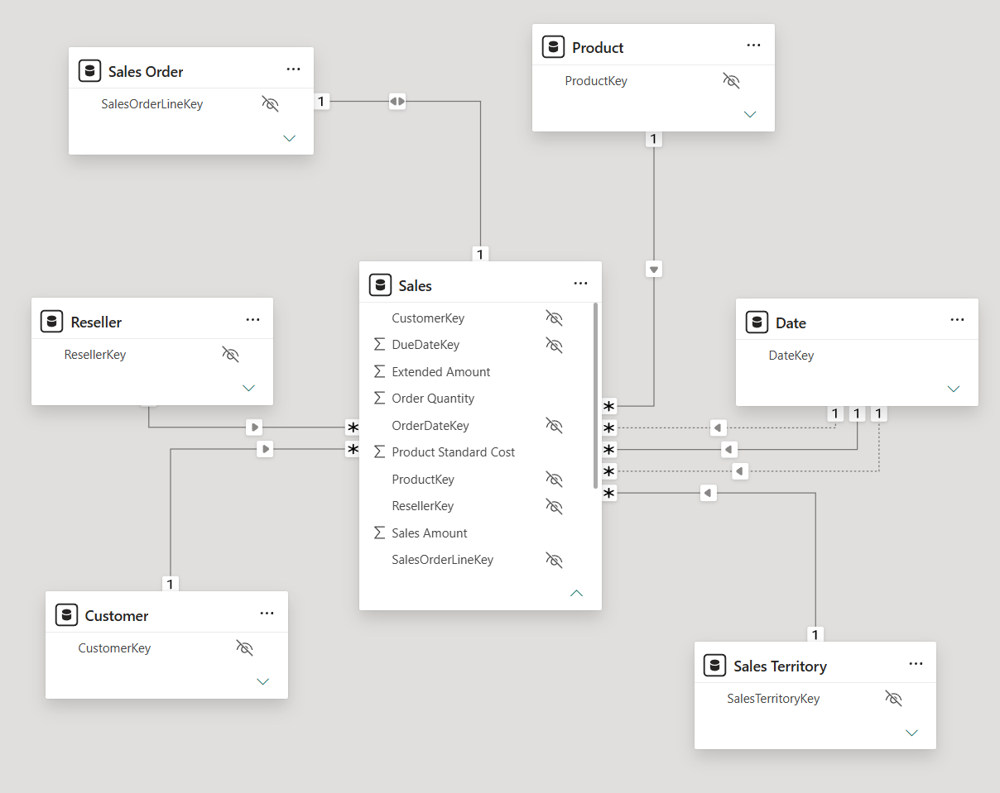

4. Notice that the table includes a **Region** column.

    *The **Region** column stores the Adventure Works sales regions. At this organization, salespeople are only allowed to see data related to their assigned sales region. In this lab, you will implement two different row-level security techniques to enforce data permissions.*

## Create static roles

In this exercise, you will create and validate static roles, and then see how you would map security principals to the semantic model roles.

### Create static roles

In this task, you will create two static roles.

1. Switch to **Report** view.

    

2. In the stacked column chart visual, in the legend, notice (for now) that it's possible to see many regions.

    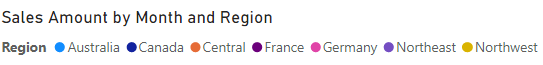

    *For now, the chart looks overly busy. That's because all regions are visible. When the solution enforces row-level security, the report consumer will see only one region.*

3. To add a security role, on the **Modeling** ribbon tab, from inside the **Security** group, select **Manage roles**.

    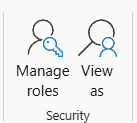

4. In the **Manage roles** window, select **Create**.

    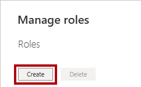

5. To name the role, replace the selected text with **Australia**, and then press **Enter**.

    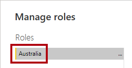

6. In the **Tables** list, for the **Sales Territory** table, select the ellipsis, and then select **Add filter** > **[Region]**.

    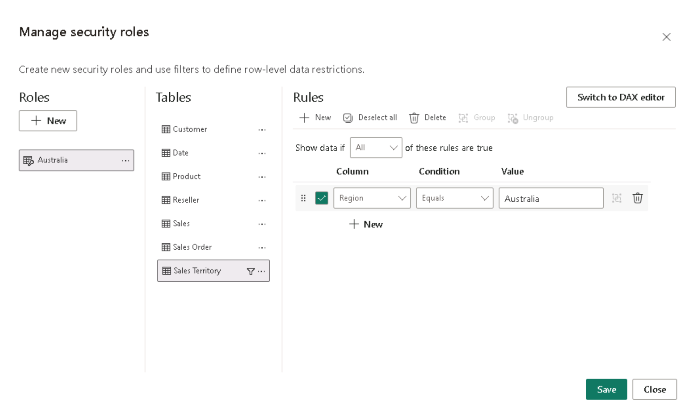

7. In the **Table filter DAX expression** box, replace **Value** with **Australia**.

    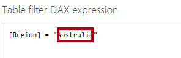

    *This expression filters the **Region** column by the value **Australia**.*

8. To create another role, press **Create**.

    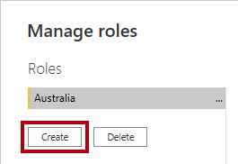

9. Repeat the steps in this task to create a role named **Canada** that filters the **Region** column by **Canada**.

    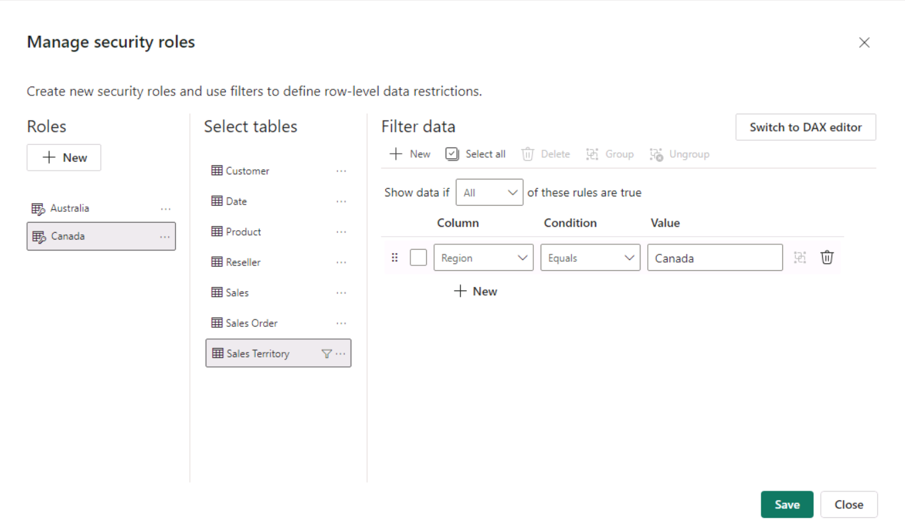

    *In this lab, you'll create just the two roles. Consider, however, that in a real-world solution, a role must be created for each of the 11 Adventure Works regions.*

10. Select **Save**.

	

### Validate the static roles

In this task, you will validate one of the static roles.

1. On the **Modeling** ribbon tab, from inside the **Security** group, select **View as**.

    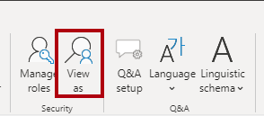

2. In the **View as roles** window, select the **Australia** role.

    

3. Select **OK**.

    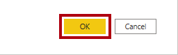

4. On the report page, notice that the stacked column chart visual shows only data for Australia.

    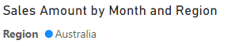

5. Across the top of the report, notice the yellow banner that confirms the enforced role.

    

6. To stop viewing by using the role, at the right of the yellow banner, select **Stop viewing**.

	

### Publish the report

In this task, you will publish the report.

1. Save the Power BI Desktop file. When asked to apply pending changes, select **Apply later**.

	

2. To publish the report, on the **Home** ribbon tab, select **Publish**.

    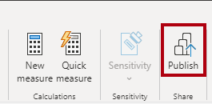

3. In the **Publish to Power BI** window, select your workspace, and then select **Select**.

    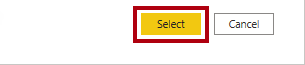

4. When the publishing succeeds, select **Got it**.

    

### Configure row-level security (*optional*)

In this task, you will see how to configure row-level security in the Power BI service.

This task relies on the existence of a **Salespeople_Australia** security group in the tenant you are working in. This security group does NOT automatically exist in the tenant. If you have permissions on your tenant, you can follow the steps below. If you are using a tenant provided to you in training, you will not have the appropriate permissions to create security groups. Please read through the tasks, but note that you will not be able to complete them in the absence of the existence of the security group. **After reading through, proceed to the Clean Up task.**

1. Switch to the Power BI service (web browser).

2. In the workspace landing page, notice the **Sales Analysis - Enforce model security** semantic model.

    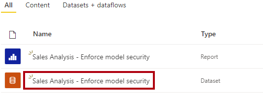

3. Hover the cursor over the semantic model, and when the ellipsis appears, select the ellipsis, and then select **Security**.

    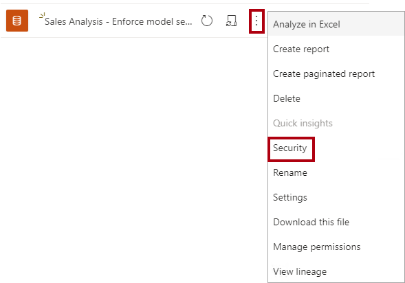

    *The **Security** option supports mapping Microsoft Azure Active Directory (Azure AD) security principals, which includes security groups and users.*

4. At the left, notice the list of roles, and that **Australia** is selected.

    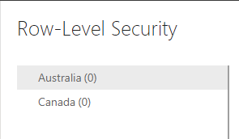

5. In the **Members** box, commence entering **Salespeople_Australia**.

    *Steps 5 through 8 are for demonstration purposes only, as they rely on the creation or existence of a Salespeople_Australia security group. If you have permissions and the knowledge to create security groups, please feel free to proceed. Otherwise, continue to the Clean Up task.*

    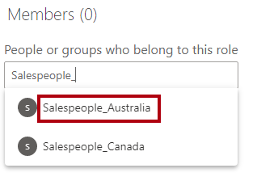

6. Select **Add**.

    

7. To complete the role mapping, select **Save**.

    

    *Now all members of the **Salespeople_Australia** security group are mapped to the **Australia** role, which restricts data access to view only Australian sales.*

    *In a real-world solution, each role should be mapped to a security group.*

    *This design approach is simple and effective when security groups exist for each region. However, there are disadvantages: it requires more effort to create and set up. It also requires updating and republishing the semantic model when new regions are onboarded.*

    *In the next exercise, you will create a dynamic role that is data-driven. This design approach can help address these disadvantages.*

8. To return to the workspace landing page, in the **Navigation** pane, select the workspace.

### Clean up the solution

In this task, you will clean up the solution by removing the semantic model and the model roles.

1. To remove the semantic model, hover the cursor over the semantic model, and when the ellipsis appears, select the ellipsis, and then select **Delete**.

    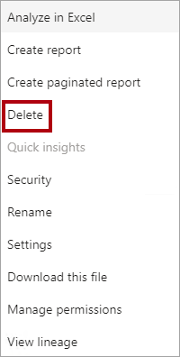

    *You will republish a revised semantic model in the next exercise.*

2. When prompted to confirm the deletion, select **Delete**.

    

3. Switch to Power BI Desktop.

4. To remove the security roles, on the **Modeling** ribbon tab, from inside the **Security** group, select **Manage roles**.

    

5. In the **Manage roles** window, to remove the first role, select **Delete**.

    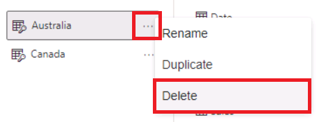

6. When prompted to confirm the deletion, press **Yes, delete**.

    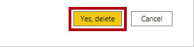

7. Also remove the second role.

8. Select **Save**.

    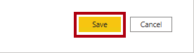

## Create a dynamic role

In this exercise, you will add a table to the model, create and validate a dynamic role, and then map a security principal to the semantic model role.

### Add the Salesperson table

In this task, you will add the **Salesperson** table to the model.

1. Switch to **Model** view.

    

2. On the **Home** ribbon tab, from inside the **Queries** group, select the **Transform data** icon.

    

    *If you are prompted to specify how to connect, **Edit Credentials** and specify how to sign-in.*

    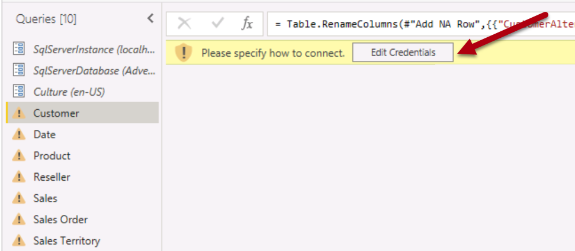

    *Select **Connect***

     

    *In the **Encryption Support** page, select **OK**.*

3. In the **Power Query Editor** window, in the **Queries** pane (located at the left), right-click the **Customer** query, and then select **Duplicate**.

    

    *Because the **Customer** query already includes steps to connect the data warehouse, duplicating it is an efficient way to commence the development of a new query.*

4. In the **Query Settings** pane (located at the right), in the **Name** box, replace the text with **Salesperson**.

    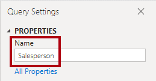

5. In the **Applied Steps** list, right-click the **Removed Other Columns** step (third step), and then select **Delete Until End**.

    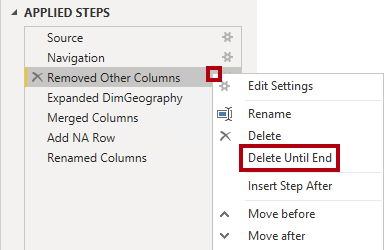

6. When prompted to confirm deletion of the step, select **Delete**.

    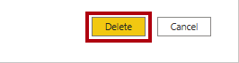

7. To source data from a different data warehouse table, in the **Applied Steps** list, in the **Navigation** step (second step), select the gear icon (located at the right).

    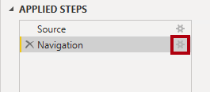

8. In the **Navigation** window, select the **DimEmployee** table.

    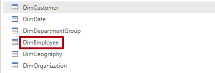

9. Select **OK**.

    

10. To remove unnecessary columns, on the **Home** ribbon tab, from inside the **Manage Columns** group, select the **Choose Columns** icon.

    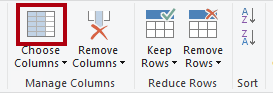

11. In the **Choose Columns** window, uncheck the **(Select All Columns)** item.

    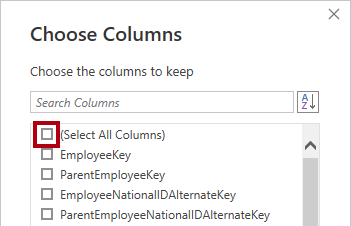

12. Check the following three columns:

    - EmployeeKey

    - SalesTerritoryKey

    - EmailAddress

13. Select **OK**.

    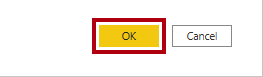

14. To rename the **EmailAddress** column, double-click the **EmailAddress** column header.

15. Replace the text with **UPN**, and then press **Enter**.

    *UPN is an acronym for User Principal Name. The values in this column match the Azure AD account names.*

    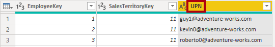

16. To load the table to the model, on the **Home** ribbon tab, select the **Close &amp; Apply** icon.

    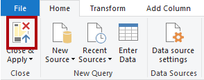

17. When the table has added to the model, notice that a relationship to the **Sales Territory** table was automatically created.

### Configure the relationship

In this task, you will configure properties of the new relationship.

1. Right-click the relationship between the **Salesperson** and **Sales Territory** tables, and then select **Properties**.

    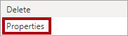

2. In the **Edit relationship** window, in the **Cross filter direction** dropdown list, select **Both**.

3. Check the **Apply security filter in both directions** checkbox.

    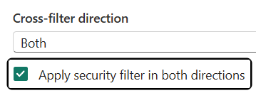

    *Because there' a one-to-many relationship from the **Sales Territory** table to the **Salesperson** table, filters propagate only from the **Sales Territory** table to the **Salesperson** table. To force propagation in the other direction, the cross filter direction must be set to both.*

4. Select **OK**.

    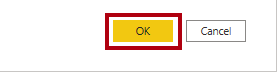

5. To hide the table, at the top-right of the **Salesperson** table, select the eye icon.

    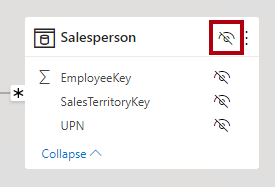

    *The purpose of the **Salesperson** table is to enforce data permissions. When hidden, report authors and the Q&A experience won't see the table or its fields.*

### Create a dynamic role

In this task, you will create a dynamic role, which enforces permissions based on data in the model.

1. Switch to **Report** view.

    

2. To add a security role, on the **Modeling** ribbon tab, from inside the **Security** group, select **Manage roles**.

    

3. In the **Manage roles** window, select **Create**.

    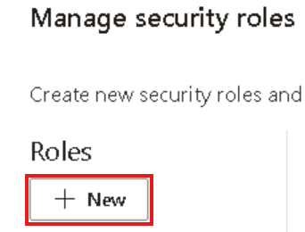

4. To name the role, replace the selected text with **Salespeople**.

    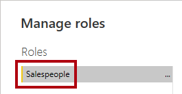

    *This time, only one role needs to be created.*

5. Add a filter to the **UPN** column of the **Salesperson** table.

    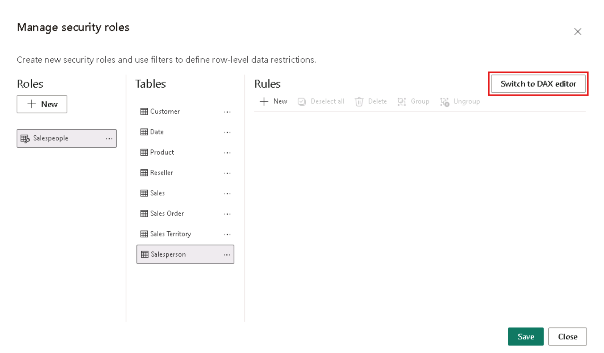

6. In the **Table filter DAX expression** box, replace **"Value"** with `USERPRINCIPALNAME()`.

    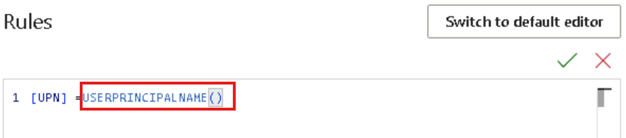

    *This expression filters the **UPN** column by the USERPRINCIPALNAME function, which returns the user principal name (UPN) of the authenticated user.*

    *When the UPN filters the **Salesperson** table, it filters the **Sales Territory** table, which in turn filters the **Sales** table. This way, the authenticated user will only see sales data for their assigned region.*

7. Select **Save**.

    

### Validate the dynamic role

In this task, you will validate the dynamic role.

1. On the **Modeling** ribbon tab, from inside the **Security** group, select **View as**.

    

2. In the **View as roles** window, check **Other user**, and then in the corresponding box, enter: `michael9@adventure-works.com`.

    

    *For testing purposes, **Other user** is the value that will be returned by the USERPRINCIPALNAME function. Note that this salesperson is assigned to the **Northeast** region.*

3. Check the **Salespeople** role.

    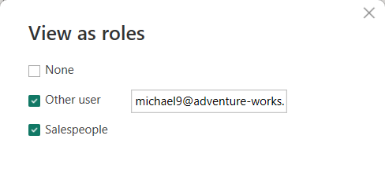

4. Select **OK**.

    

5. On the report page, notice that the stacked column chart visual shows only data for Northeast.

    

6. Across the top of the report, notice the yellow banner that confirms the enforced role.

    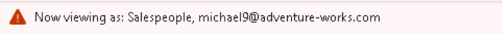

7. To stop viewing by using the role, at the right of the yellow banner, select **Stop viewing**.

    

### Finalize the design

In this task, you will finalize the design by publishing the report and mapping a security group to the role.

*The steps in this task are deliberately brief. For full step details, refer to the task steps of the previous exercise.*

1. Save the Power BI Desktop file.

2. Publish the report to the workspace you created at the beginning of the lab.

3. Close Power BI Desktop.

4. Switch to the Power BI service (web browser).

5. Go to the security settings for the **Sales Analysis - Enforce model security** semantic model.

6. Map the **Salespeople** security group the **Salespeople** role.

    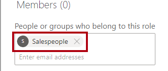

    *Now all members of the **Salespeople** security group are mapped to the **Salespeople** role. Providing the authenticated user is represented by a row in the **Salesperson** table, the assigned sales territory will be used to filter the sales table.*

    *This design approach is simple and effective when the data model stores the user principal name values. When salespeople are added or removed, or are assigned to different sales territories, this design approach will simply work.*
