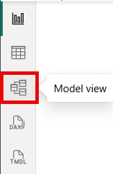
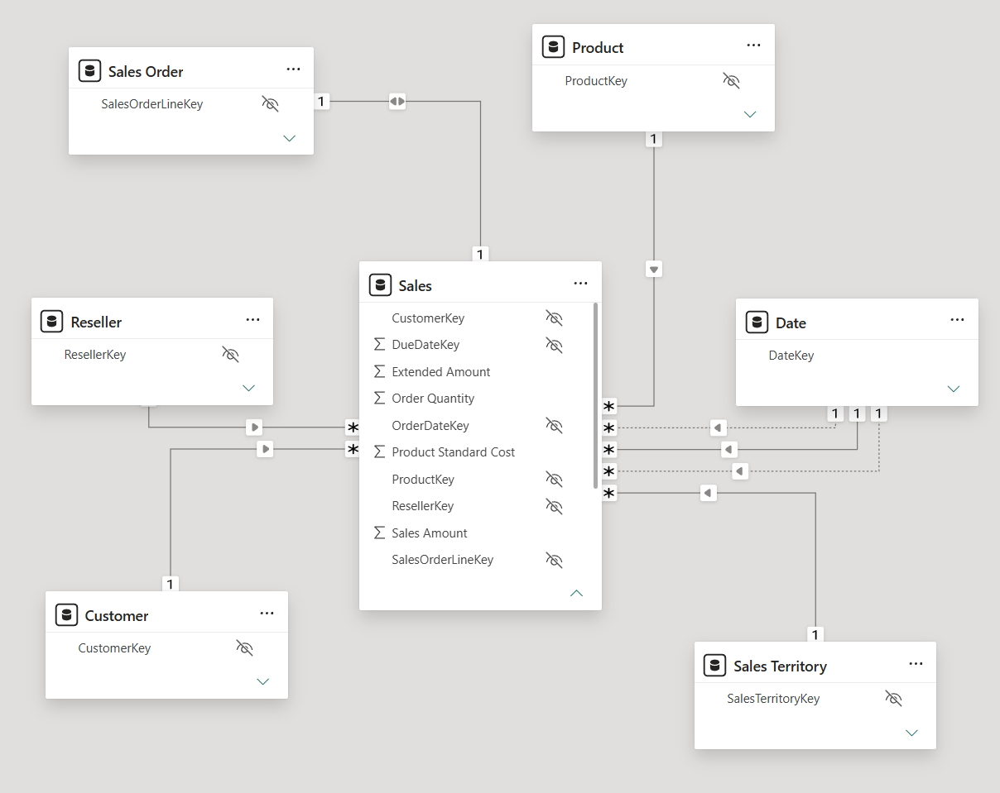
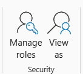
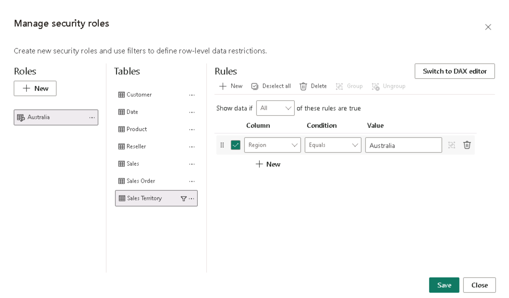
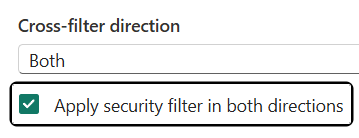
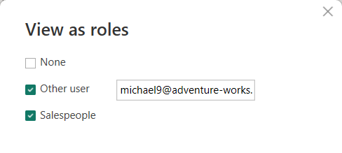
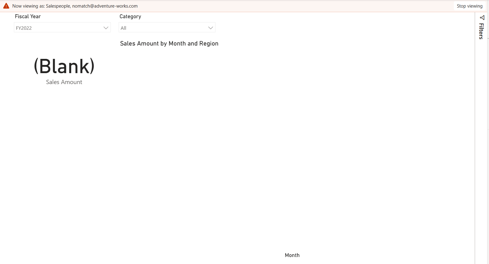

---
lab:
  title: Enforce semantic model security
  module: Enforce semantic model security
  description: Import a security mapping table, configure relationship filter propagation, and implement static and dynamic row-level security in a Power BI semantic model.
  duration: 30 minutes
  level: 300
  islab: true
  primarytopics:
    - Power BI
    - Row-level security
---

# Enforce semantic model security

In this exercise, you implement row-level security (RLS) on a Power BI semantic model. You start by reviewing the model and creating static roles, then import a salesperson mapping table and configure a dynamic role that filters data based on user identity.

In this exercise, you learn how to:

- Import and prepare a security mapping table using Power Query.
- Configure a bi-directional relationship with security filter propagation.
- Create static and dynamic roles using DAX.
- Validate role behavior by testing with different user identities.

This lab takes approximately **30** minutes to complete.

## Set up the environment

You need [Power BI Desktop](https://www.microsoft.com/download/details.aspx?id=58494) (November 2025 or newer) installed to complete this exercise. *Note: UI elements might vary slightly depending on your version.*

1. Open a web browser and enter the following URL to download the [17-enforce-security zip folder](https://github.com/MicrosoftLearning/mslearn-fabric/raw/refs/heads/main/Allfiles/Labs/17/17-enforce-security.zip):

    `https://github.com/MicrosoftLearning/mslearn-fabric/raw/refs/heads/main/Allfiles/Labs/17/17-enforce-security.zip`

1. Save the file in **Downloads** and extract the zip file to the **17-enforce-security** folder.

1. Open **17-Starter-Sales Analysis.pbix** from the extracted folder.

    > **Note**: If a security warning asks you to apply changes, select **Ignore** or **Close**. Don't select **Discard changes**. If prompted about a data source connection, dismiss the warning — you won't need to refresh data in this lab.

## Review the data model

In this task, you review the semantic model structure to understand how the tables relate and where security filters must be applied.

1. In Power BI Desktop, at the left, switch to **Model** view.

    

1. Review the model diagram to see the table relationships.

   > The model comprises six dimension tables and one fact table in a star schema. The `Sales` fact table stores sales order details.

    

1. Expand the `Sales Territory` table to view its columns.

1. Locate the `Region` column in the table. The `Region` column stores the Adventure Works sales regions.

At this organization, salespeople are only allowed to see data related to their assigned sales region.

## Create static roles

The simplest form of RLS is a static role, where a DAX filter hardcodes a field value. Static roles are useful for understanding the RLS mechanics before moving to a data-driven approach. In this section, you create two static roles—one per region—and validate that each one filters correctly.

In this task, you define a static filter on the `Sales Territory` table for two regions.

1. Switch to **Report** view.

1. Notice the stacked column chart shows data for all regions. That changes once RLS is applied.

    

1. On the **Modeling** ribbon, in the **Security** group, select **Manage roles**.

    

1. Select **+ New**, name the role `Australia`, and select the `Sales Territory` table.

1. In the **Rules** section, select **+ New** and configure the filter:

    - **Column** = `Region`
    - **Condition** = Equals
    - **Value** = `Australia`

    

1. Select **+ New** again in the **Roles** section to add a second role named `Canada`, applying the same filter for `Canada` and **Save**.

### Validate the static roles

In this task, you confirm that each role restricts the report to its assigned region.

1. On the **Modeling** ribbon, select **View as**, select the `Australia` role, and select **OK**.

1. Verify the chart shows only Australia data, then select **Stop viewing**.

1. Repeat for the `Canada` role and confirm it shows only Canada data, then select **Stop viewing**.

Static roles work, but they don't scale. Every new region requires a new role definition, and any change means updating and republishing the semantic model. For 11 Adventure Works regions, that's 11 roles to create and maintain—and the number grows with the business.

## Add the Salesperson table

Dynamic RLS requires a mapping table that links each user identity to a sales territory. In this section, you import the `Salesperson` table from a CSV file, prepare it in Power Query, and configure the relationship so security filters propagate correctly.

### Import the CSV

In this task, you use Power Query to import `Salesperson` data from the CSV file included in the extracted zip folder.

1. On the **Home** ribbon, select **Get data** > **Text/CSV**.

1. Navigate to the extracted **17-enforce-security** folder and select **Salesperson.csv**, then select **Open**.

1. In the preview window, verify you see three columns: `EmployeeKey`, `SalesTerritoryKey`, and `EmailAddress`.

1. Select **Transform Data** to open Power Query Editor.

    > **Note**: Selecting **Transform Data** instead of **Load** lets you rename the column before loading it into the model.

### Rename the column

In this task, you rename the `EmailAddress` column to `UPN` (User Principal Name) to clarify its purpose as the identity field for dynamic RLS.

1. In Power Query Editor, right-click the `EmailAddress` column header and select **Rename**.

1. Replace the text with `UPN` and press **Enter**.

    *UPN stands for User Principal Name. The values in this column match Microsoft Entra account names, which is what the USERPRINCIPALNAME() DAX function returns.*

1. On the **Home** ribbon, select **Close & Apply** to load the table into the model.

### Create and configure the relationship

In this task, you create a relationship between the `Salesperson` table and the `Sales Territory` table, then configure it so security filters propagate in both directions.

1. Switch to **Model** view.

1. Drag the `SalesTerritoryKey` field from the `Salesperson` table to the `SalesTerritoryKey` field on the `Sales Territory` table to create a relationship.

    > **Note**: If the relationship was created automatically when you loaded the table, you can skip the drag step and proceed to configuring its properties.

1. Right-click the relationship line between `Salesperson` and `Sales Territory`, then select **Properties**.

1. In the **Edit relationship** window, set **Cross filter direction** to **Both**.

1. Check the **Apply security filter in both directions** checkbox and **OK**.

    

The `Sales Territory` table has a one-to-many relationship to the `Salesperson` table. By default, filters only flow from the "one" side (`Sales Territory`) to the "many" side (`Salesperson`).

To make a security filter on `Salesperson` propagate back to `Sales Territory` — and then down to `Sales` — you must enable bi-directional cross-filtering with the security filter option.

### Hide the Salesperson table

In this task, you hide the `Salesperson` table so it doesn't appear in report authoring tools or Q&A.

1. In Model view, select the `Salesperson` table header.

1. Right-click and select **Hide in report view** (or select the eye icon at the top-right of the table).

    *The `Salesperson` table exists solely to enforce data permissions. Hiding it prevents report authors from accidentally using it in visuals or exposing `UPN` data.*

## Create the dynamic role

Dynamic RLS avoids creating and maintaining one role per region. A single role can serve all users by filtering rows to the signed-in identity.

In this section, you create one dynamic role that filters the `Salesperson` table by user principal name.

1. On the **Modeling** ribbon, in the **Security** group, select **Manage roles**.

    

1. Select **+ New**, name the role `Salespeople`, select the `Salesperson` table, and then select **Switch to DAX editor**.

    

1. Enter the following expression:

    ```DAX
    [UPN] = USERPRINCIPALNAME()
    ```

1. Select **Save**.

This expression keeps only rows where the `UPN` value matches the authenticated user's identity. Because of the bi-directional security filter you configured earlier, this filter propagates from `Salesperson` -> `Sales Territory` -> `Sales`, restricting the user to only their assigned region's data.

## Validate the dynamic role

In this section, you test the dynamic role for a mapped user and an unmapped user to demonstrate how a single role returns different results based on user identity.

### Test the role as another model user

In this task, you confirm that the same role returns a different filtered result when evaluated for another identity.

1. On the **Modeling** ribbon, select **View as**.

1. Select **Other user** and enter `michael9@adventure-works.com`.

1. Check the `Salespeople` role, then select **OK**.

    

1. Verify the report now shows data for only the `Northeast` region (michael9's assigned territory).

1. Select **Stop viewing**.

### Test as an unmapped user

In this task, you confirm that dynamic RLS denies data when no matching UPN row exists.

1. Select **View as** > **Other user**.

1. Enter `nomatch@adventure-works.com`, check `Salespeople`, and select **OK**.

1. Verify the report shows no data.

    

1. Select **Stop viewing**.

## Clean up resources

1. Close Power BI Desktop without saving.
