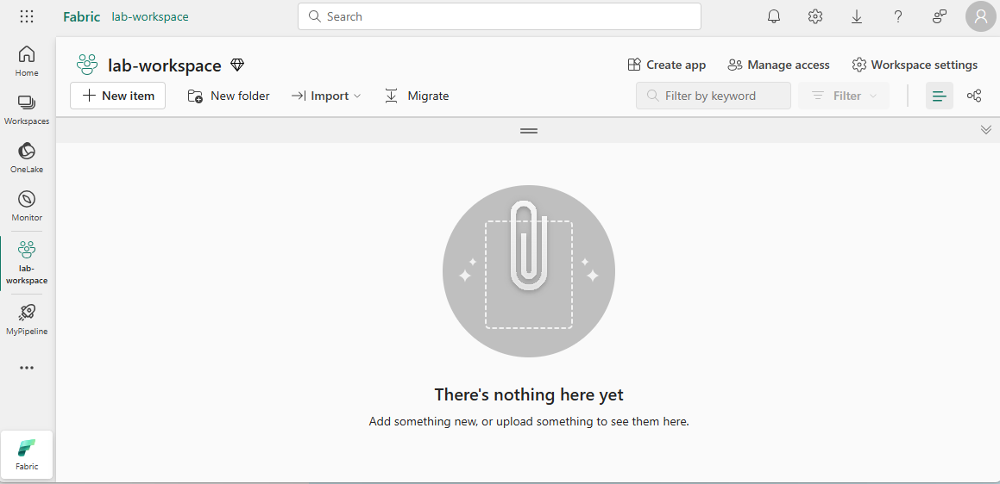
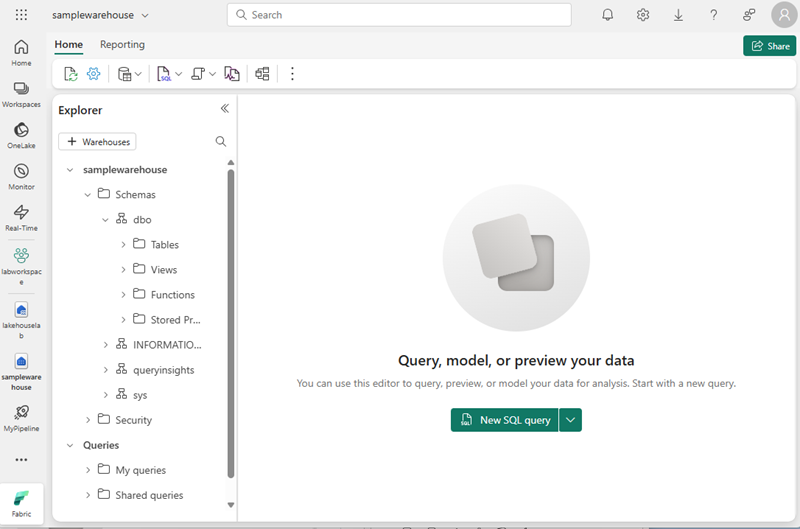
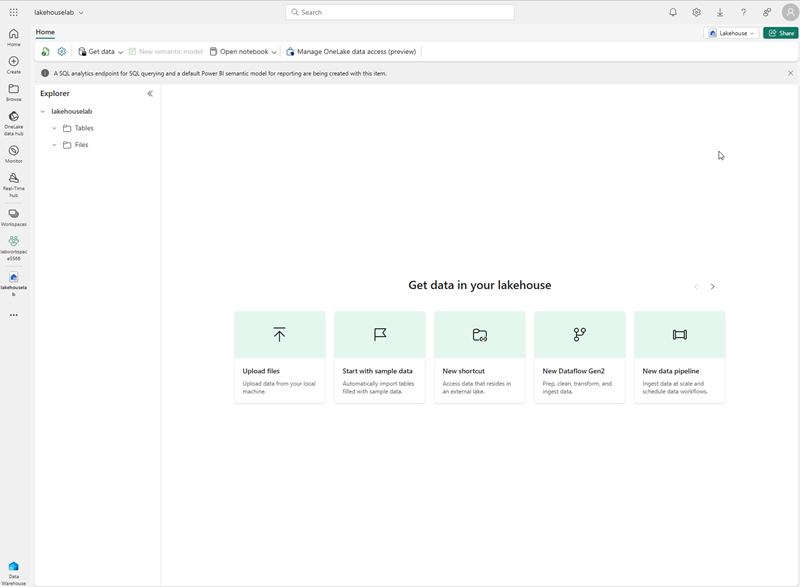
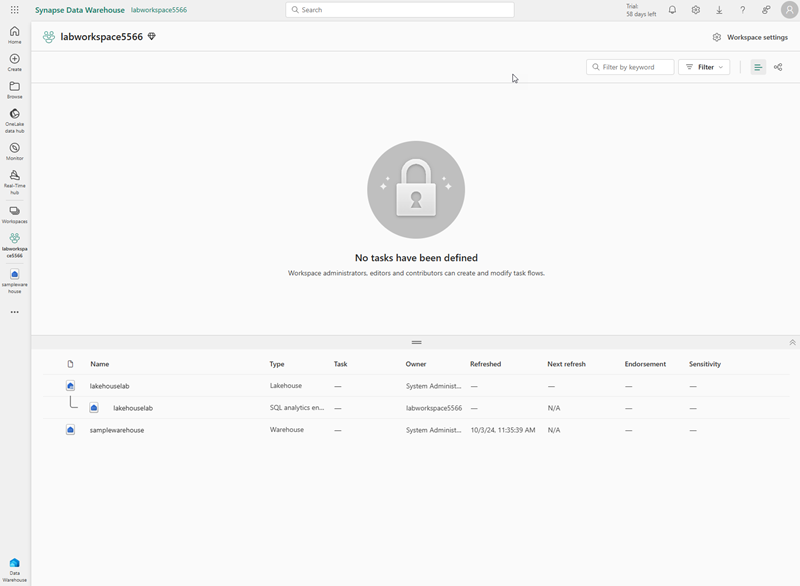
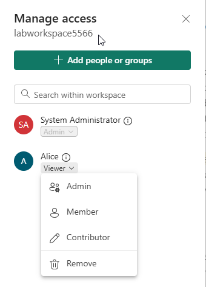
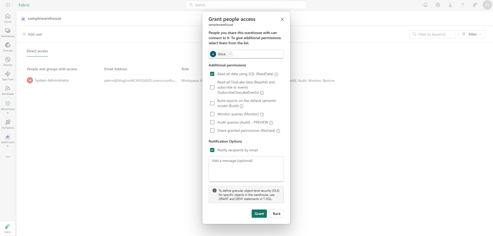
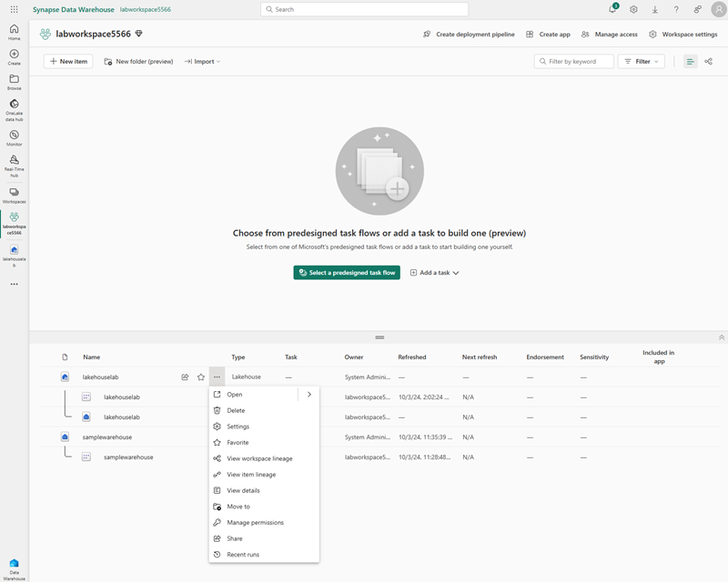
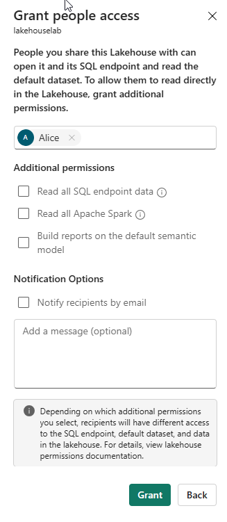

---
lab:
    title: 'Secure data access in Microsoft Fabric'
    module: 'Secure data access in Microsoft Fabric'
---

# Secure data access in Microsoft Fabric

Microsoft Fabric has a multi-layer security model for managing data access.  Security can be set for an entire workspace, for individual items, or through granular permissions in each Fabric engine.  In this exercise, you'll secure data using workspace, and item access controls and OneLake data access roles.

> **Note**: To complete the exercises in this lab, you'll need two users: one user should be assigned the Workspace Admin role, and the other will be assigned permissions throughout this lab. To assign roles to workspaces see [Give access to your workspace](https://learn.microsoft.com/fabric/get-started/give-access-workspaces).

This lab takes approximately **45** minutes to complete.

## Create a workspace

Before working with data in Fabric, create a workspace with the Fabric trial enabled.

1. On the [Microsoft Fabric home page](https://app.fabric.microsoft.com/home?experience=fabric) at `https://app.fabric.microsoft.com/home?experience=fabric`, select **Synapse Data Warehouse**.
1. In the menu bar on the left, select **Workspaces** (the icon looks similar to &#128455;).
1. Create a new workspace with a name of your choice, selecting a licensing mode that includes Fabric capacity (*Trial*, *Premium*, or *Fabric*).
1. When your new workspace opens, it should be empty.

    

> **Note**: When you create a workspace, you automatically become a member of the Workspace Admin role. 

## Create a data warehouse

Next, create a data warehouse in the workspace you just created. The Synapse Data Warehouse home page includes a shortcut to create a new warehouse:

1. In the workspace you just created, click the **New Item** button. Under the **Store data** header, click **Sample warehouse**.  Create a new **Sample Warehouse** with the name of your choice.  
    After a minute or so, a new warehouse will be created:

    

## Create a lakehouse
Next, create a lakehouse in the workspace you created. 

1. In the menu bar on the left, select **Workspaces** (the icon looks similar to 🗇).
2. Select the workspace you created.
3. In the workspace, click the **New Item** button. Under the **Store data** header, click **Lakehouse**. Create a new Lakehouse with the name of your choice.
After a minute or so, a new Lakehouse will be created:

    

4. Select the **Start with sample data** tile.  After a minute or so, the lakehouse will be populated with data.

## Apply workspace access controls

Workspace roles are used to control access to workspaces and the content within them.  Workspace roles can be assigned, for example, when users need to see all items in a workspace, when they need to manage workspace access, or create new Fabric items, or when they need specific permissions to view, modify or share content in the workspace.  

In this exercise, you will add a user to a workspace role, apply permissions and see what is viewable when each set of permissions is applied. You'll open two browsers and login as different users. In one browser, you will be a **Workspace Admin** and in the other, you will login as a second, less privileged user. In one browser, the Workspace Admin will change permissions for the second user and in the second browser, you'll be able to see the effects of changing permissions.  

1. In the menu bar on the left, select **Workspaces** (the icon looks similar to &#128455;).
2. Next select the workspace you created.
3. Click on **Manage access** on the top of the screen.

> **Note**: You'll see the user you're logged, who is a a member of the **Workspace Admin** role because you created the workspace. No other users are assigned access to the workspace yet.

4. Next, you'll see what a user without permissions on the workspace can view.  In your browser, open an InPrivate window. To do this in the Edge browser, click the ellipse at the top right corner and select **New InPrivate Window**.
5. Enter https://app.fabric.microsoft.com and login as the second user you're using for testing.  
6. On the bottom left corner of your screen, select **Microsoft Fabric** and then select **Data Warehouse**. Next select **Workspaces** (the icon looks similar to &#128455;).  

> **Note:** The second user doesn't have access to the workspace, so it's not viewable.

7. Next, you'll assign the **Workspace Viewer** role to the second user and see that the role grants read access to the warehouse in the workspace.  
8. Return to the browser window where you're logged in as the Workspace Admin. Ensure you're still on the page that shows the workspace you created.  It should have your new workspace items, and the sample warehouse and lakehouse, listed at the bottom of the page.
9. Select **Manage access** at the top right of the screen.
10. Select **Add people or groups**.  Enter the email of the second, user you're testing with. Click **Add** to assign the user to the workspace **Viewer** role. 
11. Return to the InPrivate browser window where you're logged in as the second user and click refresh button on the browser to refresh session permissions just assigned to the second user.
12. Select the **Workspaces** icon on the left menu bar (the icon looks similar to &#128455;) and click on the workspace name you created as the Workspace Admin user. The second user can now see all of the items in the workspace because they were assigned the **Workspace Viewer** role.

    

13. Click on the warehouse to open it.
14. Select the **Date** table and wait for the rows to be loaded. You can see the rows because as a member of the Workspace Viewer role, you have CONNECT and ReadData permission on tables in the warehouse. See [Workspace roles](https://learn.microsoft.com/en-us/fabric/data-warehouse/workspace-roles)

## Apply item access control

Item permissions control access to individual Fabric items within a workspace, like warehouses, lakehouses and semantic models.  In this exercise, you will remove the **Workspace Viewer** permissions applied in the previous exercise and then apply item level permissions on the warehouse so a less privileged user can only view the warehouse data, not the lakehouse data.

1. Return to the browser window where you're logged in as the first user or Workspace Admin. Select **Workspaces** from the left navigation pane.  
2. Select **Manage access** from the top of the screen.
3. Select the word **Viewer** under the name of the second, less privileged user. On the menu that appears, select **Remove**.

   

4. In the workspace, hover over the name of your warehouse and an ellipse (**...**) will appear.  Select the ellipse and click **Manage permissions**

    

5. Enter the name of the second, less privileged user. Under **Additional permissions** check only **Read all data using SQL (ReadData).

6. Click **Grant**

7. Return to the browser window where you're logged in as the second, less privileged user.  Refresh the browser view.  

8. The second user no longer has access to the workspace and instead has access to only the warehouse. You can no longer browse workspaces on the left navigation pane to find the warehouse. Click on **OneLake data hub** on the left navigation menu to find the warehouse. 

9. Select the warehouse and on the screen that appears, select **Open** from the top menu bar.

10. When the warehouse view appears, click on the **Date** table to view it's rows.

## Apply OneLake data access roles within a Lakehouse

OneLake data access roles let you create custom roles within a Lakehouse and grant read permissions to folders you specify.  

In this exercise, you will assign a workspace role and create a OneLake data access role and experiment with how they work together to restrict access to folders in a Lakehouse.  

1. Stay in the browser where you're logged in as the second, less privileged user.  
2. Select **OneLake data hub** on the left navigation bar.  Note that the second user doesn't see the lakehouse.  
3. Return to the browser where you're logged in as the Workspace Admin and hover over the name of the lakehouse.  
4. Click on the ellipse (**...**) to the right of the elipse and select **Manage permissions**

      

5. On the screen that appears, click **Add user**. Assign the second user to the lakehouse and ensure none of the checkboxes on the **Grant People Access** window are checked.  

      

6. Select **Grant**.  Note that the second user now has read permissions on the lakehouse.
7. Return to the browser where you're logged in as the second user.  Refresh the browser.
8. Select **OneLake data hub** in the left navigation pane.  
9. Select the lakehouse to open it. 
10.Select **Open** on the top menu bar
11.When the lakehouse opens, click **Manage OneLake data access** on the top menu bar and enable the feature.
12.
1. 
1. In the warehouse you created in the last exercise, select the **New SQL Query** dropdown.  Under the header **Blank**, select **New SQL Query**.

2. Create a table and insert data into it. So that you can test row-level security in a later step, replace `username1@your_domain.com` with a user name from your environment and replace `username2@your_domain.com` with your user name.

    ```T-SQL
   CREATE TABLE dbo.Sales  
   (  
       OrderID INT,  
       SalesRep VARCHAR(60),  
       Product VARCHAR(10),  
       Quantity INT  
   );
    
   --Populate the table with 6 rows of data, showing 3 orders for each test user. 
   INSERT dbo.Sales (OrderID, SalesRep, Product, Quantity) VALUES
   (1, '<username1>@<your_domain>.com', 'Valve', 5),   
   (2, '<username1>@<your_domain>.com', 'Wheel', 2),   
   (3, '<username1>@<your_domain>.com', 'Valve', 4),  
   (4, '<username2>@<your_domain>.com', 'Bracket', 2),   
   (5, '<username2>@<your_domain>.com', 'Wheel', 5),   
   (6, '<username2>@<your_domain>.com', 'Seat', 5);  
    
   SELECT * FROM dbo.Sales;  
    ```

3. Use the **&#9655; Run** button to run the SQL script, which creates a new table named **Sales** in the **dbo** schema of the data warehouse.

4. Then, in the **Explorer** pane, expand **Schemas** > **dbo** > **Tables** and verify that the **Sales** table has been created.
5. Create a new schema, a security predicate defined as a function, and a security policy.  

    ```T-SQL
   --Create a separate schema to hold the row-level security objects (the predicate function and the security policy)
   CREATE SCHEMA rls;
   GO
   
   /*Create the security predicate defined as an inline table-valued function.
   A predicate evaluates to true (1) or false (0). This security predicate returns 1,
   meaning a row is accessible, when a row in the SalesRep column is the same as the user
   executing the query.*/   
   --Create a function to evaluate who is querying the table
   CREATE FUNCTION rls.fn_securitypredicate(@SalesRep AS VARCHAR(60)) 
       RETURNS TABLE  
   WITH SCHEMABINDING  
   AS  
       RETURN SELECT 1 AS fn_securitypredicate_result   
   WHERE @SalesRep = USER_NAME();
   GO   
   /*Create a security policy to invoke and enforce the function each time a query is run on the Sales table.
   The security policy has a filter predicate that silently filters the rows available to 
   read operations (SELECT, UPDATE, and DELETE). */
   CREATE SECURITY POLICY SalesFilter  
   ADD FILTER PREDICATE rls.fn_securitypredicate(SalesRep)   
   ON dbo.Sales  
   WITH (STATE = ON);
   GO
    ```

6. Use the **&#9655; Run** button to run the SQL script
7. Then, in the **Explorer** pane, expand **Schemas** > **rls** > **Functions**, and verify that the function has been created.
8. Log in to Fabric as the user you replaced `<username1>@<your_domain>.com` with, in the Sales table `INSERT`statement. Confirm that you're logged in as that user by running the following T-SQL.

    ```T-SQL
   SELECT USER_NAME();
    ```

9. Query the **Sales** table to confirm that row-level security works as expected. You should only see data that meets the conditions in the security predicate defined for the user you're logged in as.

    ```T-SQL
   SELECT * FROM dbo.Sales;
    ```

## Implement column-level security

Column-level security allows you to designate which users can access specific columns in a table. It's implemented by issuing a `GRANT` or `DENY` statement on a table specifying a list of columns and the user or role that can or cannot read them. To streamline access management, assign permissions to roles in lieu of individual users. In this exercise, you will create a table, grant access to a subset of columns on the table, and test that restricted columns aren't viewable by a user other than yourself.

1. In the warehouse you created in the earlier exercise, select the **New SQL Query** dropdown. Under the header **Blank**, select **New SQL Query**.  

2. Create a table and insert data into the table.

    ```T-SQL
   CREATE TABLE dbo.Orders
   (   
       OrderID INT,   
       CustomerID INT,  
       CreditCard VARCHAR(20)      
   );   
   INSERT dbo.Orders (OrderID, CustomerID, CreditCard) VALUES
   (1234, 5678, '111111111111111'),
   (2341, 6785, '222222222222222'),
   (3412, 7856, '333333333333333');   
   SELECT * FROM dbo.Orders;
     ```

3. Deny permission to view a column in the table. The T-SQL statement prevents `<username>@<your_domain>.com` from seeing the CreditCard column in the Orders table. In the `DENY` statement, replace `<username>@<your_domain>.com` with a user name in your system who has **Viewer** permissions on the workspace.

     ```T-SQL
   DENY SELECT ON dbo.Orders (CreditCard) TO [<username>@<your_domain>.com];
     ```

4. Test column-level security by logging in to Fabric as the user you denied select permissions to.

5. Query the Orders table to confirm that column-level security works as expected. The following query will return only the OrderID and CustomerID columns, not the CreditCard column.  

    ```T-SQL
   SELECT * FROM dbo.Orders;
    ```

    You'll receive an error because access to the CreditCard column has been restricted.  Try selecting only the OrderID and CustomerID fields and the query will succeed.

    ```T-SQL
   SELECT OrderID, CustomerID from dbo.Orders
    ```

## Configure SQL granular permissions using T-SQL

Fabric has a permissions model that allows you to control access to data at the workspace level, and at the item level. When you need more granular control of what users can do with securables in a Fabric warehouse, you can use the standard SQL data control language (DCL) commands `GRANT`,`DENY` and, `REVOKE`. In this exercise, you will create objects, secure them using `GRANT`, and `DENY`, and then run queries to view the effect of applying granular permissions.

1. In the warehouse you created in the earlier exercise, select the **New SQL Query** dropdown. Under the header **Blank**, select **New SQL Query**.  

2. Create a stored procedure and a table. Then execute the procedure and query the table.

     ```T-SQL
   CREATE PROCEDURE dbo.sp_PrintMessage
   AS
   PRINT 'Hello World.';
   GO   
   CREATE TABLE dbo.Parts
   (
       PartID INT,
       PartName VARCHAR(25)
   );
   
   INSERT dbo.Parts (PartID, PartName) VALUES
   (1234, 'Wheel'),
   (5678, 'Seat');
    GO
   
   /*Execute the stored procedure and select from the table and note the results you get
   as a member of the Workspace Admin role. Look for output from the stored procedure on 
   the 'Messages' tab.*/
   EXEC dbo.sp_PrintMessage;
   GO   
   SELECT * FROM dbo.Parts
     ```

3. Next `DENY SELECT` permissions on the table to a user who is a member of the **Workspace Viewer** role and `GRANT EXECUTE` on the procedure to the same user. Replace `<username>@<your_domain>.com` with a user name from your environment that is a member of the **Workspace Viewer** role.

     ```T-SQL
   DENY SELECT on dbo.Parts to [<username>@<your_domain>.com];

   GRANT EXECUTE on dbo.sp_PrintMessage to [<username>@<your_domain>.com];
     ```

4. Sign in to Fabric as the user you specified in the `DENY` and `GRANT` statements in place of `<username>@<your_domain>.com`. Then test the granular permissions you applied by executing the stored procedure and querying the table.  

     ```T-SQL
   EXEC dbo.sp_PrintMessage;
   GO
   
   SELECT * FROM dbo.Parts;
     ```

## Clean up resources

In this exercise, you applied dynamic data masking rules to columns in a table, applied row-level security, implemented column-level security and, configured SQL granular permissions using T-SQL.

1. In the left navigation bar, select the icon for your workspace to view all of the items it contains.
2. In the menu on the top toolbar, select **Workspace settings**.
3. In the **General** section, select **Remove this workspace**.
