---
lab:
  title: Secure data access in Microsoft Fabric
  module: Secure data access in Microsoft Fabric
  description: In this lab, you'll learn how to secure data in Microsoft Fabric using a multi-layer security approach. You'll apply workspace roles to control access to entire workspaces, configure item-level permissions to restrict access to specific Fabric items, and create OneLake security roles to grant granular permissions on specific tables and folders within a lakehouse.
  duration: 45 minutes
  level: 300
  islab: true
  primarytopics:
    - Microsoft Fabric
  categories:
    - Security and governance
  courses:
    - DP-700
    - DP-600
---

# Secure data access in Microsoft Fabric

Microsoft Fabric has a multi-layer security model for managing data access. Security can be set for an entire workspace, for individual items, or through granular permissions in each Fabric engine. In this exercise, you secure data using workspace and item access controls and OneLake security roles.

> **Note**: To complete the exercises in this lab, you'll need two users: one user should be assigned the Workspace Admin role, and the other should have the Workspace Viewer role. To assign roles to workspaces see [Give access to your workspace](https://learn.microsoft.com/fabric/get-started/give-access-workspaces). If you don't have access to a second account in the same organization, you can still do the exercise as a Workspace Admin and skip the steps done as a Workspace Viewer account, referring to the exercise's screenshots to see what a Workspace Viewer account has access to.

This lab takes approximately **45** minutes to complete.

> **Tip:** For related training content, see [Secure data access in Microsoft Fabric](https://learn.microsoft.com/training/modules/secure-data-access-in-fabric/).

## Create a workspace

> **Note**: You need access to a Fabric paid or trial capacity to complete this exercise. For information about the free Fabric trial, see [Fabric trial](https://aka.ms/fabrictrial).

1. Navigate to the [Microsoft Fabric home page](https://app.fabric.microsoft.com/home?experience=fabric) at `https://app.fabric.microsoft.com/home?experience=fabric` in a browser and sign in with your Fabric credentials.
1. In the menu bar on the left, select **Workspaces** (the icon looks similar to &#128455;).
1. Create a new workspace with a name of your choice, selecting a licensing mode that includes Fabric capacity (*Trial*, *Premium*, or *Fabric*).
1. When your new workspace opens, it should be empty.

    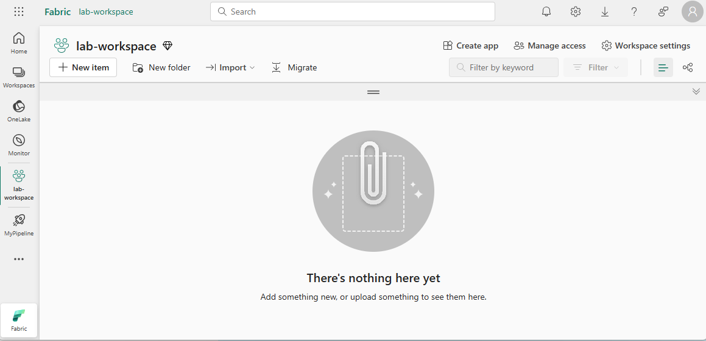

> **Note**: When you create a workspace, you automatically become a member of the Workspace Admin role.

## Create a data warehouse

Next, create a data warehouse in the workspace you created:

1. Click **+ New Item**. On the *New item* page, under the *Store Data* section, select **Sample warehouse** and create a new data warehouse with a name of your choice.

     After a minute or so, a new warehouse will be created:

    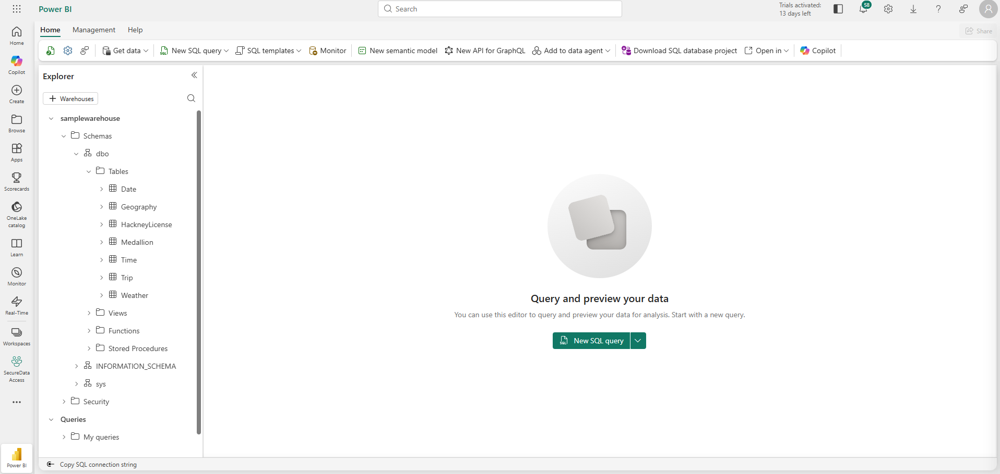

## Create a lakehouse

Next, create a lakehouse in the workspace you created.

1. In the menu bar on the left, select **Workspaces** (the icon looks similar to 🗇).
2. Select the workspace you created.
3. In the workspace, select the **+ New Item** button and then select **Lakehouse**. Create a new Lakehouse with the name of your choice. Leave the **Lakehouse schemas** box selected.

   After a minute or so, a new Lakehouse will be created:

    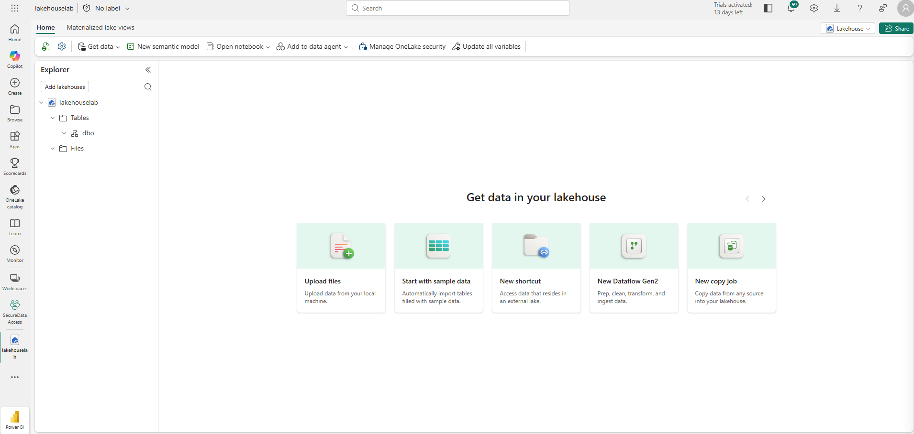

4. Select the **Start with sample data** tile. After a minute or so, the lakehouse will be populated with sample public holidays data.

## Apply workspace access controls

Workspace roles are used to control access to workspaces and the content within them. Workspace roles can be assigned when users need to see all items in a workspace, when they need to manage workspace access, or create new Fabric items, or when they need specific permissions to view, modify or share content in the workspace.

In this exercise, you add a user to a workspace role, apply permissions, and see what is viewable when each set of permissions is applied. You open two browsers and sign-in as different users. In one browser, you'll be a **Workspace Admin** and in the other, you'll sign-in as a second, less privileged user. In one browser, the Workspace Admin changes permissions for the second user and in the second browser, you're able to see the effects of changing permissions.

1. In the menu bar on the left, select **Workspaces** (the icon looks similar to &#128455;).
2. Next select the workspace you created.
3. Select **Manage access** on the top of the screen.

> **Note**: You'll see the user you're logged in as, who is a member of the **Workspace Admin** role because you created the workspace. No other users are assigned access to the workspace yet.

4. Next, you'll see what a user without permissions on the workspace can view. In your browser, open an InPrivate window. In the Microsoft Edge browser, select the ellipse at the top right corner and select **New InPrivate Window**.
5. Enter https://app.fabric.microsoft.com and sign-in as the second user you're using for testing.
6. On the bottom left corner of your screen, select **Microsoft Fabric** and then select **Data Warehouse**. Next select **Workspaces** (the icon looks similar to &#128455;).

> **Note:** The second user doesn't have access to the workspace, so it's not viewable.

7. Next, you assign the **Workspace Viewer** role to the second user and see that the role grants read access to the warehouse in the workspace.
8. Return to the browser window where you're logged in as the Workspace Admin. Ensure you're still on the page that shows the workspace you created. It should have your new workspace items, and the sample warehouse and lakehouse, listed at the bottom of the page.
9. Select **Manage access** at the top right of the screen.
10. Select **Add people or groups**. Enter the email of the second user you're testing with. Select **Add** to assign the user to the workspace **Viewer** role.

11. Return to the InPrivate browser window where you're logged in as the second user and select refresh button on the browser to refresh session permissions assigned to the second user.
12. Select the **Workspaces** icon on the left menu bar (the icon looks similar to &#128455;) and select the workspace name you created as the Workspace Admin user. The second user can now see all of the items in the workspace because they were assigned the **Workspace Viewer** role.

    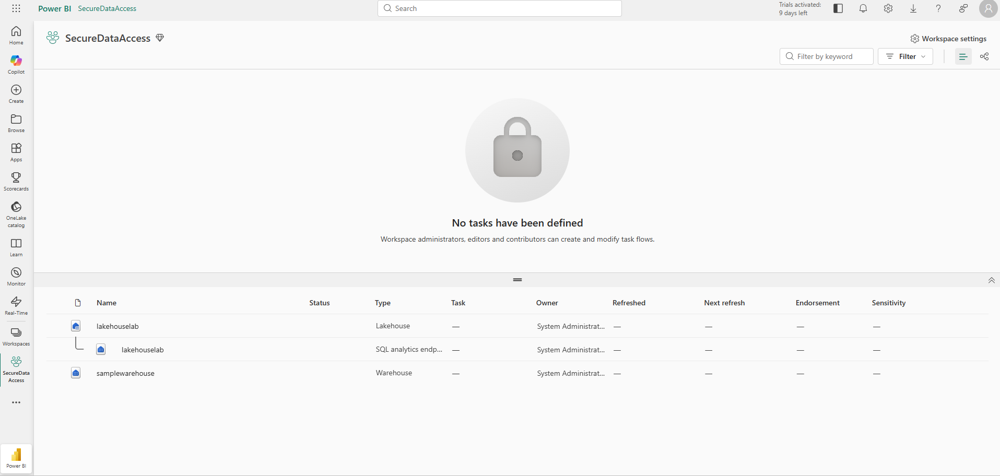

13. Select the warehouse and open it.
14. Select the **Date** table and wait for the rows to be loaded. You can see the rows because as a member of the Workspace Viewer role, you have CONNECT and ReadData permission on tables in the warehouse. For more information on permissions granted to the Workspace Viewer role, see [Workspace roles](https://learn.microsoft.com/en-us/fabric/data-warehouse/workspace-roles).

15. Next, select the **Workspaces** icon on the left menu bar, then select the lakehouse.
16. When the lakehouse opens, click on the dropdown box at the top right corner of the screen that says **Lakehouse** and select **SQL analytics endpoint**.

17. Select the **publicholidays** table and wait for the data to be displayed. Data in the lakehouse table is readable from the SQL analytics endpoint because the user is a member of the Workspace Viewer role that grants read permissions on the SQL analytics endpoint.

## Apply item access control

Item permissions control access to individual Fabric items within a workspace, like warehouses, lakehouses and semantic models. In this exercise, you remove the **Workspace Viewer** permissions applied in the previous exercise and then apply item level permissions on the warehouse so a less privileged user can only view the warehouse data, not the lakehouse data.

1. Return to the browser window where you're logged in as the Workspace Admin. Select **Workspaces** from the left navigation pane.
2. Select the workspace that you created to open it.
3. Select **Manage access** from the top of the screen.
4. Select the word **Viewer** under the name of the second user. On the menu that appears, select **Remove**.

   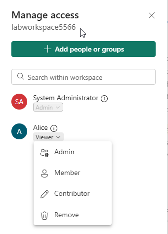

5. Close the **Manage access** section.
6. In the workspace, hover over the name of your warehouse and an ellipse (**...**) will appear. Select the ellipse and select **Manage permissions**.
7. Select **Add user** and enter the name of the second user.
8. In the box that appears, under **Additional permissions**, select **ReadData** and clear all other checkboxes.

    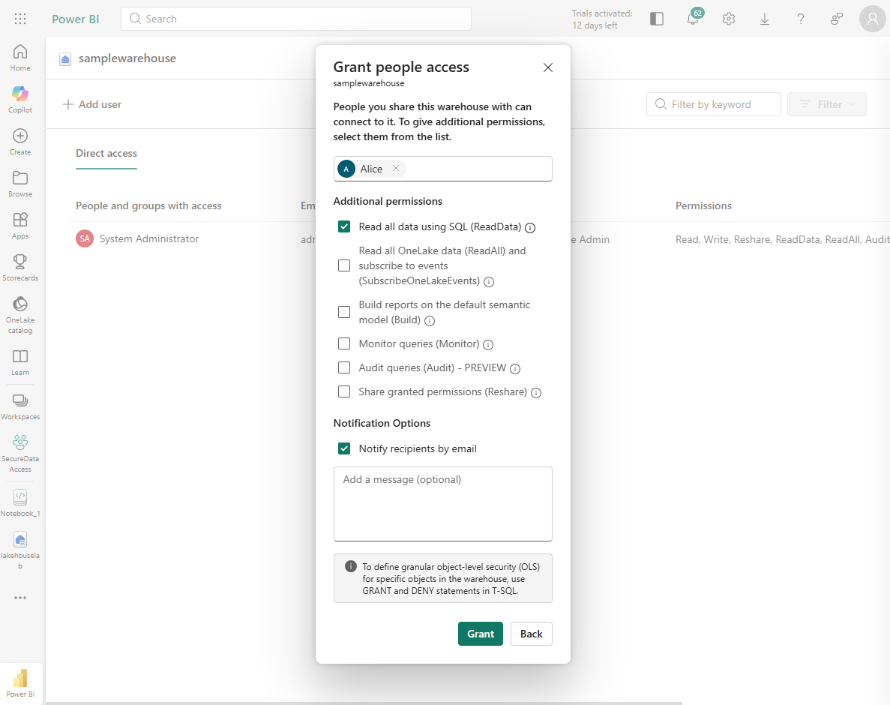

9. Select **Grant**.
10. Return to the browser window where you're logged in as the second user. Navigate to the workspace icon again and refresh the browser view.
11. The second user no longer has access to everything in the workspace and instead has access to only the warehouse. You can no longer browse workspaces on the left navigation pane to find the warehouse. Select **OneLake catalog** on the left navigation menu to find the warehouse:

12. On the screen that appears, next to **All items**, select **Type: Data items**, then select **All types**.

    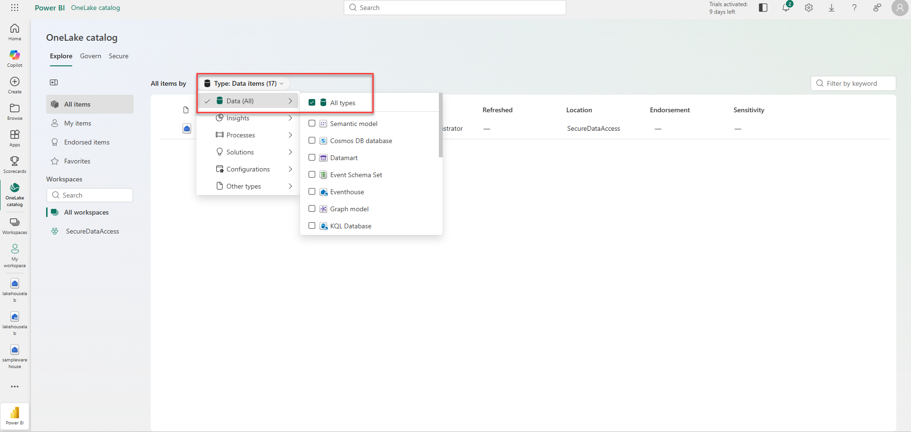

13. Select the warehouse, then select **Open**.
14. Select the **Date** table to view table data. The rows are viewable because the user has **ReadData** permission on the warehouse, which was granted through item-level permissions.

## Apply OneLake security in a lakehouse

OneLake security lets you create custom roles within a lakehouse and grant granular access to specific tables and folders. You can also add row or column constraints to roles to further limit data access.

In this exercise, you grant an item permission and create an OneLake security role to control access to data in a lakehouse.
1. Stay in the browser where you're logged in as the second user.
2. Select **OneLake catalog** on the left navigation bar. The second user doesn't see the lakehouse.
3. Return to the browser where you're logged in as the Workspace Admin.
4. Select **Workspaces** on the left menu and select your workspace. Hover over the name of the lakehouse.
5. Select the ellipse (**...**) and select **Manage permissions**.

    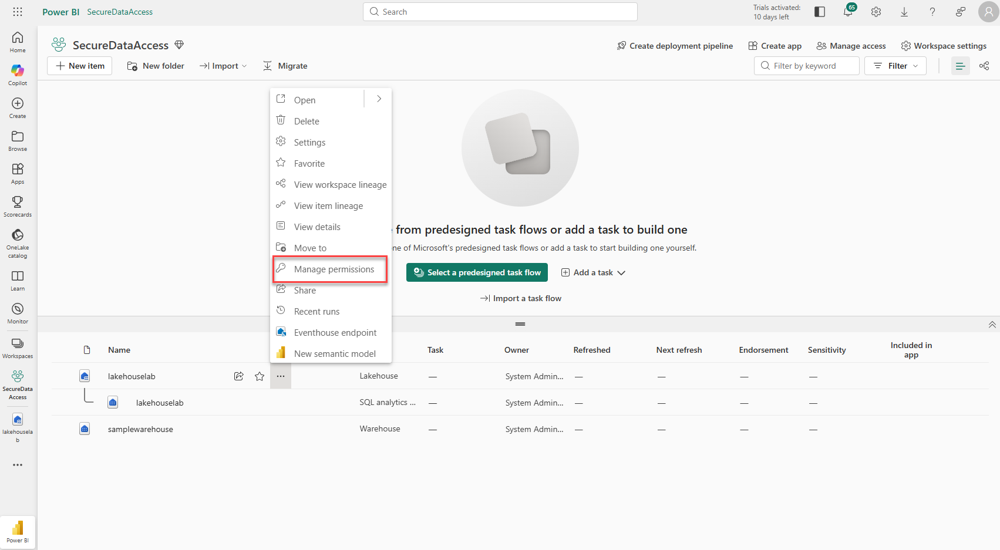

6. On the screen that appears, select **Add user**.
7. Assign the second user to the lakehouse and ensure none of the permission checkboxes on the **Grant People Access** window are checked.

    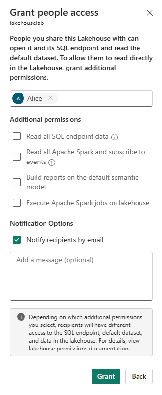

8. Select **Grant**. The second user now has **Read** permission on the lakehouse, which allows access to metadata but not the underlying data. Next, you'll validate this behavior.
9. Return to the browser where you're logged in as the second user. Refresh the browser.
10. Select **OneLake catalog** in the left navigation pane.
11. Select the ellipsis (...) next to the lakehouse name and select **Open**.
12. Try to expand **Tables** to see the **publicholidays** table. You'll see the lakehouse but won't be able to view data in publicholidays table.

    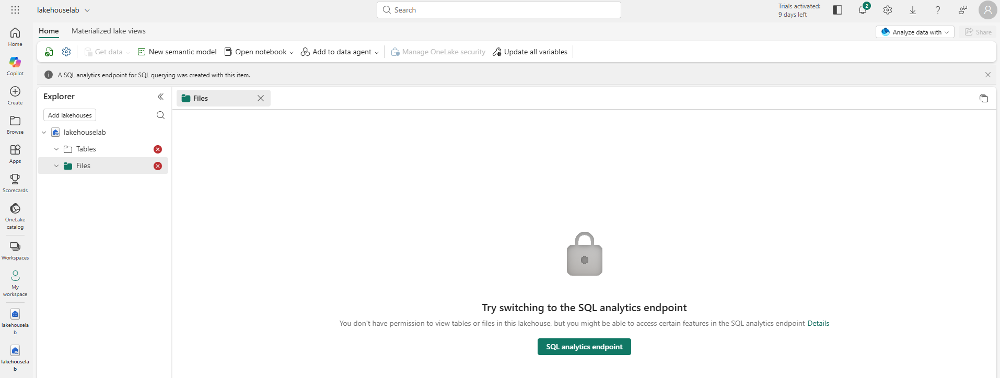

13. Next, you'll grant the second user access to the **publicholidays** table using OneLake security roles.
14. Return to the browser where you're logged in as the workspace administrator.
15. Select **Workspaces** from the left navigation bar.
16. Select your workspace name.
17. Select the lakehouse to open it.
18. When the lakehouse opens, select **Manage OneLake security**.

    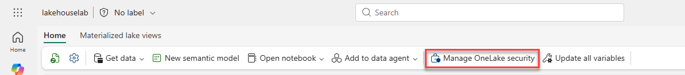

19. On the **OneLake security** screen that appears, select **+ New**.

20. Create a new role named **publicholidays**. Under **Select Grant permissions**, leave the box unchecked. Select **Next**.
21. On the **New role Data** screen that appears, under **Add data to your role**, select **Selected data**.
22. Under **Data preview**, select **Edit**. In the data browser, expand **Tables**, and **dbo**, then select the checkbox next to **publicholidays**.

    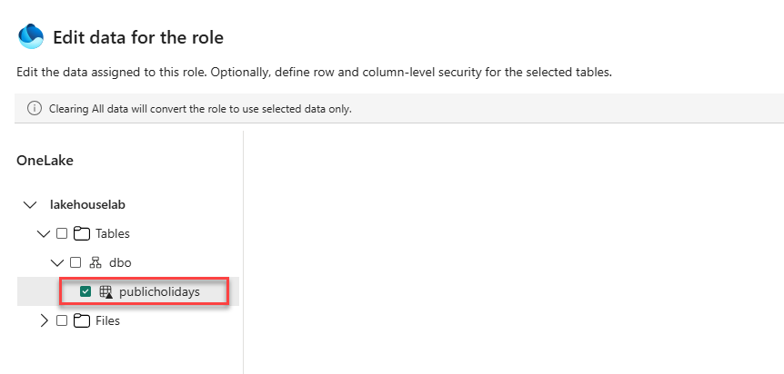

23. Select **Add data** to confirm. Then select **Next** from the **New role Data** screen.

24. In the **New role Member** section, enter the email address of your second user, select the **checkbox**, then select **Create**.

    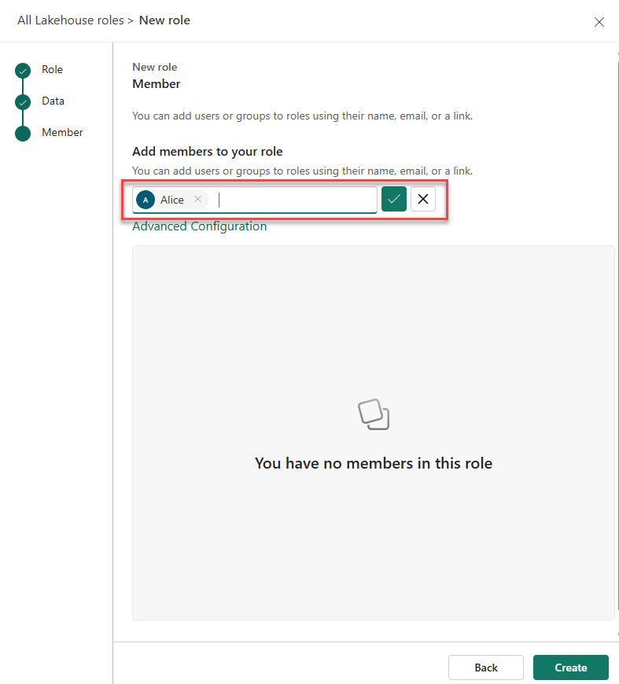

25. Return to the browser where you're logged in as the second user. Ensure you're still on the page where the lakehouse is open. Refresh the browser.
26. Expand **Tables** in the lakehouse explorer and select the **publicholidays** table. Wait for the data to load. The user can now view data in this table because they're a member of the **publicholidays** OneLake security role, which grants **Read** permission to this specific table only.

## Clean up resources

In this exercise, you secured data using workspace access controls, item access controls, and OneLake security roles.

1. In the left navigation bar, select the icon for your workspace to view all of the items it contains.
2. In the menu on the top toolbar, select **Workspace settings**.
3. In the **General** section, select **Remove this workspace**.
