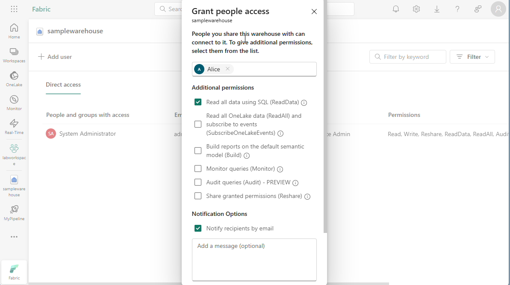
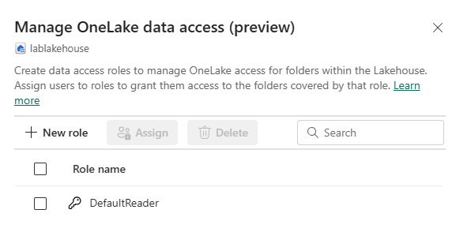

---
lab:
    title: 'Secure data access in Microsoft Fabric'
    module: 'Secure data access in Microsoft Fabric'
---

# Secure data access in Microsoft Fabric

Microsoft Fabric has a multi-layer security model for managing data access.  Security can be set for an entire workspace, for individual items, or through granular permissions in each Fabric engine.  In this exercise, you'll secure data using workspace, and item access controls and OneLake data access roles.

> **Note**: To complete the exercises in this lab, you'll need two users: one user should be assigned the Workspace Admin role, and the other will be assigned permissions throughout this lab. To assign roles to workspaces see [Give access to your workspace](https://learn.microsoft.com/fabric/get-started/give-access-workspaces).

This lab takes approximately **45** minutes to complete.

## Create a workspace

Before working with data in Fabric, create a workspace with the Fabric trial enabled.

1. On the [Microsoft Fabric home page](https://app.fabric.microsoft.com/home?experience=fabric) at `https://app.fabric.microsoft.com/home?experience=fabric`, select **Synapse Data Warehouse**.
1. In the menu bar on the left, select **Workspaces** (the icon looks similar to &#128455;).
1. Create a new workspace with a name of your choice, selecting a licensing mode that includes Fabric capacity (*Trial*, *Premium*, or *Fabric*).
1. When your new workspace opens, it should be empty.

    

> **Note**: When you create a workspace, you automatically become a member of the Workspace Admin role. 

## Create a data warehouse

Next, create a data warehouse in the workspace you just created. The Synapse Data Warehouse home page includes a shortcut to create a new warehouse:

1. In the workspace you just created, click the **New Item** button. Under the **Store data** header, click **Sample warehouse**.  Create a new **Sample Warehouse** with the name of your choice.  
    After a minute or so, a new warehouse will be created:

    

## Create a lakehouse
Next, create a lakehouse in the workspace you created. 

1. In the menu bar on the left, select **Workspaces** (the icon looks similar to 🗇).
2. Select the workspace you created.
3. In the workspace, click the **New Item** button. Under the **Store data** header, click **Lakehouse**. Create a new Lakehouse with the name of your choice.
After a minute or so, a new Lakehouse will be created:

    

4. Select the **Start with sample data** tile.  After a minute or so, the lakehouse will be populated with data.

## Apply workspace access controls

Workspace roles are used to control access to workspaces and the content within them.  Workspace roles can be assigned, for example, when users need to see all items in a workspace, when they need to manage workspace access, or create new Fabric items, or when they need specific permissions to view, modify or share content in the workspace.  

In this exercise, you will add a user to a workspace role, apply permissions and see what is viewable when each set of permissions is applied. You'll open two browsers and login as different users. In one browser, you will be a **Workspace Admin** and in the other, you will login as a second, less privileged user. In one browser, the Workspace Admin will change permissions for the second user and in the second browser, you'll be able to see the effects of changing permissions.  

1. In the menu bar on the left, select **Workspaces** (the icon looks similar to &#128455;).
2. Next select the workspace you created.
3. Click on **Manage access** on the top of the screen.

> **Note**: You'll see the user you're logged, who is a a member of the **Workspace Admin** role because you created the workspace. No other users are assigned access to the workspace yet.

4. Next, you'll see what a user without permissions on the workspace can view.  In your browser, open an InPrivate window. To do this in the Edge browser, click the ellipse at the top right corner and select **New InPrivate Window**.
5. Enter https://app.fabric.microsoft.com and login as the second user you're using for testing.  
6. On the bottom left corner of your screen, select **Microsoft Fabric** and then select **Data Warehouse**. Next select **Workspaces** (the icon looks similar to &#128455;).  

> **Note:** The second user doesn't have access to the workspace, so it's not viewable.

7. Next, you'll assign the **Workspace Viewer** role to the second user and see that the role grants read access to the warehouse in the workspace.  
8. Return to the browser window where you're logged in as the Workspace Admin. Ensure you're still on the page that shows the workspace you created.  It should have your new workspace items, and the sample warehouse and lakehouse, listed at the bottom of the page.
9. Select **Manage access** at the top right of the screen.
10. Select **Add people or groups**.  Enter the email of the second, user you're testing with. Click **Add** to assign the user to the workspace **Viewer** role. 
11. Return to the InPrivate browser window where you're logged in as the second user and click refresh button on the browser to refresh session permissions just assigned to the second user.
12. Select the **Workspaces** icon on the left menu bar (the icon looks similar to &#128455;) and click on the workspace name you created as the Workspace Admin user. The second user can now see all of the items in the workspace because they were assigned the **Workspace Viewer** role.

    

13. Select the warehouse to open it.
14. Select the **Date** table and wait for the rows to be loaded. You can see the rows because as a member of the Workspace Viewer role, you have CONNECT and ReadData permission on tables in the warehouse. See [Workspace roles](https://learn.microsoft.com/en-us/fabric/data-warehouse/workspace-roles) for more information on permissions granted to the Workspace Viewer role.
15. Next, select the **Workspaces** icon on the left menu bar, then select the lakehouse.
16. When the lakehouse opens, click on the dropdown box at the top left corner of the screen that says **Lakehouse** and select **SQL analytics endpoint**.
17. Select the **publicholidays** table and wait for the data to be displayed.  Data in the lakehouse table is readable from the SQL analytics endpoint because the user is a member of the Workspace Viewer role that grants read permissions on the SQL analytics endpoint.

## Apply item access control

Item permissions control access to individual Fabric items within a workspace, like warehouses, lakehouses and semantic models.  In this exercise, you will remove the **Workspace Viewer** permissions applied in the previous exercise and then apply item level permissions on the warehouse so a less privileged user can only view the warehouse data, not the lakehouse data.

1. Return to the browser window where you're logged in as the Workspace Admin. Select **Workspaces** from the left navigation pane. 
2. Select the workspace that you created to open it. 
3. Select **Manage access** from the top of the screen.
4. Select the word **Viewer** under the name of the second user. On the menu that appears, select **Remove**.

   

5. Close the **Manage access** section.
6. In the workspace, hover over the name of your warehouse and an ellipse (**...**) will appear.  Select the ellipse and click **Manage permissions**

    

7. Select **Add user** and enter the name of the second user. 
8. In the box that appears, under **Additional permissions** check **Read all data using SQL (ReadData)** and uncheck all other boxes.

9. Click **Grant**

10. Return to the browser window where you're logged in as the second user.  Refresh the browser view.  

11. The second user no longer has access to the workspace and instead has access to only the warehouse. You can no longer browse workspaces on the left navigation pane to find the warehouse. Click on **OneLake data hub** on the left navigation menu to find the warehouse. 

12. Select the warehouse and on the screen that appears, select **Open** from the top menu bar.

13. When the warehouse view appears, click on the **Date** table to view it's rows.  The rows are viewable because the user still has read access to the warehouse because ReadData permissions were applied by using item permissions on the warehouse.

## Apply OneLake data access roles in a Lakehouse

OneLake data access roles let you create custom roles within a Lakehouse and grant read permissions to folders you specify.  

In this exercise, you will assign a workspace role and create a OneLake data access role and experiment with how they work together to restrict access to folders in a Lakehouse.  

1. Stay in the browser where you're logged in as the second user.  
2. Select **OneLake data hub** on the left navigation bar.  Note that the second user doesn't see the lakehouse.  
3. Return to the browser where you're logged in as the Workspace Admin.
4. Select **Workspaces** on the left menu and select your workspace.  Hover over the name of the lakehouse.  
5. Click on the ellipse (**...**) to the right of the ellipse and select **Manage permissions**

      

6. On the screen that appears, click **Add user**. Assign the second user to the lakehouse and ensure none of the checkboxes on the **Grant People Access** window are checked.  

      

7. Select **Grant**.  Note that the second user now has read permissions on the lakehouse.
8. Return to the browser where you're logged in as the second user.  Refresh the browser.
8. Select **OneLake data hub** in the left navigation pane.  
10. Select the lakehouse to open it. 
11.Select **Open** on the top menu bar
12.When the lakehouse opens, click **Manage OneLake data access** on the top menu bar and enable the feature by clicking the **Continue** button.

      

14. Select new role on the **Manage OneLake data access (preview) screen that appears.
1.  
1.       
1. 
1. Create a new role called **publicholiday** that can only access the publicholiday folder as shown in the screenshot below.
1. 
1. 1.       
1. 
1. When the role finishes creating, select **Assign role** and assign the role to your second user and select **Save**.
1. 
1.  1. 1.       
1. 
1. Return to the browser where you're signed in as the second user.  Refresh the browser.
1. Select the **publicholiday** table and wait for the data to load.
1. Note that the user doesn't have access to any other data in the lakehouse because they were assigned to the custom role that permits them to see only data in the public holiday table, not any of the files.
1. 
1. 1.  1. 1.       

## Clean up resources

In this exercise, you applied dynamic data masking rules to columns in a table, applied row-level security, implemented column-level security and, configured SQL granular permissions using T-SQL.

1. In the left navigation bar, select the icon for your workspace to view all of the items it contains.
2. In the menu on the top toolbar, select **Workspace settings**.
3. In the **General** section, select **Remove this workspace**.
