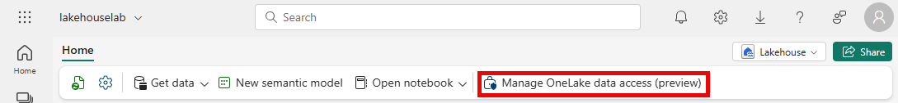

---
lab:
    title: 'Secure data access in Microsoft Fabric'
    module: 'Secure data access in Microsoft Fabric'
---

# Secure data access in Microsoft Fabric

Microsoft Fabric has a multi-layer security model for managing data access. Security can be set for an entire workspace, for individual items, or through granular permissions in each Fabric engine. In this exercise, you secure data using workspace, and item access controls and OneLake data access roles.

> **Note**: To complete the exercises in this lab, you'll need two users: one user should be assigned the Workspace Admin role, and the other should have the Workspace Viewer role. To assign roles to workspaces see [Give access to your workspace](https://learn.microsoft.com/fabric/get-started/give-access-workspaces). If you don't have access to a second account in the same organization, you can still do the exercise as an Workspace Admin and skip the steps done as an Workspace Viewer account, referring to the exercise's screenshots to see what an Workspace Viewer account has access to.

This lab takes approximately **45** minutes to complete.

## Create a workspace

Before working with data in Fabric, create a workspace with the Fabric trial enabled.

1. Navigate to the [Microsoft Fabric home page](https://app.fabric.microsoft.com/home?experience=fabric) at `https://app.fabric.microsoft.com/home?experience=fabric` in a browser and sign in with your Fabric credentials.
1. In the menu bar on the left, select **Workspaces** (the icon looks similar to &#128455;).
1. Create a new workspace with a name of your choice, selecting a licensing mode that includes Fabric capacity (*Trial*, *Premium*, or *Fabric*).
1. When your new workspace opens, it should be empty.

    

> **Note**: When you create a workspace, you automatically become a member of the Workspace Admin role.

## Create a data warehouse

Next, create a data warehouse in the workspace you created:

1. Click **+ New Item**. On the *New item* page, under the *Store Data* section, select **Sample warehouse** and create a new data warehouse with a name of your choice.

     After a minute or so, a new warehouse will be created:

    

## Create a lakehouse
Next, create a lakehouse in the workspace you created.

1. In the menu bar on the left, select **Workspaces** (the icon looks similar to 🗇).
2. Select the workspace you created.
3. In the workspace, select the **+ New Item** button and then select **Lakehouse**. Create a new Lakehouse with the name of your choice.

   After a minute or so, a new Lakehouse will be created:

    

4. Select the **Start with sample data** tile and then select the **Public holidays** sample. After a minute or so, the lakehouse will be populated with data.

## Apply workspace access controls

Workspace roles are used to control access to workspaces and the content within them. Workspace roles can be assigned when users need to see all items in a workspace, when they need to manage workspace access, or create new Fabric items, or when they need specific permissions to view, modify or share content in the workspace.  

In this exercise, you add a user to a workspace role, apply permissions and, see what is viewable when each set of permissions is applied. You open two browsers and sign-in as different users. In one browser, you'll be a **Workspace Admin** and in the other, you'll sign-in as a second, less privileged user. In one browser, the Workspace Admin changes permissions for the second user and in the second browser, you're able to see the effects of changing permissions.  

1. In the menu bar on the left, select **Workspaces** (the icon looks similar to &#128455;).
2. Next select the workspace you created.
3. Select on **Manage access** on the top of the screen.

> **Note**: You'll see the user you're logged, who is a a member of the **Workspace Admin** role because you created the workspace. No other users are assigned access to the workspace yet.

4. Next, you'll see what a user without permissions on the workspace can view. In your browser, open an InPrivate window. In the Microsoft Edge browser, select the ellipse at the top right corner and select **New InPrivate Window**.
5. Enter https://app.fabric.microsoft.com and sign-in as the second user you're using for testing.  
6. On the bottom left corner of your screen, select **Microsoft Fabric** and then select **Data Warehouse**. Next select **Workspaces** (the icon looks similar to &#128455;).  

> **Note:** The second user doesn't have access to the workspace, so it's not viewable.

7. Next, you assign the **Workspace Viewer** role to the second user and see that the role grants read access to the warehouse in the workspace.  
8. Return to the browser window where you're logged in as the Workspace Admin. Ensure you're still on the page that shows the workspace you created. It should have your new workspace items, and the sample warehouse and lakehouse, listed at the bottom of the page.
9. Select **Manage access** at the top right of the screen.
10. Select **Add people or groups**. Enter the email of the second user you're testing with. Select **Add** to assign the user to the workspace **Viewer** role.
11. Return to the InPrivate browser window where you're logged in as the second user and select refresh button on the browser to refresh session permissions assigned to the second user.
12. Select the **Workspaces** icon on the left menu bar (the icon looks similar to &#128455;) and select on the workspace name you created as the Workspace Admin user. The second user can now see all of the items in the workspace because they were assigned the **Workspace Viewer** role.

    

13. Select the warehouse and open it.
14. Select the **Date** table and wait for the rows to be loaded. You can see the rows because as a member of the Workspace Viewer role, you have CONNECT and ReadData permission on tables in the warehouse. For more information on permissions granted to the Workspace Viewer role, see [Workspace roles](https://learn.microsoft.com/en-us/fabric/data-warehouse/workspace-roles).
15. Next, you grant item-level permissions on the lakehouse so the second user can access the lakehouse SQL analytics endpoint. Return to the browser window where you're logged in as the Workspace Admin.
16. Select **Workspaces** from the left navigation bar and select your workspace.
17. Hover over the name of the lakehouse and an ellipse (**...**) will appear. Select the ellipse and select **Manage permissions**.
18. Select **Add user** and enter the name of the second user.
19. In the box that appears, under **Additional permissions** check **Read all SQL endpoint data (ReadData)** and uncheck all other boxes, then select **Grant**.

    > **Note**: Unlike the warehouse, the Workspace Viewer role alone does not grant sufficient permissions to access lakehouse data through the SQL analytics endpoint. You must explicitly grant item-level Read permission on the lakehouse for users to query its data via the SQL analytics endpoint.

20. Return to the InPrivate browser window where you're logged in as the second user and select the refresh button on the browser to refresh session permissions.
21. Select the **Workspaces** icon on the left menu bar, then select the lakehouse.
22. When the lakehouse opens, click on the dropdown box at the top right corner of the screen that says **Lakehouse** and select **SQL analytics endpoint**.
23. Select the **publicholidays** table and wait for the data to be displayed. The data is now accessible because the user has both the Workspace Viewer role and item-level Read permission on the lakehouse, which together grant read permissions on the SQL analytics endpoint.

## Apply item access control

Item permissions control access to individual Fabric items within a workspace, like warehouses, lakehouses and semantic models. In this exercise, you remove the **Workspace Viewer** permissions and the lakehouse item permissions applied in the previous exercise and then apply item level permissions on the warehouse so a less privileged user can only view the warehouse data, not the lakehouse data.

1. Return to the browser window where you're logged in as the Workspace Admin. Select **Workspaces** from the left navigation pane. 
2. Select the workspace that you created to open it.
3. Select **Manage access** from the top of the screen.
4. Select the word **Viewer** under the name of the second user. On the menu that appears, select **Remove**.

   

5. Close the **Manage access** section.
6. Now remove the lakehouse item permissions. Hover over the name of the lakehouse and an ellipse (**...**) will appear. Select the ellipse and select **Manage permissions**.
7. Find the second user in the list, select the ellipse (**...**) next to their name, and select **Remove**.
8. Close the **Manage permissions** section.
9. In the workspace, hover over the name of your warehouse and an ellipse (**...**) will appear. Select the ellipse and select **Manage permissions**
10. Select **Add user** and enter the name of the second user. 
11. In the box that appears, under **Additional permissions** check **Read all data using SQL (ReadData)** and uncheck all other boxes.

    

12. Select **Grant**
13. Return to the browser window where you're logged in as the second user. Refresh the browser view.
14. The second user no longer has access to the workspace and instead has access to only the warehouse. You can no longer browse workspaces on the left navigation pane to find the warehouse. Select **OneLake catalog** on the left navigation menu to find the warehouse: 

    

15. Select the warehouse. On the screen that appears, select **Open** from the top menu bar.
16. When the warehouse view appears, select the **Date** table to view table data. The rows are viewable because the user still has read access to the warehouse because ReadData permissions were applied by using item permissions on the warehouse.

## Apply OneLake data access roles in a Lakehouse

OneLake data access roles let you create custom roles within a Lakehouse and grant read permissions to folders you specify. OneLake data access roles is currently a Preview feature.

In this exercise, you assign an item permission and create a OneLake data access role and experiment with how they work together to restrict access to data in a Lakehouse.  

1. Stay in the browser where you're logged in as the second user.  
2. Select **OneLake catalog** on the left navigation bar. The second user doesn't see the lakehouse.  
3. Return to the browser where you're logged in as the Workspace Admin.
4. Select **Workspaces** on the left menu and select your workspace. Hover over the name of the lakehouse.  
5. Select on the ellipse (**...**) to the right of the ellipse and select **Manage permissions**

    

6. On the screen that appears, select **Add user**. 
7. Assign the second user to the lakehouse and ensure none of the checkboxes on the **Grant People Access** window are checked.  

    

8. Select **Grant**. The second user now has read permissions on the lakehouse. Read permission only allows the user to see metadata for the lakehouse but not the underlying data. Next we'll validate this.
9. Return to the browser where you're logged in as the second user. Refresh the browser.
10. Select **OneLake** in the left navigation pane.  
11. Select the lakehouse and open it. 
12. Select **Open** on the top menu bar. You're unable to expand the tables or files even though read permission was granted.

    

13. Next, you grant the second user access to a specific folder using OneLake data access permissions.
14. Return to the browser where you're logged in as the workspace administrator.
15. Select **Workspaces** from the left navigation bar.
16. Select your workspace name.
17. Select the lakehouse.
18. When the lakehouse opens, select **Manage OneLake data access** on the top menu bar and enable the feature by selecting the **Continue** button.

    

19. Select **+ New** on the **OneLake security** screen that appears.
  
    

20. Create a new role called **publicholidays**, then select **Selected data** and **Browse Lakehouse**. In the new window, select the publicholidays table.
21. In the **Add members to your role** field, add your second user.
22. In the **Preview role** section, confirm that the **publicholidays** table is added to the **Data preview** tab with Read permissions and your second user is added to the **Members preview** tab. Select **Create role**.
23. Return to the browser where you're logged in as the second user. Ensure you're still on the page where the lakehouse is open. Refresh the browser.  
24. Select the **publicholidays** table and wait for the data to load. Only the data in the publicholidays table is accessible to the user because the user was assigned to the custom OneLake data access role. The role permits them to see only the data in the publicholidays table, not data in any of the other tables, files, or folders.

    

## Clean up resources

In this exercise, you secured data using workspace access controls, item access controls and, OneLake data access roles.

1. In the left navigation bar, select the icon for your workspace to view all of the items it contains.
2. In the menu on the top toolbar, select **Workspace settings**.
3. In the **General** section, select **Remove this workspace**.
