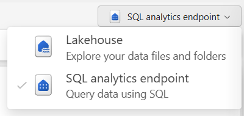
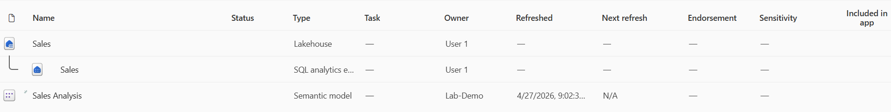
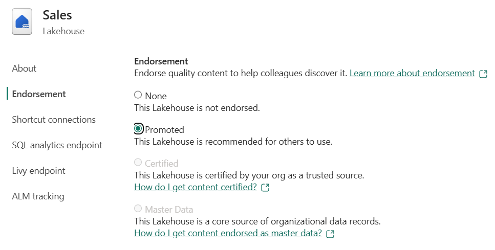
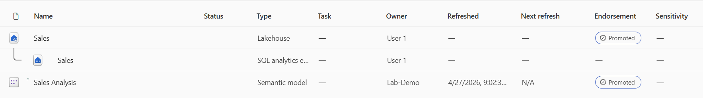
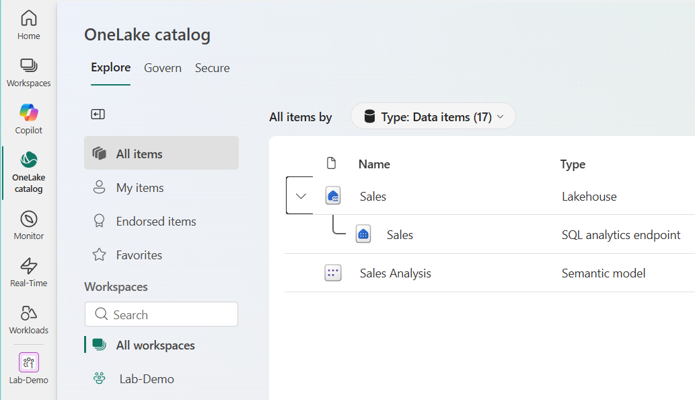
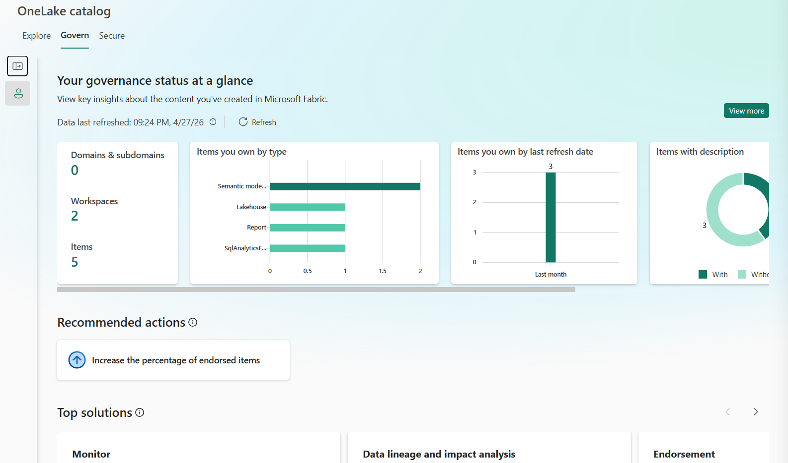
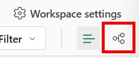

---
lab:
    title: 'Govern analytics data in Microsoft Fabric'
    module: 'Govern analytics data in Microsoft Fabric'
    description: 'Create analytics assets in Microsoft Fabric and apply governance practices including endorsement, documentation, and lineage analysis to make data assets trustworthy and discoverable.'
    duration: 30 minutes
    level: 200
    islab: true
    primarytopics:
        - Microsoft Fabric
        - Data governance
        - OneLake catalog
---

# Govern analytics data in Microsoft Fabric

In a growing analytics environment, data assets multiply quickly across workspaces. Lakehouses, semantic models, and reports are created by different teams, and without governance, it becomes difficult to tell which assets are trustworthy and ready for organizational use. Governance practices like endorsement, documentation, and lineage analysis help users find and trust the right data.

Microsoft Fabric provides built-in governance capabilities that don't require additional licensing or external tools. You can promote items to signal their readiness, add descriptions to improve discoverability, and use the OneLake catalog to monitor governance coverage across your data estate. Lineage views and impact analysis show how data flows between items, helping you understand the consequences of changes before you make them.

In this exercise, you create a lakehouse and semantic model, then apply governance practices including endorsement, documentation, and lineage analysis. You use the OneLake catalog to explore governance insights and discover how these signals make your data estate more trustworthy.

This lab takes approximately **30** minutes to complete.

## Set up the environment

You need a Fabric-enabled workspace to complete this exercise. For more information about a Fabric trial, see [Getting started with Fabric](https://learn.microsoft.com/fabric/get-started/fabric-trial).

### Create a workspace

1. Navigate to the [Microsoft Fabric home page](https://app.fabric.microsoft.com/home?experience=fabric) at `https://app.fabric.microsoft.com/home?experience=fabric` in a browser, and sign in with your Fabric credentials.
1. In the menu bar on the left, select **Workspaces** (the icon looks similar to &#128455;).
1. Create a new workspace with a name of your choice, selecting a licensing mode that includes Fabric capacity (*Trial*, *Premium*, or *Fabric*). If you're using a paid capacity, an F2 SKU or higher is sufficient.
1. When your new workspace opens, it should be empty.

    

### Create a lakehouse and load data

In this task, you create a lakehouse and load sample sales data into a table.

1. In your workspace, select **+ New item**, and then select **Lakehouse**. Name it **Sales**.

    After a minute or so, a new lakehouse with empty **Tables** and **Files** folders is created.

1. Download the [sales.csv](https://github.com/MicrosoftLearning/dp-data/raw/main/sales.csv) sample sales data file from `https://github.com/MicrosoftLearning/dp-data/raw/main/sales.csv`. Save it as **sales.csv**.

    > **Tip**: If the file opens in your browser, right-click anywhere on the page and select **Save as** to save it as a CSV file.

1. Return to your lakehouse in the browser. In the **...** menu for the **Files** folder, select **Upload** > **Upload files**, and upload the **sales.csv** file from your local computer.

1. After the file uploads, select the **...** menu for the **sales.csv** file and select **Load to Tables** > **New table**.

1. In the **Load to table** dialog, set the table name to **sales** and confirm the load operation. Wait for the table to be created and loaded.

    > **Tip**: If the **sales** table doesn't appear automatically, select **Refresh** in the **...** menu for the **Tables** folder.

1. In the **Explorer** pane, select the **sales** table to verify the data loaded correctly.

### Create a semantic model

In this task, you create a semantic model from the lakehouse sales table.

1. At the top-right of the lakehouse page, switch from **Lakehouse** to **SQL analytics endpoint**. Wait for the SQL analytics endpoint to open.

    

1. In the Home ribbon, select **New semantic model**.

1. In the **New semantic model** dialog box, name the semantic model **Sales Analysis**.

1. Leave the default selections, select the `sales` table, then **Confirm** to create the model.

    After a moment, the semantic model is created in your workspace.

1. Select your workspace name in the breadcrumb at the top of the page to return to the workspace view. You should now see several items: the **Sales** lakehouse, its **SQL analytics endpoint**, and the **Sales Analysis** semantic model you created.

    

## Endorse and document data assets

Endorsement and descriptions work together to make items trustworthy and discoverable. In this section, you promote and document the lakehouse and semantic model so users can find and evaluate them in the OneLake catalog.

### Endorse and document the lakehouse

In this task, you promote the **Sales** lakehouse and add a description.

1. In the workspace view, find the **Sales** lakehouse. Select the **...** menu for the lakehouse and choose **Settings**.

1. In the settings pane, expand the **Endorsement** section.

1. Select **Promoted** and then select **Apply**.

    

1. In the **About** section, enter the following description:

    `Retail sales transactions including order date, item, category, quantity, and unit price. Refreshed manually with sample data for training purposes.`

1. Close the settings pane to save your changes and return to the workspace view.

### Endorse and document the semantic model

In this task, you promote the **Sales Analysis** semantic model and add a description.

1. In the workspace view, find the **Sales Analysis** semantic model. Select the **...** menu and choose **Settings**.

1. Expand the **Endorsement and discovery** section, select **Promoted**.

    > Notice that the option to **Make discoverable** is automatically selected at this time. While access is still restricted, this semantic model appears in results so users can request access.

1. In the **Description** field, enter:

    `Semantic model built from the Sales lakehouse. Contains retail sales data with revenue by item and category. Promoted for team use.`

1. Close the settings pane and return to the workspace view. Notice that promoted items now display a **Promoted** badge next to their name in the workspace list.

    

## Explore governance in the OneLake catalog

The OneLake catalog provides a centralized view of data assets in your Fabric environment. In this section, you use the different tabs to discover items, review governance insights, and check access controls.

1. In the left navigation pane, select the **OneLake** icon to open the OneLake catalog.

    

1. In the **Explore** tab, browse the list of items. Find your **Sales** lakehouse and select it to view its details in the side pane.

1. In the details pane, notice the **Overview** tab displays:
    - The description you added earlier.
    - **Location**: Shows the workspace where the item is stored.
    - **Data updated**: Shows when the data was last updated.
    - **Owner**: Shows who owns the item.
    - **Endorsement**: Shows the Promoted badge you applied.
    - **Tables**: Shows which tables exist.

1. Select the **Endorsed items** section in the navigation pane. Notice how only your endorsed lakehouse and semantic model should appear.

    > **Note**: Filtering by endorsement helps you focus on trusted, quality-checked assets.

1. Select the **Govern** tab at the top of the OneLake catalog. The Govern tab displays a **Your governance status at a glance** dashboard with summary cards showing the number of domains, workspaces, and items you own. Charts break down items by type, last refresh date, and description coverage. A **Recommended actions** section suggests improvements like increasing the percentage of endorsed items.

    

1. Select **View more** to open the **All insights** report. This interactive report resembles a Power BI dashboard with a filters pane on the right. It includes detailed charts about your data estate, such as items by type, workspaces assigned to domains, items that failed last refresh by type, items by last access date, and items by last refresh date.

1. Explore the report by filtering and scrolling through the charts. When you're done, select the back arrow to return to the OneLake catalog.

1. Select the **Secure** tab to view security information. The Secure tab shows workspace roles and OneLake security roles across items, providing a centralized view of users and their access permissions.

## View lineage and run impact analysis

Lineage shows how data flows between items in a workspace, and impact analysis identifies downstream dependencies. In this section, you trace data lineage from the lakehouse to the semantic model and run impact analysis to identify items affected by changes.

1. Return to your workspace by selecting **Workspaces** in the left navigation pane and then selecting your workspace.

1. In the workspace toolbar, select the **Lineage view** icon below **Workspace settings**.

    The lineage view displays all items in the workspace as cards, connected by arrows showing data flow.

    

1. Find the **Sales** lakehouse card. Trace the arrows to see how data flows from the lakehouse to its SQL analytics endpoint, and from there to the **Sales Analysis** semantic model.

    This visualization shows the complete data lineage: the lakehouse is the source, the SQL analytics endpoint provides SQL access, and the semantic model enables reporting and AI consumption.

    

1. On the **Sales** lakehouse card, select the arrow icon at the bottom-right corner to highlight its specific lineage. Fabric dims unrelated items and highlights only the items connected to the lakehouse.

1. On the **Sales** lakehouse card, select the icon to **Show impact across workspaces**.

    

1. In the impact analysis pane, select **All downstream items** and review what depends on the lakehouse:
    - The SQL analytics endpoint
    - The semantic model built from the endpoint

    These are the items that would be affected if you changed the lakehouse structure, deleted tables, or modified data. Understanding this dependency chain is critical before making changes.

1. Close the impact analysis pane and switch back to **List view** in the workspace toolbar.

## Clean up resources

In this exercise, you created a lakehouse with sample data, built a semantic model, and applied governance practices including endorsement, documentation, and lineage analysis. You used the OneLake catalog to explore governance insights across your data estate.

If you've finished exploring, you can delete the workspace you created for this exercise.

1. In the bar on the left, select the icon for your workspace to view all of the items it contains.
1. In the toolbar, select **Workspace settings**.
1. In the **General** section, select **Remove this workspace**.
