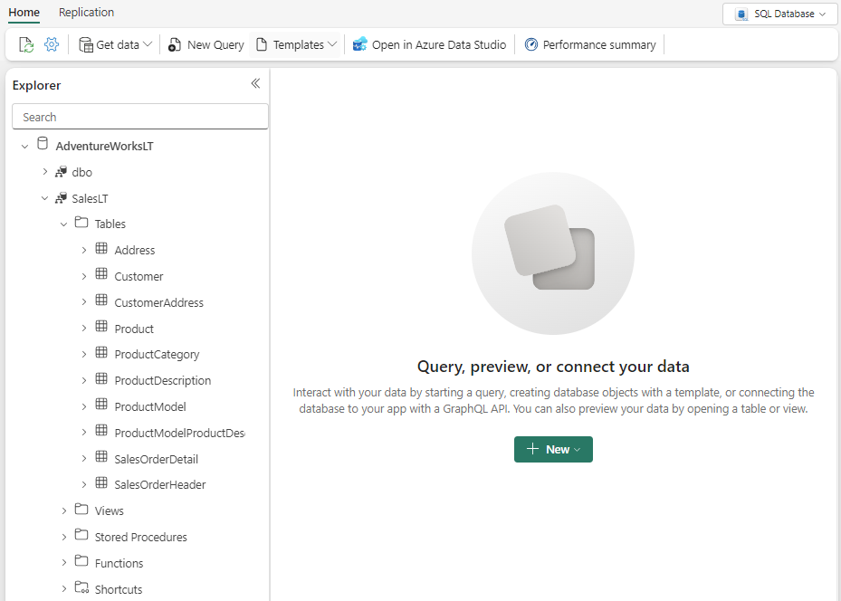

---
lab:
    title: 'Work with API for GraphQL in Microsoft Fabric'
    module: 'Get started with GraphQL in Microsoft Fabric'
---

# Work with API for GraphQL in Microsoft Fabric

Microsoft Fabric API for GraphQL is a data access layer that enables quick and efficient querying of multiple data sources with a widely adopted and familiar API technology. The API allows you to abstract the specifics of backend data sources so you can concentrate on your application's logic, and provide all the data a client needs in a single call. GraphQL uses a simple query language and easily manipulated result sets, which minimizes the time it takes for applications to access your data in Fabric.

This lab will take approximately **30** minutes to complete.

> **Note**: You need a [Microsoft Fabric trial](https://learn.microsoft.com/fabric/get-started/fabric-trial) to complete this exercise.

## Create a workspace

Before working with data in Fabric, create a workspace with the Fabric trial enabled.

1. On the [Microsoft Fabric home page](https://app.fabric.microsoft.com/home?experience=fabric) at `https://app.fabric.microsoft.com/home?experience=fabric`.
1. In the menu bar on the left, select **New workspace**.
1. Create a new workspace with a name of your choice, selecting a licensing mode that includes Fabric capacity (*Trial*, *Premium*, or *Fabric*).
1. When your new workspace opens, it should be empty.

    

## Create a SQL database with sample data

Now that you have a workspace, it's time to create a SQL database.

1. On Fabric portal, select **+ New item** on the left panel.
1. Navigate to the **Store data** section, and select **SQL database**.
1. Enter **AdventureWorksLT** as the database name, and select **Create**.
1. Once you have created your database, you can load sample data into your database from **Sample data** card.

    After a minute or so, your database will be populated with sample data for your scenario.

    

## Query a SQL database

The SQL query editor provides support for IntelliSense, code completion, syntax highlighting, client-side parsing, and validation. You can run Data Definition Language (DDL), Data Manipulation Language (DML) and Data Control Language (DCL) statements.

1. In the **AdventureWorksLT** database page, navigate to **Home**, and select **New query**.
1. In the new blank query pane, enter and run the following T-SQL code.

    ```sql
    SELECT 
        p.Name AS ProductName,
        pc.Name AS CategoryName,
        p.ListPrice
    FROM 
        SalesLT.Product p
    INNER JOIN 
        SalesLT.ProductCategory pc ON p.ProductCategoryID = pc.ProductCategoryID
    ORDER BY 
    p.ListPrice DESC;
    ```
    
    This query joins the `Product` and `ProductCategory` tables to display the product names, their categories, and their list prices, sorted by price in descending order.

1. Close all query tabs.

## Create an API for GraphQL

First, you will set up a GraphQL endpoint to expose the sales order data. This endpoint will allow you to query sales orders based on various parameters, such as date, customer, and product.

1. On Fabric portal, navigate to your workspace, and select **+ New item**.
1. Navigate to the **Develop data** section, and select **API for GraphQL**.
1. Provide a name, and select **Create**.
1. On the main page of your API for GraphQL, select **Select data source**.
1. If prompted to choose a connectivity option, select **Connect to Fabric data sources with single sign-on(SSO) authentication**.
1. On the **Choose the data you want to connect** page, select the `AdventureWorksLT` database previously created.
1. Select **Connect**.
1. On the **Choose data** page, select the `SalesLT.Product` table. 
1. Preview the data and select **Load**.
1. Select **Copy endpoint** and note the public URL link. We don't need this, but this is where you'd go to copy your API address.

## Disable mutations

Now that our API is created, we only want to expose the sales data for reading operations in this scenario.

1. On the **Schema explorer** of your API for GraphQL, expand **Mutations**.
1. Select on the **...** (ellipsis) next to each mutation and select **Disable**.

This will prevent any modifications or updates to the data through the API. This means that the data will be read-only, and users will only be able to view or query the data, but not make any changes to it.

## Query data using GraphQL

Now, let's query the data using GraphQL to find all the products whose names begin with *"HL Road Frame."*

1. In the GraphQL query editor, enter and run the following query.

```json
query {
  products(filter: { Name: { startsWith: "HL Road Frame" } }) {
    items {
      ProductModelID
      Name
      ListPrice
      Color
      Size
      ModifiedDate
    }
  }
}
```

In this query, products is the main type, and it includes fields for `ProductModelID`, `Name`, `ListPrice`, `Color`, `Size`, and `ModifiedDate`. This query will return a list of products whose names begin with *"HL Road Frame."*.

> **Further Information**: See [What is Microsoft Fabric API for GraphQL?](https://learn.microsoft.com/fabric/data-engineering/api-graphql-overview) in the Microsoft Fabric documentation to learn more about other components available in the platform.

In this exercise, you've created, queried, and exposed data from a SQL database using GraphQL in Microsoft Fabric.

## Clean up resources

If you've finished exploring your database, you can delete the workspace you created for this exercise.

1. In the bar on the left, select the icon for your workspace to view all of the items it contains.
2. In the **...** menu on the toolbar, select **Workspace settings**.
3. In the **General** section, select **Remove this workspace**.

