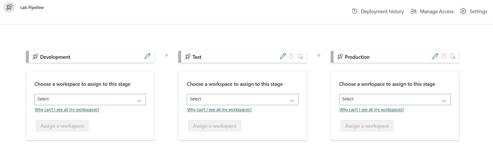
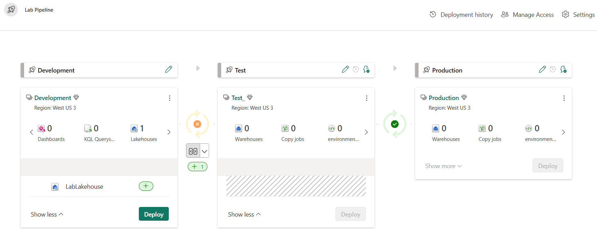

---
lab:
    title: 'Implement deployment pipelines in Microsoft Fabric'
    module: 'Implement CI/CD in Microsoft Fabric'
---

# Implement deployment pipelines in Microsoft Fabric

Deployment pipelines in Microsoft Fabric let you automate the process of copying   changes made to the content in Fabric items between environments like development, test, and production. You can use deployment pipelines to develop and test content before it reaches end users. In this exercise, you create a deployment pipeline, and assign stages to the pipeline. Then you create some content in a development workspace and use deployment pipelines to deploy it between the Development, Test and Production pipeline stages.

> **Note**: To complete this exercise, you need to be an member of the Fabric workspace admin role. To assign roles see [Roles in workspaces in Microsoft Fabric](https://learn.microsoft.com/en-us/fabric/get-started/roles-workspaces).

This lab takes approximately **20** minutes to complete.

## Create workspaces

Create three workspaces with the Fabric trial enabled.

1. Navigate to the [Microsoft Fabric home page](https://app.fabric.microsoft.com/home?experience=fabric) at `https://app.fabric.microsoft.com/home?experience=fabric` in a browser and sign in with your Fabric credentials.
2. In the menu bar on the left, select **Workspaces** (the icon looks similar to &#128455;).
3. Create a new workspace named Development, selecting a licensing mode that includes Fabric capacity (*Trial*, *Premium*, or *Fabric*).
4. Repeat steps 1 & 2, creating two more workspaces named Test, and Production. Your workspaces are: Development, Test, and Production.
5. Select the **Workspaces** icon on the menu bar on the left and confirm that there are three workspaces named:  Development, Test, and Production

> **Note**: If you are prompted to enter a unique name for the workspaces, append one or more random numbers to the words: Development, Test, or Production.

## Create a deployment pipeline

Next, create a deployment pipeline.

1. In the menu bar on the left, select **Workspaces**.
2. Select **Deployment Pipelines**, then **New pipeline**.
3. In the **Add a new deployment pipeline** window, give the pipeline a unique name and select **Next**.
4. In the new pipeline window, select **Create and continue**.

## Assign workspaces to stages of a deployment pipeline

Assign workspaces to the stages of the deployment pipeline.

1. On the left menu bar, select the pipeline you created. 
2. In the window that appears, expand the options under **Assign a workspace** on each deployment stage and select the name of the workspace that matches the name of the stage.
3. Select the check mark **Assign** for each deployment stage.

  

## Create content

Fabric items haven't been created in your workspaces yet. Next, create a lakehouse in the development workspace.

1. In the menu bar on the left, select **Workspaces**.
2. Select the **Development** workspace.
3. Select **New Item**.
4. In the window that appears, select **Lakehouse** and in the **New lakehouse window**, name the lakehouse, **LabLakehouse**.
5. Select **Create**.
6. In the Lakehouse Explorer window, select **Start with sample data** to populate the new lakehouse with data.

  

7. Select the sample **NYCTaxi**.
8. In the menu bar on the left, select the pipeline you created.
9. Select the **Development** stage, and under the deployment pipeline canvas you can see the lakehouse you created as a stage item. In the left edge of the **Test** stage, there's an **X** within a circle. The **X** indicates that the Development and Test stages aren't synchronized.
10. Select the **Test** stage and under the deployment pipeline canvas you can see that the lakehouse you created is only a stage item in the source, which in this case refers to the **Development** stage.  

  

## Deploy content between stages

Deploy the lakehouse from the **Development** stage to the **Test** and **Production** stages.
1. Select the **Deploy** button in the **Development** stage of the pipeline to copy the lakehouse in its current state to the text stage. 
2. In the **Deploy to next stage** window, select **Deploy**.
3. There is an orange X between the Test and Production stages. Select the downward facing arrow below the orange X. The lakehouse exists in the Development and Test stages but not yet in the Production stage.
4. In the **Test** stage, select **Deploy**.
5. In the **Deploy to next stage** window, select **Deploy**. The green check mark between the stages indicates that all stages in sync and contain the same content.
6. Using deployment pipelines to deploy between stages also updates the content in the workspaces corresponding to the deployment stage. Let's confirm.
7. In the menu bar on the left, select **Workspaces**.
8. Select the **Test** workspace. The lakehouse was copied there.
9. Open the **Production** workspace from the **Workspaces** icon on the left menu. The lakehouse was copied to the Production workspace too.

## Clean up

In this exercise, you created a deployment pipeline, and assigned stages to the pipeline. Then you created content in a development workspace and deployed it between pipeline stages using deployment pipelines.

- In the left navigation bar, select the icon for each workspace to view all of the items it contains.
- In the menu on the top toolbar, select Workspace settings.
- In the General section, select Remove this workspace.
