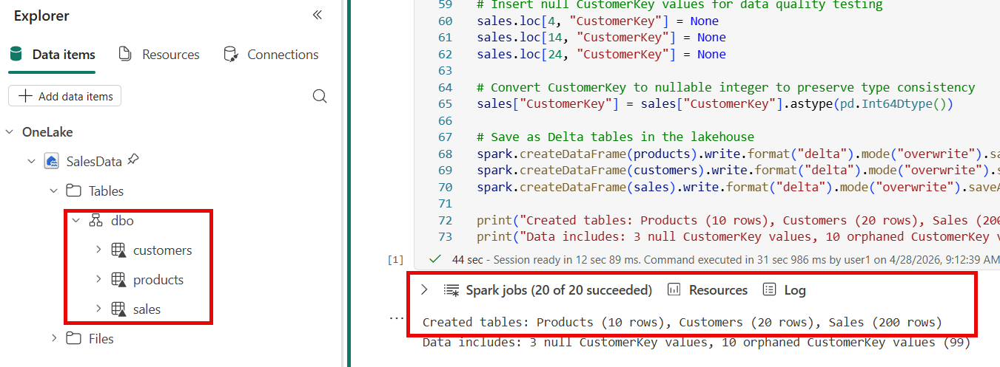
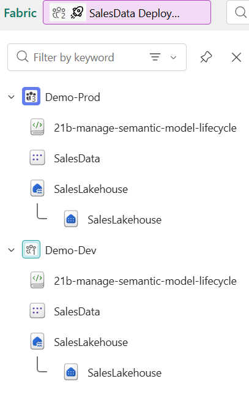

---
lab:
    title: 'Manage the semantic model lifecycle'
    module: 'Manage the semantic model development lifecycle'
    description: 'Validate a semantic model with SemPy in a Fabric notebook, create a deployment pipeline to promote content across stages, and verify deployed content in a production workspace.'
    duration: 45 minutes
    level: 200
    islab: true
    primarytopics:
        - Microsoft Fabric
        - Power BI
        - Semantic Link
        - Deployment pipelines
    categories:
        - Operations and lifecycle management
    courses:
        - DP-600
---

# Manage the semantic model lifecycle

Analytics teams that publish directly to production without validation or structured deployment risk breaking reports, losing change history, and serving incorrect data. A defined lifecycle process prevents these problems by catching issues before content reaches business users.

In this exercise, you create a lakehouse with sample data, then use SemPy in a Fabric notebook to inspect the semantic model's structure and validate data quality. When validation reveals missing relationships that produce incorrect DAX results, you use SemPy's read/write TOM connection to fix the model programmatically. After confirming the model is correct, you create a deployment pipeline with Development and Production stages and promote the validated content from Development to Production. These tasks follow the **Validate → Fix → Deploy** stages of the semantic model lifecycle.

This lab takes approximately **45** minutes to complete.

> **Tip:** For related training content, see [Manage the semantic model development lifecycle](https://learn.microsoft.com/training/modules/manage-semantic-model-lifecycle/).

## Set up the environment

> **Note**: You need access to a Fabric paid or trial capacity to complete this exercise. Paid capacities must include Power BI capabilities, or you need a separate Power BI Pro or Premium Per User license. For information about the free Fabric trial, see [Fabric trial](https://aka.ms/fabrictrial).

### Create workspaces

In this task, you create two workspaces for the deployment pipeline stages: Development and Production.

1. Navigate to the [Microsoft Fabric home page](https://app.fabric.microsoft.com/home?experience=fabric) at `https://app.fabric.microsoft.com/home?experience=fabric` in a browser, and sign in with your Fabric credentials.
1. In the menu bar on the left, select **Workspaces** (the icon looks similar to &#128455;).
1. Create a new workspace with a name of your choice followed by `-dev` (for example, `SalesLifecycle-dev`), selecting a licensing mode that includes Fabric capacity (*Trial*, *Premium*, or *Fabric*). Remember this base name because you use it for the production workspace and the deployment pipeline.
1. When your new workspace opens, it should be empty.

    

1. Repeat the process to create a second workspace with the same base name followed by `-prod` (for example, `SalesLifecycle-prod`).

    > **Note**: Both workspaces must be on Fabric or Premium capacity for deployment pipelines to work.

1. Navigate back to your **-dev** workspace to continue with the exercise.

### Import a notebook

In this task, you download the lab notebook that contains all the Python code for this exercise.

1. Open a web browser and enter the following URL to download the [21b-manage-semantic-model-lifecycle.ipynb](https://github.com/MicrosoftLearning/mslearn-fabric/raw/main/Allfiles/Labs/21b/21b-manage-semantic-model-lifecycle.ipynb) notebook:

    `https://github.com/MicrosoftLearning/mslearn-fabric/raw/main/Allfiles/Labs/21b/21b-manage-semantic-model-lifecycle.ipynb`

1. Save the file to your local **Downloads** folder (or to the VM desktop if you're in a hosted lab environment).

1. In your workspace, select **Import** and then select **Notebook**.

1. Select **Upload** and browse to the **21b-manage-semantic-model-lifecycle.ipynb** file you downloaded. Select **Open**, then select **Upload**.

## Create a lakehouse and load data

In this task, you create a lakehouse and generate the sample data.

1. From the workspace toolbar, select **+ New item** and select **Lakehouse**.

1. Name the lakehouse `SalesLakehouse`. It may take a minute for the lakehouse to create.

1. Once the lakehouse opens, select **Open notebook > Existing notebook** from the toolbar.

1. Select the notebook you just uploaded — `21b-manage-semantic-model-lifecycle` — and select **Open**.

1. Once in the notebook, run the first code cell under the `Generate sample data` heading.

    > Do **not** run any cells below the `Generate sample data` section yet. You need to create the semantic model first.

1. In the lakehouse explorer on the left, select the ellipsis **...** next to **Tables** and **Refresh** to confirm that `products`, `customers`, and `sales` tables appear.

## Create a semantic model

In this task, you create a Power BI semantic model from the lakehouse tables so you can validate it with SemPy.

1. Navigate back to the workspace and select the **SalesLakehouse** lakehouse.

1. Switch to the **SQL analytics endpoint** in the top-right corner.

    
   
1. From the toolbar, select **New semantic model** and configure as follows:

    - **Name**: `SalesData`
    - **Workspace**: Your `-dev` workspace
    - **Storage mode**: Direct Lake on SQL
    - **Tables**: Select all

1. Confirm and wait for the model to create. *It can take a minute or two for the semantic model to be fully available.*

You now have a semantic model built upon a lakehouse that can be managed using SemPy in notebooks.

## Validate the semantic model with SemPy

SemPy is a Python library in Fabric notebooks that connects to semantic models through the XMLA endpoint. In this task, you use SemPy to inspect model structure, check data quality, and verify relationships before deployment.

1. Navigate back to the notebook and scroll down to the **Validate the semantic model with SemPy** heading in the notebook. Run each code cell in this section one at a time and review the output:

1. Lists all tables in the `SalesData` semantic model to confirm it's accessible.
    - The output shows three tables: `products`, `customers`, and `sales`.

1. Lists every column across all tables, showing name, data type, and parent table. This helps you understand an unfamiliar model without opening Power BI Desktop.
    - The output shows a table with each column's name, data type, and which table it belongs to.

1. Checks for null values across all columns and duplicate primary keys. Nulls in foreign key columns mean rows can't join to dimension tables, causing blanks in reports. Duplicates would inflate aggregations.
    - The output shows three null `CustomerKey` values and zero duplicate `SalesKey` values.

1. Uses SemPy to discover potential relationships between tables by matching column name patterns (like `Key` suffixes) and checking value overlap.
    - The output shows one many-to-one relationship on `ProductKey` between the `sales` and `products` tables.

1. Checks for orphaned foreign keys — values in the fact table that have no matching row in the dimension table. Orphaned keys cause blank rows in reports.
    - The output shows violations for `CustomerKey` value 99, which has no match in the `customers` table — meaning 10 sales records produce blank customer names.

1. Evaluates a DAX query against the semantic model to verify calculations without opening Power BI Desktop.
    - The output shows the same total for every product category. **This is incorrect** — the totals should differ because each category contains different products at different prices. The identical values occur because the semantic model has no relationships, so the DAX engine can't filter sales by category.

## Fix the semantic model with SemPy

The validation revealed that the DAX query returns identical totals for every category — a clear sign that the semantic model is missing relationships. In this task, you use SemPy's `connect_semantic_model` function to open a read/write connection to the model's Tabular Object Model (TOM) and programmatically add the missing relationships.

1. In the notebook, scroll down to the **Fix the semantic model with SemPy** heading. Run each code cell in this section one at a time and review the output:

1. Opens a read/write connection to the `SalesData` semantic model and creates two many-to-one relationships using the TOM API: `sales[ProductKey]` to `products[ProductKey]` and `sales[CustomerKey]` to `customers[CustomerKey]`. Changes save automatically when the connection closes, and the cell then refreshes the semantic model so the new relationships hold data.
    - The output confirms two relationships were added and the semantic model was refreshed.

1. Re-runs the same DAX query from the validation step. Now that relationships exist, the DAX engine filters sales by product category and returns correct per-category totals.
    - The output shows different totals for each product category (Accessories, Bikes, Clothing), confirming the relationships are working.

> **Note**: The `connect_semantic_model` function requires ReadWrite permissions on the semantic model and uses the XMLA read/write endpoint. Fabric Trial, Premium, and Fabric capacity workspaces have this endpoint enabled by default.

You can now close the notebook and any other items you may still have open.

## Create a deployment pipeline

Deployment pipelines promote validated content from development to production through defined stages. In this task, you create a pipeline with two stages and assign the workspaces you created earlier.

1. Navigate to your **-dev** workspace.

1. In the workspace toolbar, select **Create deployment pipeline**.

1. In the **Add a new deployment pipeline** dialog, enter a name for the pipeline (for example, `SalesData Deployment Pipeline`) and select **Next**.

1. In the pipeline structure step, you see three default stages: `Development`, `Test`, and `Production`. Delete the `Test` stage by selecting its delete icon so that only `Development` and `Production` remain. Select **Create and continue**.

    

1. In the **Development** stage, select your `-dev` workspace and select the check to save the setting.

1. In the **Production** stage, select your **-prod** workspace and save.

The pipeline shows two stages. The `Development` stage contains the `SalesLakehouse` lakehouse, notebook, and semantic model. The `Production` stage shows the assigned workspace with no content yet.

## Deploy content across stages

With both stages configured, you can compare and promote content. In this task, you deploy the validated content from Development to Production and verify the results.

1. In the pipeline view, review the comparison between stages. Items in Development should show an indicator that they exist only in the source stage.

1. Select the **Production** card to select all items for staging.

    

1. Select **Deploy**. In the deployment dialog, optionally add a note (for example, `Initial deployment - validated with SemPy`) and confirm the deployment.

1. Wait for the deployment to complete. The pipeline view should indicate that both stages are in sync.

1. Navigate to your **-prod** workspace to verify the deployed items. You should see the lakehouse, semantic model, and other items from the development workspace.

    > **Note**: After deployment, the production workspace contains copies of the items from development. Subsequent changes in development don't appear in production until you deploy again, which gives you control over what reaches end users.

### Try it with Copilot (optional)

In a notebook in your development workspace, ask Copilot:

`Write a Python script using the Fabric REST API to automate a deployment pipeline deployment and send a notification on completion.`

Review the generated code. This shows how teams automate deployments without manual steps. The generated code doesn't trigger an actual deployment.

`Write Python code to generate a data quality summary report for a FabricDataFrame. Include checks for null values, duplicate keys, and value distribution statistics.`

Review the generated code. Copilot produces a reusable quality check script that you can adapt to validate other semantic models without modifying the tables you already created.

## Clean up resources

In this exercise, you validated a semantic model with SemPy, created a deployment pipeline, and deployed content from development to production.

If you've finished exploring, delete the resources you created for this exercise.

1. Navigate to the deployment pipeline. In the pipeline settings, select **Delete pipeline**.

1. In the menu bar on the left, select **Workspaces**.

1. Open your **-dev** workspace. In the toolbar, select **Workspace settings**, then in the **General** section, select **Remove this workspace**.

1. Open your **-prod** workspace. In the toolbar, select **Workspace settings**, then in the **General** section, select **Remove this workspace**.
