---
lab:
    title: 'Work smarter with Copilot in Microsoft Fabric dataflow gen2'
    module: 'Get started with Copilot in Fabric for data engineering'
---

# Work smarter with Copilot in Microsoft Fabric dataflow gen2

In Microsoft Fabric, Dataflows (Gen2) connect to various data sources and perform transformations in Power Query Online. They can then be used in Data Pipelines to ingest data into a lakehouse or other analytical store, or to define a dataset for a Power BI report.

This lab is designed to introduce you to Copilot in Dataflows (Gen2), and not create a complex solution that may exist in an enterprise. This lab takes **approximately 30 minutes** to complete.

> **Note**: You need a [Microsoft Fabric Capacity (F2 or higher)](https://learn.microsoft.com/fabric/fundamentals/copilot-enable-fabric) with Copilot enabled to complete this exercise.

## Create a workspace

Before working with data in Fabric, create a workspace with the Fabric trial enabled.

1. Navigate to the [Microsoft Fabric home page](https://app.fabric.microsoft.com/home?experience=fabric) at `https://app.fabric.microsoft.com/home?experience=fabric` in a browser, and sign in with your Fabric credentials.
2. In the menu bar on the left, select **Workspaces** (the icon looks similar to &#128455;).
3. Create a new workspace with a name of your choice, selecting a licensing mode that includes Fabric capacity (*Premium*, or *Fabric*). Note that *Trial* is not supported.
4. When your new workspace opens, it should be empty.

    

## Create a lakehouse

Now that you have a workspace, it's time to create a data lakehouse into which you'll ingest data.

1. On the menu bar on the left, select **Create**. In the *New* page, under the *Data Engineering* section, select **Lakehouse**. Give it a unique name of your choice.

    >**Note**: If the **Create** option is not pinned to the sidebar, you need to select the ellipsis (**...**) option first.

    After a minute or so, a new empty lakehouse will be created.

    

## Create a Dataflow (Gen2) to ingest data

Now that you have a lakehouse, you need to ingest some data into it. One way to do this is to define a dataflow that encapsulates an *extract, transform, and load* (ETL) process.

1. In the home page for your workspace, select **Get data** > **New Dataflow Gen2**. After a few seconds, the Power Query editor for your new dataflow opens as shown here.

    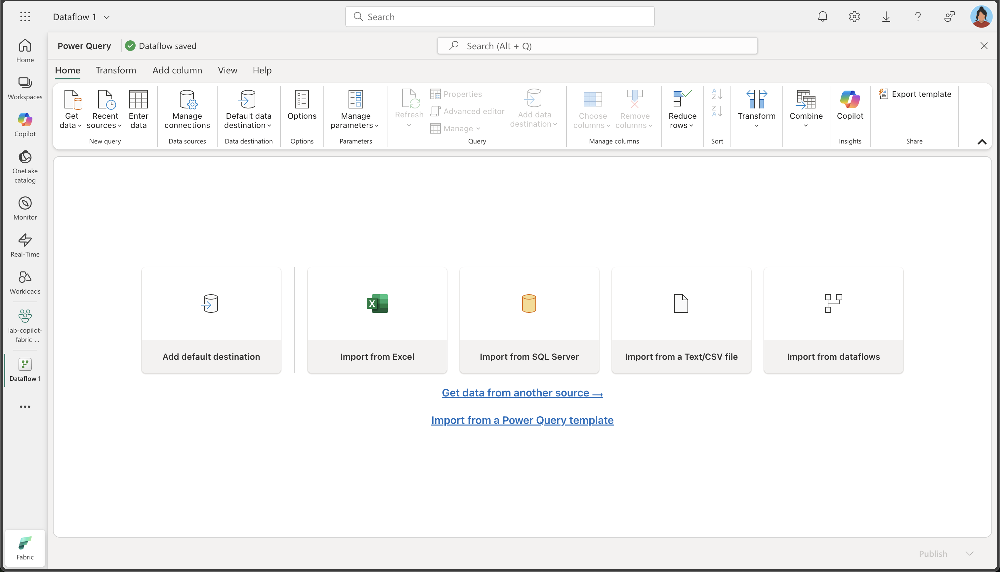

2. Select **Import from a Text/CSV file**, and create a new data source with the following settings:
 - **Link to file**: *Selected*
 - **File path or URL**: `https://raw.githubusercontent.com/microsoft/sql-server-samples/refs/heads/master/samples/databases/adventure-works/oltp-install-script/Store.csv`
 - **Connection**: Create new connection
 - **data gateway**: (none)
 - **Authentication kind**: Anonymous
 - **Privacy Level**: None

3. Select **Next** to preview the file data, and then **Create** the data source. The Power Query editor shows the data source and an initial set of query steps to format the data, as shown here:

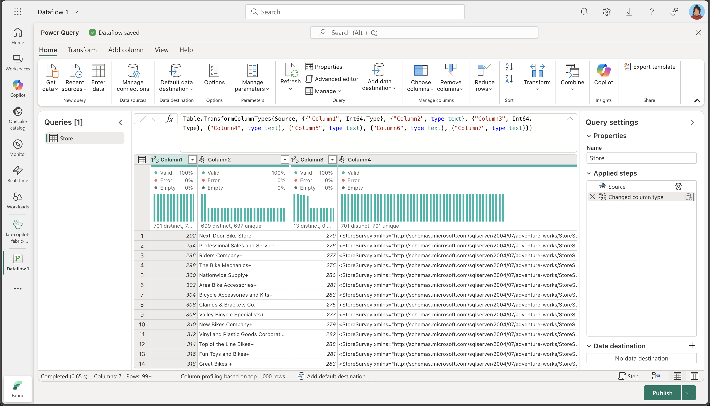

4. On the **Home** ribbon tab, from inside the **Insights** group, select **Copilot**, as shown here:
    
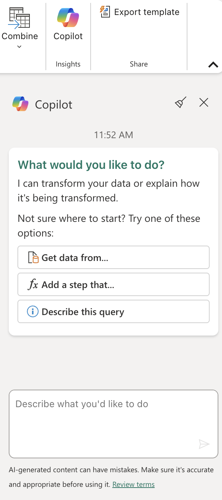

5. The column names are currently too generic and lack clear meaning. Use the following prompt to refine them and ensure they convey the intended information accurately:

```plaintext
    Rename columns to BusinessEntityID, Name, SalesPersonID, Demographics, rowguid, ModifiedDate
```

Take note that the column names are now accurate. Furthermore, an additional step has been incorporated into the Applied Steps list:

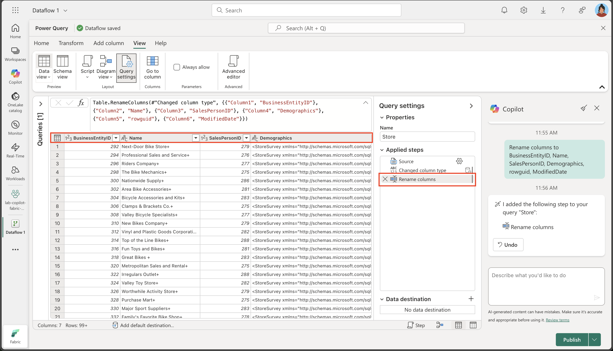

6. Certain columns contain a '+' character at the end of their text. 

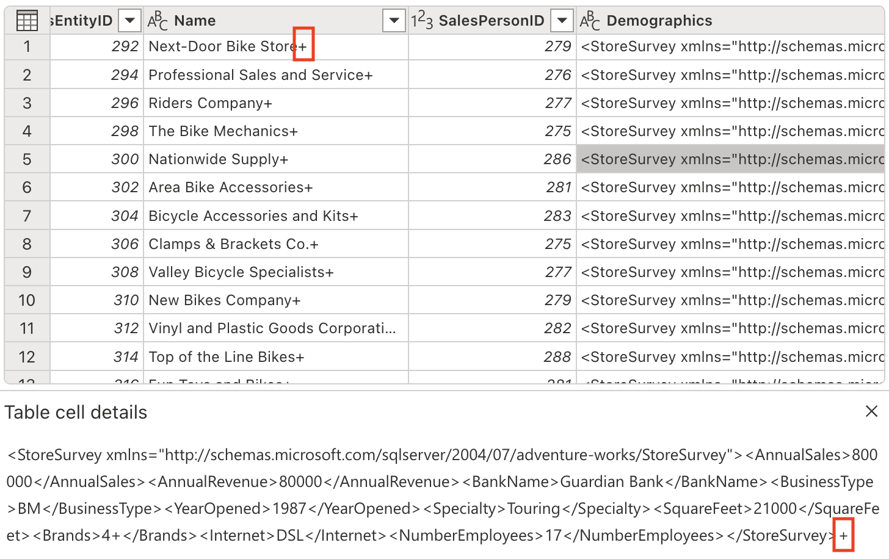

Let's eliminate it using the following prompt:

```plaintext
    Delete the last character from the columns Name, Demographics, rowguid
```

7. The table contains some redundant columns that need to be removed. Use the following prompt to refine the data accordingly:

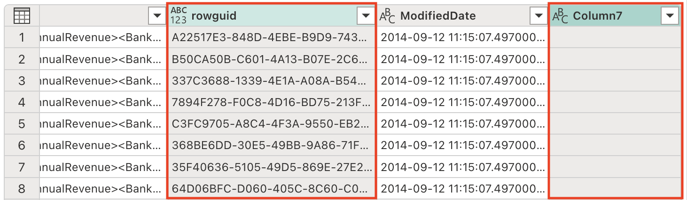

```plaintext
    Remove the rowguid and Column7 columns
```

8. The Demographics column includes an invisible Unicode character, the Byte Order Mark (BOM) \ufeff, which interferes with XML data parsing. We need to remove it to ensure proper processing.

```plaintext
    Remove the Byte Order Mark (BOM) \ufeff from the Demographics column
```

Notice the formula that was generated to remove the character:

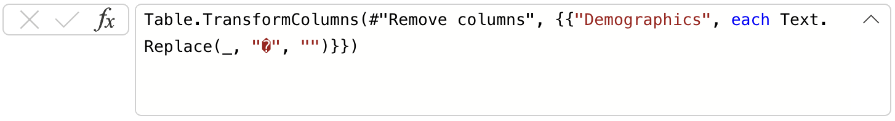

9. We are now prepared to parse the XML and unfold the columns.

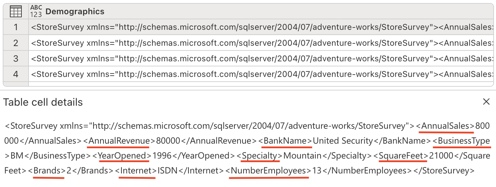

```plaintext
    Parse this XML and expand it's columns
```

Notice new columns have been added to the table (you might need to scroll to the right).

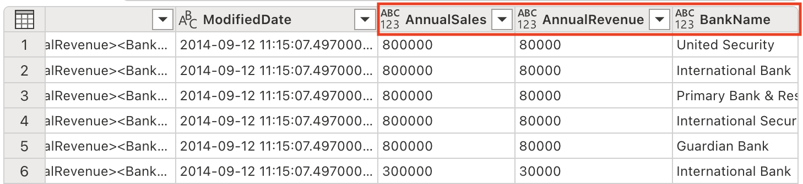

10. Remove the Demographics column, as we no longer need it:

```plaintext
    Remove the Demographics column.
```

11. The ModifiedDate column has an ampersand (&) at the end of its values. It needs to be removed before parsing to ensure proper data processing.

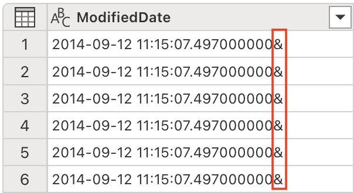

```plaintext
    Remove the last character from the ModifiedDate
```

12. We are now ready to convert its data type to DateTime.

```plaintext
    Set the data type to DateTime
```

Notice the ModifiedDate data type has changed to DateTime:

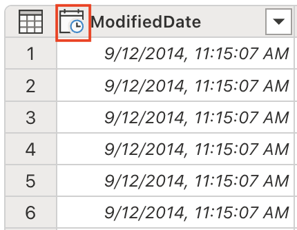

13. Adjust the data types of several columns to numeric values.

```plaintext
    Set the data type to whole number for the following columns: AnnualSales, AnnualRevenue, SquareFeet, NumberEmployee
```

14. The SquareFeet field holds numerical values ranging from 6,000 to 80,000. 


Let's generate a new column to categorize the store size accordingly:

```plaintext
    Add a column StoreSize, based on the SquareFeet:
        0 - 10000: Small
        10001 - 40000: Medium
        40001 - 80000: Large
```

Notice a new column StoreSize has been added, with a formula based on the SquareFeet column. Notice also the column profile has the 3 disting values: Small, Mediu, and Large.

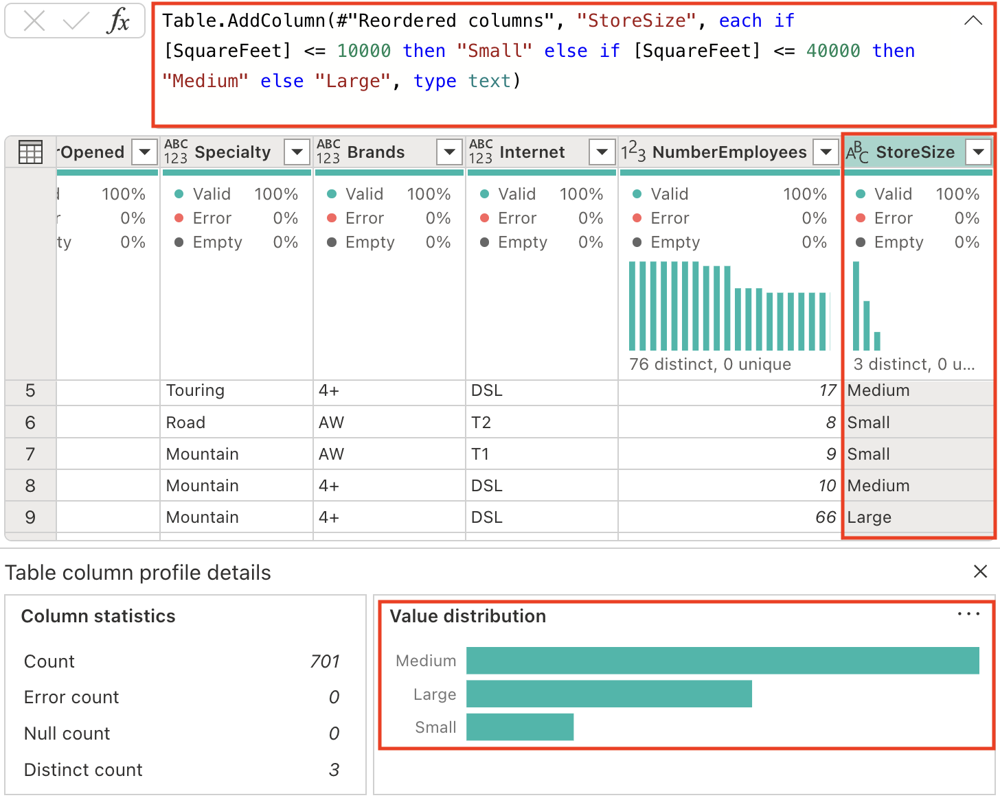

15. Modify the data types of columns that currently lack a specified type.

```plaintext
    Set the datatype of the following columns to text: Name, BankName, BusinessType, YearOpened, Specialty, Brands, Internet, StoreSize
```

## Code explanation

1. We've performed several transformations. Let's request Copilot to summarize the steps we've taken.

```plaintext
    Describe this query
```

Observe that the result appears in the Copilot pane. Below is an example of the explanation provided. Your results might vary slightly as AI-generated content can have mistakes.

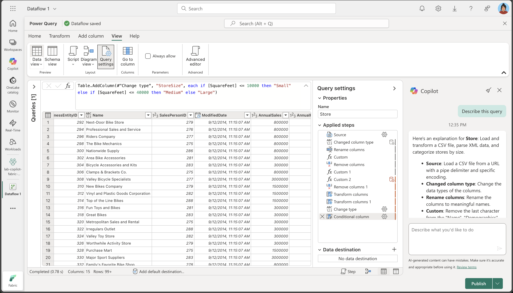

```md
*Here's an explanation for **Store**: Load and transform a CSV file, parse XML data, and categorize stores by size.*

- _**Source**: Load a CSV file from a URL with a pipe delimiter and specific encoding._
- _**Changed column type**: Change the data types of the columns._
- _**Rename columns**: Rename the columns to meaningful names._
- _**Custom**: Remove the last character from the "Name", "Demographics", and "rowguid" columns._
- _**Remove columns**: Remove the "rowguid" and "Column7" columns._
- _**Custom 1**: Remove any leading special characters from the "Demographics" column._
- _**Custom 2**: Parse the "Demographics" column as XML and expand it into multiple columns._
- _**Remove columns 1**: Remove the original "Demographics" column._
- _**Transform columns**: Remove the last character from the "ModifiedDate" column._
- _**Transform columns 1**: Convert the "ModifiedDate" column to datetime type._
- _**Change type**: Change the data types of the "AnnualSales", "AnnualRevenue", "SquareFeet", and "NumberEmployees" columns to integer._
- _**Conditional column**: Add a new column "StoreSize" based on the "SquareFeet" value, categorizing stores as "Small", "Medium", or "Large"._
- _**Change type 1**: Change the data types of several columns to text._
```

## Add data destination for Dataflow

1. On the toolbar ribbon, select the **Home** tab. Then in the **Add data destination** drop-down menu, select **Lakehouse**.

   > **Note:** If this option is grayed out, you may already have a data destination set. Check the data destination at the bottom of the Query settings pane on the right side of the Power Query editor. If a destination is already set, you can change it using the gear.

2. In the **Connect to data destination** dialog box, edit the connection and sign in using your Power BI organizational account to set the identity that the dataflow uses to access the lakehouse.

 

3. Select **Next** and in the list of available workspaces, find your workspace and select the lakehouse you created in it at the start of this exercise. Then specify a new table named **Store**:

   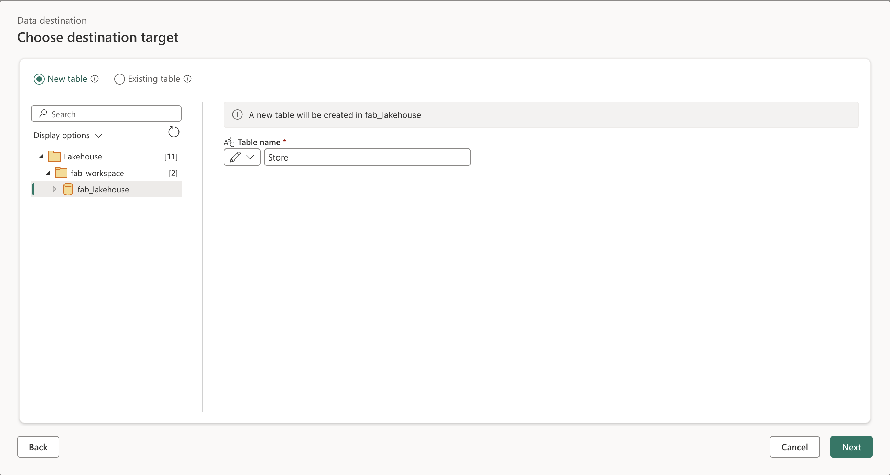

4. Select **Next** and on the **Choose destination settings** page, disable the **Use automatic settings** option, select **Append** and then **Save settings**.

    > **Note:** We suggest using the *Power query* editor for updating data types, but you can also do so from this page, if you prefer.

    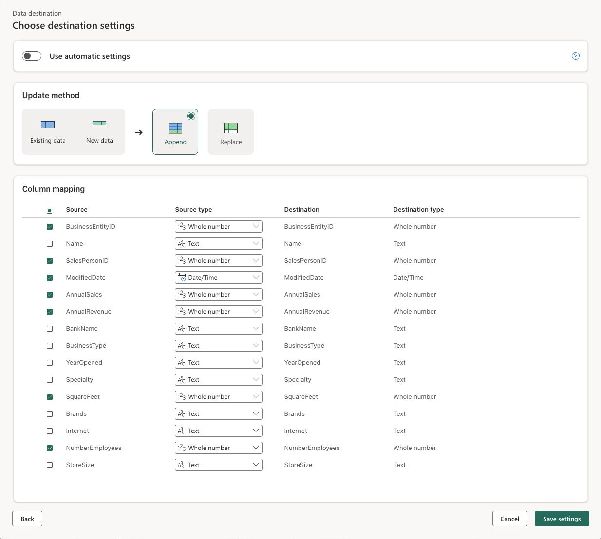

5. Select **Publish** to publish the dataflow. Then wait for the **Dataflow 1** dataflow to be created in your workspace.

## Validate your work

Now it's time to validate the ETL from the dataflow. Let's open the lakehouse you created earlier and open the **Store** table (You might need to wait a few minutes before it gets populated). Observe the different columns, their data types and the actual values. 

   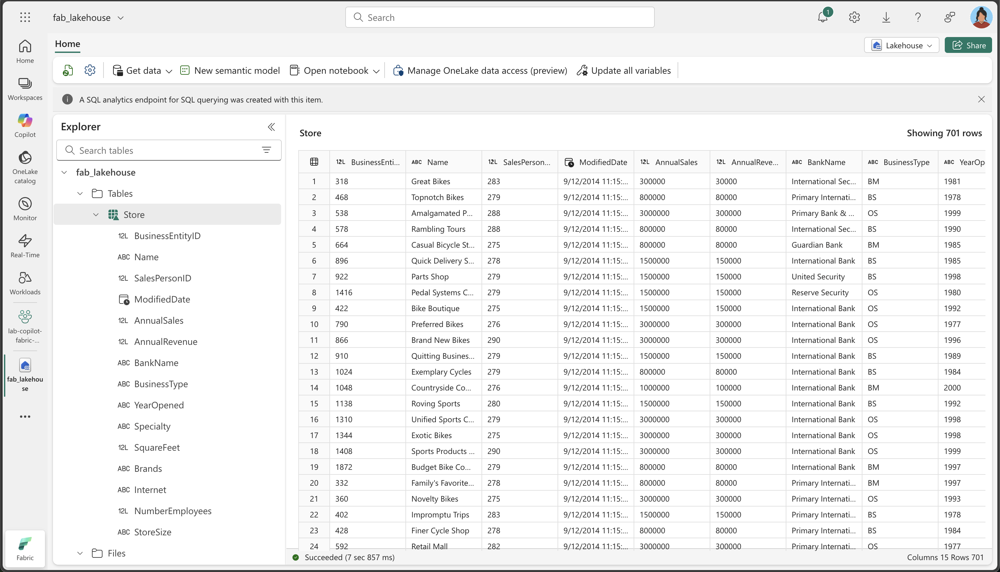

## Clean up resources

If you've finished exploring dataflows in Microsoft Fabric, you can delete the workspace you created for this exercise.

1. Navigate to Microsoft Fabric in your browser.
1. In the bar on the left, select the icon for your workspace to view all of the items it contains.
1. Select **Workspace settings** and in the **General** section, scroll down and select **Remove this workspace**.
1. Select **Delete** to delete the workspace.

