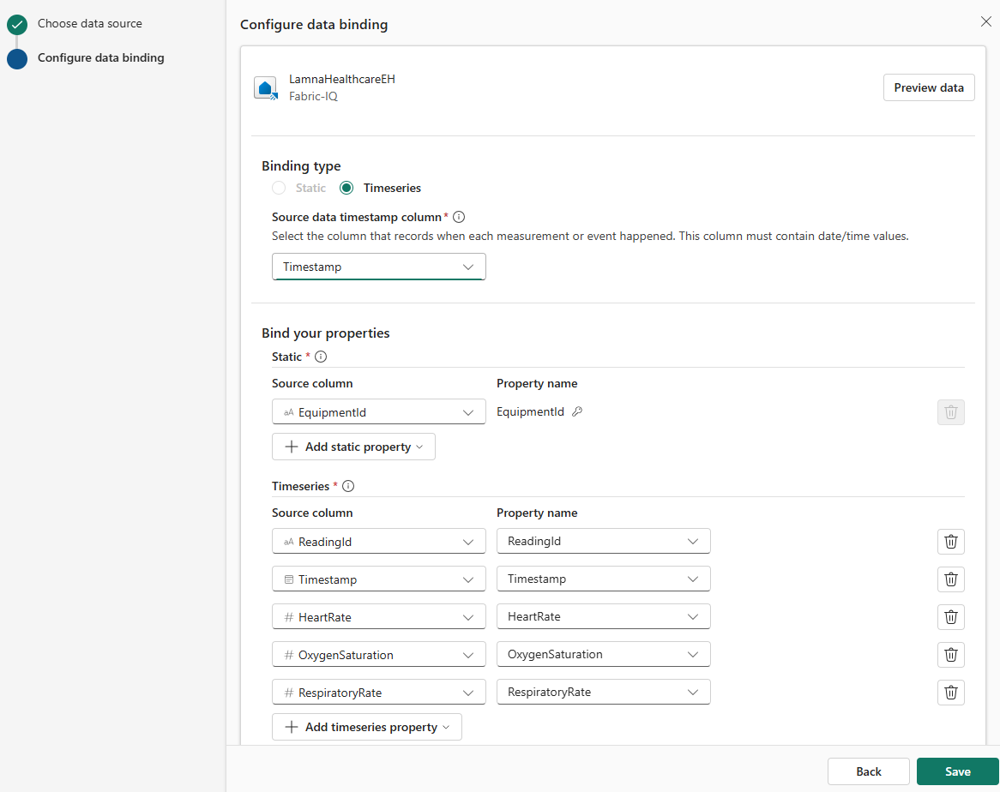
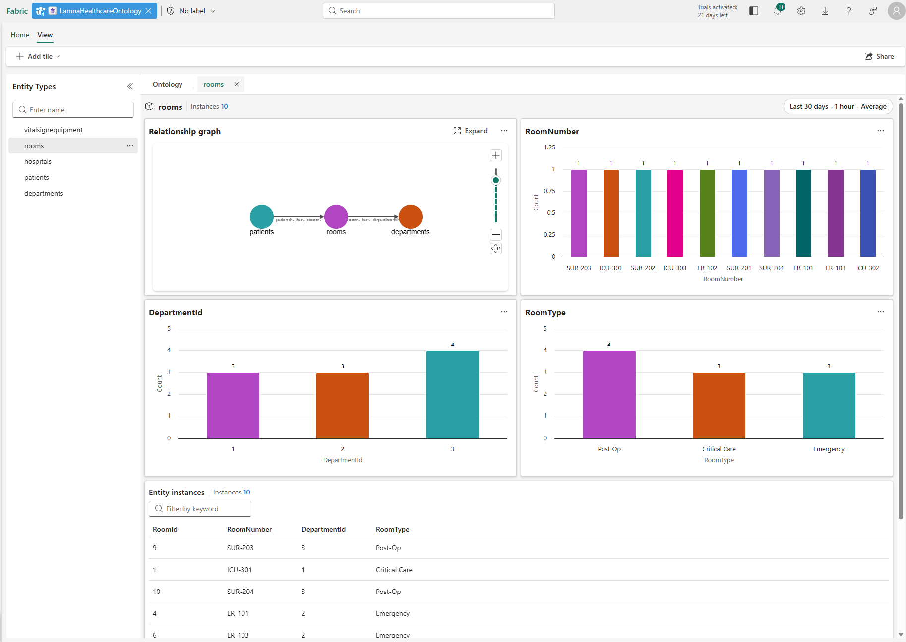

---
lab:
    title: 'Build an ontology (preview) from a semantic model in Fabric IQ'
    module: 'Create ontology with Microsoft Fabric IQ'
---

# Build an ontology (preview) from a semantic model in Fabric IQ

There are two ways to build a Fabric IQ ontology: manually, by creating each entity type and relationship from scratch, or automatically, by generating the structure from a Power BI semantic model. This lab uses the semantic model approach.

In this lab, you'll load sample data for a fictitious healthcare company into a lakehouse and eventhouse, build a semantic model on top of it, and then generate an ontology from that model. The sample data represents hospitals, departments, rooms, patients, vital sign equipment, and vital signs readings. Each table in the semantic model becomes an entity type, and each relationship between tables becomes a relationship type in the ontology.

This lab takes approximately **45** minutes to complete.

> **Note**: You need a [Microsoft Fabric trial](https://learn.microsoft.com/fabric/get-started/fabric-trial) to complete this exercise. You'll also need to enable the following [tenant settings](https://learn.microsoft.com/fabric/iq/ontology/overview-tenant-settings): **Enable Ontology item (preview)** and **User can create Graph (preview)**.

## Create a workspace

Before working with ontologies in Fabric, you need a workspace with a Fabric capacity.

1. Navigate to the [Microsoft Fabric home page](https://app.fabric.microsoft.com/home?experience=fabric) at `https://app.fabric.microsoft.com/home?experience=fabric` in a browser, and sign in with your Fabric credentials.
1. In the menu bar on the left, select **Workspaces** (the icon looks similar to &#128455;).
1. Create a new workspace with a name of your choice, selecting a licensing mode in one of the following workspace types: *Fabric*, *Fabric Trial*, or *Power BI Premium*.
1. When your new workspace opens, it should be empty.

## Create a lakehouse with sample data  

Now you'll create a lakehouse and load hospital operations data that will form the basis of your ontology.

1. In your workspace, select **+ New item** > **Lakehouse**.
1. Name the lakehouse `LamnaHealthcareLH` and select **Create**.
1. When the lakehouse opens, you'll upload CSV files and convert them to tables.

### Download and load the hospital data files

You'll download sample CSV files, upload them to the lakehouse, and convert them to tables.

1. Download [sample-data.zip](https://github.com/MicrosoftLearning/mslearn-fabric/raw/main/Allfiles/Labs/23-24/sample-data.zip) and extract the CSV files to your local computer. The ZIP file contains:
   - **Hospitals.csv** - Healthcare facilities in your network
   - **Departments.csv** - Hospital departments (ICU, Emergency, Surgical)
   - **Rooms.csv** - Individual rooms within departments
   - **Patients.csv** - Current patients and their room assignments
   - **VitalSignEquipment.csv** - Monitoring equipment assigned to patients (which patient is being monitored, and when monitoring started)
   - **VitalSignsReadings.csv** - Patient vital sign measurements (heart rate, oxygen levels, respiratory rate) collected over time from the vital sign equipment

1. Upload the five lakehouse files:
   - In the lakehouse, select **Upload files** from the main view
   - Browse to and select these five files: **Hospitals.csv**, **Departments.csv**, **Rooms.csv**, **Patients.csv**, **VitalSignEquipment.csv**
   - Select **Open**
   - Select **Upload** to upload all five files at once
   - Wait for the upload to complete
   
   > **Note**: Do not upload **VitalSignsReadings.csv** to the lakehouse. You'll load it to the eventhouse in the next section, where it belongs as time-series data.

1. Convert each uploaded file to a table:
   - In **Explorer**, select the **Files** folder, where you should see all five CSV files
   - For each file, select the **ellipsis (...)** to the right of the file name
   - Select **Load to Tables** > **New table**
   - Configure the table:
     - **Table name**: Fabric pre-fills this from the filename with a lowercase first letter (e.g., `hospitals`, `departments`, `rooms`, `patients`, `vitalSignEquipment`). 
     - **Column header**: Check **Use header for column names**
     - **Separator**: Leave as comma (`,`)
   - Select **Load**
   - Repeat this process for all five files

1. Verify you have five tables in the **Tables** section: `hospitals`, `departments`, `rooms`, `patients`, and `vitalSignEquipment`.

## Create an eventhouse with streaming data

Next, you'll create an eventhouse to store real-time vital signs data as a time-series entity in your ontology.

1. In your workspace, select **+ New item** > **Eventhouse**.
1. Name the eventhouse `LamnaHealthcareEH` and select **Create**.
1. A default KQL database is created with the same name. Select the KQL database to open it.

### Ingest vital signs data

1. Select the KQL database `LamnaHealthcareEH`, then select **Get data** > **Local file**.
1. In the **Select or create a destination table** section, select **+ New table** and enter `VitalSignsReadings` as the table name.
1. Under **Add up to 1,000 files**, select **Browse for files** and upload the **VitalSignsReadings.csv** file you downloaded earlier.
1. Select **Next**, then continue through the ingestion wizard, keeping the default settings.
1. Select **Finish** to complete the ingestion.
1. Verify the **VitalSignsReadings** table appears in the KQL database with 20 rows.

## Create a semantic model

Now you'll create a Power BI semantic model from your lakehouse. As you define each relationship, think about what it means in the real world: a department *belongs to* a hospital, a room *is part of* a department, a patient *is admitted to* a room, and a piece of equipment *is assigned to* a patient. These business relationships are exactly what ends up in the ontology.

1. In your workspace, open the **LamnaHealthcareLH** lakehouse.

1. From the lakehouse ribbon, select **New semantic model**.

1. In the **New semantic model** dialog, as shown below:
   - In the **Direct Lake semantic model name** field, enter `LamnaHealthcareModel`.
   - Select all five tables: **hospitals**, **departments**, **rooms**, **patients**, **vitalSignEquipment**.
   - Select **Confirm**.
   
   > **Note**: If the tables don't appear in the list, refresh your browser and try again.
   
   - The semantic model opens directly, showing your five tables.

   

 ### Define relationships between tables

Relationships in the semantic model define how tables connect to each other. These relationships become the relationship types in your ontology.

1. In the ribbon, select **Manage relationships** > **+ New relationship**.

2. Create the first relationship with these settings, then select **Save**:
   - **From table**: departments | **Column**: HospitalId
   - **To table**: hospitals | **Column**: HospitalId
   - **Cardinality**: Many to one (*:1)
   - **Cross filter direction**: Both
   - Select **Save**

3. Select **+ New relationship** again and create three more relationships:

   | From table | From column | To table | To column |
   |---|---|---|---|
   | rooms | DepartmentId | departments | DepartmentId |
   | patients | CurrentRoomId | rooms | RoomId |
   | vitalsignequipment | PatientId | patients | PatientId |

   Use the same settings for each: cardinality **Many to one (\*:1)**, cross filter **Both**, then **Save**.

4. Verify your **Manage relationships** pane shows exactly 4 active relationships, matching the image below, then select **Close**.

   

5. In the top navigation bar, select the **×** next to **LamnaHealthcareModel** to close the semantic model. Return to your workspace item list.

6. In your workspace item list, select the **ellipsis (...)** next to **LamnaHealthcareModel** and select **Open semantic model**.

## Generate the ontology

Now that your semantic model is ready and your lakehouse data is in place, you'll generate the ontology from the semantic model editor. The semantic model captures your static hospital data — hospitals, departments, rooms, patients, and vital sign equipment. The eventhouse vital signs readings data is time-series data, which is added to the ontology manually after generation.

1. From the top ribbon, select **Generate Ontology**.

   

1. Select your workspace name from the drop-down box.

1. In the name dialog, enter `LamnaHealthcareOntology`, then select **Create**

   > **Tip**: Ontology names can include numbers, letters, and underscores — no spaces or dashes.

Wait a few moments while the system is **Generating Ontology**.

The system generates **5 entity types** (Hospitals, Departments, Rooms, Patients, VitalSignEquipment) with all their properties and **4 relationship types** based on the semantic model relationships. The VitalSignEquipment entity has static properties from the lakehouse, but doesn't yet have the time-series vital signs readings from the eventhouse — you'll add that as a second binding after configuring the relationship bindings.

After generating the ontology, you need to complete the following tasks manually:

1. **Review entity type keys** and add any that are missing
2. **Verify and configure relationship types** so the relationships are queryable
3. **Add time-series binding** to VitalSignEquipment for real-time vital signs data

You'll complete these tasks in the sections below.

## Review and add entity type keys

Each entity type needs a key property that uniquely identifies each instance. During ontology generation, keys are inferred from the semantic model's relationship structure. Depending on each table's role in relationships, some keys are inferred automatically while others need to be added manually. Verify that each entity type has a key defined.

1. In the **Entity Types** list, select **hospitals**.
1. In the **Entity type configuration** pane, under **Key properties**, verify a **HospitalId** key is defined.
1. If no key appears, select **+ Add key**, choose **HospitalId**, and select **Save**.
1. Verify and add keys as needed for the remaining entity types:

   | Entity type | Key property |
   |---|---|
   | departments | DepartmentId |
   | rooms | RoomId |
   | patients | PatientId |
   | vitalsignequipment | EquipmentId |

## Verify and configure relationship types

The generated ontology includes relationship type definitions. During generation, relationship bindings to source data are created based on the semantic model structure. Depending on how the semantic model defines keys and relationships, some bindings are configured automatically while others require manual setup. You'll verify each relationship and configure any that need it.

**Understanding relationship configuration:**

A relationship binding connects a relationship type to source data. You select a data table that contains columns identifying both entity types — essentially a foreign key relationship. The system uses two columns from this table to match entity instances on both sides of the relationship.

The image below shows a configured relationship using the `departments` table:

- **Section 1 (Source entity type)**: `DepartmentId` — identifies the department instance
- **Section 2 (Target entity type)**: `HospitalId` — identifies which hospital the department belongs to

Now let's check the relationships in your ontology:

1. In the ontology canvas, select the **departments** entity in the **Entity Types** navigation bar.
1. Select the relationship line between **Departments** and **Hospitals** to open the **Relationship configuration** pane.
1. Check the **Source data** section:
   - **If already configured**: The pane shows workspace, lakehouse, schema, table, and both column mappings. Verify the configuration matches the image above.
   - **If not configured**: The source data fields are empty. Follow the configuration steps below.

### Configure Departments–Hospitals relationship

If the relationship requires configuration, complete these steps:

1. In the **Relationship configuration** pane, configure the source data location:
   - **Workspace**: Select your workspace
   - **Lakehouse**: Select **LamnaHealthcareLH**
   - **Schema**: Select **dbo**
   - **Table**: Select **Departments**
   
   > **Note**: Select the Departments table (not Hospitals) because it contains both the department identifier and the hospital reference. The Hospitals table has no column pointing back to departments, so it can't express the direction of the relationship.

2. Configure the entity type mappings:
   - Under **1. Source entity type**: Select **Departments**
     - **Source column**: Select **DepartmentId**
   - Under **2. Target entity type**: Select **Hospitals**
     - **Source column**: Select **HospitalId**

3. Select **Apply** or **Create**.

### Verify remaining relationships

Verify the remaining three relationships. Configure any that require setup using the values in the table below:

| Relationship | Source table | Source entity table: column | Target entity table: column |
|---|---|---|---|
| rooms_has_departments | LamnaHealthcareLH > dbo > **Rooms** | Rooms: **RoomId** | Departments: **DepartmentId** |
| patients_has_rooms | LamnaHealthcareLH > dbo > **Patients** | Patients: **PatientId** | Rooms: **CurrentRoomId** |
| vitalsignequipment_has_patients | LamnaHealthcareLH > dbo > **VitalSignEquipment** | VitalSignEquipment: **EquipmentId** | Patients: **PatientId** |

With all four relationships verified and configured, your ontology understands the complete healthcare data model: hospitals contain departments, departments contain rooms, patients are admitted to rooms, and vital sign equipment is assigned to patients.

## Add time-series binding to VitalSignEquipment

The VitalSignEquipment entity currently has only static properties from the lakehouse (EquipmentId, PatientId, EquipmentType, MonitoringStartDate). Now you'll add a second binding to attach time-series vital signs readings from your eventhouse. This allows a single entity to combine static reference data with real-time streaming measurements.

1. In the **Entity Types** list, select **vitalsignequipment**.

1. In the **Entity type configuration** pane, go to the **Bindings** tab. You'll see the existing static binding from the lakehouse.

1. Select **Add data to entity type** to add a second binding.

1. In the **OneLake catalog**, locate **LamnaHealthcareEH** (eventhouse) in your workspace and select it.

2. Select **Add**.

3. Select the **VitalSignsReadings** table and select **Next**.

4. For **Binding type**, select **Time series**.

5. For **Source data timestamp column**, select **Timestamp**.

   > [!IMPORTANT]
   > Time-series bindings require a matching key from static data. The static binding you already have provides EquipmentId as the key to link streaming readings to equipment entities.

6. Configure the time-series binding:
   - **Static section** - Maps the key to link streaming data to entities:
     - Select **EquipmentId** as the column that connects streaming readings to equipment entities
     - This matches the EquipmentId from your static binding
   
   - **Time series section** - Map the properties to columns (should auto-map):
     - ReadingId → ReadingId
     - Timestamp → Timestamp
     - HeartRate → HeartRate
     - OxygenSaturation → OxygenSaturation
     - RespiratoryRate → RespiratoryRate

   Your configuration should look like this:

   

7. Select **Save** to create the time-series binding.

Your VitalSignEquipment entity now has both static reference data (which equipment monitors which patient) and time-series data (actual vital sign readings over time).

Your ontology now has **5 entity types** and **4 relationships**, with all entity data and relationship bindings fully configured.

## Preview the ontology

Your ontology is now complete with static entities from the lakehouse and time-series data from the eventhouse, all connected through four relationships.

1. Select **Rooms** from the Entity Types list.
1. In the ontology ribbon, select **Entity type overview**.
1. You'll see an "Updating your ontology" message while the system processes your data in the background. After 1-2 minutes, refresh your browser to display the entity type overview.

   You'll see tiles showing:
   - **Relationship graph**: Visual representation of how this entity type connects to other entity types
   - **Property charts**: Bar charts showing the distribution of property values (like RoomType, RoomNumber, or DepartmentId)
   - **Entity instances table**: List of all individual room instances with their properties

   

1. In the **Entity instances** table, select any room instance (for example, **ICU-302**).
1. The instance view opens, showing the properties for this specific room and its connections to other entities.

You've successfully created a complete ontology by building a semantic model from your lakehouse, generating the ontology structure automatically, extending it with time-series data from an eventhouse, and connecting everything with relationship bindings. Your ontology now represents the healthcare domain with:
- **5 entity types**: Hospitals, Departments, Rooms, Patients, VitalSignEquipment
- **4 relationships**: all bound to source data and fully queryable
- **Static + time-series data**: VitalSignEquipment combines lakehouse reference data with eventhouse streaming measurements

## Clean up resources (optional)

You can keep this workspace and ontology to continue exploring Fabric IQ capabilities. If you want to remove the resources you created in this exercise, follow these steps:

1. In the bar on the left, select the icon for your workspace to view all of the items it contains.
1. Select **Workspace settings**.
1. In the **General** section, select **Remove this workspace**.
