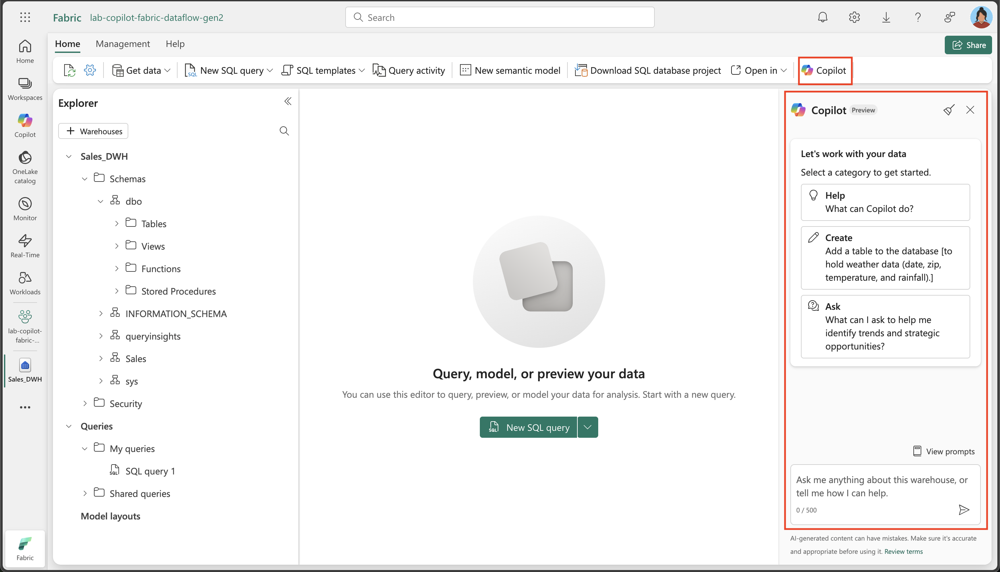
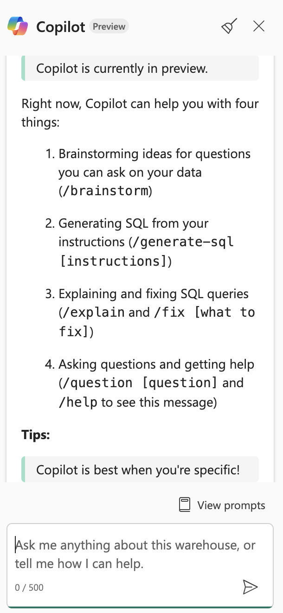
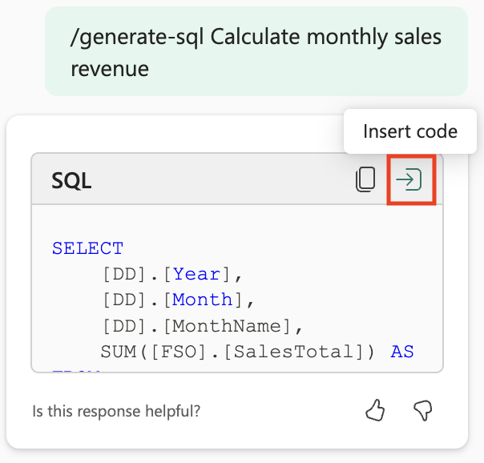
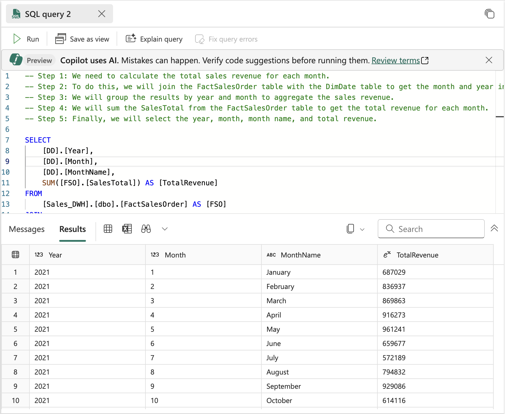
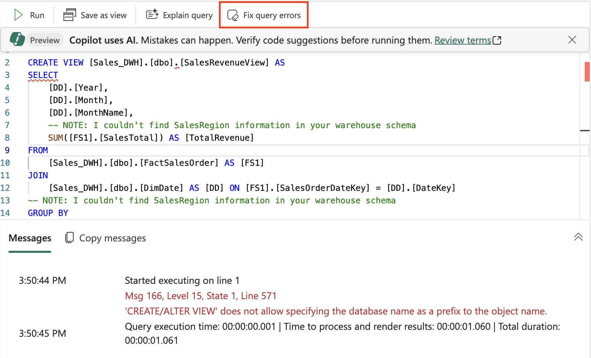

---
lab:
    title: 'Use Copilot in Microsoft Fabric data warehouse'
    module: 'Get started with Copilot in Fabric for Data Warehouse'
---

# Use Copilot in Microsoft Fabric data warehouse

In Microsoft Fabric, a data warehouse provides a relational database for large-scale analytics. Unlike the default read-only SQL endpoint for tables defined in a lakehouse, a data warehouse provides full SQL semantics; including the ability to insert, update, and delete data in the tables. In this lab, we will explore how we can leverage Copilot to create SQL Queries.

This exercise should take approximately **30** minutes to complete.

## What you’ll learn

By completing this lab, you will be able to:

- Understand the role of data warehouses in Microsoft Fabric.
- Create and configure a workspace and data warehouse in Fabric.
- Load and explore sample data using SQL.
- Use Copilot to generate, refine, and troubleshoot SQL queries from natural language prompts.
- Create views and perform advanced data analysis with AI-assisted SQL generation.
- Apply Copilot's capabilities to accelerate data exploration and analysis tasks.

## Before you start

You need a [Microsoft Fabric Capacity (F2 or higher)](https://learn.microsoft.com/fabric/fundamentals/copilot-enable-fabric) with Copilot enabled to complete this exercise.

## Exercise scenario

In this exercise, you are a data analyst at a retail company that wants to better understand sales performance using Microsoft Fabric. Your team has recently adopted Fabric's data warehouse capabilities and is interested in leveraging Copilot to accelerate data exploration and reporting. You will create a new data warehouse, load sample retail sales data, and use Copilot to generate and refine SQL queries. By the end of the lab, you'll have hands-on experience using AI to analyze sales trends, create reusable views, and perform advanced data analysis—all within the Fabric environment.

## Create a workspace

Before working with data in Fabric, create a workspace with Fabric enabled. A workspace in Microsoft Fabric serves as a collaborative environment where you can organize and manage all your data engineering artifacts including lakehouses, notebooks, and datasets. Think of it as a project folder that contains all the resources needed for your data analysis.

1. Navigate to the [Microsoft Fabric home page](https://app.fabric.microsoft.com/home?experience=fabric) at `https://app.fabric.microsoft.com/home?experience=fabric` in a browser, and sign in with your Fabric credentials.
2. In the menu bar on the left, select **Workspaces** (the icon looks similar to &#128455;).
3. Create a new workspace with a name of your choice, selecting a licensing mode that includes Fabric capacity (*Premium*, or *Fabric*). Note that *Trial* is not supported.
   
   > **Why this matters**: Copilot requires a paid Fabric capacity to function. This ensures you have access to the AI-powered features that will help generate code throughout this lab.

4. When your new workspace opens, it should be empty.

    

## Create a data warehouse

Now that you have a workspace, it's time to create a data warehouse. A data warehouse in Microsoft Fabric is a relational database optimized for analytical workloads. Unlike traditional databases designed for transactional operations, data warehouses are structured to handle large volumes of data and complex queries efficiently. Locate the shortcut to create a new warehouse:

1. On the menu bar on the left, select **Create**. In the *New* page, under the *Data Warehouse* section, select **Warehouse**. Give it a unique name of your choice. This name will identify your data warehouse within the workspace, so choose something descriptive that reflects its purpose.

    >**Note**: If the **Create** option is not pinned to the sidebar, you need to select the ellipsis (**...**) option first.

    After a minute or so, a new warehouse will be created. The provisioning process sets up the underlying infrastructure and creates the necessary components for your analytical database:

    

## Create tables and insert data

A warehouse is a relational database in which you can define tables and other objects. To demonstrate Copilot's capabilities, we need sample data to work with. We'll create a typical retail sales schema with dimension tables (customer, date, product) and a fact table (sales orders) - this is a common pattern in data warehousing called a star schema.

1. On the **Home** menu tab, use the **New SQL Query** button to create a new query. This opens a SQL editor where you can write and execute Transact-SQL commands. Then copy and paste the Transact-SQL code from `https://raw.githubusercontent.com/MicrosoftLearning/dp-data/main/create-dw.txt` into the new query pane. This script contains all the necessary CREATE TABLE and INSERT statements to build our sample dataset.

2. Run the query, which creates a simple data warehouse schema and loads some data. The script should take around 30 seconds to run. During this time, the database engine is creating the table structures and populating them with sample retail sales data.

3. Use the **Refresh** button on the toolbar to refresh the view. Then in the **Explorer** pane, verify that the **dbo** schema in the data warehouse now contains the following four tables:
    - **DimCustomer** - Contains customer information including names and addresses
    - **DimDate** - A date dimension table with calendar information (year, month, day names, etc.)
    - **DimProduct** - Product catalog with categories, names, and pricing information
    - **FactSalesOrder** - The central fact table containing sales transactions with foreign keys to the dimension tables

    > **Tip**: If the schema takes a while to load, just refresh the browser page. The Explorer pane shows the database structure and makes it easy to browse your tables and other database objects.

## Query data warehouse tables

Since the data warehouse is a relational database, you can use SQL to query its tables. However, writing complex SQL queries from scratch can be time-consuming and error-prone. Working with Copilot makes it even faster to generate SQL queries! Copilot uses artificial intelligence to understand your natural language requests and translate them into proper SQL syntax, making data analysis more accessible.

1. Close the current **SQL Query 1**. This clears the workspace so we can focus on using Copilot for query generation.

2. From the Home ribbon, select the Copilot option. This opens the Copilot assistant pane where you can interact with AI to generate queries.



3. Let’s start by exploring what Copilot can do. Click on the suggestion labeled `What can Copilot do?` and send it as your prompt.

Read the output and observe Copilot is currently in preview and can help with brainstorming, generating SQL queries, explain and fix queries, etc.



4. We're aiming to analyze sales revenue by month. This is a common business requirement - understanding revenue trends over time helps identify seasonal patterns, growth trends, and performance metrics. Enter the following prompt and send it.

```plaintext
/generate-sql Calculate monthly sales revenue
```

5. Review the output that was generated, which might differ slightly depending on your environment and the latest updates to Copilot. Notice how Copilot interprets your request and creates appropriate JOIN statements between the fact and dimension tables to aggregate sales data by month.

6. Select the **Insert Code** icon located at the top-right corner of the query. This transfers the generated SQL from the Copilot pane into your SQL editor, where you can execute it.



7. Execute the query by selecting the ▷ **Run** option above the query and observe the output. You should see monthly revenue totals that demonstrate how your sales data is aggregated across time periods.



8. Create a **New SQL Query**, and ask a follow-up question to also include the month name and sales region in the results. This demonstrates how you can iteratively refine your queries with Copilot - building on previous requests to create more detailed analysis:

```plaintext
/generate-sql Retrieves sales revenue data grouped by year, month, month name and sales region
```

9. Select the **Insert Code** icon and ▷ **Run** the query. Observe the output it returns. Notice how Copilot adapts the query to include additional dimensions while maintaining the core revenue calculation logic.

10. Let's create a view from this query by asking Copilot the following question. Views are virtual tables that store query logic, making it easier to reuse complex queries and provide consistent data access patterns for reporting and analysis:

```plaintext
/generate-sql Create a view in the dbo schema that shows sales revenue data grouped by year, month, month name and sales region
```

11. Select the **Insert Code** icon and ▷ **Run** the query. Review the output it generates. 

The query does not execute successfully because the SQL statement includes the database name as a prefix, which is not allowed in the data warehouse when defining a view. This is a common syntax issue when working across different database platforms - what works in one environment might need adjustment in another.

12. Select the **Fix query errors** option. Observe how Copilot makes corrections to the query. This demonstrates one of Copilot's powerful features - not only can it generate queries, but it can also troubleshoot and fix syntax errors automatically.



Here's an example of the query it corrected - notice the `Auto-Fix` comments that explain what changes were made:

```sql
-- Auto-Fix: Removed the database name prefix from the CREATE VIEW statement
CREATE VIEW [dbo].[SalesRevenueView] AS
SELECT 
    [DD].[Year],
    [DD].[Month],
    [DD].[MonthName],
    -- NOTE: I couldn't find SalesRegion information in your warehouse schema
    SUM([FS1].[SalesTotal]) AS [TotalRevenue]
FROM 
    [dbo].[FactSalesOrder] AS [FS1] -- Auto-Fix: Removed the database name prefix
JOIN 
    [dbo].[DimDate] AS [DD] ON [FS1].[SalesOrderDateKey] = [DD].[DateKey] -- Auto-Fix: Removed the database name prefix
-- NOTE: I couldn't find SalesRegion information in your warehouse schema
GROUP BY 
    [DD].[Year],
    [DD].[Month],
    [DD].[MonthName]; 
```

Notice how Copilot not only fixed the syntax errors but also provided helpful comments explaining the changes and noting that sales region information wasn't available in the current schema.

13. Enter another prompt to retrieve a detailed product listing, organized by category. This query will demonstrate more advanced SQL features like window functions for ranking data within groups. For each product category, it should display the available products along with their list prices and rank them within their respective categories based on price. 

```plaintext
/generate-sql Retrieve a detailed product listing, organized by category. For each product category, it should display the available products along with their list prices and rank them within their respective categories based on price. 
```

14. Select the **Insert Code** icon and ▷ **Run** the query. Observe the output it returns. 

This allows for easy comparison of products within the same category, helping identify the most and least expensive items. The ranking functionality is particularly useful for product management, pricing analysis, and inventory decisions.

## Summary

In this exercise, you have created a data warehouse that contains multiple tables. You used Copilot to generate SQL queries to analyze data in the data warehouse. You've experienced how AI can accelerate the process of writing complex SQL queries, fix errors automatically, and help you explore data more efficiently.

Throughout this lab, you've learned to:
- Leverage natural language prompts to generate SQL queries
- Use Copilot's error correction capabilities to fix syntax issues
- Create views and complex analytical queries with AI assistance
- Apply ranking functions and grouping for data analysis

## Clean up resources

If you've finished exploring Copilot in Microsoft Fabric data warehouse, you can delete the workspace you created for this exercise.

1. Navigate to Microsoft Fabric in your browser.
2. In the bar on the left, select the icon for your workspace to view all of the items it contains.
3. Select **Workspace settings** and in the **General** section, scroll down and select **Remove this workspace**.
4. Select **Delete** to delete the workspace.


