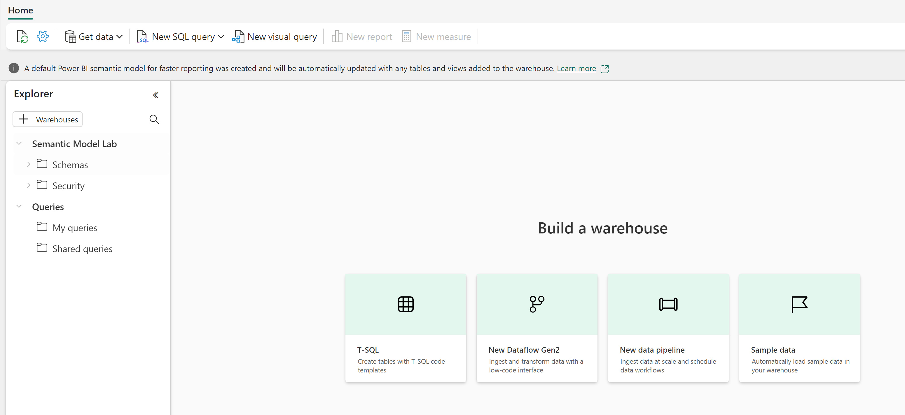
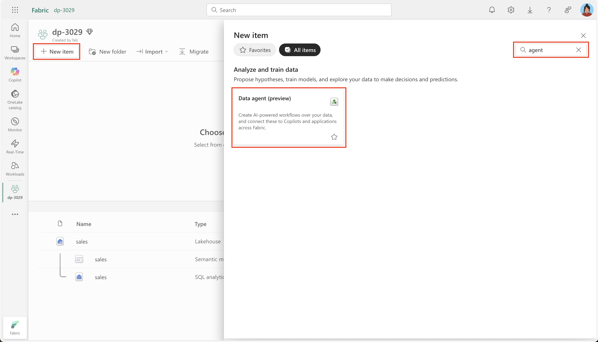
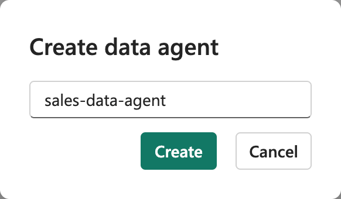
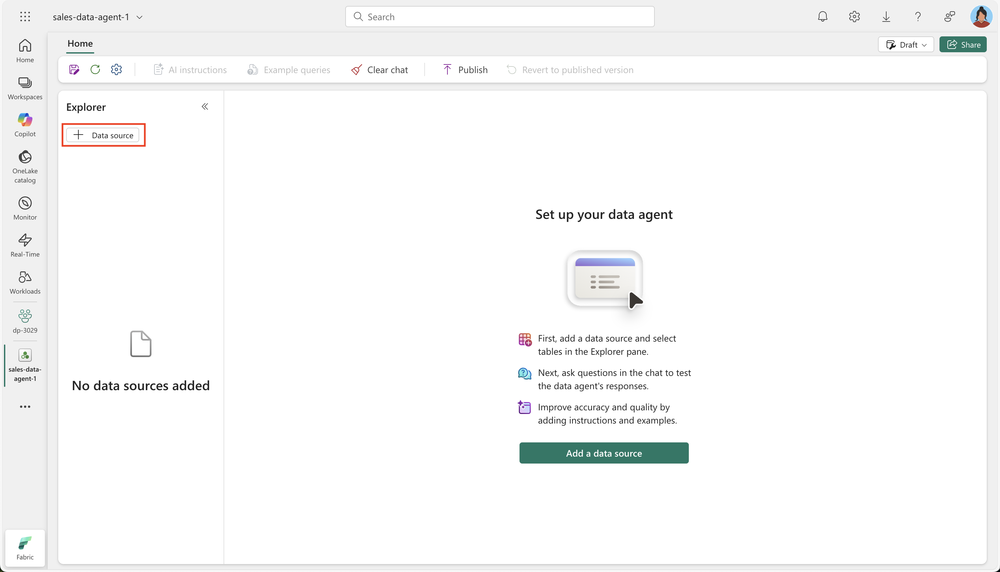
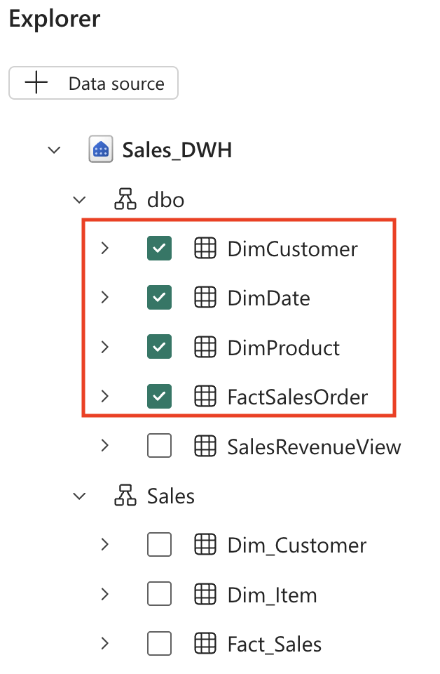
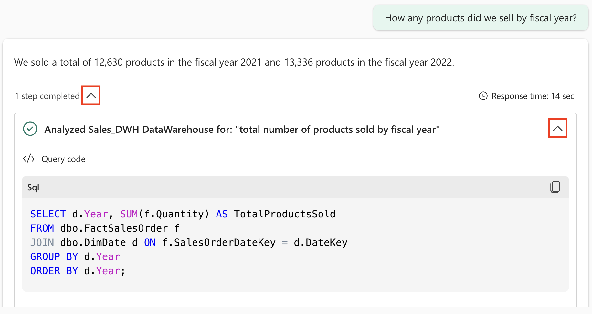
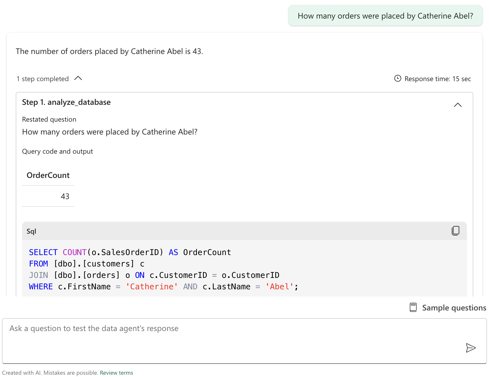

---
lab:
    title: 'Chat with your data using Microsoft Fabric data agents'
    module: 'Implement Fabric Data Agents'
---

# Chat with your data using Microsoft Fabric data agents

A Microsoft Fabric data agent enables natural interaction with your data by allowing you to ask questions in plain English and receive structured, human-readable responses. By eliminating the need to understand query languages like SQL (Structured Query Language), DAX (Data Analysis Expressions), or KQL (Kusto Query Language), the data agent makes data insights accessible across the organization, regardless of technical skill level.

In this excercise, we will create a sales data warehouse, load some data into it and then create Fabric data agent. We will then ask it a variety of questions and further configure it using customized AI instructions. Let's start!

This lab will take approximately **30** minutes to complete.

> **Note**: You need a [Microsoft Fabric Capacity (F2 or higher)](https://learn.microsoft.com/fabric/fundamentals/copilot-enable-fabric) with Copilot enabled to complete this exercise.

## Create a workspace

Before working with data in Fabric, create a workspace with the Fabric trial enabled.

1. Navigate to the [Microsoft Fabric home page](https://app.fabric.microsoft.com/home?experience=fabric) at `https://app.fabric.microsoft.com/home?experience=fabric` in a browser, and sign in with your Fabric credentials.
1. In the menu bar on the left, select **Workspaces** (the icon looks similar to &#128455;).
1. Create a new workspace with a name of your choice, selecting a licensing mode that includes Fabric capacity (*Trial*, *Premium*, or *Fabric*).
1. When your new workspace opens, it should be empty.

    

## Create a data warehouse

Now that you have a workspace, it's time to create a data warehouse. The Synapse Data Warehouse home page includes a shortcut to create a new warehouse:

1. On the menu bar on the left, select **Create**. In the *New* page, under the *Data Warehouse* section, select **Warehouse**. Give it a unique name of your choice.

    >**Note**: If the **Create** option is not pinned to the sidebar, you need to select the ellipsis (**...**) option first.

    After a minute or so, a new warehouse will be created:

    

## Create tables and insert data

A warehouse is a relational database in which you can define tables and other objects.

1. On the **Home** menu tab, use the **New SQL Query** button to create a new query. Then copy and paste the Transact-SQL code from `https://raw.githubusercontent.com/MicrosoftLearning/dp-data/main/create-dw.txt` into the new query pane.
1. Run the query, which creates a simple data warehouse schema and loads some data. The script should take around 30 seconds to run.
1. Use the **Refresh** button on the toolbar to refresh the view. Then in the **Explorer** pane, verify that the **dbo** schema in the data warehouse now contains the following four tables:
    - **DimCustomer**
    - **DimDate**
    - **DimProduct**
    - **FactSalesOrder**

    > **Tip**: If the schema takes a while to load, just refresh the browser page.

## Create a Fabric data agent

1. Create a new data agent.


1. Give it a name like **sales-data-agent**.



1. Select **Add a data source**. 



1. Choose the data warehouse you created earlier.

1. Expand the data warehouse, and check both **DimCustomer**, **DimDate**, **DimProduct** and **FactSalesOrder**.



## Ask questions

Now is the time to start experimenting and ask questions to our data agent.

1. Ask a question by typing in the following prompt: 

```plaintext
How any products did we sell by fiscal year?
```

Note the resulting answer: We sold a total of 12,630 products in the fiscal year 2021 and 13,336 products in the fiscal year 2022.

1. Expand the step completed and it's substep. This reveals the SQL query that was generated by the data agent in order to answer the question.



Copilot generated the following SQL code, which might differ slightly depending on your environment and the latest updates to Copilot.

```sql
SELECT d.Year, SUM(f.Quantity) AS TotalProductsSold
FROM dbo.FactSalesOrder f
JOIN dbo.DimDate d ON f.SalesOrderDateKey = d.DateKey
GROUP BY d.Year
ORDER BY d.Year;
```

1. Continue with the following question: 

```plaintext
What are the top 10 most popular products all time?
```

1. Follow up with this question: 

```plaintext
What are the historical trends across all my data?
```

1. Another question you can try: 

```plaintext
In which countries are our customers located?`
How many products did we sell in the United States?
How much revenue did we make in FY 2022?
How much was our total sales revenue, by fiscal year, fiscal quarter and month name?
```

- The fiscal year starts in July, the 7th month. So, Q1 is from July-Sept, Q2 is from Oct-Dec, Q3 is from Jan-Mar, Q4 is from Apr-Jun

- CustomerAltKey contains the email address. 
- List prices and sales totals are in GBP


1. Create a new data agent.


1. Give it a name like **sales-data-agent**.


1. Select **Add a data source**.


1. Expand the lakehouse, and check both **customers** and **orders**.


1. Ask a question 

How many orders were placed by Catherine Abel?

Notice the answer (The number of orders placed by Catherine Abel is 43).
Expand the step completed so see the query it generated and executed.



1. Ask a follow question:

How much has this customer ordered in total?

Notice the answer (Catherine Abel has ordered a total of 33,320).
Expand the step and observe that the query still applies a filter for Catherine Abel, even though her name is no longer mentioned in the question.

1. Ask another question:

How many orders did we receive each month?

Notice the answer contains the list with a number of orders for each month.
Expand the Step and have a look at the SQL query generated. It useds functions like YEAR(), MONTH(), COUNT() and a GROUP BY clause:

```sql
SELECT 
    YEAR(OrderDate) AS OrderYear,
    MONTH(OrderDate) AS OrderMonth,
    COUNT(SalesOrderID) AS OrderCount
FROM 
    [dbo].[orders]
GROUP BY 
    YEAR(OrderDate),
    MONTH(OrderDate)
ORDER BY 
    YEAR(OrderDate),
    MONTH(OrderDate);
```