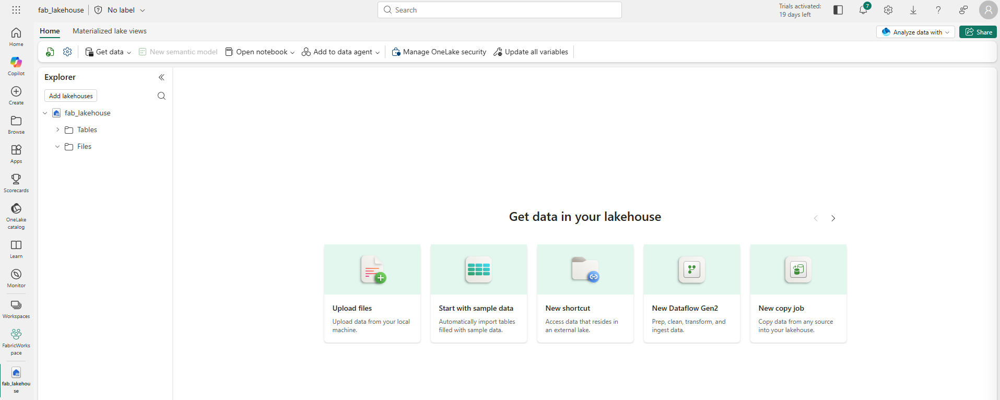
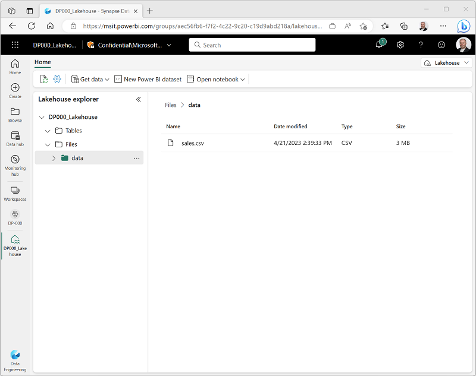
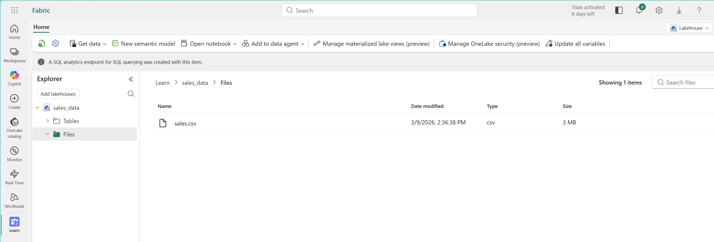
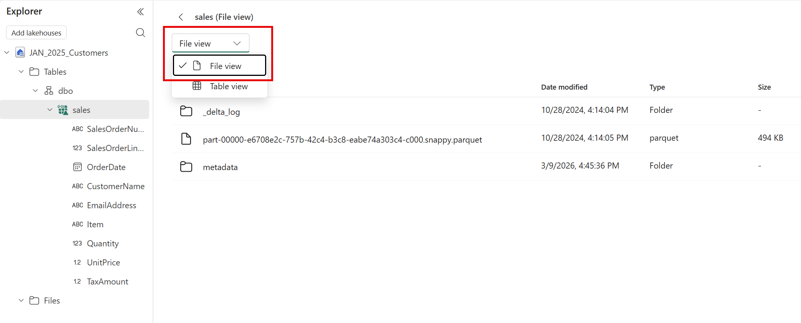
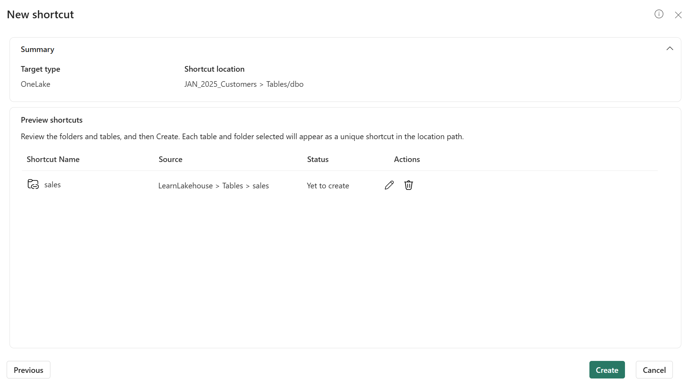
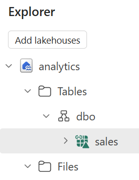
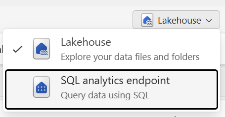
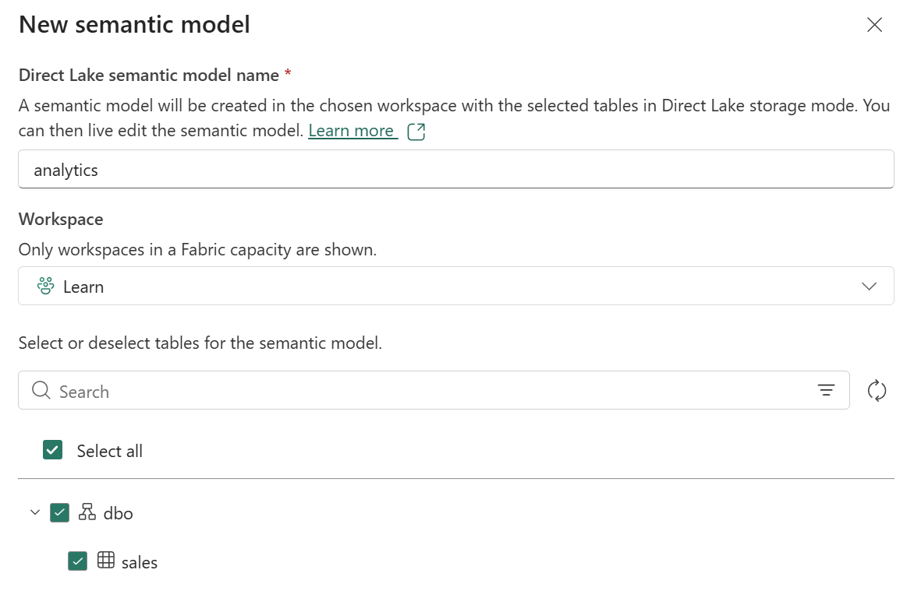
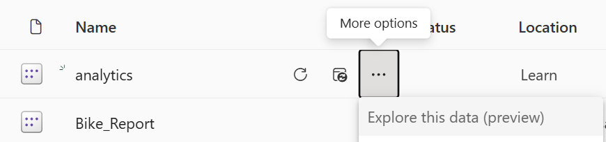
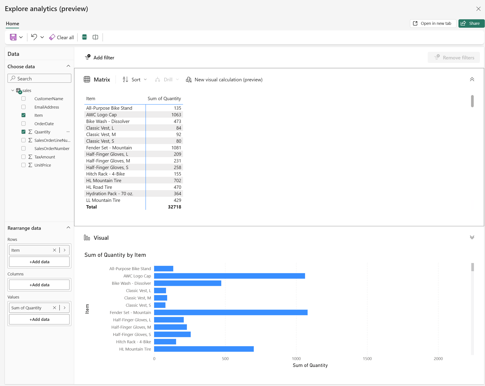

---
lab:
    title: 'Discover and connect to data in OneLake'
    module: 'Discover and connect to data in OneLake'
---

# Discover and connect to data in OneLake

In modern analytics organizations, data often exists across multiple workspaces and teams. Data engineers create lakehouses with raw and cleansed data, other teams build warehouses with business metrics, and analysts develop semantic models. As an analytics engineer, you need to find and connect to this data before you can transform it or build analytical solutions.

Microsoft Fabric provides the OneLake catalog as a centralized discovery experience. The catalog helps you search for data assets, view their metadata, and understand what's available across your organization. Once you locate the data you need, you can connect to it using shortcuts, query it with SQL, or explore it through semantic models.

In this exercise, you create a sample environment with a lakehouse containing sales data. You then practice discovering this data through the OneLake catalog, creating shortcuts for cross-workspace access, querying data via the SQL analytics endpoint, and exploring semantic models.

This lab takes approximately **30** minutes to complete. 

> **Note**: You need access to a Fabric-enabled workspace. If you don't have one, create a [Microsoft Fabric trial](https://learn.microsoft.com/fabric/get-started/fabric-trial) to complete this exercise.

## Create a workspace

Before working with data in Fabric, create a workspace with the Fabric trial enabled.

1. Navigate to the [Microsoft Fabric home page](https://app.fabric.microsoft.com/home?experience=fabric) at `https://app.fabric.microsoft.com/home?experience=fabric` in a browser, and sign in with your Fabric credentials.

1. In the menu bar on the left, select **Workspaces** (the icon looks similar to **&#128455;**).

1. Create a new workspace with a name of your choice (for example, *Data-Engineering*).

1. Choose a **Fabric and Power BI workspace type** in the _Advanced_ section. The choices might be: _Fabric, Fabric trial, Power BI Premium_.

1. When your new workspace opens, it should be empty.

    

## Create a lakehouse and load sample data

Now that you have a workspace, it's time to create a lakehouse and populate it with sample sales data. This lakehouse represents data that a data engineering team might have already created in a real organization.

1. Download the [sales.csv](https://raw.githubusercontent.com/MicrosoftLearning/dp-data/main/sales.csv) file from `https://raw.githubusercontent.com/MicrosoftLearning/dp-data/main/sales.csv`, saving it as **sales.csv** on your local computer (or provided VM, if applicable).

    > **Note**: To download the file, open a new tab in the browser and paste in the URL. Right-click anywhere on the page and select **Save as** to save it as a CSV file.

1. In your workspace, select **+ New item**, and then select **Lakehouse**. Give it a name of your choice (for example, _sales-data_).

    After a minute or so, a new lakehouse with empty **Tables** and **Files** folders will be created.

    

1. In the lakehouse explorer, highlight the **Files** folder and select the ellipses **(...)** then **Upload > Upload files**, and select the **sales.csv** file you just downloaded.

1. After the file uploads, select the **Files** folder to verify that **sales.csv** was uploaded. Select the file to preview its contents.

    

## Load data into a table

Loading file data into a Delta table makes it queryable using SQL and provides reliability features like ACID transactions, which are similar to a traditional data warehouse.

1. In the **Explorer** pane, expand the **Files** folder to see the **sales.csv** file.

1. In the ellipses **(...)** menu for the **sales.csv** file, select **Load to Tables > New table**.

1. In the **Load to table** dialog, set the table name to **sales** and confirm the load operation. Wait for the table to be created and loaded.

    > **Tip**: If the **sales** table doesn't automatically appear, select **Refresh** in the ellipses **(...)** menu for the **Tables** folder.

1. In the **Explorer** pane, select the **sales** table to view its data and schema.

    

## Browse the OneLake catalog to discover data

Now that you have data in your lakehouse, you can explore how to discover it through the OneLake catalog. The catalog provides a centralized view of all data assets across your Fabric tenant.

1. At the top of the page, select the Fabric icon to return to the Fabric home page.

1. In the left navigation pane, select the **OneLake catalog** icon.

    

1. In the catalog, you see various item types including lakehouses, warehouses, semantic models, and reports. Browse the list to find your **sales_data** lakehouse (or whatever name you chose).

    > **Note**: Depending on what else is in your trial environment, you may see other items in the catalog. The catalog respects access permissions, so you only see items you have permission to access.

1. Select your lakehouse to view its details. The detail pane shows metadata including:
    - **Location**: The workspace where the item is located
    - **Data updated**: When the data was last updated
    - **Owner**: Who created the item
    - **SQL connection string**: How to connect using tools, such as SQL Server Management Studio (SSMS)

    

1. Select **Open** and you will see the Lakehouse explorer view of your lakehouse.

## Explore lakehouse tables and schema

After discovering a data asset in the catalog, the next step is to explore its structure. Understanding the tables, columns, and data types helps you determine whether the data meets your needs.

1. From the catalog, select your **sales_data** lakehouse to open it.

1. In the **Explorer** pane on the left, expand the **Tables** folder to see the **sales** table you created earlier.

1. Select the **sales** table. The main view shows a preview of the data, displaying the first several rows.

    

1. In the table preview, observe the column headers: **SalesOrderNumber**, **SalesOrderLineNumber**, **OrderDate**, **CustomerName**, **EmailAddress**, **Item**, **Quantity**, **UnitPrice**, and **TaxAmount**. Below the preview, you can see the schema showing each column's data type.

1. Select **File view** to see the underlying files as well.

    

The table is stored as Parquet files in the Delta Lake format. The **_delta_log** subfolder contains transaction logs that track all changes to the table, enabling features like ACID transactions and time travel.

## Create a shortcut to access data from another workspace

Shortcuts let you reference data from other workspaces without copying it, providing a live connection to the source. In this task, you create a second lakehouse and a shortcut pointing to the sales data in your original lakehouse.

1. At the top of the page, select your workspace name to return to the workspace view.

1. Select **+ New item** > **Lakehouse** to create a second lakehouse. Name it **analytics** (or another name of your choice).

    This lakehouse represents your analytics workspace where you'll transform data and build semantic models.

1. When the new lakehouse opens, in the **Explorer** pane, select the **...** menu for the **Tables** folder and select **New shortcut**.

    

1. In the **New shortcut** dialog, select **OneLake** as the shortcut source.

    

1. In the workspace list, select the workspace containing your original **sales_data** lakehouse (for example, _Data-Engineering_).

1. Select the **sales_data** lakehouse, then select the **Tables** folder.

1. Select the **sales** table, and then select **Next**.

1. Review the shortcut details before selecting **Create**.

    - **Target type**: Which shortcut type, OneLake in this case
    - **Shortcut location**: The lakehouse you want the shortcut in
    - **Shortcut name**: Defaults to _sales_
    - **Source**: The lakehouse where the data exists

    

1. In the **Explorer** pane of your **analytics** lakehouse, expand the **Tables** folder. You should see the **sales** table with a shortcut icon (a link overlay).

    

1. Select the **sales** shortcut to view its data. The data is identical to the original table, but no data was copied. The shortcut provides a live reference to the source.

## Query data using the SQL analytics endpoint

Every lakehouse includes a SQL analytics endpoint that provides read-only T-SQL access to tables. This endpoint enables you to query lakehouse data using familiar SQL syntax, making it easy to explore data and verify it contains what you need.

1. At the top-right of your **analytics** lakehouse page, locate the drop-down menu that currently shows **Lakehouse**. Select the drop-down and switch to **SQL analytics endpoint**.

    

    The view changes to a SQL-focused interface where you can query tables using T-SQL.

1. In the toolbar, select **New SQL query** to open a query editor.

1. In the query editor, enter the following T-SQL query:

    ```sql
    SELECT 
        Item,
        SUM(Quantity * UnitPrice) AS TotalRevenue,
        SUM(Quantity) AS TotalQuantity
    FROM sales
    GROUP BY Item
    ORDER BY TotalRevenue DESC;
    ```

    This query calculates total revenue and total quantity sold for each item.

1. Select **Run** to execute the query. Review the results showing revenue by item.

    

1. Write a second query to find the top customers by revenue:

    ```sql
    SELECT TOP 5
        CustomerName,
        SUM(Quantity) AS TotalQuantity,
        SUM(Quantity * UnitPrice) AS TotalRevenue
    FROM sales
    GROUP BY CustomerName
    ORDER BY TotalRevenue DESC;
    ```

1. Run the query and review the results.

## Create and explore a semantic model

Semantic models provide a business-friendly layer on top of data, including predefined relationships, measures, and calculations for Power BI reports. In this task, you create a semantic model from the lakehouse and explore it using the _Explore this data_ feature.

1. While still in the SQL analytics endpoint view of your **analytics** lakehouse, select the **New semantic model** option in the toolbar.

    

1. In the **Create a semantic model** dialog, verify that the **sales** table is selected. Give the semantic model a name like **Sales Analysis** and select **Create**.

    > After a moment, the semantic model is created. The model appears in your workspace.

1. Navigate back to your workspace and find the **Sales Analysis** semantic model you just created. Select the ellipses **(...)** menu for the semantic model and choose **Explore this data**.

    

    The **Explore this data** feature opens a lightweight exploration interface where you can create quick visualizations without opening Power BI Desktop.

1. In the **Explore** window, drag the **Item** field to the canvas to create a table visualization.

1. Drag the **Quantity** field to the **Values** area to show total quantities by item.

1. In the **Visualizations** pane, change the visualization type to a **Bar chart** or **Column chart** to see a graphical representation.

    

1. Experiment with other fields and visualization types to explore the data.

## (Optional) Use Copilot to write a SQL query

If you have access to Microsoft Copilot in Fabric, you can use it to assist with writing SQL queries. Copilot can generate queries based on natural language descriptions, helping you explore data faster.

> **Note**: This task requires Copilot access in your Fabric environment. If Copilot is not available, skip this task.

1. Return to your **analytics** lakehouse and switch to the **SQL analytics endpoint** view.

1. Open a new SQL query editor.

1. In the query editor, locate the **Copilot** button in the toolbar (it may appear as a lightbulb or Copilot icon).

1. Select the Copilot button to open the Copilot pane.

1. In the Copilot prompt, type a natural language request such as:

    `Write a SQL query to show total revenue by month for the year 2026, sorted by month.`

1. Review the query that Copilot generates. It should look similar to:

    ```sql
    SELECT 
        FORMAT(OrderDate, 'yyyy-MM') AS Month,
        SUM(Quantity * UnitPrice) AS TotalRevenue
    FROM sales
    WHERE YEAR(OrderDate) = 2026
    GROUP BY FORMAT(OrderDate, 'yyyy-MM')
    ORDER BY Month;
    ```

1. Select **Insert** to add the generated query to your editor, then select **Run** to execute it.

1. Review the results. Try asking Copilot to write other queries, such as:
    - _"Show me the average unit price by item"_
    - _"Find all orders with quantity greater than 10"_

## Clean up resources

In this exercise, you created a lakehouse, explored the OneLake catalog, created shortcuts for cross-workspace access, queried data using the SQL analytics endpoint, and created a semantic model.

Once you finished exploring your lakehouses and semantic models, you can delete the workspaces you created for this exercise.

1. In the bar on the left, select the icon for your workspace to view all of the items it contains.
1. In the toolbar, select **Workspace settings**.
1. In the **General** section, select **Remove this workspace**.
1. Repeat these steps for any additional workspaces you created (such as the analytics workspace).
