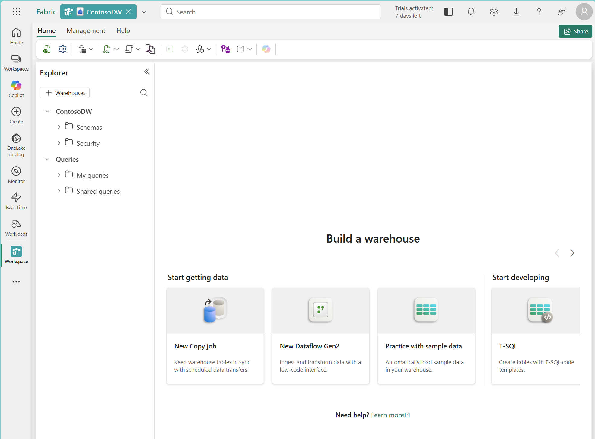
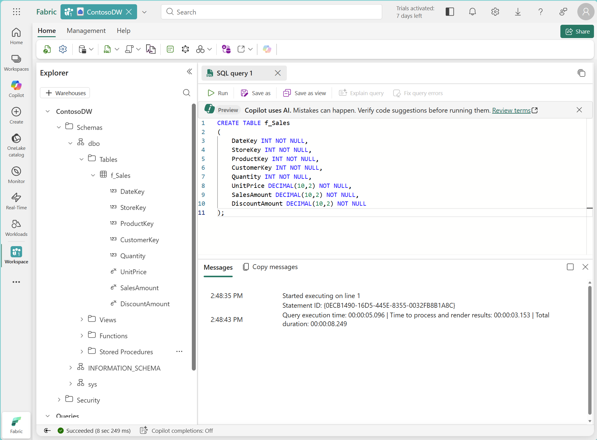

---
lab:
  title: Design and implement a dimensional model
  module: Design dimensional models for analytics in Microsoft Fabric
  description: In this exercise, you created a data warehouse with a star schema dimensional model containing a sales fact table and four dimension tables. You loaded sample data, ran queries that join the fact table to dimension tables, and implemented SCD Type 1 and Type 2 change patterns.
  duration: 30 minutes
  level: 100
  islab: true
---

# Design and implement a dimensional model

In Microsoft Fabric, a data warehouse provides full T-SQL semantics for creating and managing dimensional models. Dimensional models organize data into fact tables that capture business events and dimension tables that provide the context for analysis. This structure, known as a star schema, is the recommended approach for most analytics workloads and the foundation for Power BI semantic models.

In this exercise, you design and implement a star schema dimensional model for Contoso Retail, a fictional retail organization that needs to analyze sales performance across stores, products, customers, and time periods. You create the fact and dimension tables in a Fabric Warehouse, load sample data, and run analytical queries that join the fact table to dimension tables as a **star schema**.

You also implement slowly changing dimension (SCD) patterns to handle data that changes over time, demonstrating how Type 1 (overwrite) and Type 2 (historical tracking) changes work in practice.

This lab takes approximately **30** minutes to complete.

> **Note**: You need access to a Fabric-enabled workspace. If you don't have one, create a [Microsoft Fabric trial](https://learn.microsoft.com/fabric/get-started/fabric-trial) to complete this exercise.

## Create a workspace

Before working with data in Fabric, create a workspace with the Fabric trial enabled.

1. Navigate to the [Microsoft Fabric home page](https://app.fabric.microsoft.com/home?experience=fabric) at `https://app.fabric.microsoft.com/home?experience=fabric` in a browser, and sign in with your Fabric credentials.

1. In the menu bar on the left, select **Workspaces** (the icon looks similar to &#128455;).

1. Choose a **Fabric and Power BI workspace type** in the _Advanced_ section. The choices might be: _Fabric, Fabric trial, Power BI Premium_.

1. When your new workspace opens, it should be empty.

    

## Create a data warehouse

Now that you have a workspace, create a data warehouse to host your dimensional model.

1. In your workspace, select **+ New item**, and then select **Warehouse** in the _Store Data_ section. Name it **ContosoDW**.

    After a minute or so, a new warehouse is created and opens in the browser.

    

## Create the fact table

The fact table captures the business events you want to measure — for Contoso Retail, that's sales transactions. The grain is **one row per sales transaction line item**. The numeric columns you aggregate in queries are called **measures**: quantity, unit price, sales amount, and discount amount. The table also includes foreign keys that link each transaction to four dimension tables.

1. In your warehouse, select the **New SQL query** button on the toolbar, and enter the following T-SQL statement:

    ```sql
    CREATE TABLE f_Sales
    (
        DateKey INT NOT NULL,
        StoreKey INT NOT NULL,
        ProductKey INT NOT NULL,
        CustomerKey INT NOT NULL,
        Quantity INT NOT NULL,
        UnitPrice DECIMAL(10,2) NOT NULL,
        SalesAmount DECIMAL(10,2) NOT NULL,
        DiscountAmount DECIMAL(10,2) NOT NULL
    );
    ```

1. Use the **&#9655; Run** button to run the SQL script.

1. Use the **Refresh** button on the toolbar to refresh the view. In the **Explorer** pane, expand **Schemas** > **dbo** > **Tables** and verify that the **f_Sales** table has been created.

    > **Note**: The `f_` prefix identifies this as a fact table. This naming convention makes it easy for analysts and tools to distinguish fact tables from dimension tables. The fact table intentionally has no primary key, which is standard practice because it doesn't serve a useful purpose for fact tables and would unnecessarily increase storage.

    

## Create the dimension tables

Dimension tables provide the context that makes fact data meaningful. They answer the _who_, _what_, _when_, and _where_ behind every measurement. For this model, you need four dimensions: date, store, product, and customer.

The product and store dimensions include SCD Type 2 tracking columns (`ValidFrom`, `ValidTo`, `IsCurrent`) because the business needs to track historical changes to product costs and store regional assignments. The customer and date dimensions use simpler structures because only corrections (Type 1) are needed for customers, and the date dimension is static reference data.

1. On the **Home** menu tab, select **New SQL query** and run the following code to create all four dimension tables:

    ```sql
    -- Date dimension: uses YYYYMMDD integer format as surrogate key
    CREATE TABLE d_Date
    (
        DateKey INT NOT NULL,
        FullDate DATE NOT NULL,
        [Year] INT NOT NULL,
        [Quarter] INT NOT NULL,
        [Month] INT NOT NULL,
        MonthName VARCHAR(10) NOT NULL,
        [Day] INT NOT NULL,
        [DayOfWeek] VARCHAR(10) NOT NULL,
        FiscalYear INT NOT NULL,
        FiscalQuarter INT NOT NULL,
        IsHoliday BIT NOT NULL,
        IsWeekday BIT NOT NULL
    );

    -- Store dimension: includes SCD Type 2 tracking columns
    CREATE TABLE d_Store
    (
        StoreKey INT NOT NULL,
        StoreNaturalKey VARCHAR(10) NOT NULL,
        StoreName VARCHAR(50) NOT NULL,
        StoreType VARCHAR(20) NOT NULL,
        City VARCHAR(50) NOT NULL,
        [State] VARCHAR(50) NOT NULL,
        Country VARCHAR(50) NOT NULL,
        Region VARCHAR(50) NOT NULL,
        OpenDate DATE NOT NULL,
        ValidFrom DATE NOT NULL,
        ValidTo DATE NOT NULL,
        IsCurrent BIT NOT NULL
    );

    -- Product dimension: includes SCD Type 2 tracking columns
    CREATE TABLE d_Product
    (
        ProductKey INT NOT NULL,
        ProductNaturalKey VARCHAR(10) NOT NULL,
        ProductName VARCHAR(50) NOT NULL,
        Brand VARCHAR(50) NOT NULL,
        Subcategory VARCHAR(50) NOT NULL,
        Category VARCHAR(50) NOT NULL,
        UnitCost DECIMAL(10,2) NOT NULL,
        ValidFrom DATE NOT NULL,
        ValidTo DATE NOT NULL,
        IsCurrent BIT NOT NULL
    );

    -- Customer dimension: simple structure (SCD Type 1 only)
    CREATE TABLE d_Customer
    (
        CustomerKey INT NOT NULL,
        CustomerName VARCHAR(50) NOT NULL,
        Segment VARCHAR(20) NOT NULL,
        City VARCHAR(50) NOT NULL,
        [State] VARCHAR(50) NOT NULL,
        Country VARCHAR(50) NOT NULL,
        LoyaltyTier VARCHAR(20) NOT NULL,
        JoinDate DATE NOT NULL
    );
    ```

    > **Note**: The date dimension uses the `YYYYMMDD` integer format as its surrogate key. This is the accepted practice for date dimensions because it's both meaningful and efficient. The fiscal year starts in July, so January 2026 falls in fiscal quarter 3. The store and product dimensions include a `NaturalKey` column (the source system identifier) and three SCD Type 2 tracking columns: `ValidFrom`, `ValidTo`, and `IsCurrent`. The surrogate key (`StoreKey`, `ProductKey`) uniquely identifies each _version_ of a dimension member. This design is essential for tracking historical changes, which you implement later in this exercise.

1. Use the **Refresh** button on the toolbar. In the **Explorer** pane, verify that all five tables (**f_Sales**, **d_Date**, **d_Store**, **d_Product**, **d_Customer**) appear under **Schemas** > **dbo** > **Tables**.

    > **Tip**: If the tables take a while to appear, refresh the browser page.

    

## Add table constraints

Now that the fact and dimension tables exist, connect them into a star schema by adding foreign key constraints, loading sample data, and running analytical queries. In Fabric Warehouse, table constraints (primary keys and foreign keys) can't be defined inline within a CREATE TABLE statement — use ALTER TABLE to add them after the tables are created. Constraints are `NOT ENFORCED` and serve as metadata that documents the relationships between tables. This metadata helps Power BI auto-detect relationships when you create a semantic model from the warehouse.

1. Create a new SQL query and run the following code to add primary keys to each dimension table and foreign keys to the fact table:

    ```sql
    -- Add primary keys to dimension tables
    ALTER TABLE d_Date
        ADD CONSTRAINT PK_d_Date PRIMARY KEY NONCLUSTERED (DateKey) NOT ENFORCED;

    ALTER TABLE d_Store
        ADD CONSTRAINT PK_d_Store PRIMARY KEY NONCLUSTERED (StoreKey) NOT ENFORCED;

    ALTER TABLE d_Product
        ADD CONSTRAINT PK_d_Product PRIMARY KEY NONCLUSTERED (ProductKey) NOT ENFORCED;

    ALTER TABLE d_Customer
        ADD CONSTRAINT PK_d_Customer PRIMARY KEY NONCLUSTERED (CustomerKey) NOT ENFORCED;

    -- Add foreign keys to the fact table
    ALTER TABLE f_Sales
        ADD CONSTRAINT FK_Sales_Date FOREIGN KEY (DateKey)
            REFERENCES d_Date(DateKey) NOT ENFORCED;

    ALTER TABLE f_Sales
        ADD CONSTRAINT FK_Sales_Store FOREIGN KEY (StoreKey)
            REFERENCES d_Store(StoreKey) NOT ENFORCED;

    ALTER TABLE f_Sales
        ADD CONSTRAINT FK_Sales_Product FOREIGN KEY (ProductKey)
            REFERENCES d_Product(ProductKey) NOT ENFORCED;

    ALTER TABLE f_Sales
        ADD CONSTRAINT FK_Sales_Customer FOREIGN KEY (CustomerKey)
            REFERENCES d_Customer(CustomerKey) NOT ENFORCED;
    ```

## Load sample data

With the schema in place, load sample data so you can query the star schema. This block inserts rows into all five tables.

1. Create a new SQL query and run the following code to load sample data into all dimension tables and the fact table:

    ```sql
    -- Load date dimension data
    INSERT INTO d_Date VALUES
    (20260105, '2026-01-05', 2026, 1, 1, 'January', 5, 'Monday', 2026, 3, 0, 1),
    (20260112, '2026-01-12', 2026, 1, 1, 'January', 12, 'Monday', 2026, 3, 0, 1),
    (20260209, '2026-02-09', 2026, 1, 2, 'February', 9, 'Monday', 2026, 3, 0, 1),
    (20260302, '2026-03-02', 2026, 1, 3, 'March', 2, 'Monday', 2026, 3, 0, 1),
    (20260406, '2026-04-06', 2026, 2, 4, 'April', 6, 'Monday', 2026, 4, 0, 1),
    (20260504, '2026-05-04', 2026, 2, 5, 'May', 4, 'Monday', 2026, 4, 0, 1);

    -- Load store dimension data
    INSERT INTO d_Store VALUES
    (1, 'ST-001', 'Contoso Downtown', 'Flagship', 'Seattle', 'Washington', 'United States', 'West', '2020-03-15', '2026-01-01', '9999-12-31', 1),
    (2, 'ST-002', 'Contoso Mall', 'Standard', 'Portland', 'Oregon', 'United States', 'West', '2021-07-01', '2026-01-01', '9999-12-31', 1),
    (3, 'ST-003', 'Contoso Central', 'Standard', 'Chicago', 'Illinois', 'United States', 'Central', '2019-11-20', '2026-01-01', '9999-12-31', 1),
    (4, 'ST-004', 'Contoso Plaza', 'Express', 'New York', 'New York', 'United States', 'East', '2022-01-10', '2026-01-01', '9999-12-31', 1);

    -- Load product dimension data
    INSERT INTO d_Product VALUES
    (1, 'MB-PRO', 'Mountain Bike Pro', 'AdventureWorks', 'Mountain Bikes', 'Bikes', 1200.00, '2026-01-01', '9999-12-31', 1),
    (2, 'RB-ELT', 'Road Bike Elite', 'AdventureWorks', 'Road Bikes', 'Bikes', 900.00, '2026-01-01', '9999-12-31', 1),
    (3, 'HL-STD', 'Cycling Helmet', 'SafeRide', 'Helmets', 'Accessories', 25.00, '2026-01-01', '9999-12-31', 1),
    (4, 'WB-STD', 'Water Bottle', 'HydroGear', 'Bottles', 'Accessories', 5.00, '2026-01-01', '9999-12-31', 1),
    (5, 'LK-STD', 'Bike Lock', 'SecureLock', 'Locks', 'Accessories', 15.00, '2026-01-01', '9999-12-31', 1);

    -- Load customer dimension data
    INSERT INTO d_Customer VALUES
    (1, 'Jordan Rivera', 'Premium', 'Seattle', 'Washington', 'United States', 'Gold', '2023-06-15'),
    (2, 'Alex Chen', 'Standard', 'Portland', 'Oregon', 'United States', 'Silver', '2024-01-20'),
    (3, 'Sam Patel', 'Premium', 'Chicago', 'Illinois', 'United States', 'Gold', '2022-11-05'),
    (4, 'Taylor Kim', 'Budget', 'New York', 'New York', 'United States', 'Bronze', '2025-03-12'),
    (5, 'Morgan Lee', 'Standard', 'Seattle', 'Washington', 'United States', 'Silver', '2024-08-30');

    -- Load fact data (sales transactions)
    INSERT INTO f_Sales VALUES
    (20260105, 1, 1, 1, 1, 1500.00, 1500.00, 0.00),
    (20260105, 1, 3, 1, 2, 35.00, 70.00, 5.00),
    (20260112, 2, 2, 2, 1, 1100.00, 1100.00, 100.00),
    (20260112, 2, 4, 2, 3, 8.00, 24.00, 0.00),
    (20260209, 3, 1, 3, 2, 1500.00, 3000.00, 150.00),
    (20260209, 3, 5, 3, 1, 22.00, 22.00, 0.00),
    (20260302, 1, 2, 5, 1, 1100.00, 1100.00, 0.00),
    (20260302, 4, 3, 4, 4, 35.00, 140.00, 10.00),
    (20260406, 2, 1, 2, 1, 1500.00, 1500.00, 75.00),
    (20260504, 3, 4, 3, 5, 8.00, 40.00, 0.00);
    ```

## Query the star schema

1. Create a new SQL query and run the following code to analyze sales by product category and month:

    ```sql
    SELECT
        d.MonthName,
        p.Category,
        SUM(f.SalesAmount) AS TotalSales,
        SUM(f.Quantity) AS TotalQuantity,
        SUM(f.DiscountAmount) AS TotalDiscounts
    FROM f_Sales f
    JOIN d_Date d ON f.DateKey = d.DateKey
    JOIN d_Product p ON f.ProductKey = p.ProductKey
    GROUP BY d.MonthName, d.[Month], p.Category
    ORDER BY d.[Month], p.Category;
    ```

    > Notice how the query reflects the star schema design: the fact table (`f_Sales`) joins to each dimension table to bring in descriptive attributes. The `SUM` functions aggregate the numeric columns from the fact table, and the `GROUP BY` clause uses dimension attributes to define the grouping.

    | MonthName | Category | TotalSales | TotalQuantity | TotalDiscounts |
    |---|---|---|---|---|
    | January | Accessories | 94.00 | 5 | 5.00 |
    | January | Bikes | 2600.00 | 2 | 100.00 |
    | February | Accessories | 22.00 | 1 | 0.00 |
    | February | Bikes | 3000.00 | 2 | 150.00 |
    | March | Accessories | 140.00 | 4 | 10.00 |
    | March | Bikes | 1100.00 | 1 | 0.00 |
    | April | Bikes | 1500.00 | 1 | 75.00 |
    | May | Accessories | 40.00 | 5 | 0.00 |

1. Create a new SQL query and run the following code to analyze sales by store region and customer segment:

    ```sql
    SELECT
        s.Region,
        c.Segment,
        SUM(f.SalesAmount) AS TotalSales,
        COUNT(*) AS TransactionCount
    FROM f_Sales f
    JOIN d_Store s ON f.StoreKey = s.StoreKey
    JOIN d_Customer c ON f.CustomerKey = c.CustomerKey
    GROUP BY s.Region, c.Segment
    ORDER BY s.Region, c.Segment;
    ```

    > Review the results. By swapping the dimension tables in the JOIN and GROUP BY clauses, you can analyze the same fact data from different angles without changing the underlying schema.

    | Region | Segment | TotalSales | TransactionCount |
    |---|---|---|---|
    | Central | Premium | 3062.00 | 3 |
    | East | Budget | 140.00 | 1 |
    | West | Premium | 1570.00 | 2 |
    | West | Standard | 3724.00 | 4 |

## Implement SCD patterns

Dimension data changes over time. Customers move, products get repriced, and stores get reassigned to different regions. Slowly changing dimension (SCD) patterns define how your dimensional model responds to these changes.

The product dimension uses two SCD patterns:
- **Type 2 (add new row)** for `UnitCost` — the business needs to track cost changes for historical margin analysis.
- **Type 1 (overwrite)** for `ProductName` — name corrections should apply to all history.

### Simulate an SCD Type 2 change

Suppose the cost of the Mountain Bike Pro increases from $1,200 to $1,350 effective March 1, 2026. An SCD Type 2 change expires the current row and inserts a new version.

1. Create a new SQL query and run the following code to:
   - Expire the current product version
   - Insert the new version
   - Add a sale that references the updated product

    ```sql
    -- Step 1: Expire the current version of Mountain Bike Pro
    UPDATE d_Product
    SET ValidTo = '2026-03-01',
        IsCurrent = 0
    WHERE ProductNaturalKey = 'MB-PRO'
      AND IsCurrent = 1;

    -- Step 2: Insert the new version with updated cost
    INSERT INTO d_Product VALUES
    (6, 'MB-PRO', 'Mountain Bike Pro', 'AdventureWorks', 'Mountain Bikes', 'Bikes', 1350.00, '2026-03-01', '9999-12-31', 1);

    -- Step 3: A sale after the cost change references the new product version (ProductKey = 6)
    INSERT INTO f_Sales VALUES
    (20260504, 1, 6, 5, 1, 1500.00, 1500.00, 0.00);
    ```

1. Create a new SQL query and run the following code to see how SCD Type 2 preserves historical accuracy:

    ```sql
    SELECT
        d.FullDate,
        p.ProductName,
        p.UnitCost AS ProductCostVersion,
        p.ValidFrom AS CostEffectiveDate,
        f.Quantity,
        f.SalesAmount
    FROM f_Sales f
    JOIN d_Date d ON f.DateKey = d.DateKey
    JOIN d_Product p ON f.ProductKey = p.ProductKey
    WHERE p.ProductNaturalKey = 'MB-PRO'
    ORDER BY d.FullDate;
    ```

    > Review the results. The January, February, and April sales are linked to the original cost version ($1,200), while the May sale is linked to the new cost version ($1,350). Each fact row retains the product cost that was in effect at the time of the sale. This is the key benefit of SCD Type 2 — historical facts remain accurate even after dimension attributes change.

    | FullDate | ProductName | ProductCostVersion | CostEffectiveDate | Quantity | SalesAmount |
    |---|---|---|---|---|---|
    | 2026-01-05 | Mountain Bike Pro | 1200.00 | 2026-01-01 | 1 | 1500.00 |
    | 2026-02-09 | Mountain Bike Pro | 1200.00 | 2026-01-01 | 2 | 3000.00 |
    | 2026-04-06 | Mountain Bike Pro | 1200.00 | 2026-01-01 | 1 | 1500.00 |
    | 2026-05-04 | Mountain Bike Pro | 1350.00 | 2026-03-01 | 1 | 1500.00 |

### Simulate an SCD Type 1 change

Now suppose the product name "Water Bottle" needs to be corrected to "Insulated Water Bottle." An SCD Type 1 change overwrites the existing value in place, with no history tracking.

1. Create a new SQL query and run the following code to overwrite the product name:

    ```sql
    UPDATE d_Product
    SET ProductName = 'Insulated Water Bottle'
    WHERE ProductNaturalKey = 'WB-STD';
    ```

1. Create a new SQL query and run the following code to verify both SCD changes:

    ```sql
    SELECT ProductKey, ProductNaturalKey, ProductName, UnitCost, ValidFrom, ValidTo, IsCurrent
    FROM d_Product
    ORDER BY ProductNaturalKey, ValidFrom;
    ```

    > Notice that:
    > - **MB-PRO** has two rows: the expired version (ProductKey 1, cost $1,200) and the current version (ProductKey 6, cost $1,350). This is SCD Type 2.
    > - **WB-STD** has one row with the corrected name "Insulated Water Bottle." The original name is gone. This is SCD Type 1.

    | ProductKey | ProductNaturalKey | ProductName | UnitCost | ValidFrom | ValidTo | IsCurrent |
    |---|---|---|---|---|---|---|
    | 3 | HL-STD | Cycling Helmet | 25.00 | 2026-01-01 | 9999-12-31 | 1 |
    | 5 | LK-STD | Bike Lock | 15.00 | 2026-01-01 | 9999-12-31 | 1 |
    | 1 | MB-PRO | Mountain Bike Pro | 1200.00 | 2026-01-01 | 2026-03-01 | 0 |
    | 6 | MB-PRO | Mountain Bike Pro | 1350.00 | 2026-03-01 | 9999-12-31 | 1 |
    | 2 | RB-ELT | Road Bike Elite | 900.00 | 2026-01-01 | 9999-12-31 | 1 |
    | 4 | WB-STD | Insulated Water Bottle | 5.00 | 2026-01-01 | 9999-12-31 | 1 |

## Verify the design

Review your completed dimensional model by running a comprehensive query that joins all four dimensions to the fact table.

1. Create a new SQL query and run the following code:

    ```sql
    SELECT
        d.FullDate,
        d.[Year],
        d.MonthName,
        s.StoreName,
        s.Region,
        p.ProductName,
        p.Category,
        c.CustomerName,
        c.Segment,
        f.Quantity,
        f.UnitPrice,
        f.SalesAmount,
        f.DiscountAmount
    FROM f_Sales f
    JOIN d_Date d ON f.DateKey = d.DateKey
    JOIN d_Store s ON f.StoreKey = s.StoreKey
    JOIN d_Product p ON f.ProductKey = p.ProductKey
    JOIN d_Customer c ON f.CustomerKey = c.CustomerKey
    ORDER BY d.FullDate, s.StoreName;
    ```

1. Review the results. Confirm that the model supports:
    - **Sales by time period**: The date dimension enables grouping by year, quarter, month, and day.
    - **Sales by location**: The store dimension provides geographic hierarchy (Region > Country > State > City).
    - **Sales by product**: The product dimension provides product hierarchy (Category > Subcategory > Brand > Product).
    - **Sales by customer segment**: The customer dimension enables segmentation by segment and loyalty tier.

1. Review the results considering the following design summary:

- **Schema type**: Star schema with one fact table (`f_Sales`) and four dimension tables (`d_Date`, `d_Store`, `d_Product`, `d_Customer`)
- **Grain**: One row per sales transaction line item
- **Measures**: Quantity (additive), UnitPrice (non-additive), SalesAmount (additive), DiscountAmount (additive). Additive measures can be summed across all dimensions. Non-additive measures (like unit price) can't be summed meaningfully — they should be averaged or used in calculations instead.
- **Hierarchies**: Date (Year > Quarter > Month > Day), Store (Region > Country > State > City), Product (Category > Subcategory > Brand > Product)
- **SCD tracking**: Type 2 on product cost; Type 1 on product name and all customer attributes (as demonstrated in this exercise). The store dimension also includes SCD Type 2 columns by design.

## Try it with Copilot (Optional)

Copilot can assist with several tasks in this exercise:

| Task | Copilot Alternative |
|------|---------------------|
| Writing CREATE TABLE statements | Use Copilot in the SQL editor to generate table definitions from a natural language description of your dimensional model |
| Writing star schema queries | Ask Copilot to write aggregation queries that join the fact table to dimension tables |
| Writing SCD update logic | Ask Copilot to generate the SQL for an SCD Type 2 change on a specific dimension attribute |

**Example prompt:** 

`"Write a query that shows total sales revenue and discount amount by store region and product category for Q1 2026, using the f_Sales fact table with d_Store and d_Product dimensions."`

> **Tip:** Complete the manual steps first to build understanding, then try Copilot to see how it accelerates common tasks.

## Clean up resources

In this exercise, you created a data warehouse with a star schema dimensional model containing a sales fact table and four dimension tables. You loaded sample data, ran queries that join the fact table to dimension tables, and implemented SCD Type 1 and Type 2 change patterns.

When you finish exploring your data warehouse, delete the workspace you created for this exercise.

1. In the bar on the left, select the icon for your workspace to view all of the items it contains.
1. In the toolbar, select **Workspace settings**.
1. In the **General** section, select **Remove this workspace**.
