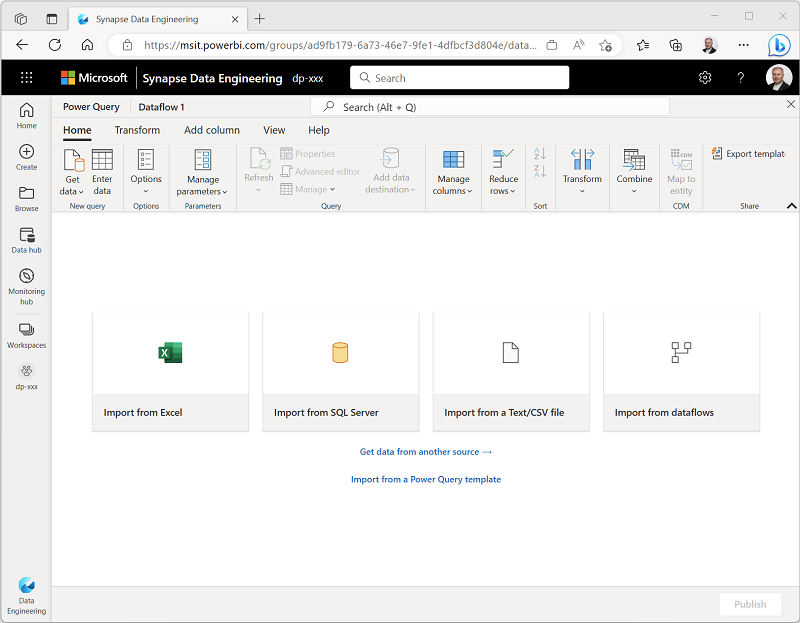
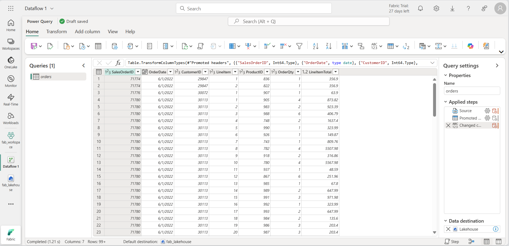
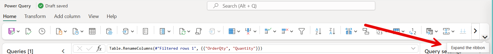
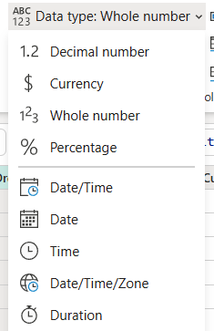
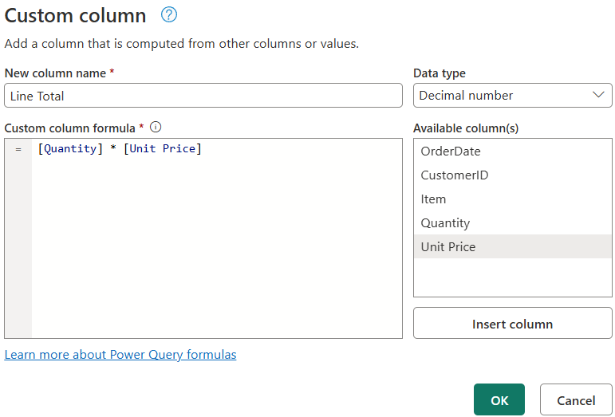
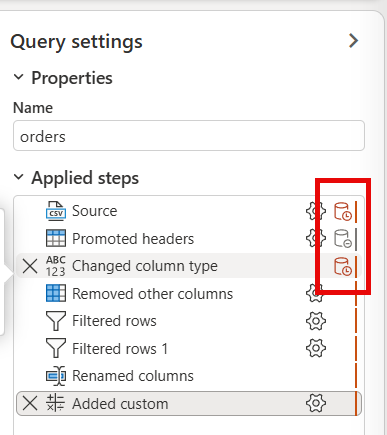

---
lab:
  title: Transform data using dataflows in Microsoft Fabric
  module: Transform data using dataflows in Microsoft Fabric
  description: In this lab, you create a Dataflow Gen2 to connect to sample sales data, apply Power Query transformations to clean and shape the data, and load the results to a lakehouse table. You practice common data preparation tasks including filtering rows, removing columns, changing data types, renaming columns, and creating calculated columns.
  duration: 30 minutes
  level: 300
  islab: true
  primarytopics:
    - Microsoft Fabric
  categories:
    - Data engineering
  courses:
    - DP-600
---

# Transform data using dataflows in Microsoft Fabric

Dataflows in Microsoft Fabric provide a low-code, Power Query-based transformation experience for preparing analytical data. When your team includes members who are familiar with Power Query from Excel or Power BI Desktop, dataflows let them apply those skills to enterprise-scale data preparation without writing Spark or T-SQL code.

In this exercise, you create a Dataflow Gen2 to connect to sample sales data, apply a series of Power Query transformations to clean and shape the data, and load the results to a lakehouse table. The transformations you apply represent common data preparation tasks: filtering rows, removing unnecessary columns, changing data types, renaming columns, and creating calculated columns. These are the steps that produce analytics-ready tables for downstream reporting and AI experiences.

This lab takes approximately **30** minutes to complete.

## Set up your environment

You need a Fabric-enabled workspace to complete this exercise. For more information about a Fabric trial, see [Getting started with Fabric](https://learn.microsoft.com/fabric/get-started/fabric-trial).

### Create a workspace

In this task, you create a Fabric-enabled workspace to organize the resources for this exercise.

1. Navigate to the [Microsoft Fabric home page](https://app.fabric.microsoft.com/home?experience=fabric) at `https://app.fabric.microsoft.com/home?experience=fabric` in a browser, and sign in with your Fabric credentials.
1. In the menu bar on the left, select **Workspaces** (the icon looks similar to &#128455;).
1. Create a new workspace with a name of your choice, selecting a licensing mode that includes Fabric capacity (*Trial*, *Premium*, or *Fabric*).
1. When your new workspace opens, it should be empty.

    

### Create a lakehouse

In this task, you create a lakehouse that serves as the destination for your transformed dataflow output.

1. On the menu bar on the left, select **Create**. In the *New* page, under the *Data Engineering* section, select **Lakehouse**. Give it a unique name of your choice.

    >**Note**: If the **Create** option is not pinned to the sidebar, you need to select the ellipsis (**...**) option first.

    After a minute or so, a new empty lakehouse is created.

    

## Create a Dataflow Gen2

Dataflows provide a reusable, no-code transformation layer that can refresh on a schedule and serve multiple downstream consumers, making them ideal for teams that need to centralize data preparation logic. In this section, you create a Dataflow Gen2 from the lakehouse and connect it to a sample CSV data source containing sales orders.

1. In the home page for your lakehouse, select **Get data** > **New Dataflow Gen2**. After a few seconds, the Power Query editor for your new dataflow opens.

    

1. Select **Import from a Text/CSV file**, and create a new data source with the following settings:
    - **Link to file**: *Selected*
    - **File path or URL**: `https://raw.githubusercontent.com/MicrosoftLearning/dp-data/main/orders.csv`
    - **Connection**: Create new connection
    - **Connection name**: Leave as-is
    - **data gateway**: (none)
    - **Authentication kind**: Anonymous

1. Select **Next** to preview the file data, and then select **Create** to create the data source. The Power Query editor shows the data source and an initial set of query steps to format the data.

    

You now have a dataflow ready for transformations before loading the data into your lakehouse.

## Apply Power Query transformations

These transformations represent the most common data quality and preparation tasks that data professionals perform to convert raw source data into analytics-ready tables. In this section, you apply column selection, filtering, data type changes, renaming, and a calculated column to the orders data.

The first three tasks support *query folding*, where Power Query pushes operations back to the data source for more efficient execution. Placing these steps first maximizes the work that can be folded. Steps that follow, like renaming and custom columns, typically break the fold boundary and run locally in the Power Query engine.

   > **Tip**: In the **Query Settings** pane on the right side, notice that each transformation appears as a step in **Applied Steps**. You can select any step to see the data at that point in the transformation process.

### Choose columns

Removing extra columns reduces the data retrieved from the source and is one of the most effective steps for query folding. In this task, you keep only the columns needed for analysis.

1. Select the **Home** tab on the ribbon. Select **Choose Columns**.

    > **Tip**: Expand the ribbon to see larger icons.
    > 

1. Deselect any columns that you don't need for downstream analysis. Keep the following columns selected and then select **OK**:
    - `OrderDate`
    - `CustomerID`
    - `LineItem`
    - `OrderQty`
    - `LineItemTotal`

### Filter rows

Filtering rows before other transformations reduces the volume of data that subsequent steps process and folds well to most data sources. In this task, you remove rows with missing dates and rows with zero or negative quantities.

1. Select the `OrderDate` column header. Select the drop-down arrow, and then select **Remove empty**.

1. Select the `OrderQty` column header. Select the drop-down arrow, select **Number Filters**, and then select **Greater Than**. Enter `0` as the value and select **OK**.

### Set data types

Correct data types are essential for calculations, sorting, and filtering, and they enable Copilot and other AI features to interpret your data correctly. Data type changes also fold to many sources, so applying them before rename and text operations keeps the fold chain intact. In this task, you verify the data types for three columns.

1. On the ribbon, select the **Transform** tab. Select the following columns and make sure the data type is correctly set:

    - `OrderDate` = **Date**
    - `OrderQty` = **Whole Number**
    - `LineItemTotal` = **Decimal Number**

    

### Rename columns

Renaming columns typically breaks query folding, so it comes after the foldable steps above. Clear, business-friendly column names make data easier to understand for report builders and improve the usability of AI tools like Copilot that rely on descriptive names. In this task, you rename three columns to more readable names.

1. Select the `OrderQty` column header. Double-click the header and rename it to `Quantity`.

1. Rename `LineItemTotal` to `Line Total`.

1. Rename `LineItem` to `Item`.

    > **Tip**: You can also rename columns by right-clicking the column header and selecting **Rename**.

### Add a calculated column

Deriving the per-unit price from the line total gives report builders a column they can use for price comparisons, discount analysis, and cost breakdowns without recalculating in every report. In this task, you create a `Unit Price` column by dividing `Line Total` by `Quantity`.

1. On the **Add Column** tab, select **Custom Column**.

1. In the **Custom Column** dialog, set the following values:
    - **New column name**: `Unit Price`
    - **Data type**: **Decimal Number**
    - **Custom column formula**: `[Line Total] / [Quantity]`

1. Select **OK**. Verify that the new `Unit Price` column appears in the data preview with calculated values.

### Review applied steps and configuration

Understanding the applied steps list helps you debug transformation issues, optimize the sequence of operations, and document the data preparation logic for team members. In this task, you review the **Applied Steps** list in the **Query Settings** pane to confirm all transformations are complete and in the correct order.

1. In the **Query Settings** pane, review the **Applied Steps** list. You should see steps for column selection, filtering, data type changes, renaming, and custom columns.

1. Select different steps to see how the data looks at each stage of the transformation process.

1. Notice how some steps have an extra icon near the Settings gear icon. This icon indicates whether the step can be evaluated within the data source, meaning supports *query folding*. This lab uses a CSV file, which doesn't support query folding. However, it's important to be familiar with this icon to know if you can improve the performance by changing the order of your steps.

    

1. Notice how the **Data destination** is already set to *Lakehouse*. Hover over the lakehouse to see it's defaulting to the lakehouse you created. The default data destination is set because you created the dataflow directly from that lakehouse. The experience is different if you create the dataflow separately.

    

### Publish and verify results

Publishing makes the dataflow available for scheduled refreshes and team collaboration, while verification confirms that transformations produced the expected output before downstream systems depend on the data. In this task, you save and run the dataflow, then verify that the table loaded correctly to your lakehouse with the expected columns and calculated values.

1. On the toolbar ribbon, select the **Home** tab. Select **Save and run** and wait for the dataflow to be saved and refreshed.

    > **Note**: Saving automatically publishes and validates your dataflow. The first refresh runs after saving.

1. Wait for the dataflow to finish refreshing. This may take a few minutes. When complete, navigate back to your workspace.

    > **Note**: You can check the **Recent runs** from the Home tab on the ribbon to see when the dataflow succeeds.

1. Navigate back to your lakehouse.

1. In the **Explorer** pane, expand **Tables** and select the `orders` table to preview the loaded data.

    > **Tip**: If the table doesn't appear, select **Refresh** in the **...** menu for the **Tables** folder.

1. Verify that the data includes only the columns you selected and the `Unit Price` calculated column.

1. Notice the `Unit Price` column has inconsistent decimal places. Some values show two decimal places, while others show more. To fix this, go back to the dataflow by selecting it in your workspace.

1. Select the `Unit Price` column header. On the **Transform** tab, select **Rounding**, and then select **Round...**. Enter `2` for the number of decimal places and select **OK**.

1. Select **Save and run** to publish the updated dataflow. Wait for the refresh to complete, then navigate back to your lakehouse and verify the `Unit Price` column now shows consistent two-decimal formatting.

## Try it with Copilot (Optional)

Copilot translates natural language instructions into Power Query steps, which accelerates development and makes dataflows more accessible to team members who are less familiar with Power Query syntax. In this section, you explore how Copilot in Data Factory can assist with common transformations like filtering rows and adding calculated columns.

| Task | Copilot alternative |
|------|---------------------|
| Filter rows with null values | Use Copilot to type "*Remove rows where `OrderDate` is empty*" |
| Add a calculated column | Use Copilot to type "*Add a column called `Unit Price` that divides `Line Total` by `Quantity`*" |

> **Note:** Complete the manual steps first to build understanding, then try Copilot to see how it accelerates common tasks. Copilot in Data Factory requires a Fabric capacity and is available in supported regions.

## Clean up resources

In this exercise, you created a Dataflow Gen2, connected to sample data, applied Power Query transformations to clean and shape the data, and loaded the results to a lakehouse table.

If you've finished exploring dataflows in Microsoft Fabric, you can delete the workspace you created for this exercise.

1. Navigate to Microsoft Fabric in your browser.
1. In the bar on the left, select the icon for your workspace to view all of the items it contains.
1. Select **Workspace settings** and in the **General** section, scroll down and select **Remove this workspace**.
1. Select **Delete** to delete the workspace.
