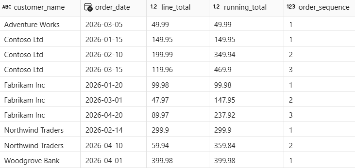
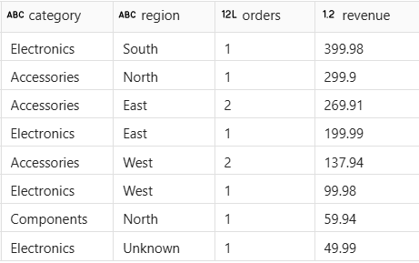

---
lab:
    title: Transform data with notebooks in Microsoft Fabric
    module: Transform data using notebooks in Microsoft Fabric
    description: In this lab, you clean raw sales data in a Fabric notebook, join multiple tables, apply aggregations and window functions, and write results to Delta tables in a lakehouse.
    duration: 30 minutes
    level: 200
    islab: true
    primarytopics:
        - Microsoft Fabric
---

# Transform data with notebooks in Microsoft Fabric

Notebooks in Microsoft Fabric provide an interactive, code-based environment for transforming lakehouse data at scale using Apache Spark. You write and run code in individual cells, see results immediately, and iterate step by step. For analytics engineers working with SQL, Spark SQL extends familiar syntax to work with large datasets—and the `%%sql` magic command lets you run SQL directly in notebook cells.

In this exercise, you work with sales, customer, and product data for a retail analytics organization. The raw data has quality issues: duplicate rows, null values, and inconsistent formatting. You clean and shape the data, join multiple tables, calculate aggregations and window functions, and write the results to Delta tables in a lakehouse. These are the same transformation patterns you explored in the module's conceptual units.

This exercise takes approximately **30** minutes to complete.

## Set up the environment

You need a Fabric-enabled workspace to complete this exercise. For more information about a Fabric trial, see [Getting started with Fabric](https://learn.microsoft.com/fabric/get-started/fabric-trial).

### Create a workspace

In this task, you create a Fabric workspace with capacity licensing and a new lakehouse.

1. Navigate to the [Microsoft Fabric home page](https://app.fabric.microsoft.com/home?experience=fabric) at `https://app.fabric.microsoft.com/home?experience=fabric` in a browser, and sign in with your Fabric credentials.

1. In the menu bar on the left, select **Workspaces** (the icon looks similar to &#128455;).

1. Create a new workspace with a name of your choice, selecting a licensing mode that includes Fabric capacity (*Trial*, *Premium*, or *Fabric*).

1. When your new workspace opens, it should be empty.

    

1. In the workspace, select **+ New item**, then select **Lakehouse**.

1. Give the lakehouse a name (for example, `Sales`) and select **Create**.

1. The lakehouse will open once created. Close it and navigate back to your workspace for the next task.

### Generate sample data

In this task, you download a pre-built notebook, upload it to your workspace, attach it to the lakehouse, and run the first cell to generate sample data.

1. Download the [Sales Data Transformation.ipynb](https://github.com/MicrosoftLearning/mslearn-fabric/raw/main/Allfiles/Labs/26c/Sales%20Data%20Transformation.ipynb) notebook from `https://github.com/MicrosoftLearning/mslearn-fabric/raw/main/Allfiles/Labs/26c/Sales%20Data%20Transformation.ipynb` and save it locally.

1. Return to the workspace and select **Import** > **Notebook**, then select **Upload**. Select the **Sales Data Transformation.ipynb** file.

1. In the workspace item list, select the **Sales Data Transformation** notebook to open it.

1. In the **Explorer** pane on the left, select **Add** to add a data source, then select your lakehouse (for example, **Sales**). The notebook is now attached to the lakehouse and tables you create are accessible in the **Explorer** pane.

1. In the notebook, run the first code cell by pressing **Shift+Enter**. The code creates three Delta tables in the lakehouse.

    > Notice that `raw_sales` contains 11 rows — including a duplicate row (order_id 10 appears twice) and a null value in the `region` column. These quality issues are intentional and represent common problems in real source data.

1. In the **Explorer** pane, select **&#8635; Refresh** next to **Tables** to confirm that `raw_sales`, `customers`, and `products` appear.

## Shape and clean the sales data

Real-world data rarely arrives clean. In this section, you remove duplicates, handle null values, add a calculated column, and create a conditional column to categorize each order by value.

1. In the notebook, scroll to the **Shape and clean the sales data** section. Review the markdown cell that describes the four transformations, then run the code cell below it.

    The query applies four transformations in a single pass: `SELECT DISTINCT` removes the duplicate row, `COALESCE` fills the null region, a calculated column computes the line total, and a `CASE` expression categorizes each order by value tier.

1. Run the next code cell to verify the results.

The result shows 10 rows (the duplicate is gone). The row with order_id 6 shows `Unknown` for region. Every row has a `line_total` and `value_tier` value.

> Optionally, follow the **Try it with Copilot** prompt in the notebook to extend `clean_sales` with an additional column.

## Join and aggregate the data

Cleansed data becomes more useful when enriched with context from other tables. In this section, you join the sales data with customer and product reference tables, then create a regional revenue summary using aggregations.

1. In the notebook, scroll to the **Join and aggregate the data** section and run the first code cell to join the three tables.

    The `INNER JOIN` matches each sales row to its customer and product details. Rows that don't match in both tables are excluded.

1. Run the next code cell to create a regional summary with aggregations.

The output shows one row per region with order counts, total revenue, and average order value. The 10 detail rows are now collapsed into summary rows — one for each region.

> Optionally, follow the **Try it with Copilot** prompt in the notebook to create an additional aggregation by product category.

## Apply window functions

Window functions let you calculate values across related rows without collapsing the detail. In this section, you add running totals and order sequence numbers for each customer using `SUM() OVER` and `ROW_NUMBER() OVER`.

1. In the notebook, scroll to the **Apply window functions** section and run the code cell.

    Unlike the aggregations in the previous section, the window functions keep all original rows. The `PARTITION BY` clause groups rows by customer, the `ORDER BY` clause determines the sequence, and each row gets a cumulative `running_total` and a sequential `order_sequence` number.

Customers with multiple orders (like Contoso Ltd) show an increasing running total and sequential order numbers. The total row count is the same as the input.

> Optionally, follow the **Try it with Copilot** prompt in the notebook to apply a `RANK` window function to the data.

## Write results to a Delta table

Persisting results as a Delta table makes the data available to reports, other notebooks, and downstream pipelines. In this section, you write the enriched sales view to a managed Delta table in the lakehouse.

1. In the notebook, scroll to the **Write results to a Delta table** section and run the first code cell.

    The `CREATE OR REPLACE TABLE` statement writes the enriched view as a permanent Delta table. The `OR REPLACE` option overwrites the table if it exists, which is useful when re-running the notebook during development.

1. In the **Explorer** pane, select **&#8635; Refresh** next to **Tables** and verify that `gold_sales` appears in the table list.

1. Run the next code cell to confirm the data is queryable.

The result shows revenue by product category and region, confirming that the joined and enriched data was written correctly.

> Optionally, follow the **Try it with Copilot** prompt in the notebook to query the Delta table for high-value orders.

## Clean up resources

In this exercise, you created a notebook to generate sample data, clean and shape raw sales transactions, join multiple tables, apply aggregations and window functions, and write the results to a Delta table in a Microsoft Fabric lakehouse.

If you've finished exploring, you can delete the workspace you created for this exercise.

1. In the bar on the left, select the icon for your workspace to view all of the items it contains.

1. In the toolbar, select **Workspace settings**.

1. In the **General** section, select **Remove this workspace**.
