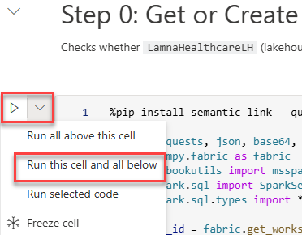
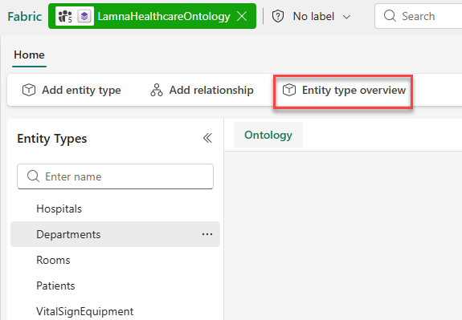

---
lab:
  title: Visualize ontology data with Microsoft Fabric IQ
  module: Visualize ontology data with Microsoft Fabric IQ
  description: 'In this lab, you'll visualize entity instances and relationships using the ontology preview experience. You'll work with the Lamna Healthcare ontology to see how your data comes to life through interactive graphs, charts, and relationship visualizations.'
  duration: 60 minutes
  level: 100
  islab: true
  primarytopics:
    - Microsoft Fabric
---

# Visualize ontology data with Microsoft Fabric IQ

In this lab, you'll create an ontology from a notebook for a fictitious company called Lamna Healthcare. You'll visualize entity instances, explore entity relationships through interactive graphs, and see your data through property charts and time-series visualizations.

This lab takes approximately **60** minutes to complete.

> **Note**: You need a [Microsoft Fabric trial](https://learn.microsoft.com/fabric/get-started/fabric-trial) to complete this exercise. You'll also need to enable the following [tenant settings](https://learn.microsoft.com/fabric/iq/ontology/overview-tenant-settings): **Enable Ontology item (preview)** and **User can create Graph (preview)**.

## Create a workspace

Before working with ontologies in Fabric, you need a workspace with a Fabric capacity.

1. Navigate to the [Microsoft Fabric home page](https://app.fabric.microsoft.com/home?experience=fabric) at `https://app.fabric.microsoft.com/home?experience=fabric` in a browser, and sign in with your Fabric credentials.
1. In the menu bar on the left, select **Workspaces** (the icon looks similar to &#128455;).
1. Create a new workspace with a name of your choice, selecting a licensing mode in one of the following workspace types: *Fabric*, *Fabric Trial*, or *Power BI Premium*.
1. When your new workspace opens, it should be empty.

## Create the ontology from a notebook

This lab focuses on visualizing an ontology using the preview experience—examining entity instances, exploring relationships in the graph, and filtering data using the Query builder. To maximize your time working with these features, you'll use a notebook that automates the ontology creation process, including setting up the lakehouse, eventhouse, entity types, data bindings, and relationships.

The Lamna Healthcare ontology includes sample data representing hospitals, departments, rooms, patients, vital sign equipment, and vital signs readings.

> **Note**: If you want to learn how to build ontologies step-by-step, see the labs on [creating an ontology manually](https://microsoftlearning.github.io/mslearn-fabric/Instructions/Labs/23-build-ontology-manually.html) or [generating an ontology from a semantic model](https://microsoftlearning.github.io/mslearn-fabric/Instructions/Labs/24-build-ontology-semantic-model.html).

1. Download the notebook file [**setup-ontology.ipynb**](https://github.com/MicrosoftLearning/mslearn-fabric/raw/main/Allfiles/Labs/27-28/setup-ontology.ipynb) to your local computer.

1. In your workspace, select **Import** from the ribbon.

1. In the **Import** dialog:
   - Select **Upload** and browse to the **setup-ontology.ipynb** file you downloaded
   - Select **Open**

1. Wait for the import to complete. The notebook appears in your workspace item list.

1. Select the **setup-ontology** notebook to open it.

   The notebook contains detailed markdown cells explaining each step. It will:
   - Create a lakehouse named **LamnaHealthcareLH** with 5 hospital data tables (Hospitals, Departments, Rooms, Patients, VitalSignEquipment)
   - Create an eventhouse named **LamnaHealthcareEH** with time-series vital signs readings
   - Build the **LamnaHealthcareOntology** with 5 entity types, data bindings, and relationship types via the Fabric REST API

1. In the notebook, locate the first Python code cell under **Step 0: Get or Create Infrastructure**. To the left of the cell, select **Run this cell and all below**.

   

### What to expect when the notebook runs

As the notebook executes, watch for these success indicators in the cell outputs:

- **Step 0**: Displays "✅ Infrastructure ready!" with lakehouse and eventhouse IDs
- **Step 1**: Shows "✅ All lakehouse tables written!" with a count of 5 tables
- **Step 2**: Confirms "✅ Eventhouse step complete!" (may skip ingestion if data already exists)
- **Step 3**: Reports "✅ Entity and relationship definitions ready!"
- **Step 4**: After polling, displays "✅ SUCCESS" (this step creates the ontology via REST API)
- **Step 5**: Lists "Ontologies in workspace:" with your ontology name marked with ✅

> **Troubleshooting**: If Step 4 shows "❌ FAILED", the notebook will display error details. Common causes include insufficient permissions or missing tenant settings. Verify you have the required tenant settings enabled and try re-running the notebook.

1. When execution finishes, verify the following items appear in your workspace:
   - **LamnaHealthcareLH** (lakehouse)
   - **LamnaHealthcareEH** (eventhouse)
   - **LamnaHealthcareOntology** (ontology)
   - **LamnaHealthcareOntology** (graph) — automatically created with the same name as the ontology

   > **Important**: After the notebook completes, Fabric processes the data bindings and builds the graph model in the background. **This processing typically completes in 2-20 minutes**, depending on capacity load and complexity. This is a one-time setup process—once complete, the ontology remains responsive. To check if data is ready, open the **LamnaHealthcareOntology** item, select an entity type (e.g., **Departments**), and select **Entity type overview**. If you see "Setting up your ontology" or "Updating your ontology", wait on the page—it will automatically update when the preview experience finishes loading. Once entity instances appear, you can continue to the next section.

   

Now you're ready to explore the ontology.

## Explore entity instances

Now that your ontology is built and the preview experience has loaded, you can explore the entity instances—the actual data records from your lakehouse and eventhouse that populate each entity type.

### View the Departments entity instances

You may already have the **Departments** entity type overview open from checking if the data loaded. If you navigated away:

1. Return to the **LamnaHealthcareOntology** ontology canvas
1. Select the **Departments** entity type to highlight it
1. In the ribbon, select **Entity type overview**

   

Once in the entity type overview:

1. The overview page shows several tiles:
   - A **relationship graph** tile (on the left) showing how Departments connects to other entity types
   - **Property chart tiles** visualizing the distribution of property values across the department records:
     - **DepartmentName**: Shows the three department names in your data
     - **HospitalId**: Shows which hospital the departments belong to (all departments belong to HospitalId 1)
     - **Floor**: Shows the floor numbers where each department is located (floors 1, 2, and 3)
   - An **Entity instances** table (at the bottom) listing actual department records from the lakehouse

1. Observe how the property chart tiles provide a visual summary of your data before drilling into individual records.

1. In the **Entity instances** table, verify you can see department records such as *Intensive Care Unit*, *Emergency Department*, and *Surgical Services*.

1. Select any row in the Entity instances table (for example, *Intensive Care Unit*).
1. The **Instance view** opens, showing:
   - All property values for the selected department instance (top section)
   - A **relationship graph** (left section) that shows the entity type connections for Departments (Rooms, Hospitals, etc.)

1. Select the **X** next to the Instance tab to return to the Departments entity type overview.

### Explore time-series data from the eventhouse

The VitalSignEquipment entity is bound to your eventhouse for time-series data. Unlike the lakehouse entities you explored earlier (Departments, Hospitals), which contain relatively static records, the eventhouse stores continuously streaming vital signs readings—measurements captured at specific timestamps that change frequently.

Here's how static and time-series data connect in this ontology:
- **VitalSignEquipment** (static): Each equipment record in the lakehouse has properties like EquipmentId, PatientId, and MonitoringStartDate that rarely change
- **VitalSignsReadings** (time-series): The measurements from that equipment—heart rate, oxygen saturation, respiratory rate—are captured at regular intervals in the eventhouse and associated with the equipment record

This combination lets you see both the equipment details and its real-time readings in one unified view. The entity type overview displays time-series charts showing how these measurements change over time.

1. Select the **VitalSignEquipment** entity type on the canvas.
1. In the ribbon, select **Entity type overview**.
1. Notice that this entity type displays differently than lakehouse-bound entities:
   - **Time-series charts** show measurements over time (HeartRate, OxygenSaturation, RespiratoryRate) in addition to the standard property distribution charts (PatientId, EquipmentType)
   - The time range selector at the top controls what time period is displayed in the time-series charts

1. The sample data for this lab is timestamped for April 1, 2026. If you're running this lab later, the default "Last 30 days" filter won't show this historical data. You'll need to set a custom date range to display the vital signs readings.

1. In the time range selector, set a custom date range:
   - Select **Custom**
   - **Start date**: April 1, 2026 at 12:00 AM
   - **End date**: April 2, 2026 at 12:00 AM
   - **Granularity**: 5 minutes
   - **Aggregation**: Average
   - Select **Apply**

2. Observe the time-series charts update to show vital sign readings (heart rate, oxygen saturation, respiratory rate) within the specified time range.

3. In the **Entity instances** tile, select an equipment ID (for example, **VS-1004**) to view the specific readings in the **HeartRate**, **OxygenSaturation**, and **RespiratoryRate** tiles.

   

4. Return to the ontology canvas when finished exploring.

## Visualize the relationship graph

The ontology relationship graph lets you see how entity types connect to each other and navigate through multi-hop relationships. Next, you'll expand the graph from the Department entity and explore connections across your healthcare model.

### Expand and explore the graph

1. On the ontology canvas, select the **Departments** entity type.
1. Select **Entity type overview** from the ribbon.
1. In the **relationship graph** tile, select **Expand**.
1. The graph view opens, showing entity type nodes (not actual data instances yet).
1. In the **Query builder** ribbon, select **Run query**.
1. The graph now loads actual entity instances from your bound data:
   - Entity type nodes expand into clusters of individual instances
   - Edges show labeled relationship connections between instances (inHospital, inDepartment, admittedTo, assignedToPatient)

1. Select a **Departments** node (for example, *Intensive Care Unit*) to view its properties in the side panel.
1. Follow the relationship edges to see how Departments connects to Rooms:
   - From the Intensive Care Unit department, trace the **inDepartment** edge to connected Rooms instances
   - From a Rooms instance, trace the **admittedTo** edge to connected Patients instances
   - From a Patients instance, trace the **assignedToPatient** edge to connected VitalSignEquipment instances

1. This multi-hop navigation demonstrates how the ontology models real-world relationships: departments contain rooms, rooms have admitted patients, and patients have monitoring equipment assigned.

   > **Note**: You can zoom and pan in the graph view using your mouse or the controls in the bottom-right corner. Double-click a node to center and zoom on it.

2. When finished exploring, close the graph view.

## Filter data with the Query builder

The Query builder lets you filter and shape the data you retrieve from the ontology graph. You'll create two filtered views: one to find patients in a specific department, and another that uses the **Add a node** feature to include monitoring equipment in your results.

### Find patients in the Intensive Care Unit department

1. From the ontology canvas, select **Entity type overview** on the **Rooms** entity type, then select **Expand** on the relationship graph tile to open the graph view.
1. In the **Query builder** ribbon, select **Add filter**.
1. Configure the filter:
   - **Entity type**: Departments
   - **Property**: DepartmentName
   - **Operator**: equals
   - **Value**: Intensive Care Unit

2. In the **Components** pane, check only the following items:
   - **Entity types**: Departments, Rooms, Patients
   - **Relationships**: inDepartment, admittedTo
   - Uncheck all other entity types and relationships

   

3. Select **Run query**.
4. The graph now shows only:
   - The Intensive Care Unit department instance
   - Rooms that belong to ICU (inDepartment relationship)
   - Patients admitted to those rooms (admittedTo relationship)

5. Above the graph visualization, locate the **Diagram view** mode selector and explore the three result views:
   - **Diagram**: Interactive graph structure (current view)
   - **Card**: Property values displayed as cards for each instance
   - **Table**: Tabular rows and columns format

6. Switch to **Card** view to see patient details more easily.
   - In Card view, notice the **Index by** dropdown at the top. This lets you organize the cards by different entity types in your query results.
   - Try selecting **Departments** or **Rooms** from the dropdown to see how the data reorganizes around that entity type.
   
7. Switch to **Table** view to see a spreadsheet-like format of your query results.
8. Return to **Diagram** view.
9. In the ribbon, select **Clear query** to reset the graph.

### Find monitoring equipment for ICU patients

This query demonstrates the **Add a node** feature, which lets you include additional entity types in your query results.

1. In the graph view, you should have a cleared query from the previous step.
1. In the **Query canvas**, select **Add a node**.
1. Select **VitalSignEquipment** from the list of available entity types. This adds VitalSignEquipment to your query canvas.

   > **Note**: Adding a node only includes that specific entity type in your query. To see how VitalSignEquipment connects to patients, rooms, and departments, you need to select additional components.

1. Open the **Components** pane (if not already open). Notice that only **VitalSignEquipment** is checked under **Nodes**, and no **Edges** (relationships) are selected.

1. In the **Components** pane, add the other entity types and relationships needed to connect VitalSignEquipment back to departments:
   - **Nodes**: Select: Departments, Rooms, and Patients (VitalSignEquipment is already checked)
   - **Edges**: Select: inDepartment, admittedTo, and assignedToPatient

1. Select **Add filter** and configure:
   - **Entity type**: Departments
   - **Property**: DepartmentName
   - **Operator**: equals
   - **Value**: Intensive Care Unit

1. Select **Run query**.
1. The graph now shows the complete chain from ICU department through rooms and patients to their vital sign monitoring equipment.
1. Select a **VitalSignEquipment** node to view its properties, including the patient it monitors and when monitoring began.

## Clean up resources

If you're finished exploring Fabric IQ ontologies, you can delete the workspace you created for this exercise.

1. In the bar on the left, select the icon for your workspace.
1. In the toolbar, select **Workspace settings**.
1. In the **General** section, select **Remove this workspace**.
1. Select **Delete** to confirm deletion.

## Summary

In this exercise, you explored the Lamna Healthcare ontology to understand how bound data populates entity types. You:

- Examined entity instances in the overview page and instance view
- Explored time-series data from the eventhouse with date range filtering
- Visualized multi-hop relationships in the graph (Departments → Rooms → Patients → VitalSignEquipment)
- Filtered data using the Query builder and Components pane
- Used the Add a node feature to extend your filtered views

These visualization capabilities let you explore your business data through the lens of the ontology model, following relationships across multiple data sources without writing complex queries.