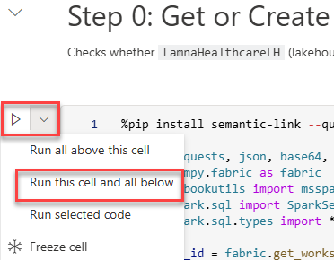
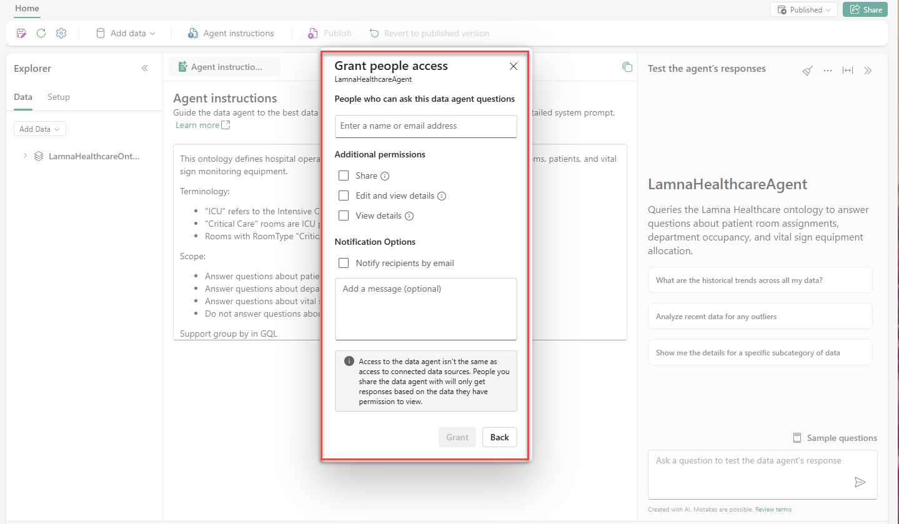
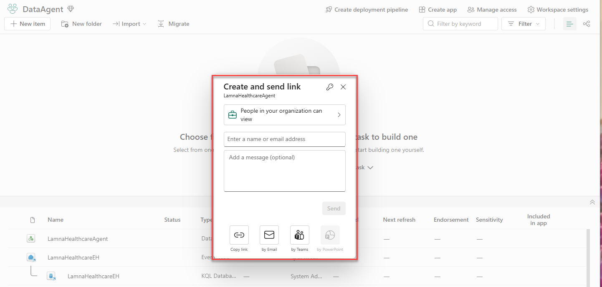

---
lab:
  title: Build a Fabric data agent with an ontology
  module: Build a Fabric data agent with an ontology
  description: In this lab, you create a Fabric data agent that uses a Lamna Healthcare ontology as its data source. You configure agent instructions, test natural language queries, and publish the agent for colleagues to use.
  duration: 30 minutes
  level: 200
  islab: true
  primarytopics:
    - Microsoft Fabric
---

# Build a Fabric data agent with an ontology

In this lab, you'll create a Fabric data agent for a fictitious company called Lamna Healthcare. You'll connect the agent to an ontology as its data source, configure instructions to improve query accuracy, test natural language questions, and publish the agent so clinical staff can get answers to questions like "How many ICU beds are occupied?"

> [!IMPORTANT]
> Ontology in Microsoft Fabric is currently in [preview](https://learn.microsoft.com/fabric/fundamentals/preview).

This lab takes approximately **30** minutes to complete.

## Before you start

You need a Microsoft Fabric Capacity (F2 or higher) to complete this exercise. 

You also need the following [tenant settings](https://learn.microsoft.com/fabric/data-science/data-agent-tenant-settings) enabled by your Fabric Administrator:

- **Capacities can be designated as Fabric Copilot capacities**
- **Data sent to Azure OpenAI can be processed outside your capacity's geographic region, compliance boundary, or national cloud instance** — required only if your Fabric capacity is outside the EU or US
- **Data sent to Azure OpenAI can be stored outside your capacity's geographic region, compliance boundary, or national cloud instance** — required only if your Fabric capacity is outside the EU or US

## Create a workspace

Before working with Fabric data agents, you need a workspace with a Fabric capacity.

1. Navigate to the [Microsoft Fabric home page](https://app.fabric.microsoft.com/home?experience=fabric) in a browser, and sign in with your Fabric credentials.
1. In the menu bar on the left, select **Workspaces** (the icon looks similar to &#128455;).
1. Create a new workspace with a name of your choice, selecting a licensing mode that includes Fabric capacity (*Fabric* or *Power BI Premium*).
1. When your new workspace opens, it should be empty.

## Create the ontology from a notebook

This lab focuses on building and using a Fabric data agent grounded in an ontology. To maximize your time on those tasks, you'll use a notebook that automates the ontology creation process, including setting up the lakehouse, eventhouse, entity types, data bindings, and relationships.

The Lamna Healthcare ontology includes sample data representing hospitals, departments, rooms, patients, and vital sign monitoring equipment.

> **Note**: If you want to learn how to build ontologies step-by-step, see the exercises on [creating an ontology manually](https://microsoftlearning.github.io/mslearn-fabric/Instructions/Labs/23-build-ontology-manually.html) or [generating an ontology from a semantic model](https://microsoftlearning.github.io/mslearn-fabric/Instructions/Labs/24-build-ontology-semantic-model.html).

1. Select [**setup-ontology.ipynb**](https://github.com/MicrosoftLearning/mslearn-fabric/raw/main/Allfiles/Labs/27-28/setup-ontology.ipynb) to open the notebook file in your browser, then right-click and save it to your local computer. If your browser saves it as `setup-ontology.ipynb.txt`, rename the file to remove the `.txt` extension.

1. In your workspace, select **Import** from the ribbon.

1. In the **Import** dialog:
   - Select **Upload** and browse to the **setup-ontology.ipynb** file you downloaded
   - Select **Open**

1. Wait for the import to complete. The notebook appears in your workspace item list.

1. Select the **setup-ontology** notebook to open it.

   The notebook contains detailed markdown cells explaining each step. It will:
   - Create a lakehouse named **LamnaHealthcareLH** with 5 hospital data tables (Hospitals, Departments, Rooms, Patients, VitalSignEquipment)
   - Create an eventhouse named **LamnaHealthcareEH** with time-series vital signs readings
   - Build the **LamnaHealthcareOntology** with 5 entity types, data bindings, and relationship types via the Fabric REST API

1. In the notebook, locate the first Python code cell under **Step 0: Get or Create Infrastructure**. To the left of the cell, select **Run this cell and all below**.

   

### What to expect when the notebook runs

As the notebook executes, watch for these success indicators in the cell outputs:

- **Step 0**: Displays "✅ Infrastructure ready!" with lakehouse and eventhouse IDs
- **Step 1**: Shows "✅ All lakehouse tables written!" with a count of 5 tables
- **Step 2**: Confirms "✅ Eventhouse step complete!"
- **Step 3**: Reports "✅ Entity and relationship definitions ready!"
- **Step 4**: After polling, displays "✅ SUCCESS" (this step creates the ontology via REST API)
- **Step 5**: Lists "Ontologies in workspace:" with your ontology name marked with ✅

> **Troubleshooting**: If Step 4 shows "❌ FAILED", verify tenant settings are enabled and try re-running the notebook.

1. When execution finishes, verify these items appear in your workspace:
   - **LamnaHealthcareLH** (lakehouse)
   - **LamnaHealthcareEH** (eventhouse)
   - **LamnaHealthcareOntology** (ontology)

   > **Important**: After the notebook completes, Fabric processes the data bindings and builds the graph model in the background. This processing typically completes in a few minutes, depending on capacity load and complexity. This is a one-time setup process. Once complete, the ontology remains responsive. To check if data is ready, open the LamnaHealthcareOntology item, select an entity type (for example, Departments), and select **Entity type overview**. If you see "Setting up your ontology" or "Updating your ontology", wait on the page — it will automatically update when the preview experience finishes loading. Once entity instances appear, you can continue to the next section.

## Create a Fabric data agent

Now that the ontology is ready, you can create a Fabric data agent that uses it as a data source.

1. In your workspace, select **+ New item**.
1. In the search box, type `data agent` and select **Data agent** from the results.
1. In the **Name** field, enter `LamnaHealthcareAgent`, then select **Create**.

   The data agent opens in the configuration view, with an Explorer pane on the left and a chat pane on the right.

## Add the ontology as a data source

Connect the data agent to the Lamna Healthcare ontology. The agent will use the ontology's entity types, properties, and relationships to interpret natural language questions.

1. In the data agent configuration view, select **Add a data source**.
1. In the search box, type `LamnaHealthcareOntology`.
1. Select **LamnaHealthcareOntology** from the search results, then select **Add**.
1. In the **Explorer** pane on the left, verify that all five entity types appear:
   - Hospitals
   - Departments
   - Rooms
   - Patients
   - VitalSignEquipment

## Configure agent instructions

Agent instructions are plain-text guidance that help the data agent interpret your specific terminology and understand what questions it should answer. For ontology data sources, instructions are the only tuning mechanism — example queries are not supported.

1. In the data agent toolbar, select **Agent instructions**.
1. In the instructions pane, enter the following text:

   ```
   This ontology defines hospital operations for Lamna Healthcare, including departments, rooms, patients, and vital sign monitoring equipment.

   Terminology:
   - "ICU" refers to the Intensive Care Unit department
   - "Critical Care" rooms are ICU patient rooms
   - Rooms with RoomType "Critical Care" are in the ICU

   Scope:
   - Answer questions about patient room assignments
   - Answer questions about department occupancy
   - Answer questions about vital sign equipment allocation
   - Do not answer questions about billing, insurance, or financial data

   Support group by in GQL
   ```

1. Close the instructions pane.

## Test with natural language questions

Use the chat pane to ask natural language questions. For each response, expand the steps to see how the agent interpreted the question and what query it generated.

1. In the chat pane, type the following question and press **Enter**:

   ```
   How many ICU beds are occupied right now?
   ```

1. Review the response. Select the **steps** dropdown below the answer to see:
   - Which entity types and relationships the agent identified
   - The generated GQL query
   - Intermediate reasoning steps

   

1. Verify the agent correctly identified the Room entity filtered by Department (ICU) and checked occupancy.

1. Ask a second question:

   ```
   How many patients are currently admitted?
   ```

1. Verify the agent returns a total patient count across all departments.

1. Ask a third question:

   ```
   Which patient is in room ICU-301?
   ```

1. Expand the steps to verify the agent traversed the `admittedTo` relationship from the Room entity to return the correct patient.

1. Ask a fourth question:

   ```
   How many rooms in the Surgical Services department are currently occupied?
   ```

1. Expand the steps to verify the agent generated a query that counts rooms by department.

1. Ask a fifth question:

   ```
   Which vital sign equipment is in the Emergency department?
   ```

1. Notice the response — the agent returns no results for this department. Before assuming the query failed, explore the data to understand what's actually there. Ask a broader follow-up question:

   ```
   Where is the vital sign equipment located?
   ```

1. Review the results to see which departments have equipment assigned. This is a key skill when working with data agents: start with a broad question to understand the shape of the data, then refine your question based on what you find.

1. Ask a sixth question:

   ```
   Which department has the most patients now?
   ```

1. Verify the agent returns a ranked result. This question tests aggregation across the ontology.

   > **Tip**: Agent instructions are how you tune the agent's behavior over time. When you added terminology like `"ICU" refers to the Intensive Care Unit department`, you were helping the agent map everyday language to ontology values. Any time the agent misinterprets a term or returns unexpected results, return to **Agent instructions** and add a clarifying definition.

## Publish and share the data agent

Publish the data agent to create a stable version that colleagues can query.

### Publish the data agent

1. In the data agent toolbar, select **Publish**.
1. In the **Description of purpose and capabilities** field, enter:

   ```
   Queries the Lamna Healthcare ontology to answer questions about patient room assignments, department occupancy, and vital sign equipment allocation.
   ```

1. Leave the **Also publish to the Agent Store in Microsoft 365 Copilot** toggle set to **Off** for this exercise.

   > **Note**: Turning this on would make the data agent available directly inside Microsoft 365 Copilot (Teams, Outlook, and other Microsoft 365 apps), so users could query it without opening Fabric. For this exercise, keep it off.

1. Select **Publish**.

   Publishing creates two versions:
   - **Draft version**: You can continue editing; changes don't affect the published version.
   - **Published version**: A stable version that users with default permissions can query.

1. In the toolbar, notice the **Draft** button. Select it and choose **Published** to switch to the published version. This is the version your colleagues will see when they access the agent.

### Share the data agent

There are two steps to sharing a data agent: granting access, then sharing the link.

**Step 1: Grant access**

1. In the data agent toolbar, select **Share**.

   A **Grant people access** dialog opens.

   

1. In the **People who can ask this data agent questions** field, enter the name or email address of the person you want to share with.
1. Under **Additional permissions**, select the appropriate level:
   - No extra checkbox selected: Can query the published version only — no access to configurations
   - **Share**: Can share this data agent with other people
   - **Edit and view details**: Full access to view, edit, and query both versions
   - **View details**: Can view configurations (both versions) and query both; can't edit
1. Select **Grant**.

**Step 2: Share the link**

1. Navigate to your workspace.
1. Find **LamnaHealthcareAgent** in the item list, select the **...** (more options) menu to the right of the item name, and select **Share**.

   A **Create and send link** dialog opens with options to copy the link, share by email, or share by Teams.

   

1. Select **Copy link** to copy the agent URL to your clipboard.

   > **Important**: The link only works for people you've already granted access to in Step 1. Recipients must also have **Read** permission on the **LamnaHealthcareOntology** item, **LamnaHealthcareLH** lakehouse, and **LamnaHealthcareEH** eventhouse. For full details on permission requirements by data source type, see [Fabric data agent sharing and permission management](https://learn.microsoft.com/fabric/data-science/data-agent-sharing).

## Clean up resources

If you're finished exploring Fabric data agents, you can delete the workspace you created for this exercise.

1. In the bar on the left, select the icon for your workspace.
1. In the toolbar, select **Workspace settings**.
1. In the **General** section, select **Remove this workspace**.
1. Select **Delete** to confirm deletion.

## Summary

In this exercise, you created a Fabric data agent grounded in the Lamna Healthcare ontology. You:

- Provisioned the ontology using a setup notebook
- Created a Fabric data agent and connected it to the ontology as a data source
- Configured agent instructions to map terminology and define scope
- Tested the agent with natural language questions and reviewed the generated queries and reasoning steps
- Published the agent and reviewed the sharing permission levels

The ontology's business vocabulary — entity types, properties, and relationships — allows the data agent to provide answers to natural language questions.